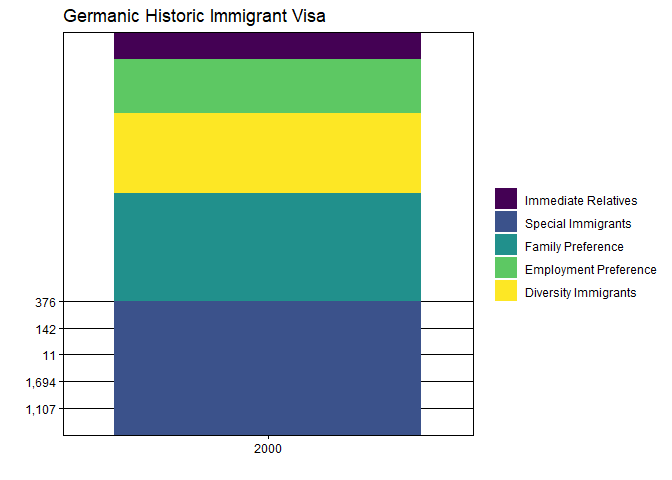
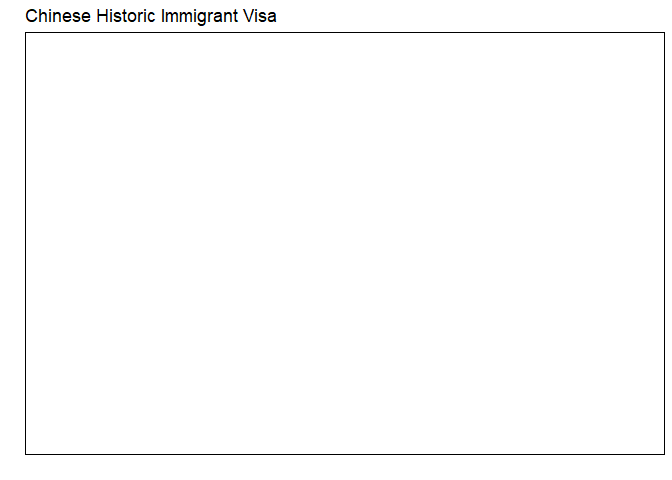
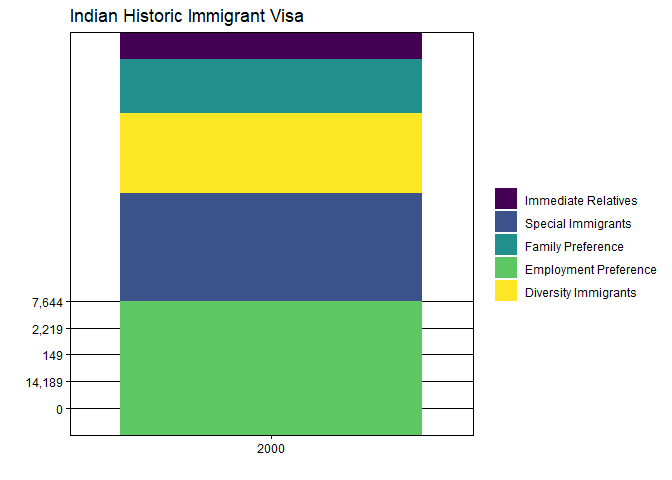

# US Immigrant Visas Issued Project

## Project Assets

original information from the US Department of State:
<https://travel.state.gov/content/travel/en/legal/visa-law0/visa-statistics/annual-reports.html>

relevant data: *Table III: Immigrant Visas Issued (by Foreign State of
Chargeability or Place of Birth): Fiscal Year YYYY*

[Excel Files 2000 -
2023](https://github.com/Dr-Eberle-Zentrum/Data-projects-with-R-and-GitHub/tree/main/Projects/mauriceschmetzer/Data/Excel)

## Data Wrangling Goal

I would like to be able to extract the data from the PDF files
themselves without having to first import the data into Excel via Power
Query. Take a look at the function `pdf_text()` from the package
`pdftools`. If you cannot make it happen, then use the Excel files.
However, the priority is to be able to get the data from the pdf files!

    colnamesSet <- c("Country", "Immediate Relatives", "Special Immigrants", "Family Preference", "Employment Preference", "Diversity Immigrants", "total")

    # list taken from xslx files, modified in Excel and Notepad++ to get strings
    # (would be better to somehow use rworldmap::countrySynonyms or similar to check if a string is a country name)
    listCountries <- factor(tolower(c("Algeria","Angola","Benin","Botswana","Burkina Faso","Burundi","Cameroon","Cape Verde","Central African Republic","Chad","Comoros","Congo, Republic of the","Congo, Democratic Republic of the","Cote d’Ivoire","Djibouti","Egypt","Equatorial Guinea","Eritrea","Ethiopia","Gabon","Gambia","Ghana","Guinea","Guinea-Bissau","Kenya","Lesotho","Liberia","Libya","Madagascar","Malawi","Mali","Mauritania","Mauritius","Morocco","Mozambique","Namibia","Niger","Nigeria","Rwanda","Sao Tome and Principe","Senegal","Seychelles","Sierra Leone","Somalia","South Africa","Sudan","Swaziland","Tanzania","Togo","Tunisia","Uganda","Zambia","Zimbabwe","Afghanistan","Bahrain","Bangladesh","Bhutan","Brunei","Burma","Cambodia","China−mainland born","−Taiwan born","Hong Kong Special","Administrative Region","India","Indonesia","Iran","Iraq","Israel","Japan","Jordan","Korea, North","Korea, South","Kuwait","Laos","Lebanon","Malaysia","Maldives","Mongolia","Nepal","Oman","Pakistan","Philippines","Qatar","Saudi Arabia","Singapore","Sri Lanka","Syria","Thailand","United Arab Emirates","Vietnam","Yemen","Albania","Andorra","Armenia","Austria","Azerbaijan","Belarus","Belgium","Bosnia and Herzegovina","Bulgaria","Croatia","Cyprus","Czech Republic","Denmark","Greenland","Estonia","Finland","France","French Guiana","French Polynesia","French Southern and Antarctic","Lands","Guadeloupe","Martinique","New Caledonia","Reunion","St. Pierre and Miquelon","Wallis and Futuna","Georgia","Germany","Great Britain and Northern Ireland","Anguilla","Bermuda","British Virgin Islands","Cayman Islands","Falkland Islands","Gibraltar","Montserrat","Pitcairn","St. Helena","Turks and Caicos Islands","Northern Ireland (DV only)","Greece","Hungary","Iceland","Ireland","Italy","Kazakhstan","Kyrgyzstan","Latvia","Liechtenstein","Lithuania","Luxembourg","Macedonia, The Former Yugoslav","Republic of","Malta","Moldova","Monaco","Netherlands","Aruba","Netherlands Antilles","Norway","Poland","Portugal","Macau","Romania","Russia","San Marino","Serbia-Montenegro","Slovakia","Slovenia","Spain","Western Sahara","Sweden","Switzerland","Tajikistan","Turkey","Turkmenistan","Ukraine","Uzbekistan","Vatican City","Antigua and Barbuda","Bahamas","Barbados","Belize","Canada","Costa Rica","Cuba","Dominica","Dominican Republic","El Salvador","Grenada","Guatemala","Haiti","Honduras","Jamaica","Mexico","Nicaragua","Panama","Saint Kitts and Nevis","Saint Lucia","Saint Vincent and the Grenadines","Trinidad and Tobago","Australia","Christmas Island","Cocos Islands","Fiji","Kiribati","Marshall Islands","Micronesia, Federated States of","Nauru","New Zealand","Cook Islands","Niue","Palau","Papua New Guinea","Samoa","Solomon Islands","Tonga","Tuvalu","Vanuatu","Argentina","Bolivia","Brazil","Chile","Colombia","Ecuador","Guyana","Paraguay","Peru","Suriname","Uruguay","Venezuela"
    )))

    # link to pdf file
    pdfFile <- "https://travel.state.gov/content/dam/visas/Statistics/FY2000%20table%20III.pdf"

    # loading the data as text from one pdf file
    pdfText <- pdf_text(pdfFile)
    # allData <- data.frame()

    #############################
    #' Extract data from one page of a PDF file that has been extracted with pdf_text()
    #' 
    #' @param curpage The number of the current page to extract
    #' @returns dataframe with cleaned data from page with columns from colnamesSet
    getData <- function(curPage){
      
        data <- str_split(pdfText[curPage], "\n")
        # take first element which equals the actual text
        data <- data[[1]] |> 
          # delete empty rows
          trimws()

        # delete rows at end of file after string containing "Grand Totals"
        if(any(str_detect(data, pattern = ".*Grand Totals"))){
          data <- data[1:(grep(pattern = ".*Grand Totals", data))-1]
        }
        
        # compare start of row with all values in listCountries (maybe possible with countrySynonyms?)
        # keep rows from data when the start of the row equals one of the entries in listCountries)
        data <- data[tolower(str_extract(pattern = "[:alpha:]+\\w{2,}", data)) %in% listCountries]
      
        # turn into df with fixed number of columns, by dividing along the whitespaces between values
        data <- data.frame(str_split_fixed(data, " {2,}", length(colnamesSet)))
        colnames(data) <- colnamesSet
        data$Continent <- countrycode(sourcevar = data[, "Country"], origin = "country.name", destination = "continent")
        
        return(data)
    }
    #############################

    #############################
     # getData(1)
     # getData(2)
     # getData(3)
     # getData(4)
     # getData(5)
     # getData(6)
     # getData(6)
        
      listData <- vector(mode = "list", length = length(pdfText))
    fileData <- 1:length(pdfText) |>   map(function(var) getData(var)) |> 
        bind_rows()

    ## Warning: Some values were not matched unambiguously: Lands

    # add column Fiscal_Year
    fileData$Fiscal_Year <- str_extract(str_extract(pdfText[1], pattern = ".*Fiscal Year \\d{4}"), "\\d{4}")

    head(fileData)

    ##    Country Immediate Relatives Special Immigrants Family Preference
    ## 1  Algeria                  67                  1                10
    ## 2   Angola                  15                  0                27
    ## 3    Benin                   7                  0                 5
    ## 4 Botswana                   4                  0                 0
    ## 5  Burundi                   2                  0                 0
    ## 6 Cameroon                 120                  0                12
    ##   Employment Preference Diversity Immigrants total Continent Fiscal_Year
    ## 1                    12                  469   559    Africa        2000
    ## 2                     1                    1    44    Africa        2000
    ## 3                     1                   22    35    Africa        2000
    ## 4                     0                    5     9    Africa        2000
    ## 5                     0                    0     2    Africa        2000
    ## 6                    14                  321   467    Africa        2000

## Tidy Data Format Goal

Below, you will find two pictures of the data (I used the country
Algeria and the fiscal year 2000 as an example. However, this applies to
every country and every fiscal year). The first picture shows the
original data provided by the Department of State. As you can see, the
data is in PDF format and is not tidy! I colored the relevant
information that I would like to extract in different colors:

-   Fiscal\_Year = Yellow
-   Country = Green
-   Continent = Red
-   Visa\_Type = Blue
-   Issued = Pink

<figure>

<figcaption aria-hidden="true">Goal Tidy Data Format</figcaption>
</figure>

The following picture shows how the final table should look like. Again,
I used the same colors to highlight how the data should be shown in tidy
format (The color of the values in both screenshots is pink but comes
across as if they have different colors so don’t be confused).

There should only be one single table in long format that has all the
information of every year for each country. 

    # add column Fiscal_Year in code chunk before for future structure with function to extract from more than one file
    # fileData$Fiscal_Year <- str_extract(str_extract(pdfText[1], pattern = ".*Fiscal Year \\d{4}"), "\\d{4}")

    # pivot to long table
    # TODO exclude column "total" cause not necessary
    data <- pivot_longer(fileData, 
                         cols = c("Immediate Relatives", "Special Immigrants", "Family Preference", "Employment Preference", "Diversity Immigrants"), 
                         names_to = "Visa_Type", values_to = "Issued")
    head(data)

    ## # A tibble: 6 × 6
    ##   Country total Continent Fiscal_Year Visa_Type             Issued
    ##   <chr>   <chr> <chr>     <chr>       <chr>                 <chr> 
    ## 1 Algeria 559   Africa    2000        Immediate Relatives   67    
    ## 2 Algeria 559   Africa    2000        Special Immigrants    1     
    ## 3 Algeria 559   Africa    2000        Family Preference     10    
    ## 4 Algeria 559   Africa    2000        Employment Preference 12    
    ## 5 Algeria 559   Africa    2000        Diversity Immigrants  469   
    ## 6 Angola  44    Africa    2000        Immediate Relatives   15

## Goal Data Visualization

Once the data is tidy, I would like to be able to visualize how many
visas were issued by country & visa category over time. For that
purpose, I would like to somehow define a specific country that I am
interested in (Maybe in a dashboard or simply a variable that I can
change) and generate a graph. This could look something like this:

Please create the above graph for the following countries:

-   Germany
-   China
-   Mexico
-   India

**TODO** \* **Diagrams are not calculating right on y-axis** \*
**Currently only one year shown**

    data[data$Country == "Germany",] |> 
    ggplot( aes(x = Fiscal_Year, y = Issued, fill = Visa_Type)) + 
      geom_bar(position = "stack", stat = "identity") +
      scale_color_viridis_d(option="viridis", aesthetics = "fill", 
                            labels= c("Immediate Relatives", "Special Immigrants", "Family Preference", "Employment Preference", "Diversity Immigrants")) +
      ggtitle("Germanic Historic Immigrant Visa") +
      theme_linedraw() +
      labs(fill = "") +
      ylab("") +
      xlab("")

    data[data$Country == "China",] |> 
    ggplot( aes(x = Fiscal_Year, y = Issued, fill = Visa_Type)) + 
      geom_bar(position = "stack", stat = "identity") +
      scale_color_viridis_d(option="viridis", aesthetics = "fill", 
                            labels= c("Immediate Relatives", "Special Immigrants", "Family Preference", "Employment Preference", "Diversity Immigrants")) +
      ggtitle("Chinese Historic Immigrant Visa") +
      theme_linedraw() +
      labs(fill = "") +
      ylab("") +
      xlab("")

    data[data$Country == "Mexico",] |> 
    ggplot( aes(x = Fiscal_Year, y = Issued, fill = Visa_Type)) + 
      geom_bar(position = "stack", stat = "identity") +
      scale_color_viridis_d(option="viridis", aesthetics = "fill", 
                            labels= c("Immediate Relatives", "Special Immigrants", "Family Preference", "Employment Preference", "Diversity Immigrants")) +
      ggtitle("Mexican Historic Immigrant Visa") +
      theme_linedraw() +
      labs(fill = "") +
      ylab("") +
      xlab("")

    data[data$Country == "India",] |> 
    ggplot( aes(x = Fiscal_Year, y = Issued, fill = Visa_Type)) + 
      geom_bar(position = "stack", stat = "identity") +
      scale_color_viridis_d(option="viridis", aesthetics = "fill", 
                            labels= c("Immediate Relatives", "Special Immigrants", "Family Preference", "Employment Preference", "Diversity Immigrants")) +
      ggtitle("Indian Historic Immigrant Visa") +
      theme_linedraw() +
      labs(fill = "") +
      ylab("") +
      xlab("")

