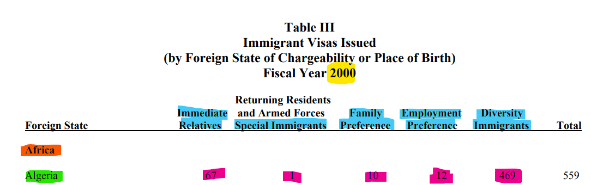
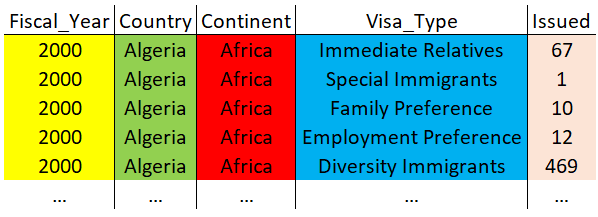
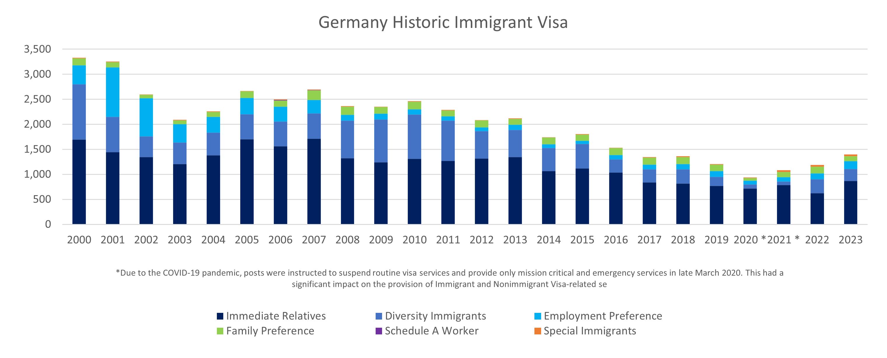

# US Immigrant Visas Issued Project

## Project Description

I would like to create a dataset that contains tidy data about how many
immigrant visas for the United States of America were issued in each
fiscal year. The amount of visas issued should be shown by country of
birth and visa category.

## Current Data

At the end of each year, the US Department of State publishes a report
that lists the amount of immigrant visas issued by country of birth for
each visa category. Unfortunately, the data is provided as a pdf file.
The information about each fiscal year is published in a seperate pdf
file.

You can find the original information from the US Department of State
here:
<https://travel.state.gov/content/travel/en/legal/visa-law0/visa-statistics/annual-reports.html>

If you click on any fiscal year, you will again find a bunch of links to
different pdf files. The relevant data can be found in *Table III:
Immigrant Visas Issued (by Foreign State of Chargeability or Place of
Birth): Fiscal Year YYYY*

For the years 2000 - 2023, I downloaded the relevant data and tried to
import it into Excel via Power Query. Therefore, you will find a
separate excel file for each fiscal year.The data for each fiscal year
is in a separate excel file. You can find them here: [Excel
Files](https://github.com/Dr-Eberle-Zentrum/Data-projects-with-R-and-GitHub/tree/main/Projects/mauriceschmetzer/Data/Excel)

Unfortunately, the current data format is pretty bad! It will need a lot
of cleaning up!

## Data Wrangling Goal

I would like to be able to extract the data from the PDF files
themselves without having to first import the data into Excel via Power
Query. Take a look at the function `pdf_text()` from the package
`pdftools`. If you cannot make it happen, then use the Excel files.
However, the priority is to be able to get the data from the pdf files!

## Tidy Data Format Goal

Below, you will find two pictures of the data (I used the country
Algeria and the fiscal year 2000 as an example. However, this applies to
every country and every fiscal year).

The first picture shows the original data provided by the Department of
State. As you can see, the data is in PDF format and is not tidy! I
colored the relevant information that I would like to extract in
different colors:

-   Fiscal\_Year = Yellow
-   Country = Green
-   Continent = Red
-   Visa\_Type = Blue
-   Issued = Pink

<figure>

<figcaption aria-hidden="true">Goal Tidy Data Format</figcaption>
</figure>

The following picture shows how the final table should look like. Again,
I used the same colors to highlight how the data should be shown in tidy
format (The color of the values in both screenshots is pink but comes
across as if they have different colors so don’t be confused).

There should only be one single table in long format that has all the
information of every year for each country.

<figure>

<figcaption aria-hidden="true">Goal Tidy Data Format</figcaption>
</figure>

## Goal Data Visualization

Once the data is tidy, I would like to be able to visualize how many
visas were issued by country & visa category over time. For that
purpose, I would like to somehow define a specific country that I am
interested in (Maybe in a dashboard or simply a variable that I can
change) and generate a graph. This could look something like this:

Please create the above graph for the following countries:

-   Germany
-   China
-   Mexico
-   India
