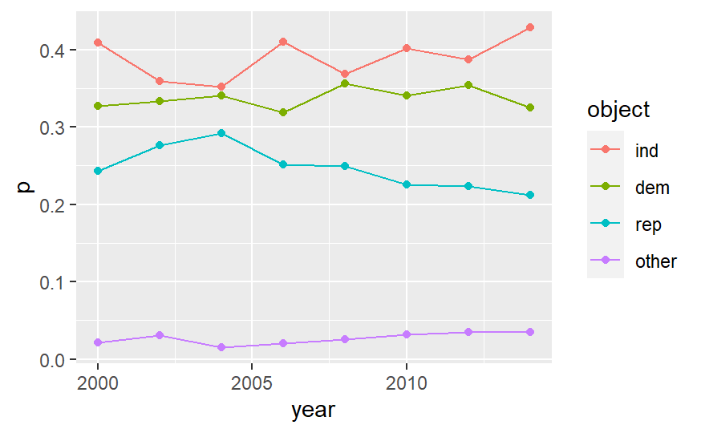

## Data set

> data from <https://data.rijksmuseum.nl/object-metadata/download/>\
> This Comma Separated Values file (*202020-rma-csv-collection.zip*) provides a simple inventory of objects in the Rijksmuseum collection. It includes the object number and persistent identifier, as well as a single title, type, creator, date and image URL for each object.

original data has columns:

```{r raw, message=FALSE, echo=FALSE}
library(tidyverse)
data <- read_csv("rma-csv-collection.csv")
# A tibble:667,894 × 7
colnames(data)
```

column 3, 4, 5, 6 should be kept meanwhile on inspecting *objectCreationDate[1]* (which are mainly years) there are NA values and values of additional information such as *1790-01-01* instead of just the year. Also due to the origial file being too large, every 60th entry is saved into a new file [rma-downsize.csv](./rma-downsize.csv) and uploaded to github.

```{r downsize, echo=FALSE}
data <- data %>%
  transmute(
    title = data[[3]],
    type = data[[4]],
    creator = data[[5]],
    year = data[[6]],
    #index = row_number()
  ) %>% 
  # filter out irregular years such as 0000-00
  filter(nchar(year) < 6, row_number() %% 60 == 0)  

write_csv(data, "rma-downsize.csv")
```

<!-- originally: the data is filtered via command line code  but this turns out to be incorrect  $ awk '$6 ~ /-?[0-9]{1,4}/  { print $3, $4, $5, $6}' rma-csv-collection.csv > rma-downsize.csv. current size:  -->

```{bash, include=FALSE}
ls -lh
```

```{r}
head(data)  # A tibble:9,986 × 4
```

## Visualization goals

The goal is to explore the change of the top 7 *type* according to *year*.

- transform the data into a summarise of *type* and its *count*;

```{r type, echo = FALSE}
types <- data %>% group_by(type) %>%
   summarise(count = n()) %>%
   mutate(type = fct_reorder(factor(type), count))
# A tibble:445 × 2
# range(types$count)  # 1 4921
```

- reorder the types according to *count*, choose the top 7 *type* with the most *count*, and track their change in  *count* over *year*.

the visualization will be something like  with 

- x-axis: *year*. try keep the x axis continuous, if it doesn't work, then `fct_lump()` it into ranges
- y-axis: *count*. the cumulative sum of the *count* of a certain *type* 
- legend: *type*. 
