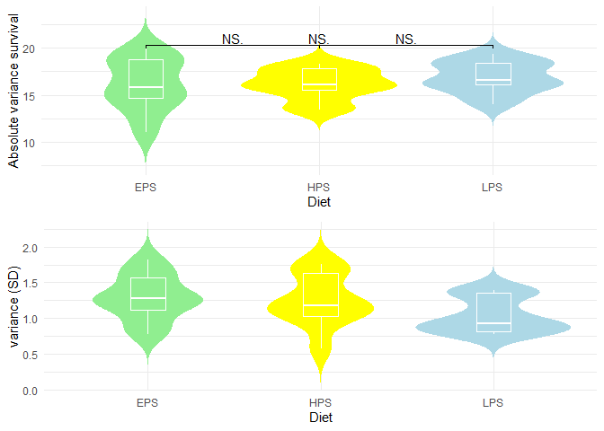
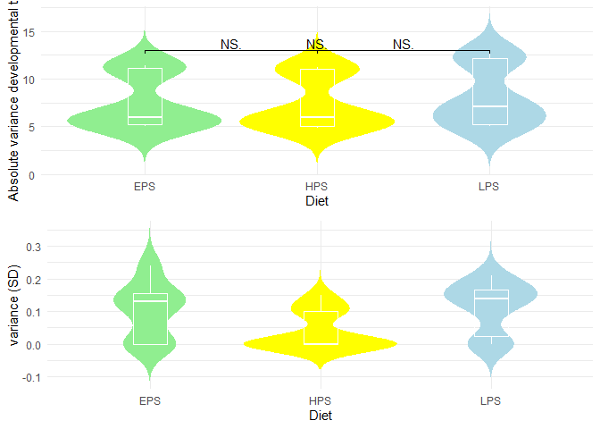
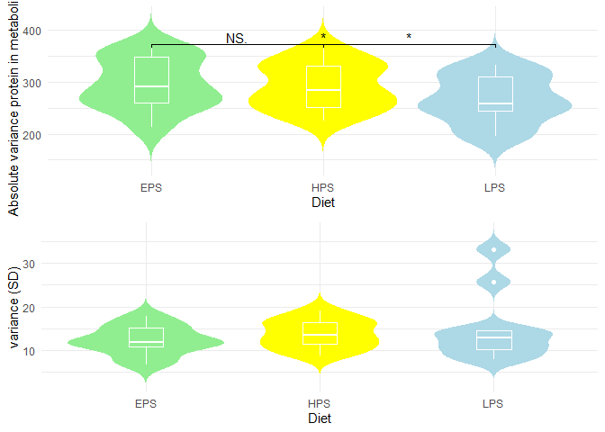
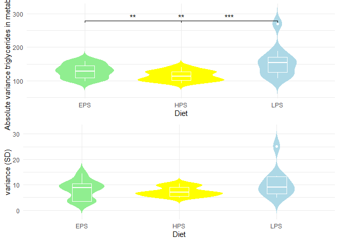
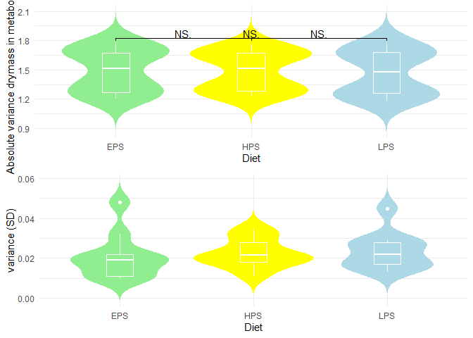
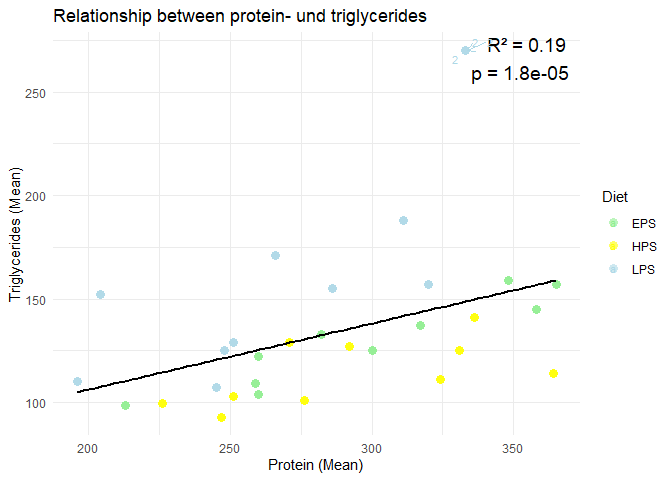

    suppressMessages({
      suppressWarnings({
        library("readxl")
        library("dplyr")
        library(tidyr)
        library("gridExtra")
        library(ggsignif)
        library(ggrepel)
      })
    })

## Sheet 1 & 2: Survival & Developmental\_Time

At first I looked at the structure of the different excel sheets. As
sheet 1 (survival) and sheet 2 (developmental time) had the same
structure, I only needed two functions for both of them: First I made a
function to rename the columns to mean and sd plus numbers.

    # Function to rename columns to mean and sd
    rename_columns <- function(df, start, prefix) {
      df %>%
        rename_with(~ paste0(prefix, seq_along(seq(start, ncol(df), by = 2))), 
                    .cols = seq(start, ncol(df), by = 2))
    }

I then implemented a function to reorganize the sheets so there are no
empty cells:

    reorganize_sheets <- function(data, sheetname, rowname1, rowname2, rowname3){
      # load data and rename columns
      data <- data %>% 
        rename_columns(2, paste0(sheetname, "_mean_")) %>%
        rename_columns(3, paste0(sheetname, "_sd_"))
      # change first column name to index
      colnames(data)[1] <- "index"
      # change "index" for rows 4-6
      new_index_names <- c(paste0(sheetname, "_" ,rowname1,"_mean"), paste0(sheetname, "_" ,rowname2,"_mean"), paste0(sheetname, "_" ,rowname3,"_mean"))
      data[c(4:6),1] <- new_index_names
      
      # one matrix for mean
      mean_cols <- data %>% 
        select(contains("mean")) %>% 
        as.matrix()

      # one matrix for sd
      sd_cols <- data %>% 
        select(contains("sd")) %>% 
        # remove first 3 rows of sd_cols as they are empty
        slice(-c(1:3)) %>% 
        as.matrix()
      
      # combine data
      combined_data <- rbind(mean_cols, sd_cols) %>% 
        as.data.frame()
      
      # change the index names
      new_index_names_sd <- c(paste0(sheetname, "_" ,rowname1,"_sd"), paste0(sheetname, "_" ,rowname2,"_sd"), paste0(sheetname, "_" ,rowname3,"_sd"))
      combined_data$index <- c(data$index, new_index_names_sd)
      
      # change structure: pivot
      reshaped_data <- combined_data %>%
        pivot_longer(cols = contains("mean"), names_to = "mean", values_to = "value") %>%
        pivot_wider(names_from = index, values_from = value) %>%
        select(-"mean")
      
      return(reshaped_data)
    }

Now let’s change the structure of the survival and development data. But
first, here is an example how the sheet for survival looked before
reshaping it:

    head(read_excel("flydata.xlsx", sheet = "Survival", col_names = F))

    ## # A tibble: 6 × 31
    ##   ...1  ...2    ...3 ...4   ...5 ...6   ...7 ...8   ...9 ...10 ...11 ...12 ...13
    ##   <chr> <chr>  <dbl> <chr> <dbl> <chr> <dbl> <chr> <dbl> <chr> <dbl> <chr> <dbl>
    ## 1 Diet  HPS   NA     HPS   NA    HPS   NA    HPS   NA    HPS   NA    EPS   NA   
    ## 2 Line  1     NA     2     NA    3     NA    4     NA    5     NA    1     NA   
    ## 3 n     10    NA     5     NA    10    NA    10    NA    7     NA    10    NA   
    ## 4 Fema… 17.8   1.14  13.4   1.03 16.1…  1.02 15.5   1.63 18.3   1.71 19     1.26
    ## 5 Males 17.8   0.573 16.8   1.2  16.1…  1.29 13.7   1.16 15.6   1.76 18     0.77
    ## 6 Total 35.6   0.78  30.2   1.07 32.2…  0.83 29.2   1.2  33.9   1.3  37     1.17
    ## # ℹ 18 more variables: ...14 <chr>, ...15 <dbl>, ...16 <chr>, ...17 <dbl>,
    ## #   ...18 <chr>, ...19 <dbl>, ...20 <chr>, ...21 <dbl>, ...22 <chr>,
    ## #   ...23 <dbl>, ...24 <chr>, ...25 <dbl>, ...26 <chr>, ...27 <dbl>,
    ## #   ...28 <chr>, ...29 <dbl>, ...30 <chr>, ...31 <dbl>

    data_survival <- read_excel("flydata.xlsx", sheet = "Survival", col_names = F) %>% 
      reorganize_sheets("Survival", "Females", "Males", "Total")

    data_developm <- read_excel("flydata.xlsx", sheet = "Developmental_Time", col_names = F) %>% 
      reorganize_sheets("Developmental_Time", "L-P", "P-E", "L-E")

It now looks like this, which is already way cleaner!

    head(data_survival)

    ## # A tibble: 6 × 9
    ##   Diet  Line  n     Survival_Females_mean Survival_Males_mean
    ##   <chr> <chr> <chr> <chr>                 <chr>              
    ## 1 HPS   1     10    17.8                  17.8               
    ## 2 HPS   2     5     13.4                  16.8               
    ## 3 HPS   3     10    16.100000000000001    16.100000000000001 
    ## 4 HPS   4     10    15.5                  13.7               
    ## 5 HPS   5     7     18.3                  15.6               
    ## 6 EPS   1     10    19                    18                 
    ## # ℹ 4 more variables: Survival_Total_mean <chr>, Survival_Females_sd <chr>,
    ## #   Survival_Males_sd <chr>, Survival_Total_sd <chr>

But now I also want to have a new column with the sex in the survival
dataframe. I wrote a function for that.

    transform_data_surviv <- function(data, exclude_columns, new_sex, mean_column, sd_column) {
      data %>%
        # only select one sex
        select(-all_of(exclude_columns)) %>%
        # add new column with sex
        mutate(sex = new_sex) %>%
        # rename columns so sex not in column name anymore
        rename(survival_mean = !!sym(mean_column),
               survival_sd = !!sym(sd_column))
    }

Now let’s use this function on the survival data.

    data_survival <-
      bind_rows(
        transform_data_surviv(
          data_survival,
          exclude_columns = c("Survival_Males_mean", "Survival_Males_sd", "Survival_Total_mean", "Survival_Total_sd"),
          new_sex = "F",
          mean_column = "Survival_Females_mean",
          sd_column = "Survival_Females_sd"),
        transform_data_surviv(
          data_survival,
          exclude_columns = c("Survival_Females_mean", "Survival_Females_sd", "Survival_Total_mean", "Survival_Total_sd"),
          new_sex = "M",
          mean_column = "Survival_Males_mean",
          sd_column = "Survival_Males_sd"),
        transform_data_surviv(
          data_survival,
          exclude_columns = c("Survival_Females_mean", "Survival_Females_sd", "Survival_Males_mean", "Survival_Males_sd"),
          new_sex = "Total",
          mean_column = "Survival_Total_mean",
          sd_column = "Survival_Total_sd"))

Let’s also do this for development.

    transform_data_developm <- function(data, exclude_columns, new_developm, mean_column, sd_column) {
      data %>%
        # only select one sex
        select(-all_of(exclude_columns)) %>%
        # add new column with sex
        mutate(developmental_time = new_developm) %>%
        # rename columns so sex not in column name anymore
        rename(developmental_mean = !!sym(mean_column),
               developmental_sd = !!sym(sd_column))
      }

    data_developm <-
      bind_rows(
        transform_data_developm(
          data_developm,
          exclude_columns = c("Developmental_Time_P-E_mean", "Developmental_Time_P-E_sd", "Developmental_Time_L-E_mean", "Developmental_Time_L-E_sd"),
          new_developm = "L-P",
          mean_column = "Developmental_Time_L-P_mean",
          sd_column = "Developmental_Time_L-P_sd"),
        transform_data_developm(
          data_developm,
          exclude_columns = c("Developmental_Time_P-E_mean", "Developmental_Time_P-E_sd", "Developmental_Time_L-P_mean", "Developmental_Time_L-P_sd"),
          new_developm = "L-E",
          mean_column = "Developmental_Time_L-E_mean",
          sd_column = "Developmental_Time_L-E_sd"),
        transform_data_developm(
          data_developm,
          exclude_columns = c("Developmental_Time_L-E_mean", "Developmental_Time_L-E_sd", "Developmental_Time_L-P_mean", "Developmental_Time_L-P_sd"),
          new_developm = "P-E",
          mean_column = "Developmental_Time_P-E_mean",
          sd_column = "Developmental_Time_P-E_sd"))

And now I combine the two:

    data_survival_developm <- data_developm %>% 
      rename(Line = line,
             Diet = diet,
             n_developm = n) %>% 
      merge(data_survival, by = c("Line", "Diet"), all = F) %>% 
      rename(n_survival = n)

So the data for survival and development now look like this:

    head(data_survival_developm)

    ##   Line Diet n_developm developmental_mean developmental_sd developmental_time
    ## 1    1  EPS         10                  5                0                P-E
    ## 2    1  EPS         10                  5                0                P-E
    ## 3    1  EPS         10                  5                0                P-E
    ## 4    1  EPS         10               11.4             0.16                L-E
    ## 5    1  EPS         10               11.4             0.16                L-E
    ## 6    1  EPS         10               11.4             0.16                L-E
    ##   n_survival survival_mean survival_sd   sex
    ## 1         10            37        1.17 Total
    ## 2         10            18        0.77     M
    ## 3         10            19        1.26     F
    ## 4         10            37        1.17 Total
    ## 5         10            18        0.77     M
    ## 6         10            19        1.26     F

Now that the development and survival data are combined, I will look at
metabolic pools.

## Sheet 3: Metabolic Pools

First I wrote a function to read and process the metabolic pool data.
The dataframe looked like this at first:

    read_excel("flydata.xlsx", sheet = "Metabolic_Pools", col_names = F)

    process_metabolic_pool <- function(sheetname, rows) {
      # read data
      read_excel("flydata.xlsx", sheet = "Metabolic_Pools", col_names = F, n_max=17) %>% 
        # only get relevant data (drymass, proteins or driglycerides)
        slice(rows) %>%
        # reorganize sheets with function above
        reorganize_sheets(sheetname, "HPS", "EPS", "LPS") %>%
        # now convert it more meaningful format
        pivot_longer(cols = starts_with(sheetname), names_to = "temp", values_to = sheetname) %>%
        separate(temp, into = c("metric", "diet", "type"), sep = "_") %>%
        select(-metric) %>% 
        pivot_wider(names_from = type, values_from = sheetname)
    }

Now I use this function for all three different types of metabolic pools
(drymass, protein and triglycerides) and also renamed the columns.

    data_drymass <- process_metabolic_pool("Drymass", c(1:3, 5:7)) %>% 
      rename(mean_drymass = mean, sd_drymass = sd)

    ## Warning: Using an external vector in selections was deprecated in tidyselect 1.1.0.
    ## ℹ Please use `all_of()` or `any_of()` instead.
    ##   # Was:
    ##   data %>% select(sheetname)
    ## 
    ##   # Now:
    ##   data %>% select(all_of(sheetname))
    ## 
    ## See <https://tidyselect.r-lib.org/reference/faq-external-vector.html>.
    ## This warning is displayed once every 8 hours.
    ## Call `lifecycle::last_lifecycle_warnings()` to see where this warning was
    ## generated.

    data_protein <- process_metabolic_pool("Protein", c(1:3, 10:12)) %>% 
      rename(mean_protein = mean, sd_protein = sd)

    data_triglycerides <- process_metabolic_pool("Triglycerides", -c(4:14)) %>% 
      rename(mean_triglycerides = mean, sd_triglycerides = sd)

This is how drymass looks like now as an example:

    head(data_drymass)

    ## # A tibble: 6 × 6
    ##   line  n     sex   diet  mean_drymass sd_drymass
    ##   <chr> <chr> <chr> <chr> <chr>        <chr>     
    ## 1 1     10    F     HPS   1.67         0.032     
    ## 2 1     10    F     EPS   1.67         0.019     
    ## 3 1     10    F     LPS   1.62         0.024     
    ## 4 1     10    M     HPS   1.23         0.018     
    ## 5 1     10    M     EPS   1.23         0.01      
    ## 6 1     10    M     LPS   1.18         0.029

## Combine into one dataframe

Now I finally combined the processed data into one final dataframe:

    final_data <- merge(data_drymass, data_protein, by=c("line", "n", "sex", "diet")) %>% 
      merge(data_triglycerides, by=c("line", "n", "sex","diet")) %>% 
      # rename so dataframes have same column names
      rename(Line = line,
             Diet = diet,
             n_metabolic = n) %>% 
      left_join(data_survival_developm, data_metabolic, by = c("Line", "Diet", "sex"))

This is how it looks like now:

    head(final_data)

    ##   Line n_metabolic sex Diet mean_drymass sd_drymass mean_protein sd_protein
    ## 1    1          10   F  EPS         1.67      0.019          365       15.2
    ## 2    1          10   F  EPS         1.67      0.019          365       15.2
    ## 3    1          10   F  EPS         1.67      0.019          365       15.2
    ## 4    1          10   F  HPS         1.67      0.032          324       13.7
    ## 5    1          10   F  HPS         1.67      0.032          324       13.7
    ## 6    1          10   F  HPS         1.67      0.032          324       13.7
    ##   mean_triglycerides sd_triglycerides n_developm developmental_mean
    ## 1                157             7.32         10                  5
    ## 2                157             7.32         10               11.4
    ## 3                157             7.32         10                6.4
    ## 4                111             6.95         10                6.3
    ## 5                111             6.95         10               11.2
    ## 6                111             6.95         10 4.9000000000000004
    ##   developmental_sd developmental_time n_survival survival_mean survival_sd
    ## 1                0                P-E         10            19        1.26
    ## 2             0.16                L-E         10            19        1.26
    ## 3             0.16                L-P         10            19        1.26
    ## 4             0.15                L-P         10          17.8        1.14
    ## 5             0.13                L-E         10          17.8        1.14
    ## 6              0.1                P-E         10          17.8        1.14

As a final step, lets convert the columns containing numerical data to
numeric.

    # check if column only contains numeric values

    is_numeric_column <- function(x) {
      all(!is.na(as.numeric(x)))
    }

    # change them to numeric
    final_data[] <- lapply(final_data, function(x) if (is_numeric_column(x)) as.numeric(x) else x)

    ## Warning in is_numeric_column(x): NAs durch Umwandlung erzeugt

    ## Warning in is_numeric_column(x): NAs durch Umwandlung erzeugt

    ## Warning in is_numeric_column(x): NAs durch Umwandlung erzeugt

## Plot

Now let’s create the plots.

### Plot for survival

    # Plot absolute values
    plot_absolute_survival <- final_data %>% 
      ggplot( aes(x = Diet, y = survival_mean, fill = Diet)) +
      geom_violin(trim = FALSE, color = NA) +
      scale_fill_manual(values = c("HPS" = "yellow", "EPS" = "lightgreen", "LPS" = "lightblue")) +
      geom_boxplot(width = 0.2, fill = NA, color = "white") +
      theme_minimal() +
      theme(legend.position = "none") +
      ylab("Absolute variance survival") +
      xlab("Diet")+
      geom_signif(comparisons = list(c("EPS", "HPS") ,c("EPS","LPS"), c("HPS","LPS")), 
                  test = t.test,
                  map_signif_level=c("***"=0.001, "**"=0.01, "*"=0.05),
                  # hide.ns does not work?
                  hide.ns = T)

    # Plot variance
    plot_variance_survival <- final_data %>%
      ggplot(aes(x = Diet, y = survival_sd, fill = Diet)) +
      geom_violin(trim = FALSE, color = NA) +
      scale_fill_manual(values = c("HPS" = "yellow", "EPS" = "lightgreen", "LPS" = "lightblue")) +
      geom_boxplot(width = 0.2, fill = NA, color = "white") +
      theme_minimal() +
      theme(legend.position = "none") +
      ylab("variance (SD)") +
      xlab("Diet")

    # show both in one 
    grid.arrange(plot_absolute_survival, plot_variance_survival, ncol = 1)

### Plot for development

    # Plot absolute values
    plot_absolute_developm <- final_data %>% 
      ggplot( aes(x = Diet, y = developmental_mean, fill = Diet)) +
      geom_violin(trim = FALSE, color = NA) +
      scale_fill_manual(values = c("HPS" = "yellow", "EPS" = "lightgreen", "LPS" = "lightblue")) +
      geom_boxplot(width = 0.2, fill = NA, color = "white") +
      theme_minimal() +
      theme(legend.position = "none") +
      ylab("Absolute variance developmental time") +
      xlab("Diet")+
      geom_signif(comparisons = list(c("EPS", "HPS") ,c("EPS","LPS"), c("HPS","LPS")), 
                  test = t.test,
                  map_signif_level=c("***"=0.001, "**"=0.01, "*"=0.05),
                  # hide.ns does not work?
                  hide.ns = TRUE)

    # Plot variance
    plot_variance_developm <- final_data %>%
      ggplot(aes(x = Diet, y = developmental_sd, fill = Diet)) +
      geom_violin(trim = FALSE, color = NA) +
      scale_fill_manual(values = c("HPS" = "yellow", "EPS" = "lightgreen", "LPS" = "lightblue")) +
      geom_boxplot(width = 0.2, fill = NA, color = "white") +
      theme_minimal() +
      theme(legend.position = "none") +
      ylab("variance (SD)") +
      xlab("Diet")

    # show both in one 
    grid.arrange(plot_absolute_developm, plot_variance_developm, ncol = 1)

\## Plot for metabolic pools \### Proteins

    # Plot absolute values
    plot_absolute_protein <- final_data %>% 
      ggplot( aes(x = Diet, y = mean_protein, fill = Diet)) +
      geom_violin(trim = FALSE, color = NA) +
      scale_fill_manual(values = c("HPS" = "yellow", "EPS" = "lightgreen", "LPS" = "lightblue")) +
      geom_boxplot(width = 0.2, fill = NA, color = "white") +
      theme_minimal() +
      theme(legend.position = "none") +
      ylab("Absolute variance protein in metabolic pool") +
      xlab("Diet")+
      geom_signif(comparisons = list(c("EPS", "HPS") ,c("EPS","LPS"), c("HPS","LPS")), 
                  test = t.test,
                  map_signif_level=c("***"=0.001, "**"=0.01, "*"=0.05),
                  # hide.ns does not work?
                  hide.ns = T)

    # Plot variance
    plot_variance_protein <- final_data %>%
      ggplot(aes(x = Diet, y = sd_protein, fill = Diet)) +
      geom_violin(trim = FALSE, color = NA) +
      scale_fill_manual(values = c("HPS" = "yellow", "EPS" = "lightgreen", "LPS" = "lightblue")) +
      geom_boxplot(width = 0.2, fill = NA, color = "white") +
      theme_minimal() +
      theme(legend.position = "none") +
      ylab("variance (SD)") +
      xlab("Diet")

    # show both in one 
    grid.arrange(plot_absolute_protein, plot_variance_protein, ncol = 1)

\### Triglycerides

    # Plot absolute values
    plot_absolute_triglycerides <- final_data %>% 
      ggplot( aes(x = Diet, y = mean_triglycerides, fill = Diet)) +
      geom_violin(trim = FALSE, color = NA) +
      scale_fill_manual(values = c("HPS" = "yellow", "EPS" = "lightgreen", "LPS" = "lightblue")) +
      geom_boxplot(width = 0.2, fill = NA, color = "white") +
      theme_minimal() +
      theme(legend.position = "none") +
      ylab("Absolute variance triglycerides in metabolic pool") +
      xlab("Diet")+
      geom_signif(comparisons = list(c("EPS", "HPS") ,c("EPS","LPS"), c("HPS","LPS")), 
                  test = t.test,
                  map_signif_level=c("***"=0.001, "**"=0.01, "*"=0.05),
                  # hide.ns does not work?
                  hide.ns = T)

    # Plot variance
    plot_variance_triglycerides <- final_data %>%
      ggplot(aes(x = Diet, y = sd_triglycerides, fill = Diet)) +
      geom_violin(trim = FALSE, color = NA) +
      scale_fill_manual(values = c("HPS" = "yellow", "EPS" = "lightgreen", "LPS" = "lightblue")) +
      geom_boxplot(width = 0.2, fill = NA, color = "white") +
      theme_minimal() +
      theme(legend.position = "none") +
      ylab("variance (SD)") +
      xlab("Diet")

    # show both in one 
    grid.arrange(plot_absolute_triglycerides, plot_variance_triglycerides, ncol = 1)

\### Drymass

    # Plot absolute values
    plot_absolute_drymass <- final_data %>% 
      ggplot( aes(x = Diet, y = mean_drymass, fill = Diet)) +
      geom_violin(trim = FALSE, color = NA) +
      scale_fill_manual(values = c("HPS" = "yellow", "EPS" = "lightgreen", "LPS" = "lightblue")) +
      geom_boxplot(width = 0.2, fill = NA, color = "white") +
      theme_minimal() +
      theme(legend.position = "none") +
      ylab("Absolute variance drymass in metabolic pool") +
      xlab("Diet")+
      geom_signif(comparisons = list(c("EPS", "HPS") ,c("EPS","LPS"), c("HPS","LPS")), 
                  test = t.test,
                  map_signif_level=c("***"=0.001, "**"=0.01, "*"=0.05),
                  # hide.ns does not work?
                  hide.ns = T)

    # Plot variance
    plot_variance_drymass <- final_data %>%
      ggplot(aes(x = Diet, y = sd_drymass, fill = Diet)) +
      geom_violin(trim = FALSE, color = NA) +
      scale_fill_manual(values = c("HPS" = "yellow", "EPS" = "lightgreen", "LPS" = "lightblue")) +
      geom_boxplot(width = 0.2, fill = NA, color = "white") +
      theme_minimal() +
      theme(legend.position = "none") +
      ylab("variance (SD)") +
      xlab("Diet")

    # show both in one 
    grid.arrange(plot_absolute_drymass, plot_variance_drymass, ncol = 1)

### Relationship triglycerides and protein

    # Lineare Regression berechnen
    fit <- lm(mean_triglycerides ~ mean_protein, data = final_data)

    # R^2 und p-Wert berechnen
    r_squared <- summary(fit)$r.squared
    p_value <- summary(fit)$coefficients[2, 4]

    # Plot erstellen
    plot_protein_triglycerides <- ggplot(final_data, aes(x = mean_protein, y = mean_triglycerides, color = Diet)) +
      geom_point(size = 3, shape = 16, alpha = 0.6) +
      geom_smooth(method = "lm", se = FALSE, color = "black") +
      annotate("text", x = Inf, y = Inf, label = paste("R² =", round(r_squared, 2), "\n", "p =", format(p_value, digits = 2)),
               hjust = 1.1, vjust = 1.1, size = 5) +
      labs(title = "Relationship between protein- und triglycerides",
           x = "Protein (Mean)",
           y = "Triglycerides (Mean)") +
      scale_color_manual(values = c("HPS" = "yellow", "EPS" = "lightgreen", "LPS" = "lightblue"))+
      theme_minimal() +
      theme(legend.position = "right")

    # Potenzielle Ausreißer markieren
    outliers <- final_data %>% 
      filter(mean_protein > mean(mean_protein) + 2 * sd(mean_protein) | mean_triglycerides > mean(mean_triglycerides) + 2 * sd(mean_triglycerides))

    plot_protein_triglycerides <- plot_protein_triglycerides +
      geom_text_repel(data = outliers, aes(label = Line), size = 3, arrow = arrow(length = unit(0.02, "npc")))

    # Plot anzeigen
    print(plot_protein_triglycerides)

    ## `geom_smooth()` using formula = 'y ~ x'

