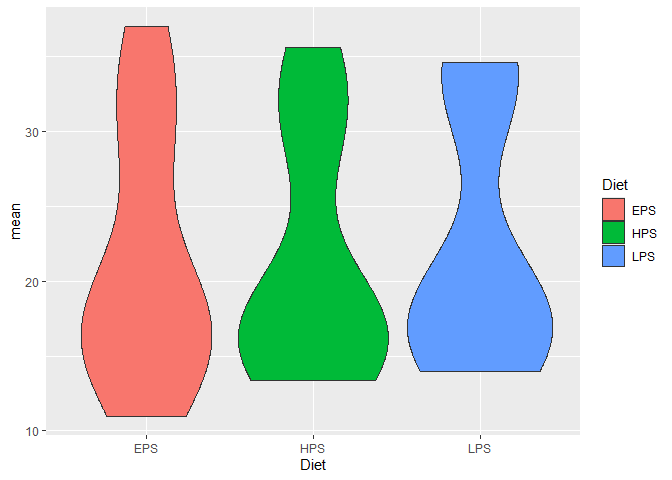
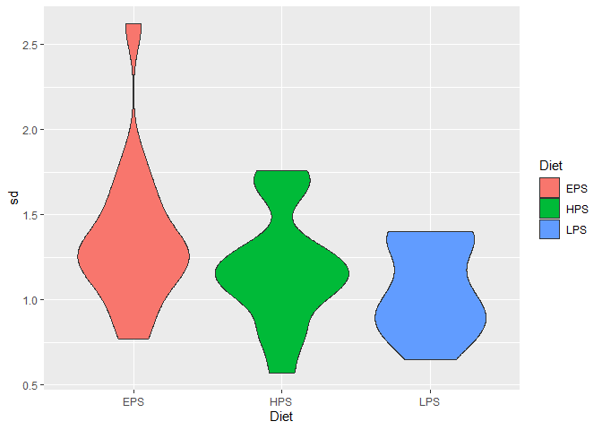

    #This chunk changes the structure of the dataset so that each column represents a different case, including all the mean and sd values for male and female.
    survival_wide<- survival[c(1:6),]
    #survival_wide[c(7:9),]<-NA

    test1=survival_wide[, seq(1, ncol(survival_wide), by = 2)]%>%
      drop_na()%>%
      select(-X1)

    test2=survival_wide[, seq(2, ncol(survival_wide), by = 2)]%>%
      drop_na()%>%
      setNames(names(test1))

    test3= rbind(test2,test1, make.row.names=F)
    survival_wide= cbind( variablen=c(survival_wide$X1,"Female SD", "Male SD", "Total SD"), test3)

    # renaming of each column to case1-30 to have a unique identifier
    survival_wide <- survival_wide %>%
      rename_with(.cols = -`variablen`, .fn = ~paste0("Case", seq_along(.)))

    print(survival_wide)

    ##   variablen Case1 Case2 Case3 Case4 Case5 Case6 Case7 Case8 Case9 Case10 Case11
    ## 1      Diet   HPS   HPS   HPS   HPS   HPS   EPS   EPS   EPS   EPS    EPS    LPS
    ## 2      Line     1     2     3     4     5     1     2     3     4      5      1
    ## 3         n    10     5    10    10     7    10     5    10    10      6     10
    ## 4   Females  17,8  13,4  16,1  15,5  18,3    19  16,4  19,9  14,7   18,8   16,9
    ## 5     Males  17,8  16,8  16,1  13,7  15,6    18    11  14,9  15,3   13,2   16,2
    ## 6     Total  35,6  30,2  32,2  29,2  33,9    37  27,4  34,8    30     32   33,1
    ## 7 Female SD  1.14  1.03  1.02  1.63  1.71  1.26  1.63  1.23   0.9    1.3   1.37
    ## 8   Male SD 0.573   1.2  1.29  1.16  1.76  0.77  1.82  1.57  1.12    1.3   0.92
    ## 9  Total SD  0.78  1.07  0.83   1.2   1.3  1.17  2.62  1.45  1.32   1.03   1.39
    ##   Case12 Case13 Case14 Case15
    ## 1    LPS    LPS    LPS    LPS
    ## 2      2      3      4      5
    ## 3      5     10     10      7
    ## 4   16,2   18,5   19,4   18,1
    ## 5   18,4   16,1     14     15
    ## 6   34,6   34,6   33,4   33,1
    ## 7   1.11   0.93   0.82   1.39
    ## 8   0.93    0.8   0.77   1.36
    ## 9    1.4   0.65   0.96   1.14

    survival_wide <- survival_wide %>%
      pivot_longer(cols = -`variablen`, names_to = "Case", values_to = "Value") %>%
      pivot_wider(names_from = `variablen`, values_from = Value)

    print(survival_wide)

    ## # A tibble: 15 × 10
    ##    Case   Diet  Line  n     Females Males Total `Female SD` `Male SD` `Total SD`
    ##    <chr>  <chr> <chr> <chr> <chr>   <chr> <chr> <chr>       <chr>     <chr>     
    ##  1 Case1  HPS   1     10    17,8    17,8  35,6  1.14        0.573     0.78      
    ##  2 Case2  HPS   2     5     13,4    16,8  30,2  1.03        1.2       1.07      
    ##  3 Case3  HPS   3     10    16,1    16,1  32,2  1.02        1.29      0.83      
    ##  4 Case4  HPS   4     10    15,5    13,7  29,2  1.63        1.16      1.2       
    ##  5 Case5  HPS   5     7     18,3    15,6  33,9  1.71        1.76      1.3       
    ##  6 Case6  EPS   1     10    19      18    37    1.26        0.77      1.17      
    ##  7 Case7  EPS   2     5     16,4    11    27,4  1.63        1.82      2.62      
    ##  8 Case8  EPS   3     10    19,9    14,9  34,8  1.23        1.57      1.45      
    ##  9 Case9  EPS   4     10    14,7    15,3  30    0.9         1.12      1.32      
    ## 10 Case10 EPS   5     6     18,8    13,2  32    1.3         1.3       1.03      
    ## 11 Case11 LPS   1     10    16,9    16,2  33,1  1.37        0.92      1.39      
    ## 12 Case12 LPS   2     5     16,2    18,4  34,6  1.11        0.93      1.4       
    ## 13 Case13 LPS   3     10    18,5    16,1  34,6  0.93        0.8       0.65      
    ## 14 Case14 LPS   4     10    19,4    14    33,4  0.82        0.77      0.96      
    ## 15 Case15 LPS   5     7     18,1    15    33,1  1.39        1.36      1.14

    survival_wide <- survival_wide %>%
      mutate(across(-c(Case,Line,Diet,n), ~ as.numeric(gsub(",", ".", .))))

    survival_final<- survival_wide %>%
      rename(
        Female_mean = Females,
        Male_mean = Males,
        Total_mean = Total,
        Female_sd = `Female SD`,
        Male_sd = `Male SD`,
        Total_sd = `Total SD`
      )%>%
      pivot_longer(
        cols = starts_with("Female_") | starts_with("Male_") | starts_with("Total_"),
        names_to = c("sex", ".value"),
        names_pattern = "(Female|Male|Total)_(mean|sd)"
      )

    ggplot(survival_final, aes(x=Diet, y=mean, fill=Diet)) + 
      geom_violin()

    ggplot(survival_final, aes(x=Diet, y=sd, fill=Diet)) + 
      geom_violin()

