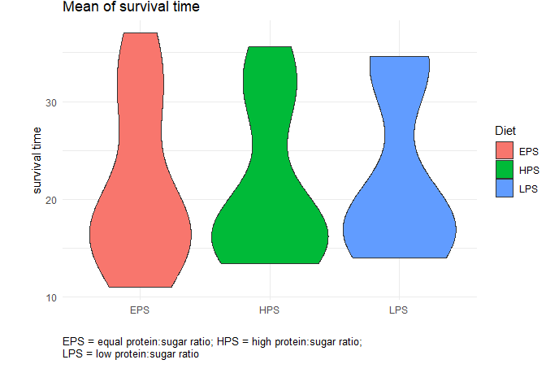

    head(survival)

    ## # A tibble: 6 × 31
    ##   X1    X2        X3 X4       X5 X6       X7 X8       X9 X10     X11 X12     X13
    ##   <chr> <chr>  <dbl> <chr> <dbl> <chr> <dbl> <chr> <dbl> <chr> <dbl> <chr> <dbl>
    ## 1 Diet  HPS   NA     HPS   NA    HPS   NA    HPS   NA    HPS   NA    EPS   NA   
    ## 2 Line  1     NA     2     NA    3     NA    4     NA    5     NA    1     NA   
    ## 3 n     10    NA     5     NA    10    NA    10    NA    7     NA    10    NA   
    ## 4 Fema… 17,8   1.14  13,4   1.03 16,1   1.02 15,5   1.63 18,3   1.71 19     1.26
    ## 5 Males 17,8   0.573 16,8   1.2  16,1   1.29 13,7   1.16 15,6   1.76 18     0.77
    ## 6 Total 35,6   0.78  30,2   1.07 32,2   0.83 29,2   1.2  33,9   1.3  37     1.17
    ## # ℹ 18 more variables: X14 <chr>, X15 <dbl>, X16 <chr>, X17 <dbl>, X18 <chr>,
    ## #   X19 <dbl>, X20 <chr>, X21 <dbl>, X22 <chr>, X23 <dbl>, X24 <chr>,
    ## #   X25 <dbl>, X26 <chr>, X27 <dbl>, X28 <chr>, X29 <dbl>, X30 <chr>, X31 <dbl>

    #This chunk changes the structure of the dataset so that each column represents a different case, including all the mean and sd values for male and female.
    survival_wide<- survival[c(1:6),]
    #survival_wide[c(7:9),]<-NA

    test1=survival_wide[, seq(1, ncol(survival_wide), by = 2)]%>%
      drop_na()%>%
      select(-X1)

    test2=survival_wide[, seq(2, ncol(survival_wide), by = 2)]%>%
      drop_na()%>%
      setNames(names(test1))

    test3= rbind(test2,test1, make.row.names=F)
    survival_wide= cbind( variablen=c(survival_wide$X1,"Female SD", "Male SD", "Total SD"), test3)

    # renaming of each column to case1-30 to have a unique identifier
    survival_wide <- survival_wide %>%
      rename_with(.cols = -`variablen`, .fn = ~paste0("Case", seq_along(.)))

    head(survival_wide)

    ##   variablen Case1 Case2 Case3 Case4 Case5 Case6 Case7 Case8 Case9 Case10 Case11
    ## 1      Diet   HPS   HPS   HPS   HPS   HPS   EPS   EPS   EPS   EPS    EPS    LPS
    ## 2      Line     1     2     3     4     5     1     2     3     4      5      1
    ## 3         n    10     5    10    10     7    10     5    10    10      6     10
    ## 4   Females  17,8  13,4  16,1  15,5  18,3    19  16,4  19,9  14,7   18,8   16,9
    ## 5     Males  17,8  16,8  16,1  13,7  15,6    18    11  14,9  15,3   13,2   16,2
    ## 6     Total  35,6  30,2  32,2  29,2  33,9    37  27,4  34,8    30     32   33,1
    ##   Case12 Case13 Case14 Case15
    ## 1    LPS    LPS    LPS    LPS
    ## 2      2      3      4      5
    ## 3      5     10     10      7
    ## 4   16,2   18,5   19,4   18,1
    ## 5   18,4   16,1     14     15
    ## 6   34,6   34,6   33,4   33,1

    survival_wide <- survival_wide %>%
      pivot_longer(cols = -`variablen`, names_to = "Case", values_to = "Value") %>%
      pivot_wider(names_from = `variablen`, values_from = Value)

    survival_wide <- survival_wide %>%
      mutate(across(-c(Case,Line,Diet,n), ~ as.numeric(gsub(",", ".", .))))

    head(survival_wide)

    ## # A tibble: 6 × 10
    ##   Case  Diet  Line  n     Females Males Total `Female SD` `Male SD` `Total SD`
    ##   <chr> <chr> <chr> <chr>   <dbl> <dbl> <dbl>       <dbl>     <dbl>      <dbl>
    ## 1 Case1 HPS   1     10       17.8  17.8  35.6        1.14     0.573       0.78
    ## 2 Case2 HPS   2     5        13.4  16.8  30.2        1.03     1.2         1.07
    ## 3 Case3 HPS   3     10       16.1  16.1  32.2        1.02     1.29        0.83
    ## 4 Case4 HPS   4     10       15.5  13.7  29.2        1.63     1.16        1.2 
    ## 5 Case5 HPS   5     7        18.3  15.6  33.9        1.71     1.76        1.3 
    ## 6 Case6 EPS   1     10       19    18    37          1.26     0.77        1.17

    survival_final<- survival_wide %>%
      rename(
        Female_mean = Females,
        Male_mean = Males,
        Total_mean = Total,
        Female_sd = `Female SD`,
        Male_sd = `Male SD`,
        Total_sd = `Total SD`
      )%>%
      pivot_longer(
        cols = starts_with("Female_") | starts_with("Male_") | starts_with("Total_"),
        names_to = c("sex", ".value"),
        names_pattern = "(Female|Male|Total)_(mean|sd)"
      )

    head(survival_final)

    ## # A tibble: 6 × 7
    ##   Case  Diet  Line  n     sex     mean    sd
    ##   <chr> <chr> <chr> <chr> <chr>  <dbl> <dbl>
    ## 1 Case1 HPS   1     10    Female  17.8 1.14 
    ## 2 Case1 HPS   1     10    Male    17.8 0.573
    ## 3 Case1 HPS   1     10    Total   35.6 0.78 
    ## 4 Case2 HPS   2     5     Female  13.4 1.03 
    ## 5 Case2 HPS   2     5     Male    16.8 1.2  
    ## 6 Case2 HPS   2     5     Total   30.2 1.07

    ggplot(survival_final, aes(x=Diet, y=mean, fill=Diet)) + 
      geom_violin()+
      ylab("survival time")+
      xlab("")+
      ggtitle("Mean of survival time")+
      labs(caption = "EPS = equal protein:sugar ratio; HPS = high protein:sugar ratio; \nLPS = low protein:sugar ratio")+
      theme_minimal()+
      theme(plot.caption = element_text(hjust = 0, size = 10),
            plot.margin = unit(c(0, 0, 1, 1), "cm")) 

    ggplot(survival_final, aes(x=Diet, y=sd, fill=Diet)) + 
      geom_violin()+
      ylab("survival time")+
      xlab("")+
      ggtitle("Standard deviation of survival time")+
      labs(caption = "EPS = equal protein:sugar ratio; HPS = high protein:sugar ratio; \nLPS = low protein:sugar ratio")+
      theme_minimal()+
      theme(plot.caption = element_text(hjust = 0, size = 10),
            plot.margin = unit(c(0, 0, 1, 1), "cm")) 

##### Developement Time

    #This chunk changes the structure of the dataset so that each column represents a different case, including all the mean and sd values for male and female.
    dev_time_wide<- dev_time[c(1:6),]
    #dev_time_wide[c(7:9),]<-NA

    test1=dev_time_wide[, seq(1, ncol(dev_time_wide), by = 2)]%>%
      drop_na()%>%
      select(-X1)

    test2=dev_time_wide[, seq(2, ncol(dev_time_wide), by = 2)]%>%
      drop_na()%>%
      setNames(names(test1))

    test3= rbind(test2,test1, make.row.names=F)
    dev_time_wide= cbind( variablen=c(dev_time_wide$X1,"L-P_SD", "P-E_SD", "L-E_SD"), test3)

    # renaming of each column to case1-30 to have a unique identifier
    dev_time_wide <- dev_time_wide %>%
      rename_with(.cols = -`variablen`, .fn = ~paste0("Case", seq_along(.)))

    dev_time_wide <- dev_time_wide %>%
      pivot_longer(cols = -`variablen`, names_to = "Case", values_to = "Value") %>%
      pivot_wider(names_from = `variablen`, values_from = Value)

    survival_wide <- survival_wide %>%
      mutate(across(-c(Case,Line,Diet,n), ~ as.numeric(gsub(",", ".", .))))

    dev_time_final<- dev_time_wide %>%
      rename(
        L_P_mean ='L-P',
        P_E_mean ='P-E',
        L_E_mean ='L-E',
        L_P_sd = `L-P_SD`,
        P_E_sd = `P-E_SD`,
        L_E_sd = `L-E_SD`
      )%>%
      pivot_longer(
        cols = starts_with("L_P_") | starts_with("P_E_") | starts_with("L_E_"),
        names_to = c("stage", ".value"),
        names_pattern = "(L_P|P_E|L_E)_(mean|sd)"
      )

    # ggplot(dev_time_final, aes(x=diet, y=mean)) + 
    #   geom_violin()+
    #   ylab("Developmental Time")+
    #   xlab("")+
    #   ggtitle("Mean of developmental time")+
    #   labs(caption = "EPS = equal protein:sugar ratio; HPS = high protein:sugar ratio; \nLPS = low protein:sugar ratio")
