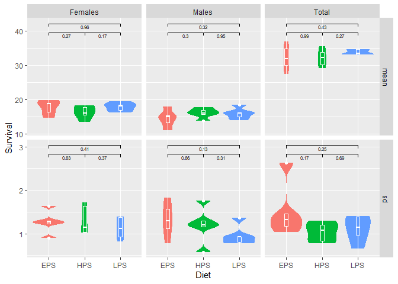

## Data import

For importing the first two data sets, I defined the following function
to reshape the data into a more tidy format.

Eventually, I treat each combination of the first column and two
subsequent columns as individual tables and reshape them into a two row
format with mean and standard deviation values. These are then combined
into one data frame with some final cleanup.

OPEN: handling of the third sheet… uuuhhh…

    reshapeUglySheet <- function( dataRaw ){
      
      rows <- list()
      for ( x in seq(2,(ncol(dataRaw)-1), by=2) ) {
        rows[[x]] <-
          rbind( 
            # mean values in one row with header
            dataRaw |> 
              select( all_of(names(dataRaw)[c(1,x)]) ) |> 
              pivot_wider(names_from = 1, values_from = 2) |> 
              mutate(measure="mean") |> 
              relocate(measure, .after=1)
            ,
            # sd values in one row with header
            dataRaw |> 
              select( all_of(names(dataRaw)[c(1,x+1)]) ) |> 
              pivot_wider(names_from = 1, values_from = 2) |> 
              mutate(measure="sd") |> 
              relocate(measure, .after=1)
          ) 
      }

      return(  
        bind_rows(rows) |> 
          # parse as numeric
          mutate(across(-c(1,2), as.numeric)) 
          |>
          # fill missing values in sd rows
          fill(1:4, .direction="down") |> 
          # ensure correct column names
          rename_with(str_to_title)
      )
    }

That way, both the survival and the time table have the same format in
the end and can be joined into one.

    survival <- 
      read_xlsx("flydata.xlsx", sheet="Survival", col_names = F) |> 
      reshapeUglySheet() |> 
      rename(n_survival = "N")

    ## New names:
    ## • `` -> `...1`
    ## • `` -> `...2`
    ## • `` -> `...3`
    ## • `` -> `...4`
    ## • `` -> `...5`
    ## • `` -> `...6`
    ## • `` -> `...7`
    ## • `` -> `...8`
    ## • `` -> `...9`
    ## • `` -> `...10`
    ## • `` -> `...11`
    ## • `` -> `...12`
    ## • `` -> `...13`
    ## • `` -> `...14`
    ## • `` -> `...15`
    ## • `` -> `...16`
    ## • `` -> `...17`
    ## • `` -> `...18`
    ## • `` -> `...19`
    ## • `` -> `...20`
    ## • `` -> `...21`
    ## • `` -> `...22`
    ## • `` -> `...23`
    ## • `` -> `...24`
    ## • `` -> `...25`
    ## • `` -> `...26`
    ## • `` -> `...27`
    ## • `` -> `...28`
    ## • `` -> `...29`
    ## • `` -> `...30`
    ## • `` -> `...31`

    time <- 
      read_xlsx("flydata.xlsx", sheet="Developmental_Time", col_names = F) |> 
      reshapeUglySheet() |> 
      rename(n_time = "N")

    ## New names:
    ## • `` -> `...1`
    ## • `` -> `...2`
    ## • `` -> `...3`
    ## • `` -> `...4`
    ## • `` -> `...5`
    ## • `` -> `...6`
    ## • `` -> `...7`
    ## • `` -> `...8`
    ## • `` -> `...9`
    ## • `` -> `...10`
    ## • `` -> `...11`
    ## • `` -> `...12`
    ## • `` -> `...13`
    ## • `` -> `...14`
    ## • `` -> `...15`
    ## • `` -> `...16`
    ## • `` -> `...17`
    ## • `` -> `...18`
    ## • `` -> `...19`
    ## • `` -> `...20`
    ## • `` -> `...21`
    ## • `` -> `...22`
    ## • `` -> `...23`
    ## • `` -> `...24`
    ## • `` -> `...25`
    ## • `` -> `...26`
    ## • `` -> `...27`
    ## • `` -> `...28`
    ## • `` -> `...29`
    ## • `` -> `...30`
    ## • `` -> `...31`

    data <- 
      left_join(survival, time, by=c("Diet", "Measure", "Line"))

    # nice table print with kable
    library(kableExtra)

    ## 
    ## Attache Paket: 'kableExtra'
    ## 
    ## Das folgende Objekt ist maskiert 'package:dplyr':
    ## 
    ##     group_rows

    data |>
      kable(format="markdown", digits=2)

<table>
<colgroup>
<col style="width: 6%" />
<col style="width: 11%" />
<col style="width: 6%" />
<col style="width: 15%" />
<col style="width: 11%" />
<col style="width: 8%" />
<col style="width: 8%" />
<col style="width: 9%" />
<col style="width: 6%" />
<col style="width: 6%" />
<col style="width: 8%" />
</colgroup>
<thead>
<tr class="header">
<th style="text-align: left;">Diet</th>
<th style="text-align: left;">Measure</th>
<th style="text-align: right;">Line</th>
<th style="text-align: right;">n_survival</th>
<th style="text-align: right;">Females</th>
<th style="text-align: right;">Males</th>
<th style="text-align: right;">Total</th>
<th style="text-align: right;">n_time</th>
<th style="text-align: right;">L-P</th>
<th style="text-align: right;">P-E</th>
<th style="text-align: right;">L-E</th>
</tr>
</thead>
<tbody>
<tr class="odd">
<td style="text-align: left;">HPS</td>
<td style="text-align: left;">mean</td>
<td style="text-align: right;">1</td>
<td style="text-align: right;">10</td>
<td style="text-align: right;">17.80</td>
<td style="text-align: right;">17.80</td>
<td style="text-align: right;">35.60</td>
<td style="text-align: right;">10</td>
<td style="text-align: right;">6.30</td>
<td style="text-align: right;">4.90</td>
<td style="text-align: right;">11.20</td>
</tr>
<tr class="even">
<td style="text-align: left;">HPS</td>
<td style="text-align: left;">sd</td>
<td style="text-align: right;">1</td>
<td style="text-align: right;">10</td>
<td style="text-align: right;">1.14</td>
<td style="text-align: right;">0.57</td>
<td style="text-align: right;">0.78</td>
<td style="text-align: right;">10</td>
<td style="text-align: right;">0.15</td>
<td style="text-align: right;">0.10</td>
<td style="text-align: right;">0.13</td>
</tr>
<tr class="odd">
<td style="text-align: left;">HPS</td>
<td style="text-align: left;">mean</td>
<td style="text-align: right;">2</td>
<td style="text-align: right;">5</td>
<td style="text-align: right;">13.40</td>
<td style="text-align: right;">16.80</td>
<td style="text-align: right;">30.20</td>
<td style="text-align: right;">5</td>
<td style="text-align: right;">6.00</td>
<td style="text-align: right;">5.00</td>
<td style="text-align: right;">11.00</td>
</tr>
<tr class="even">
<td style="text-align: left;">HPS</td>
<td style="text-align: left;">sd</td>
<td style="text-align: right;">2</td>
<td style="text-align: right;">5</td>
<td style="text-align: right;">1.03</td>
<td style="text-align: right;">1.20</td>
<td style="text-align: right;">1.07</td>
<td style="text-align: right;">5</td>
<td style="text-align: right;">0.00</td>
<td style="text-align: right;">0.00</td>
<td style="text-align: right;">0.00</td>
</tr>
<tr class="odd">
<td style="text-align: left;">HPS</td>
<td style="text-align: left;">mean</td>
<td style="text-align: right;">3</td>
<td style="text-align: right;">10</td>
<td style="text-align: right;">16.10</td>
<td style="text-align: right;">16.10</td>
<td style="text-align: right;">32.20</td>
<td style="text-align: right;">10</td>
<td style="text-align: right;">6.00</td>
<td style="text-align: right;">5.00</td>
<td style="text-align: right;">11.00</td>
</tr>
<tr class="even">
<td style="text-align: left;">HPS</td>
<td style="text-align: left;">sd</td>
<td style="text-align: right;">3</td>
<td style="text-align: right;">10</td>
<td style="text-align: right;">1.02</td>
<td style="text-align: right;">1.29</td>
<td style="text-align: right;">0.83</td>
<td style="text-align: right;">10</td>
<td style="text-align: right;">0.00</td>
<td style="text-align: right;">0.00</td>
<td style="text-align: right;">0.00</td>
</tr>
<tr class="odd">
<td style="text-align: left;">HPS</td>
<td style="text-align: left;">mean</td>
<td style="text-align: right;">4</td>
<td style="text-align: right;">10</td>
<td style="text-align: right;">15.50</td>
<td style="text-align: right;">13.70</td>
<td style="text-align: right;">29.20</td>
<td style="text-align: right;">10</td>
<td style="text-align: right;">5.90</td>
<td style="text-align: right;">5.10</td>
<td style="text-align: right;">11.00</td>
</tr>
<tr class="even">
<td style="text-align: left;">HPS</td>
<td style="text-align: left;">sd</td>
<td style="text-align: right;">4</td>
<td style="text-align: right;">10</td>
<td style="text-align: right;">1.63</td>
<td style="text-align: right;">1.16</td>
<td style="text-align: right;">1.20</td>
<td style="text-align: right;">10</td>
<td style="text-align: right;">0.10</td>
<td style="text-align: right;">0.10</td>
<td style="text-align: right;">0.00</td>
</tr>
<tr class="odd">
<td style="text-align: left;">HPS</td>
<td style="text-align: left;">mean</td>
<td style="text-align: right;">5</td>
<td style="text-align: right;">7</td>
<td style="text-align: right;">18.30</td>
<td style="text-align: right;">15.60</td>
<td style="text-align: right;">33.90</td>
<td style="text-align: right;">10</td>
<td style="text-align: right;">6.00</td>
<td style="text-align: right;">5.00</td>
<td style="text-align: right;">11.00</td>
</tr>
<tr class="even">
<td style="text-align: left;">HPS</td>
<td style="text-align: left;">sd</td>
<td style="text-align: right;">5</td>
<td style="text-align: right;">7</td>
<td style="text-align: right;">1.71</td>
<td style="text-align: right;">1.76</td>
<td style="text-align: right;">1.30</td>
<td style="text-align: right;">10</td>
<td style="text-align: right;">0.00</td>
<td style="text-align: right;">0.00</td>
<td style="text-align: right;">0.00</td>
</tr>
<tr class="odd">
<td style="text-align: left;">EPS</td>
<td style="text-align: left;">mean</td>
<td style="text-align: right;">1</td>
<td style="text-align: right;">10</td>
<td style="text-align: right;">19.00</td>
<td style="text-align: right;">18.00</td>
<td style="text-align: right;">37.00</td>
<td style="text-align: right;">10</td>
<td style="text-align: right;">6.40</td>
<td style="text-align: right;">5.00</td>
<td style="text-align: right;">11.40</td>
</tr>
<tr class="even">
<td style="text-align: left;">EPS</td>
<td style="text-align: left;">sd</td>
<td style="text-align: right;">1</td>
<td style="text-align: right;">10</td>
<td style="text-align: right;">1.26</td>
<td style="text-align: right;">0.77</td>
<td style="text-align: right;">1.17</td>
<td style="text-align: right;">10</td>
<td style="text-align: right;">0.16</td>
<td style="text-align: right;">0.00</td>
<td style="text-align: right;">0.16</td>
</tr>
<tr class="odd">
<td style="text-align: left;">EPS</td>
<td style="text-align: left;">mean</td>
<td style="text-align: right;">2</td>
<td style="text-align: right;">5</td>
<td style="text-align: right;">16.40</td>
<td style="text-align: right;">11.00</td>
<td style="text-align: right;">27.40</td>
<td style="text-align: right;">5</td>
<td style="text-align: right;">6.00</td>
<td style="text-align: right;">5.40</td>
<td style="text-align: right;">11.40</td>
</tr>
<tr class="even">
<td style="text-align: left;">EPS</td>
<td style="text-align: left;">sd</td>
<td style="text-align: right;">2</td>
<td style="text-align: right;">5</td>
<td style="text-align: right;">1.63</td>
<td style="text-align: right;">1.82</td>
<td style="text-align: right;">2.62</td>
<td style="text-align: right;">5</td>
<td style="text-align: right;">0.00</td>
<td style="text-align: right;">0.24</td>
<td style="text-align: right;">0.24</td>
</tr>
<tr class="odd">
<td style="text-align: left;">EPS</td>
<td style="text-align: left;">mean</td>
<td style="text-align: right;">3</td>
<td style="text-align: right;">10</td>
<td style="text-align: right;">19.90</td>
<td style="text-align: right;">14.90</td>
<td style="text-align: right;">34.80</td>
<td style="text-align: right;">10</td>
<td style="text-align: right;">6.00</td>
<td style="text-align: right;">5.20</td>
<td style="text-align: right;">11.20</td>
</tr>
<tr class="even">
<td style="text-align: left;">EPS</td>
<td style="text-align: left;">sd</td>
<td style="text-align: right;">3</td>
<td style="text-align: right;">10</td>
<td style="text-align: right;">1.23</td>
<td style="text-align: right;">1.57</td>
<td style="text-align: right;">1.45</td>
<td style="text-align: right;">10</td>
<td style="text-align: right;">0.00</td>
<td style="text-align: right;">0.13</td>
<td style="text-align: right;">0.13</td>
</tr>
<tr class="odd">
<td style="text-align: left;">EPS</td>
<td style="text-align: left;">mean</td>
<td style="text-align: right;">4</td>
<td style="text-align: right;">10</td>
<td style="text-align: right;">14.70</td>
<td style="text-align: right;">15.30</td>
<td style="text-align: right;">30.00</td>
<td style="text-align: right;">10</td>
<td style="text-align: right;">6.10</td>
<td style="text-align: right;">5.00</td>
<td style="text-align: right;">11.10</td>
</tr>
<tr class="even">
<td style="text-align: left;">EPS</td>
<td style="text-align: left;">sd</td>
<td style="text-align: right;">4</td>
<td style="text-align: right;">10</td>
<td style="text-align: right;">0.90</td>
<td style="text-align: right;">1.12</td>
<td style="text-align: right;">1.32</td>
<td style="text-align: right;">10</td>
<td style="text-align: right;">0.10</td>
<td style="text-align: right;">0.00</td>
<td style="text-align: right;">0.10</td>
</tr>
<tr class="odd">
<td style="text-align: left;">EPS</td>
<td style="text-align: left;">mean</td>
<td style="text-align: right;">5</td>
<td style="text-align: right;">6</td>
<td style="text-align: right;">18.80</td>
<td style="text-align: right;">13.20</td>
<td style="text-align: right;">32.00</td>
<td style="text-align: right;">10</td>
<td style="text-align: right;">6.00</td>
<td style="text-align: right;">5.10</td>
<td style="text-align: right;">11.10</td>
</tr>
<tr class="even">
<td style="text-align: left;">EPS</td>
<td style="text-align: left;">sd</td>
<td style="text-align: right;">5</td>
<td style="text-align: right;">6</td>
<td style="text-align: right;">1.30</td>
<td style="text-align: right;">1.30</td>
<td style="text-align: right;">1.03</td>
<td style="text-align: right;">10</td>
<td style="text-align: right;">0.00</td>
<td style="text-align: right;">0.14</td>
<td style="text-align: right;">0.14</td>
</tr>
<tr class="odd">
<td style="text-align: left;">LPS</td>
<td style="text-align: left;">mean</td>
<td style="text-align: right;">1</td>
<td style="text-align: right;">10</td>
<td style="text-align: right;">16.90</td>
<td style="text-align: right;">16.20</td>
<td style="text-align: right;">33.10</td>
<td style="text-align: right;">10</td>
<td style="text-align: right;">7.50</td>
<td style="text-align: right;">5.10</td>
<td style="text-align: right;">12.60</td>
</tr>
<tr class="even">
<td style="text-align: left;">LPS</td>
<td style="text-align: left;">sd</td>
<td style="text-align: right;">1</td>
<td style="text-align: right;">10</td>
<td style="text-align: right;">1.37</td>
<td style="text-align: right;">0.92</td>
<td style="text-align: right;">1.39</td>
<td style="text-align: right;">10</td>
<td style="text-align: right;">0.17</td>
<td style="text-align: right;">0.10</td>
<td style="text-align: right;">0.16</td>
</tr>
<tr class="odd">
<td style="text-align: left;">LPS</td>
<td style="text-align: left;">mean</td>
<td style="text-align: right;">2</td>
<td style="text-align: right;">5</td>
<td style="text-align: right;">16.20</td>
<td style="text-align: right;">18.40</td>
<td style="text-align: right;">34.60</td>
<td style="text-align: right;">5</td>
<td style="text-align: right;">7.00</td>
<td style="text-align: right;">5.00</td>
<td style="text-align: right;">12.00</td>
</tr>
<tr class="even">
<td style="text-align: left;">LPS</td>
<td style="text-align: left;">sd</td>
<td style="text-align: right;">2</td>
<td style="text-align: right;">5</td>
<td style="text-align: right;">1.11</td>
<td style="text-align: right;">0.93</td>
<td style="text-align: right;">1.40</td>
<td style="text-align: right;">5</td>
<td style="text-align: right;">0.00</td>
<td style="text-align: right;">0.00</td>
<td style="text-align: right;">0.00</td>
</tr>
<tr class="odd">
<td style="text-align: left;">LPS</td>
<td style="text-align: left;">mean</td>
<td style="text-align: right;">3</td>
<td style="text-align: right;">10</td>
<td style="text-align: right;">18.50</td>
<td style="text-align: right;">16.10</td>
<td style="text-align: right;">34.60</td>
<td style="text-align: right;">10</td>
<td style="text-align: right;">7.00</td>
<td style="text-align: right;">5.20</td>
<td style="text-align: right;">12.20</td>
</tr>
<tr class="even">
<td style="text-align: left;">LPS</td>
<td style="text-align: left;">sd</td>
<td style="text-align: right;">3</td>
<td style="text-align: right;">10</td>
<td style="text-align: right;">0.93</td>
<td style="text-align: right;">0.80</td>
<td style="text-align: right;">0.65</td>
<td style="text-align: right;">10</td>
<td style="text-align: right;">0.00</td>
<td style="text-align: right;">0.13</td>
<td style="text-align: right;">0.13</td>
</tr>
<tr class="odd">
<td style="text-align: left;">LPS</td>
<td style="text-align: left;">mean</td>
<td style="text-align: right;">4</td>
<td style="text-align: right;">10</td>
<td style="text-align: right;">19.40</td>
<td style="text-align: right;">14.00</td>
<td style="text-align: right;">33.40</td>
<td style="text-align: right;">10</td>
<td style="text-align: right;">7.30</td>
<td style="text-align: right;">5.00</td>
<td style="text-align: right;">12.30</td>
</tr>
<tr class="even">
<td style="text-align: left;">LPS</td>
<td style="text-align: left;">sd</td>
<td style="text-align: right;">4</td>
<td style="text-align: right;">10</td>
<td style="text-align: right;">0.82</td>
<td style="text-align: right;">0.77</td>
<td style="text-align: right;">0.96</td>
<td style="text-align: right;">10</td>
<td style="text-align: right;">0.15</td>
<td style="text-align: right;">0.21</td>
<td style="text-align: right;">0.15</td>
</tr>
<tr class="odd">
<td style="text-align: left;">LPS</td>
<td style="text-align: left;">mean</td>
<td style="text-align: right;">5</td>
<td style="text-align: right;">7</td>
<td style="text-align: right;">18.10</td>
<td style="text-align: right;">15.00</td>
<td style="text-align: right;">33.10</td>
<td style="text-align: right;">10</td>
<td style="text-align: right;">7.10</td>
<td style="text-align: right;">5.30</td>
<td style="text-align: right;">12.40</td>
</tr>
<tr class="even">
<td style="text-align: left;">LPS</td>
<td style="text-align: left;">sd</td>
<td style="text-align: right;">5</td>
<td style="text-align: right;">7</td>
<td style="text-align: right;">1.39</td>
<td style="text-align: right;">1.36</td>
<td style="text-align: right;">1.14</td>
<td style="text-align: right;">10</td>
<td style="text-align: right;">0.14</td>
<td style="text-align: right;">0.18</td>
<td style="text-align: right;">0.20</td>
</tr>
</tbody>
</table>

## Plotting survival data

Given this, we can now plot the survival data.

We want individual plot for males, females and total survival, thus we
need to make them individual rows with respective annotations.

Given this, we can easily meet all plot requirements

    library(ggsignif)
    data |>
      pivot_longer(cols=c(Females,Males,Total), names_to="Group", values_to="Survival") |>

      # plotting
      ggplot(aes(x=Diet, y=Survival)) +
      facet_grid(cols=vars(Group),rows=vars(Measure), scales = "free_y") +
      geom_violin(aes(fill=Diet), col=NA) +
      geom_boxplot(width=0.1, fill=NA, col="white") +
      guides(fill="none") +
      # pairwise significance bars
      geom_signif(comparisons = list(c("EPS", "HPS"), c("EPS", "LPS"), c("HPS", "LPS"))
                  # shift to different levels to avoid overlap
                  , margin_top=c(0.1,0.2,0.1)
                  # text below the line
                  , vjust=1.5
                  , map_signif_level=F, textsize=2, test="t.test" )

