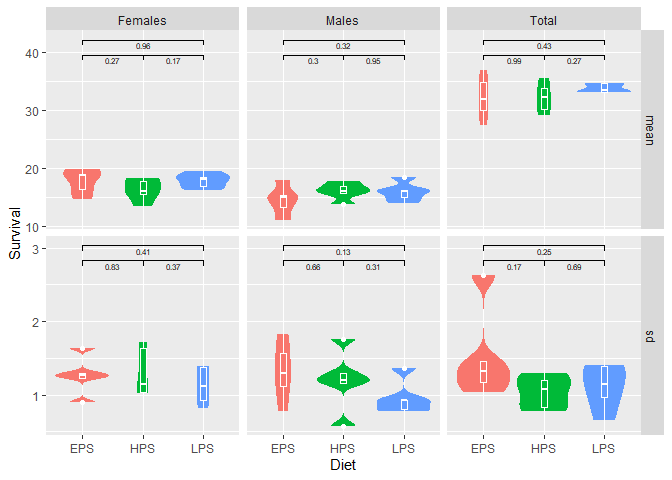

    reshapeUglySheet <- function( dataRaw ){
      
      rows <- list()
      for ( x in seq(2,(ncol(dataRaw)-1), by=2) ) {
        rows[[x]] <-
          rbind( 
            # mean values in one row with header
            dataRaw |> 
              select( all_of(names(dataRaw)[c(1,x)]) ) |> 
              pivot_wider(names_from = 1, values_from = 2) |> 
              mutate(measure="mean") |> 
              relocate(measure, .after=1)
            ,
            # sd values in one row with header
            dataRaw |> 
              select( all_of(names(dataRaw)[c(1,x+1)]) ) |> 
              pivot_wider(names_from = 1, values_from = 2) |> 
              mutate(measure="sd") |> 
              relocate(measure, .after=1)
          ) 
      }

      return(  
        bind_rows(rows) |> 
        # parse as numeric
        mutate(across(-c(1,2), as.numeric)) 
        |>
        # fill missing values in sd rows
        fill(1:4, .direction="down")
      )
    }

    survival <- 
      read_xlsx("flydata.xlsx", sheet="Survival", col_names = F) |> 
      reshapeUglySheet() |> 
      rename(n_survival = "n")

    ## New names:
    ## • `` -> `...1`
    ## • `` -> `...2`
    ## • `` -> `...3`
    ## • `` -> `...4`
    ## • `` -> `...5`
    ## • `` -> `...6`
    ## • `` -> `...7`
    ## • `` -> `...8`
    ## • `` -> `...9`
    ## • `` -> `...10`
    ## • `` -> `...11`
    ## • `` -> `...12`
    ## • `` -> `...13`
    ## • `` -> `...14`
    ## • `` -> `...15`
    ## • `` -> `...16`
    ## • `` -> `...17`
    ## • `` -> `...18`
    ## • `` -> `...19`
    ## • `` -> `...20`
    ## • `` -> `...21`
    ## • `` -> `...22`
    ## • `` -> `...23`
    ## • `` -> `...24`
    ## • `` -> `...25`
    ## • `` -> `...26`
    ## • `` -> `...27`
    ## • `` -> `...28`
    ## • `` -> `...29`
    ## • `` -> `...30`
    ## • `` -> `...31`

    time <- 
      read_xlsx("flydata.xlsx", sheet="Developmental_Time", col_names = F) |> 
      reshapeUglySheet() |> 
      rename(n_time = "n")

    ## New names:
    ## • `` -> `...1`
    ## • `` -> `...2`
    ## • `` -> `...3`
    ## • `` -> `...4`
    ## • `` -> `...5`
    ## • `` -> `...6`
    ## • `` -> `...7`
    ## • `` -> `...8`
    ## • `` -> `...9`
    ## • `` -> `...10`
    ## • `` -> `...11`
    ## • `` -> `...12`
    ## • `` -> `...13`
    ## • `` -> `...14`
    ## • `` -> `...15`
    ## • `` -> `...16`
    ## • `` -> `...17`
    ## • `` -> `...18`
    ## • `` -> `...19`
    ## • `` -> `...20`
    ## • `` -> `...21`
    ## • `` -> `...22`
    ## • `` -> `...23`
    ## • `` -> `...24`
    ## • `` -> `...25`
    ## • `` -> `...26`
    ## • `` -> `...27`
    ## • `` -> `...28`
    ## • `` -> `...29`
    ## • `` -> `...30`
    ## • `` -> `...31`

    data <- 
      left_join(survival, time, by=c("Diet"="diet", "measure"="measure", "Line"="line"))

    library(ggsignif)
    data |>
      pivot_longer(cols=c(Females,Males,Total), names_to="group", values_to="Survival") |>
      
      # plotting
      ggplot(aes(x=Diet, y=Survival)) +
      facet_grid(cols=vars(group),rows=vars(measure), scales = "free_y") +
      geom_violin(aes(fill=Diet), col=NA) +
      geom_boxplot(width=0.1, fill=NA, col="white") +
      guides(fill="none") +
      # pairwise significance bars
      geom_signif(comparisons = list(c("EPS", "HPS")), map_signif_level=F, textsize=2, margin_top=0.1, vjust=1.5, test="t.test") +
      geom_signif(comparisons = list(c("EPS", "LPS")), map_signif_level=F, textsize=2, margin_top=0.2, vjust=1.5, test="t.test") +
      geom_signif(comparisons = list(c("HPS", "LPS")), map_signif_level=F, textsize=2, margin_top=0.1, vjust=1.5, test="t.test") 

