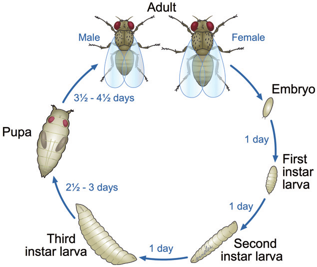
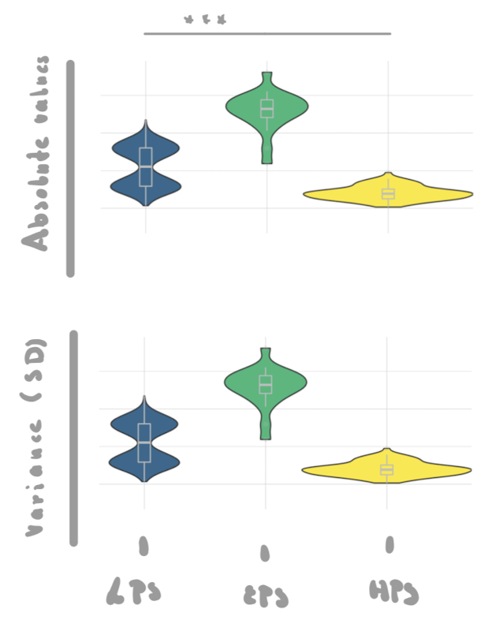
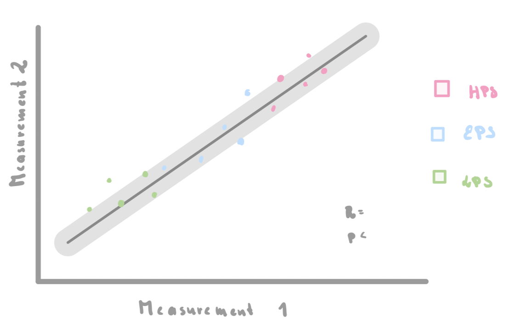

# Effect of Dietary composition on fruit fly's life cycle progression and metabolism

Data Project by Meri

## What is this about?

Diet is a major predictor of health and lifespan as well as a complex "environment" an individual needs to adapt to. High Sugar Diets (HSD), i.e. Diets where a large ratio of caloric intake stems from sugar, for example are known to cause Insulin resistance, leading to Type II diabetes, a disease that claimed 1.5 million lives in 2019 (via [WHO](https://www.who.int/news-room/fact-sheets/detail/diabetes#:~:text=Type%202%20diabetes%20affects%20how,2%20diabetes%20is%20often%20preventable)). Thus understanding how HSDs effect a biological system is essential in developing lines of treatment for diet-linked diseases like diabetes. Here is where *Drosophila melanogaster*, the fruit fly, comes into play. This fly is a popular model organism in biological research, as it combines a short developmental time and life span with conserved gene regulatory and metabolic networks, that share high similarities with their human counterparts. The goal of this project is to define how the life span, developmental time and metabolism of *D. melanogaster* are effected by the composition of their diet, specifically by HSDs.

------------------------------------------------------------------------

## What is this dataset?

I have taken all data from a paper from 2011 ([Matzkin et al., 2011](https://www.sciencedirect.com/science/article/pii/S0022316622029753)).

This publication focuses on the comparison of two *Drosophila* species, *Drosophila melanogaster* and *Drosophila mojavensis*, aiming to characterize if these two ecologically different species to several dietary composition. While interesting, for this project I'd like you to focus on *D. melanogaster* and how the dietary composition effects survival, developmental time and concentration of biomolecules such as fats/lipids, proteins and carbohydrates.

I have compiled the relevant data into an [excel table](/Projects/merinehlsen/flydata.xlsx).

Each fly or pool of flies that was measured for their survival, developmental time or concentration of biomolecules, is characterized in the data set by three factors:

1.  dietary composition
2.  genetics
3.  sex

Let's look at all of them individually in detail.

### 1. Dietary composition (hereafter diet)

The publication looks at three different diets, characterized by the respective amounts of protein (from yeast) and carbohydrates/ sugar (from sucrose) in ratio to each other. They establish them as high protein:sugar ratio (HPS), equal protein:sugar ratio (EPS), and low protein:sugar ratio (LPS), with following percentages of protein and sugar:

> "Our high protein:sugar ratio diet contained 7.1% protein and 17.9% carbohydrate, the EPS diet was 4.3% protein and 21.2% carbohydrate, and the LPS was only 2.5% protein and 24.6% carbohydrate."

If you are interested in the exact weights and volumes used for each diet, you can find those in table 1 of the paper. Importantly though, these three diets are as close in caloric content (=isocaloric) as possible, to ensure, that the observed effects are caused by composition rather than calories. While not perfectly matched (see below), caloric content can be disregarded in the analysis here.

| Diet | caloric value (kJ/ 100 g) |
|------|--------------------------:|
| HPS  |                       452 |
| EPS  |                       456 |
| LPS  |                       469 |

> Please take note, that the HSD of main interest equates not to the HPS (high protein:sugar ratio meaning High Protein Diet) but to the LPS (low protein:sugar ratio) diet.

### 2. Genetics

To account for intra-species variation, so variation of individuals of the same species, the authors study 5 genetically different isofemale *D. melanogaster* lines. Lines in the field of fly genetics basically refers to fly of different origins; often these are wild-caught flies, that were propagated in laboratory conditions. Because these flies are caught at different locations or times, they differ genetically. This is also interesting to this project as genetics can play huge effects in risk of diabetes or other metabolic diseases ([Shitomi-Jones et al., 2023](https://www.ncbi.nlm.nih.gov/pmc/articles/PMC9959290/)). The five *D. melanogaster* lines used here are just called line 1 to 5.

### 3. Sex

Lastly both survival and the Metabolic Pools are assessed for specifically for female and male flies, as sex is know to influence the effects of diet on our traits of interest ([De Groef et al., 2022](https://www.ncbi.nlm.nih.gov/pmc/articles/PMC8774106/)).

The developmental time on the other hand is determined independent on sex (mainly because the sex of larvae and pupae can not be determined easily by eye).

------------------------------------------------------------------------

Now onto the actual measurements of this dataset. Each one of these are compiled in a separate sheet of the excel table. I have also uploaded separate csv tables for each of the three measurements.

### 1. [Survival](/Projects/merinehlsen/flydata_survival.csv)

Survival here is given as the number of adults that eclose from the pupae stage per vial (see next paragraph 2. Developmental Time).

Let's look at the head of the table to understand its content:

```{r survival_table, echo=FALSE}
survival <- read.delim("flydata_survival.csv", sep = ";", header = FALSE)
head(survival)
```

Here the first line indicates the diet and the second one the line. n here refers to the number of vials the researches observed the number of eclosed adults for. The mean and SD of those vials are listed subsequently (e.g. V2 and V3, V4 and V6).

### 2. [Developmental Time](/Projects/merinehlsen/flydata_developmental_time.csv)

As holometabolous insects fruit flies undergo complete metamorphosis, meaning that their life cycle is made up by four distinct stages: egg, larvae, pupae and adult. Every transition from one stage to the next is an important bottleneck in development. Thus de- or ascelerations of the life cycle indicate biological relevancy.



Life cycle of *Drosophila melanogaster* (via [Matzkin et al., 2011](https://www.tandfonline.com/doi/full/10.3109/17435390.2014.940405))

The paper assesses the time between transition from larvae to pupae and pupae to eclosion (= emergence of the adult fly), from what they conclude the duration of the following three "Stages" in development.

| ID  | Stages                                |
|-----|---------------------------------------|
| L-P | first instar larvae to first pupation |
| P-E | first pupation to first eclosion      |
| L-E | first instar larvae to first eclosion |

Again we can check the table to understand its contents:

```{r developmental_time_table, echo=FALSE}
devtime <- read.delim("flydata_developmental_time.csv", sep = ";", header = FALSE)
head(devtime)
```

Similarly to the previous table the mean and SD are listed subsequently (e.g. V2 and V3, V4 and V6), n also refering to the number to vials the researchers studied.

### 3. [Metabolic Pools](/Projects/merinehlsen/flydata_metabolic_pools.csv)

Lastly the paper looks at metabolic markers, specifically the dry weight, protein and triglyceride (TGA) content. Triglycerides in particular play an important role in regulating metabolism in development of *Drosophila melanogaster*. In short dietary sugars are utilized to synthesis TGAs to store energy later to be mobilized during development when individuals are not actively feeding i.e. late larval and all pupal stages.

Protein and TGA content were determined with standard colorimetric assays. For these 5 flies are pooled to reach suffient concentrations and also reduce noise. The dry mass is also determined for these 5 flies (= 1 homogenate).

```{r metabolic_pools_table, echo=FALSE}
metapools <- read.delim("flydata_metabolic_pools.csv", sep = ";", header = FALSE)
head(metapools)
```

Unlike the previous tables the diets are indicated in rows here. Please note that n stands for the number of pools tested, each pool consisting of 5 flies. Again subsequent columns per group denote mean and SD.

## Goals

### Data Manipulation

In all tables you will find the mean per group as well as the standard deviation (SD) for each measurement. While this is not the most elegant to work with, I'd like you to keep the SD as a rough measurement for variance.

All three characteristics (Survival, Developmental time and the metabolic pools) are kept in slightly different table formats, which stays true - though slightly more pointed due to my hand - to the original presentation in the publication. First I'd like you to combine the three tables into one concise table, so that the values for all measurements are easily findable from giving any combination of the three characteristics (dietary composity, genetics and sex). So you will have to reformat the individual tables to a singular format. What this format will look like, I will leave to you.

So in short: Compile data into a more easily acessible format.

### Visualization

This was one of my big caviates with this paper: I think the visualization here could be much improved. I am not a fan of barplots, as they can hide the actual range of values and how they are distributed. So for visualization of the absolute measurements and their variance (i.e. SD) I'd like you to plot them as a violin barplot (see below for the general idea).

My visualization priorities (in no particular order) would be: 

[ ] Violin plot colored by diet and with **no** black outline 

[ ] Boxplot with no fill but white outlines 

[ ] Plot Absolute Values and Variance in two plots but one figure, so that variance is below the absolute values 

[ ] no legend for the color 

[ ] pairwise bars indicating significance of difference between means (t-test)

 

The overarching question I'm additionally asking about the paper is basically if any of the measurements are "related", meaning that e.g. protein content can predict TGA content. Also rather than just looking at the mean of each measurement, I am interested if the variance (by SD here) behaves in a similar way. For this I am envisioning a plot, where you plot measurement 1 (absolute values or variance) against measurement 2 and indicate their "relatedness" with a linear regression (see below for the general idea).

My visualization priorities (in no particular order) would be: 

[ ] Points with no outline, colored by diet 

[ ] Regression line 

[ ] R squared and p-values as text in the plot 

[ ] labeling potential outliers (no math required, but by visual indication) with an arrow + text indicating their line



Overall please be sure to: 

[ ] Use a uniform colors for the three diets across plots (I'd like something that is a bit like a gradient the way the diets are, so e.g. yellow for HPS, green for EPS and blue for LPS). 

[ ] Plot Females and Males once seperately and once joined (if applicable). For the violin boxplots please group them per diet.

------------------------------------------------------------------------

### References

De Groef S, Wilms T, Balmand S, Calevro F, Callaerts P. Sexual Dimorphism in Metabolic Responses to Western Diet in Drosophila melanogaster. Biomolecules. 2021 Dec 27;12(1):33. doi: 10.3390/biom12010033. PMID: 35053181; PMCID: PMC8774106. <https://www.ncbi.nlm.nih.gov/pmc/articles/PMC8774106/>

Matzkin LM, Johnson S, Paight C, Bozinovic G, Markow TA. Dietary protein and sugar differentially affect development and metabolic pools in ecologically diverse Drosophila. J Nutr. 2011 Jun;141(6):1127-33. doi: 10.3945/jn.111.138438. Epub 2011 Apr 27. PMID: 21525254. <https://www.sciencedirect.com/science/article/pii/S0022316622029753>

Shitomi-Jones LM, Akam L, Hunter D, Singh P, Mastana S. Genetic Risk Scores for the Determination of Type 2 Diabetes Mellitus (T2DM) in North India. Int J Environ Res Public Health. 2023 Feb 20;20(4):3729. doi: 10.3390/ijerph20043729. PMID: 36834424; PMCID: PMC9959290. <https://www.ncbi.nlm.nih.gov/pmc/articles/PMC9959290/>

Ong C, Yung LY, Cai Y, Bay BH, Baeg GH. Drosophila melanogaster as a model organism to study nanotoxicity. Nanotoxicology. 2015 May;9(3):396-403. doi: 10.3109/17435390.2014.940405. Epub 2014 Jul 22. PMID: 25051331. <https://www.tandfonline.com/doi/full/10.3109/17435390.2014.940405>
