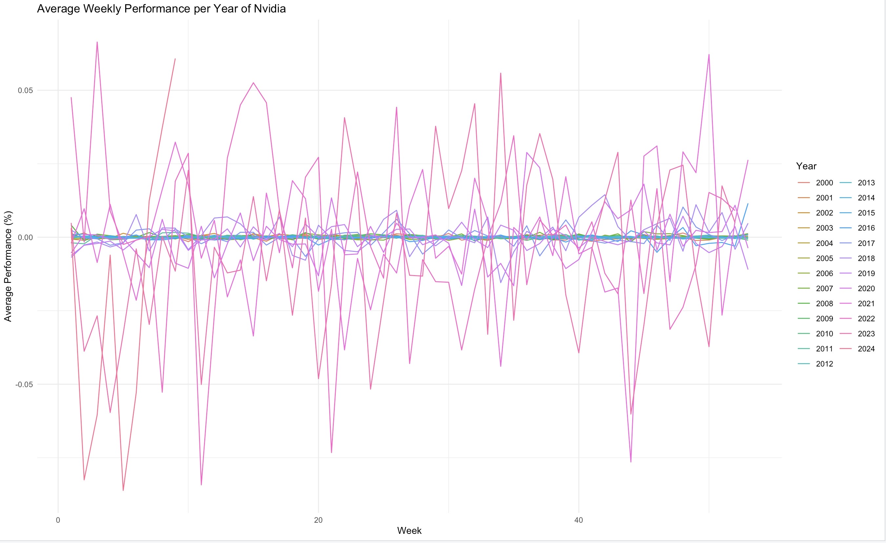

# Project Descriptions

## Plot 1: NVIDIA Stock Analysis

### Introduction
In this project, we aim to analyze the stock performance of NVIDIA Corporation (NASDAQ: NVDA) over time. Understanding how NVIDIA's stock has behaved historically can provide valuable insights for investors and analysts.

### Data Set
We obtained the stock data from Yahoo Finance (https://finance.yahoo.com/quote/NVDA/history). This dataset contains historical stock information, including the date and closing price.

```{r}
# Read the CSV file and display the head of the data
data <- read.csv("NVDA.csv", header=TRUE)
head(data)
```
### Data Manipulation Goals
Our data manipulation goals include:
1. Converting the 'Date' column to a proper date format to facilitate time-based analysis.
2. Calculating monthly closing values from the dataset to identify trends and patterns in the stock performance over time.

## Notes on Data Quality

Before proceeding with the analysis, it's important to address some data quality issues:

- **Missing Values (NA)**: Some entries in the dataset contain missing values (NA). These missing values need to be handled appropriately before conducting any analysis to ensure the accuracy of the results.

- **Data Order**: Due to certain data processing steps or data acquisition methods, the order of entries in the dataset might be mixed up. It's essential to review and potentially reorganize the data to ensure consistency and coherence before initiating any analysis.

Addressing these issues is crucial for obtaining reliable insights from the dataset.


### Visualization Goals
Our goal is to create visualizations illustrating the monthly stock performance of NVIDIA. We aim to produce two plots:
1. A plot with a logarithmic scale to highlight percentage changes over time.
2. A plot with a linear scale to provide a clear representation of absolute stock values.

### Packages Used
We utilized the following R packages for our analysis:
- `lubridate`: For handling date data effectively.
- `dplyr`: For data manipulation tasks.
- `ggplot2`: For creating visually appealing plots.
- `cowplot`: For arranging multiple plots.

### Hint 
```{r}
#example for usage of cowplot library:
library(cowplot)

# 2 example plots:
plot1 <- ggplot(data = iris, aes(x = Sepal.Length, y = Sepal.Width, color = Species)) +
  geom_point() +
  labs(title = "Plot 1")

plot2 <- ggplot(data = iris, aes(x = Petal.Length, y = Petal.Width, color = Species)) +
  geom_point() +
  labs(title = "Plot 2")

# plots next to each other
plot_grid(plot1, plot2, ncol = 2)
```


## Plot 2: Average Weekly Performance Analysis

### Introduction
This project focuses on analyzing the average weekly performance of NVIDIA. Weekly performance analysis can provide insights into short-term trends and volatility in NVIDIA's stock price.

### Data Set
We utilized the same dataset from Yahoo Finance (https://finance.yahoo.com/quote/NVDA/history), containing historical stock information.

### Data Manipulation Goals
Our data manipulation goals include:
1. Converting the 'Date' column to a proper date format for accurate time-based analysis.
2. Grouping the data by week and year to analyze weekly performance trends.
3. Calculating the average weekly performance to identify average performance levels over time.

### Visualization Goals
Our aim is to visualize the average weekly performance per year using a line plot. This visualization will provide a clear representation of how NVIDIA's stock has performed on average on a weekly basis over different years.

### Packages Used
We employed the following R packages for our analysis:
- `lubridate`: For handling date data efficiently.
- `dplyr`: For data manipulation tasks.
- `ggplot2`: For creating insightful visualizations.


