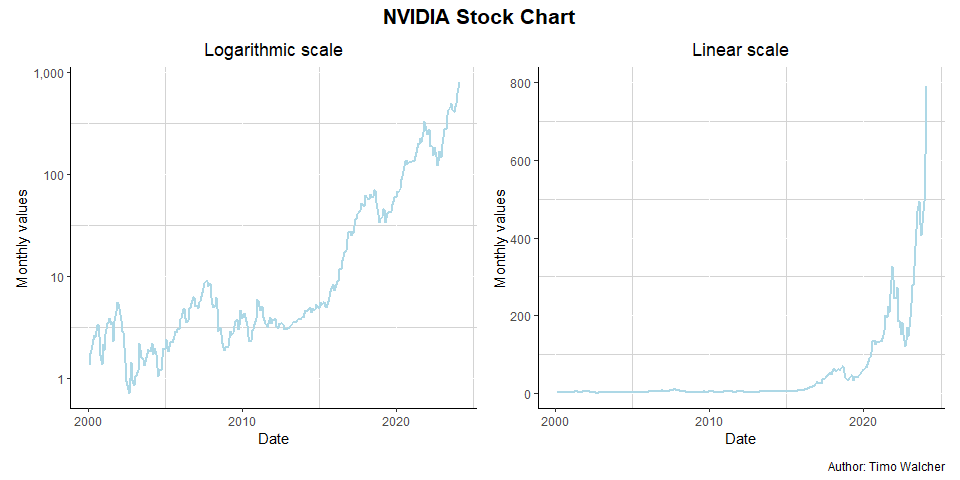
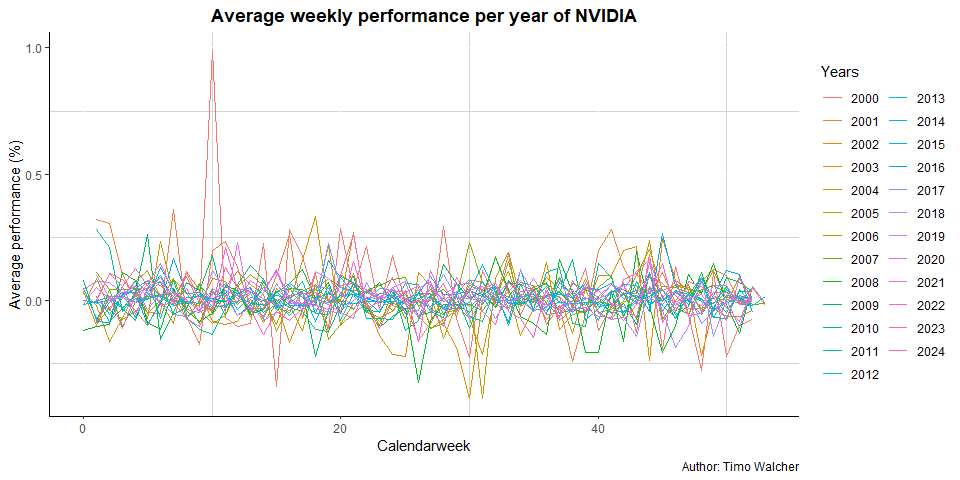

## Data Manipulation Goals

1.  Converting the ‘Date’ column to a proper date format to facilitate
    time-based analysis.

Read the CSV file and display the head of the data. We can format the
date column when importing the file.

    NVDA <- read_csv("NVDA_messedUp_final.csv", 
        col_types = cols(Date = col_date(format = "%Y-%m-%d"))) # Date format

    knitr::kable(
      NVDA[1:10, ], 
      caption = "Table: NVDA.csv")

<table>
<caption>Table: NVDA.csv</caption>
<thead>
<tr class="header">
<th style="text-align: left;">Date</th>
<th style="text-align: right;">Open</th>
<th style="text-align: right;">High</th>
<th style="text-align: right;">Low</th>
<th style="text-align: right;">Close</th>
<th style="text-align: right;">Adj.Close</th>
<th style="text-align: right;">Volume</th>
</tr>
</thead>
<tbody>
<tr class="odd">
<td style="text-align: left;">2014-06-20</td>
<td style="text-align: right;">4.7975</td>
<td style="text-align: right;">4.8150</td>
<td style="text-align: right;">4.6950</td>
<td style="text-align: right;">4.7325</td>
<td style="text-align: right;">4.505627</td>
<td style="text-align: right;">35314800</td>
</tr>
<tr class="even">
<td style="text-align: left;">2014-06-23</td>
<td style="text-align: right;">4.6700</td>
<td style="text-align: right;">4.6800</td>
<td style="text-align: right;">4.6150</td>
<td style="text-align: right;">4.6775</td>
<td style="text-align: right;">4.453262</td>
<td style="text-align: right;">41420000</td>
</tr>
<tr class="odd">
<td style="text-align: left;">2014-06-24</td>
<td style="text-align: right;">4.6700</td>
<td style="text-align: right;">4.7075</td>
<td style="text-align: right;">4.5850</td>
<td style="text-align: right;">4.6050</td>
<td style="text-align: right;">4.384239</td>
<td style="text-align: right;">27578000</td>
</tr>
<tr class="even">
<td style="text-align: left;">2014-06-25</td>
<td style="text-align: right;">4.6175</td>
<td style="text-align: right;">4.6550</td>
<td style="text-align: right;">4.5750</td>
<td style="text-align: right;">4.6525</td>
<td style="text-align: right;">4.429461</td>
<td style="text-align: right;">21542000</td>
</tr>
<tr class="odd">
<td style="text-align: left;">2014-06-26</td>
<td style="text-align: right;">4.6525</td>
<td style="text-align: right;">4.6550</td>
<td style="text-align: right;">4.5750</td>
<td style="text-align: right;">4.5900</td>
<td style="text-align: right;">4.369957</td>
<td style="text-align: right;">25690800</td>
</tr>
<tr class="even">
<td style="text-align: left;">2014-06-27</td>
<td style="text-align: right;">4.5850</td>
<td style="text-align: right;">4.6225</td>
<td style="text-align: right;">4.5575</td>
<td style="text-align: right;">4.5950</td>
<td style="text-align: right;">4.374718</td>
<td style="text-align: right;">30282000</td>
</tr>
<tr class="odd">
<td style="text-align: left;">2014-06-30</td>
<td style="text-align: right;">4.5775</td>
<td style="text-align: right;">4.6475</td>
<td style="text-align: right;">4.5775</td>
<td style="text-align: right;">4.6350</td>
<td style="text-align: right;">4.412799</td>
<td style="text-align: right;">18051200</td>
</tr>
<tr class="even">
<td style="text-align: left;">2014-07-01</td>
<td style="text-align: right;">4.6300</td>
<td style="text-align: right;">4.7150</td>
<td style="text-align: right;">4.6150</td>
<td style="text-align: right;">4.6875</td>
<td style="text-align: right;">4.462784</td>
<td style="text-align: right;">32118000</td>
</tr>
<tr class="odd">
<td style="text-align: left;">2014-07-02</td>
<td style="text-align: right;">4.6700</td>
<td style="text-align: right;">4.6900</td>
<td style="text-align: right;">4.6425</td>
<td style="text-align: right;">4.6700</td>
<td style="text-align: right;">4.446123</td>
<td style="text-align: right;">17928400</td>
</tr>
<tr class="even">
<td style="text-align: left;">2014-07-03</td>
<td style="text-align: right;">4.6275</td>
<td style="text-align: right;">4.7250</td>
<td style="text-align: right;">4.6275</td>
<td style="text-align: right;">4.7125</td>
<td style="text-align: right;">4.486585</td>
<td style="text-align: right;">13689200</td>
</tr>
</tbody>
</table>

Table: NVDA.csv

1.  Calculating weekly and monthly closing values from the dataset to
    identify trends and patterns in the stock performance over time.

Here we can use dplyr to get two new dataframes with the last Close
value of every week and month.

    NVDA_monthly <- NVDA %>%
      mutate(Date_YM = format(Date, "%Y-%m")) %>%
      # this will group by month
      group_by(Date_YM) %>%
      summarise(monthly_close = last(Close))

    NVDA_weekly <- NVDA %>%
      mutate(Date_YM = format(Date, "%Y-%W"),
             calendarweek = format(Date, "%W"),
             Date = format(Date, "%Y-%m-%d")) %>%
      # this will group by week
      group_by(Date_YM) %>%
      summarise(weekly_close = last(Close),
                calendarweek = first(calendarweek),
                Date = last(Date),
                weekly_open = first(Open))

Now we have 2 new Dataframes.  
For the second Plot we need to extend the weekly dataframe.

    NVDA_weekly <- NVDA_weekly %>%
       # add column for year (important for plot 1)
       mutate(year = lubridate::year(Date),
              Date_YM = NULL,
              # change datatypes (important for plot 2)
              Date = as.Date(Date),
              calendarweek = as.numeric(calendarweek))

Calculation of the performance (I have no Idea how). I asked ChatGPT how
to calculate Stock Performance and implemented it accordingly.

    NVDA_weekly <- NVDA_weekly %>%
      # calculate performance in %
      mutate(percentage = ((weekly_close - weekly_open)/weekly_open)) %>%  
      drop_na()

    knitr::kable(
      NVDA_weekly[1:10, ], 
      caption = "Table: NVDA_weekly")

<table>
<caption>Table: NVDA_weekly</caption>
<thead>
<tr class="header">
<th style="text-align: right;">weekly_close</th>
<th style="text-align: right;">calendarweek</th>
<th style="text-align: left;">Date</th>
<th style="text-align: right;">weekly_open</th>
<th style="text-align: right;">year</th>
<th style="text-align: right;">percentage</th>
</tr>
</thead>
<tbody>
<tr class="odd">
<td style="text-align: right;">1.226563</td>
<td style="text-align: right;">9</td>
<td style="text-align: left;">2000-03-03</td>
<td style="text-align: right;">1.268229</td>
<td style="text-align: right;">2000</td>
<td style="text-align: right;">-0.0328537</td>
</tr>
<tr class="even">
<td style="text-align: right;">2.458333</td>
<td style="text-align: right;">10</td>
<td style="text-align: left;">2000-03-10</td>
<td style="text-align: right;">1.234375</td>
<td style="text-align: right;">2000</td>
<td style="text-align: right;">0.9915609</td>
</tr>
<tr class="odd">
<td style="text-align: right;">2.080729</td>
<td style="text-align: right;">11</td>
<td style="text-align: left;">2000-03-17</td>
<td style="text-align: right;">2.229167</td>
<td style="text-align: right;">2000</td>
<td style="text-align: right;">-0.0665890</td>
</tr>
<tr class="even">
<td style="text-align: right;">1.941406</td>
<td style="text-align: right;">12</td>
<td style="text-align: left;">2000-03-24</td>
<td style="text-align: right;">2.162760</td>
<td style="text-align: right;">2000</td>
<td style="text-align: right;">-0.1023479</td>
</tr>
<tr class="odd">
<td style="text-align: right;">1.760091</td>
<td style="text-align: right;">13</td>
<td style="text-align: left;">2000-03-31</td>
<td style="text-align: right;">1.937500</td>
<td style="text-align: right;">2000</td>
<td style="text-align: right;">-0.0915659</td>
</tr>
<tr class="even">
<td style="text-align: right;">2.136719</td>
<td style="text-align: right;">14</td>
<td style="text-align: left;">2000-04-07</td>
<td style="text-align: right;">1.744141</td>
<td style="text-align: right;">2000</td>
<td style="text-align: right;">0.2250839</td>
</tr>
<tr class="odd">
<td style="text-align: right;">1.433268</td>
<td style="text-align: right;">15</td>
<td style="text-align: left;">2000-04-14</td>
<td style="text-align: right;">2.173177</td>
<td style="text-align: right;">2000</td>
<td style="text-align: right;">-0.3404734</td>
</tr>
<tr class="even">
<td style="text-align: right;">1.679688</td>
<td style="text-align: right;">16</td>
<td style="text-align: left;">2000-04-20</td>
<td style="text-align: right;">1.312500</td>
<td style="text-align: right;">2000</td>
<td style="text-align: right;">0.2797623</td>
</tr>
<tr class="odd">
<td style="text-align: right;">1.856771</td>
<td style="text-align: right;">17</td>
<td style="text-align: left;">2000-04-28</td>
<td style="text-align: right;">1.583333</td>
<td style="text-align: right;">2000</td>
<td style="text-align: right;">0.1726977</td>
</tr>
<tr class="even">
<td style="text-align: right;">1.919271</td>
<td style="text-align: right;">18</td>
<td style="text-align: left;">2000-05-05</td>
<td style="text-align: right;">1.927083</td>
<td style="text-align: right;">2000</td>
<td style="text-align: right;">-0.0040538</td>
</tr>
</tbody>
</table>

Table: NVDA\_weekly

## Visualisation: Plot 1

We use the closing values of NVDA\_monthly to produce two plots:  
1. A plot with a logarithmic scale to highlight percentage changes over
time.

First of all, the new dataframe with the column month is of type
character. We need to change it back to the date format.

    NVDA_monthly$Date_YM <- as.Date(paste0(NVDA_monthly$Date_YM, "-01"))

When using logarithmic scales, NA values would create an error message,
so we need to do something about that. It would be possible to add just
a tiny constant to all the NA values or just drop them. Adding a small
constant would look like this:  
NVDA\_monthly*m**e**a**n**c**l**o**s**e**p* &lt;  − *N**V**D**A**m**o**n**t**h**l**y*monthly\_close +
1e-6  
But it would not be useful because there is only one NA value which is
basically the recent month and even if it was not NA it would mess up
the plot.

    NVDA_monthly <- NVDA_monthly %>% drop_na()

Here is a plot with a logarithmic scale.

    # This is for the labels on the x-axis
    break_years <- as.Date(c("2000-01-01", "2010-01-01", "2020-01-01"))

    p1 <- ggplot(NVDA_monthly, aes(x = Date_YM, y = monthly_close)) +
      geom_line(group = 1, color = "lightblue", linewidth = 1) +
      scale_y_log10(breaks = c(1, 10, 100, 1000), 
                    label = \(tickposition) scales::comma(tickposition))+
      scale_x_date(breaks = break_years, 
                   labels = format(break_years, "%Y"), 
                   date_labels = "%Y") +
      labs(
        x = "Date",
        y = "Monthly values",
        title = "Logarithmic scale") +
        theme(axis.line = element_line(color = "black"),
            panel.background = element_blank(),
            panel.grid.minor = element_line(color = "lightgrey"),
            plot.title = element_text(hjust = 0.5))

1.  A plot with a linear scale to provide a clear representation of
    absolute stock values.

<!-- -->

    p2 <- ggplot(NVDA_monthly, aes(x = Date_YM, y = monthly_close)) +
      geom_line(group = 1, color = "lightblue", linewidth = 1) +
      scale_y_continuous(breaks = c(0,200,400,600,800), limits = c(0,800))+
      scale_x_date(breaks = break_years, 
                   labels = format(break_years, "%Y"), 
                   date_labels = "%Y") +
      labs(
        x = "Date",
        y = "Monthly values",
        title = "Linear scale") +
      theme(axis.line = element_line(color = "black"),
            panel.background = element_blank(),
            panel.grid.minor = element_line(color = "lightgrey"),
            plot.title = element_text(hjust = 0.5))

Now both plots next to each other

    p1 + p2 + plot_annotation(title = 'NVIDIA Stock Chart', 
                              caption = 'Author: Timo Walcher',
                              theme = theme(plot.title = element_text(size = 16, 
                                                                      hjust = 0.5,
                                                                      face = "bold")))

## Visualisation: Plot 2

    p3 <- ggplot(NVDA_weekly, aes(calendarweek, percentage, color = factor(year)))+
      geom_line(aes(group = year))+
      scale_x_continuous(breaks = c(0, 20, 40), labels = c(0,20,40))+
      guides(color = guide_legend(title = "Years"))+
      labs(
        x = "Calendarweek",
        y = "Average performance (%)",
        title = "Average weekly performance per year of NVIDIA",
        caption = "Author: Timo Walcher")+
      theme(axis.line = element_line(color = "black"),
            panel.background = element_blank(),
            panel.grid.minor = element_line(color = "lightgrey"),
            plot.title = element_text(hjust = 0.5, face = "bold"))

    p3

