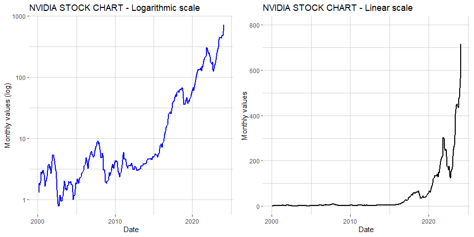

## Data Manipulation Goals

1.  Converting the ‘Date’ column to a proper date format to facilitate
    time-based analysis.

Read the CSV file and display the head of the data. We can format the
date column when importing the file.

    NVDA <- read_csv("NVDA_messedUp_final.csv", 
        col_types = cols(Date = col_date(format = "%Y-%m-%d"))) # Date format
    head(NVDA)

    ## # A tibble: 6 × 7
    ##   Date        Open  High   Low Close Adj.Close   Volume
    ##   <date>     <dbl> <dbl> <dbl> <dbl>     <dbl>    <dbl>
    ## 1 2014-06-20  4.80  4.82  4.70  4.73      4.51 35314800
    ## 2 2014-06-23  4.67  4.68  4.62  4.68      4.45 41420000
    ## 3 2014-06-24  4.67  4.71  4.58  4.61      4.38 27578000
    ## 4 2014-06-25  4.62  4.66  4.58  4.65      4.43 21542000
    ## 5 2014-06-26  4.65  4.66  4.58  4.59      4.37 25690800
    ## 6 2014-06-27  4.58  4.62  4.56  4.60      4.37 30282000

1.  Calculating weekly, monthly and yearly closing values from the
    dataset to identify trends and patterns in the stock performance
    over time.

Here we can use dplyr to get a new dataframe with the last Close value
of every week, month and year.

    NVDA_monthly <- NVDA %>%
      mutate(Date_YM = format(Date, "%Y-%m")) %>%
      group_by(Date_YM) %>%
      summarise(monthly_close = last(Close))

    NVDA_weekly <- NVDA %>%
      mutate(Date_YM = format(Date, "%Y-%W"),
             calendarweek = format(Date, "%W")) %>%
      group_by(Date_YM) %>%
      summarise(weekly_close = last(Close),
                calendarweek = first(calendarweek))

    NVDA_yearly <- NVDA %>%
      mutate(year = format(Date, "%Y")) %>%
      group_by(year) %>%
      summarise(yearly_close = last(Close))

Now we have 3 new Dataframes.  
For the second Plot we need to extend the weekly dataframe.

    # Transform Date_YM column into datatype date 
    NVDA_weekly <- NVDA_weekly %>%
      mutate(Date_YMD = as.Date(paste0(Date_YM,"-01"), format = "%Y-%W-%d"),
             Date_YM = NULL)
    # which somehow gives back wrong week numbers

    # Also add a column in NVDA_weekly with year so that we can join the yearly dataframe
    NVDA_weekly <- NVDA_weekly %>%
      mutate(year = lubridate::year(Date_YMD))

    # Merge both dataframes based on year column
    #NVDA_merged <- merge(NVDA_weekly, NVDA_yearly, by = "year", all.x = TRUE, suffixes = c("_weekly", "_yearly"))

    # Left join NVDA_weekly with NVDA_yearly
    NVDA_yearly$year <- as.double(NVDA_yearly$year) 
    NVDA_merged <- left_join(NVDA_weekly, NVDA_yearly, by = "year")

    # make new column "percentage" showing the deviation of a week to the yearly average
    NVDA_merged <- NVDA_merged %>%
      mutate(deviation = weekly_close - yearly_close,
             percentage = (deviation / yearly_close) * 100)

## Visualisation Plot 1

The closing values are now used to produce two charts \*A plot with a
logarithmic scale to highlight percentage changes over time.

First of all, the new dataframe with the column month is of type
character. I need to change it back to the date format.

    NVDA_monthly$Date_YM <- as.Date(paste0(NVDA_monthly$Date_YM, "-01"))

When using logarithmic scales, NA values would create an error message,
so first of all we need to do something about that. It would be possible
to add just a tiny constant to all the NA values or just delete them.

    NVDA_monthly <- NVDA_monthly %>% drop_na()

Adding a small constant would look like this:
NVDA\_monthly*m**e**a**n**c**l**o**s**e**p* &lt;  − *N**V**D**A**m**o**n**t**h**l**y*monthly\_close +
1e-6 But it would not be useful because there is only one NA value which
is basically the recent month.

Now we can plot it.

    # This is for the labels on the x-axis
    break_years <- as.Date(c("2000-01-01", "2010-01-01", "2020-01-01"))

    p1 <- ggplot(NVDA_monthly, aes(x = Date_YM, y = monthly_close)) +
      geom_line(group = 1, color = "blue", linewidth = 1) +
      scale_y_log10(breaks = c(1, 10, 100, 1000), 
                    label = \(tickposition) scales::comma(tickposition))+
      scale_x_date(breaks = break_years, labels = format(break_years, "%Y"), date_labels = "%Y") +
      labs(
        x = "Date",
        y = "Monthly values",
        title = "NVIDIA STOCK CHART - Logarithmic scale") +
      theme(panel.grid = element_line(colour = "lightgrey"),
            panel.background = element_rect(fill = "white"))

\*A plot with a linear scale to provide a clear representation of
absolute stock values.

    # This is for the labels on the x-axis
    break_years <- as.Date(c("2000-01-01", "2010-01-01", "2020-01-01"))

    p2 <- ggplot(NVDA_monthly, aes(x = Date_YM, y = monthly_close)) +
      geom_line(group = 1, color = "black", linewidth = 1) +
      scale_y_continuous(breaks = c(0,200,400,600,800), limits = c(0,800))+
      scale_x_date(breaks = break_years, labels = format(break_years, "%Y"), date_labels = "%Y") +
      labs(
        x = "Date",
        y = "Monthly values",
        title = "NVIDIA STOCK CHART - Linear scale") +
      theme(panel.grid = element_line(colour = "lightgrey"),
            panel.background = element_rect(fill = "white"))

Now both plots next to each other

    plot_grid(p1, p2, ncol = 2)

## Visualisation Plot 2
