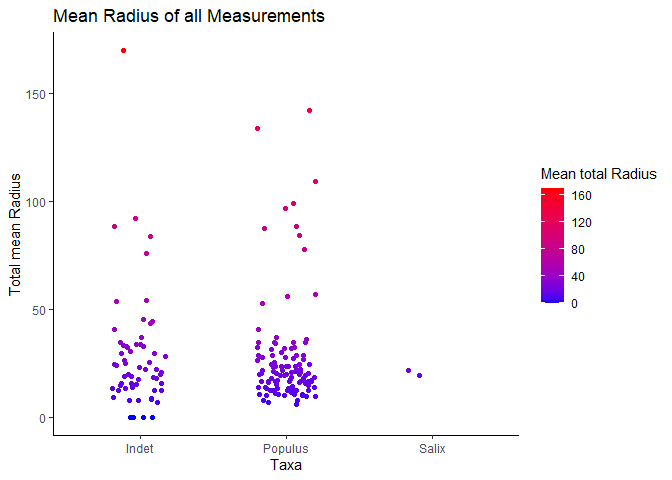
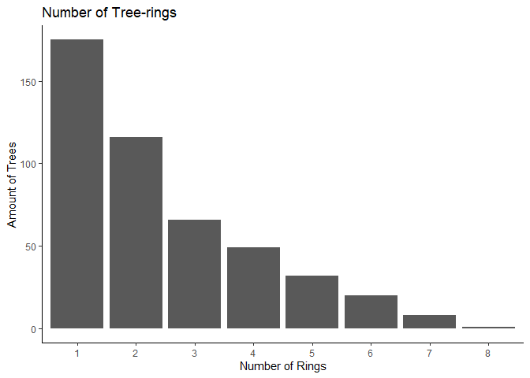
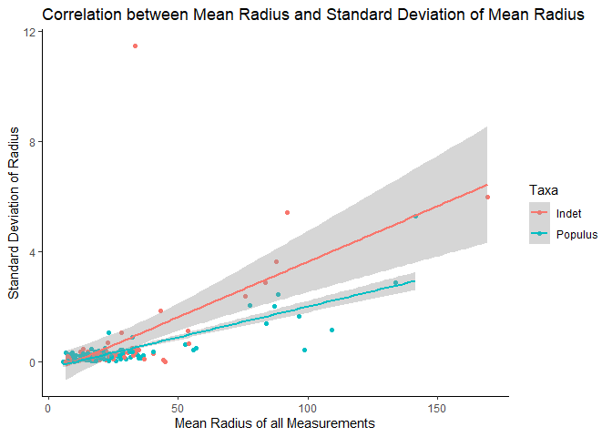

I first tried to make a simple scatterplot for the total mean radius of
the three measurements of each Taxa.

I remembered that Martin advised Nico to make Violin plots, so I did as
well. I think with violin plots the distribution of the data is a little
bit easier to see. It seems that most rings have a mean radius between 0
and 50, although there are some exceptions.

Here I make a Barplot for the number of tree rings. There seems to be a
clear trend: more trees have a fewer number of rings

I made the scatterfplot of mean radius against the standard deviation of
the mean radius and added a linear approximation of the data for INdet
and Populus.

    ## `geom_smooth()` using formula = 'y ~ x'

I wanted to see how good the linear regression fits the data. You can
see that R squared for Populus is ca. 0,7 and for Indet it is ca. 0,35.
The linear model seems to fit the Populs Taxa a lot better

    ## 
    ## Call:
    ## lm(formula = Radius_tot_mean ~ Radius_tot_sd, data = lm_data_indet)
    ## 
    ## Residuals:
    ##     Min      1Q  Median      3Q     Max 
    ## -87.580 -10.925  -4.340   6.625  95.145 
    ## 
    ## Coefficients:
    ##               Estimate Std. Error t value Pr(>|t|)    
    ## (Intercept)     23.095      3.163   7.301 1.10e-09 ***
    ## Radius_tot_sd    8.561      1.578   5.425 1.28e-06 ***
    ## ---
    ## Signif. codes:  0 '***' 0.001 '**' 0.01 '*' 0.05 '.' 0.1 ' ' 1
    ## 
    ## Residual standard error: 21.97 on 56 degrees of freedom
    ## Multiple R-squared:  0.3445, Adjusted R-squared:  0.3328 
    ## F-statistic: 29.44 on 1 and 56 DF,  p-value: 1.281e-06

    ## 
    ## Call:
    ## lm(formula = Radius_tot_mean ~ Radius_tot_sd, data = lm_data_pop)
    ## 
    ## Residuals:
    ##     Min      1Q  Median      3Q     Max 
    ## -39.425  -7.557  -2.322   4.604  69.421 
    ## 
    ## Coefficients:
    ##               Estimate Std. Error t value Pr(>|t|)    
    ## (Intercept)     15.406      1.510   10.20   <2e-16 ***
    ## Radius_tot_sd   31.279      1.968   15.89   <2e-16 ***
    ## ---
    ## Signif. codes:  0 '***' 0.001 '**' 0.01 '*' 0.05 '.' 0.1 ' ' 1
    ## 
    ## Residual standard error: 13.69 on 109 degrees of freedom
    ## Multiple R-squared:  0.6985, Adjusted R-squared:  0.6958 
    ## F-statistic: 252.6 on 1 and 109 DF,  p-value: < 2.2e-16
