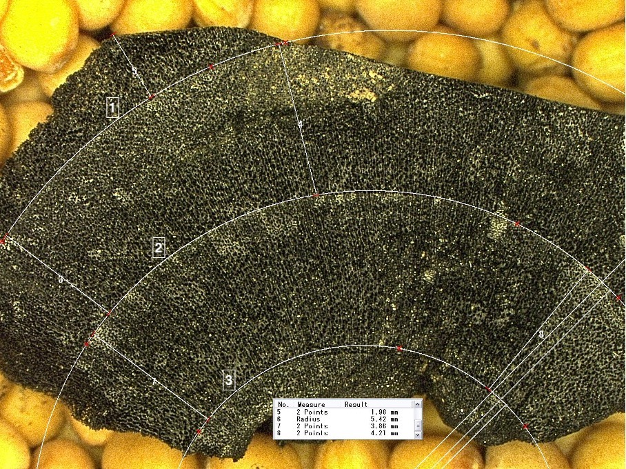

```{r setup, include=FALSE}
knitr::opts_chunk$set(include = FALSE)
library(tidyverse)
library(knitr)
Data <- read.csv("Data_Project1.csv", sep = ";") 
```

## Background

------------------------------------------------------------------------

Charcoal analysis is a valuable tool for reconstructing past human and environmental interactions. It can provide information about the types of wood used, whether green or dry wood was used and whether tree sizes and ages were prioritised. The reconstruction of the original tree diameter is necessary to answer such questions, and this is achievable by measuring the curvature of the last annual ring using different methods.(Fig. 1)  However, understanding the relationship between tree size and woodland management remains a significant challenge. Management is assumed to lead to age and/or diameter peaks, and the diameters of managed trees are supposed to be larger in their age category. Still, unmanaged trees should reach a higher age, as they are not felled in a planned manner. The difference in size is explainable by the access to light, space and nutrients, which is better in managed woods. However, it is also possible that free-standing trees grow faster.

## Data

------------------------------------------------------------------------

The [data](Data_Project1.csv) is shortened and consists now of nine columns:

-   **ID**: Number of every single piece, because of previous research purpose not abscond

-   **Localisation**: Description of the sampling area

-   **Taxa**: Identified wood species

-   **Radius_number**: outermost annual ring 1 and then continuous (See fig.1)

-   **Radius1_mean** & **Radius2_mean** & **Radius3_mean**: Each annual ring is measured three times and every measurement is written down

-   **Radius_tot_mean**: The mean of all three measurements

-   **Radius_tot_sd**: The standard deviation of the total mean radius

```{r setup, include=FALSE}
knitr::opts_chunk$set(echo = FALSE)
kable(head(Data[1:5,]))
```

## Task

------------------------------------------------------------------------

1.  Scatterplot with the mean radius size of each sample in which only the samples with Radius_number 1 are considered. Differentiation between different taxa, colour gradient from smaller to larger diameter

-   I would assume that there is no difference between Populus and Indet. It's interessting to see if there is a cluster by a specific radius size or if they are randomly distributed

2.  Barplot/Boxplot in which the number of samples with the different numbers of annual rings is shown

-   Just to know how many rings are on one piece of charcoal and if there is a dominance of a specific number

3.  Scatterplot with dependence of standard deviation on the mean value of the radius, differentiated by taxa, including for each taxa a linear trend line

-   I would except that with bigger radius the standard deviation inscrease

4.  **optional** (i) compute for each taxon a linear model of the radius 1 data. (ii) substract the model value from each value and (iii) identify all points that are above/below the standard deviation of this "mean normalized" data, to identify "interesting" outlier. plot the original data with linear trendline and highlight (color) all outliers.
