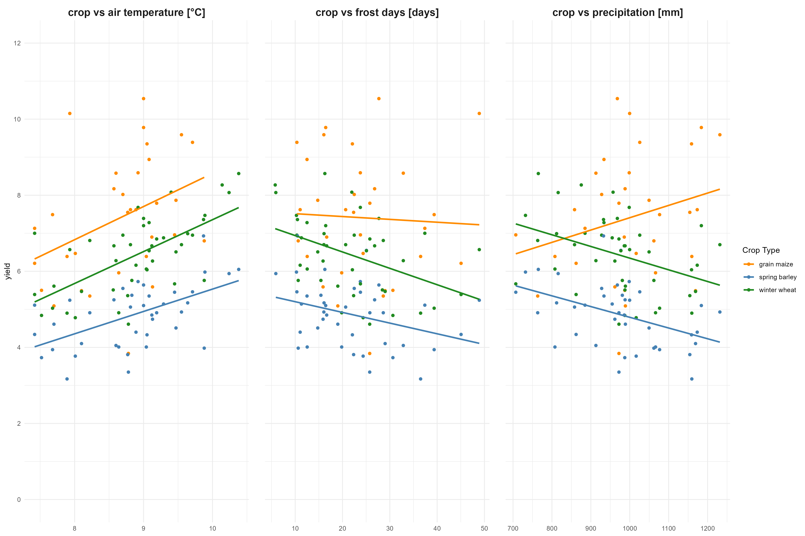
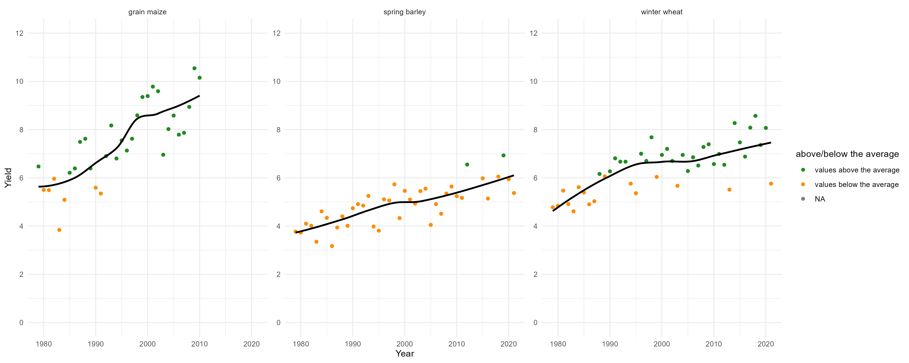
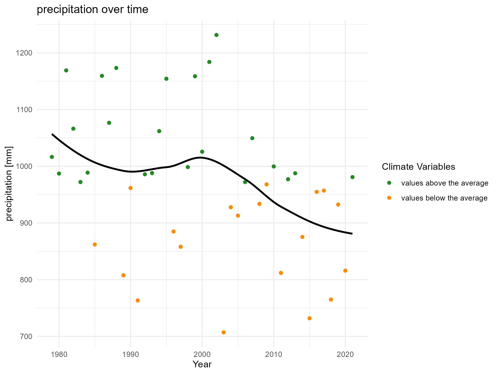
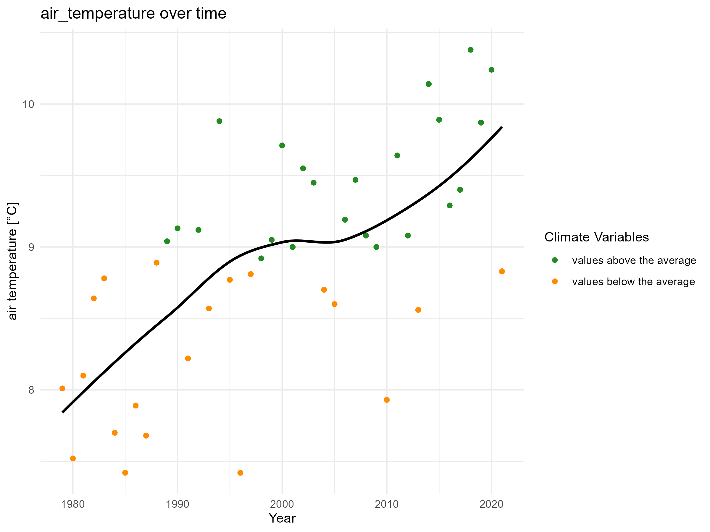
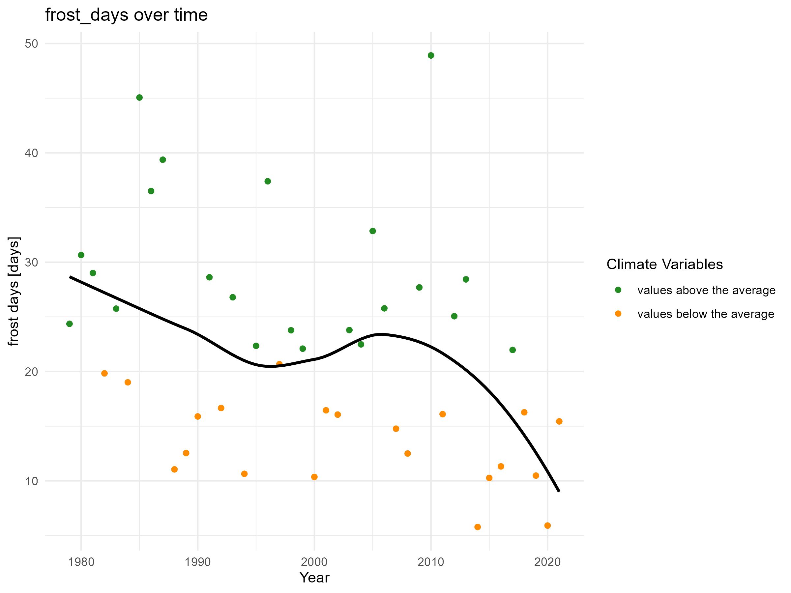

# Project 1: crop vs climate 
## solution by paula0013 
```{r setup, include=FALSE}
knitr::opts_chunk$set(echo = TRUE)
library(dplyr)
library(readxl)
library(readr)
library(magrittr)
library(tidyverse)
library(ggplot2)
```

Climate change is a huge challenge for farmers worldwide. It is causing extreme weather events, such as droughts and floods, which can have devastating effects on crops and livestock. This project focuses on *crop production in the region of Tübingen and how it has been affected by climate change.*

# Read and transform of the data
```{r echo=FALSE, message=FALSE, warning=FALSE}
# Read and transform the crop data for Tübingen
crop_data <- read.csv("https://www.openagrar.de/servlets/MCRFileNodeServlet/openagrar_derivate_00056476/Final_data.csv") %>% 
  #mutate the species 'ww' to 'winter wheat', 'sb' to 'spring barley' and 'grain_maize' to 'grain maize'
   mutate(
    var = case_when(
      var == "ww" ~ "winter wheat",
      var == "sb" ~ "spring barley",
      var == "grain_maize" ~ "grain maize",
      TRUE ~ NA_character_
    )
  ) %>%
    drop_na(var)%>%
  # Filter the columns for 'Tübingen', the species 'winter wheat', 'spring barley' and 'grain maize' and the measure in 'yield'
  filter(
  district_no == '8416' & 
  var %in% c('winter wheat', 'spring barley', 'grain maize') & 
  measure == 'yield'
)%>%
  select(district, year, var, value)%>%
   # Rename the column measure into measure in yield
  rename('yield' = 'value')%>%
  # Rename the column var into species 
  rename('species' = 'var')

# Define a function
load_and_transform <- function(url, column_name, new_name) {
  df <- read.table(
    url,
    header = TRUE,
    sep = ";",
    skip = 1,
    check.names = FALSE,
    stringsAsFactors = FALSE
  )
  
  # Remove columns with empty names
  df <- df[, names(df) != ""]
  # Remove the second column (unit “Year”)
  df <- df[, -2]
  
  # Select “Year” and desired column and filter the years
  df %>%
    select(year = Jahr, value = all_of(column_name)) %>%
    rename(!!new_name := value) %>%
    filter(between(year, 1979, 2021))
}

# Define URLs + column names + new column names
climate_sources <- tribble(
  ~url, ~column_name, ~new_name,
  "https://opendata.dwd.de/climate_environment/CDC/regional_averages_DE/annual/precipitation/regional_averages_rr_year.txt", "Baden-Wuerttemberg", "precipitation",
  "https://opendata.dwd.de/climate_environment/CDC/regional_averages_DE/annual/air_temperature_mean/regional_averages_tm_year.txt", "Baden-Wuerttemberg", "air_temperature",
  "https://opendata.dwd.de/climate_environment/CDC/regional_averages_DE/annual/ice_days/regional_averages_txcs_year.txt", "Baden-Wuerttemberg", "frost_days"
)

# Load the data with pmap
climate_data_list <- pmap(climate_sources, load_and_transform)

# Merge all data frames (join via “year”)
climate_data <- reduce(climate_data_list, left_join, by = "year")
data <- climate_data %>%
  left_join(crop_data, by = "year") %>%
  as_tibble() %>%
  pivot_longer(
    cols = c(precipitation, air_temperature, frost_days),
    names_to = "climate_variable",
    values_to = "climate_value"
  )

knitr::kable(head(data,15), caption = "weather and crop data from tuebingen (1976–2021)")
```

# Visulisation 
## 1. Relationship between crop yields and climate variables
```{r echo=FALSE, message=FALSE, warning=FALSE}
# Plot of the relationship between crop yields and climate varaibles 
p1 <- data %>%
  ggplot(
    aes(x= climate_value, y= yield, color = species)) +
    geom_point(size = 1.5) + 
  geom_smooth(method = "lm", se = FALSE, aes(color = species))+
      facet_wrap(
            ~climate_variable, 
            scales = "free_x", 
            ncol = 3, 
            labeller = labeller(climate_variable = c(
            "precipitation" = "crop vs precipitation [mm]",
            "air_temperature" = "crop vs air temperature [°C]",
            "frost_days" = "crop vs frost days [days]"
      ))) + 
    labs(
      x = NULL, 
      color = "Crop Type"
    ) +
  theme_minimal() +
    theme(legend.position="right",
          plot.title = element_text(size = 18, face = "bold", hjust = 0.5),
          strip.text = element_text(size = 14, face = "bold"),
          panel.spacing = unit(1.5, "lines"
          ))+
  scale_color_manual(values = c("grain maize" = "darkorange",
                                "spring barley" = "steelblue",
                                "winter wheat" = "forestgreen")) +
  scale_y_continuous(limits = c(0, 12), breaks = seq(0, 12, by = 2))
ggsave("plot_relationship_yield_vs_climate.png", p1, width=15, height=10)
```


## 2.Crop yields over the time [in year] 
```{r echo=FALSE, message=FALSE, warning=FALSE}
p2 <-data %>%
  mutate(
    yield_average = mean(yield, na.rm = TRUE),
    yield_above_average = if_else(yield >= yield_average, "above", "below")
  )%>%
  ggplot(
    aes(x= year, y= yield, color = yield_above_average)) +
    geom_point(size = 1.5) + 
  geom_smooth(method = "loess", se = FALSE, color = "black")+
      facet_wrap(
                  ~species, 
                  scales = "free_y", 
                  ncol = 3,
                  labeller = labeller(species = c(
      'grain maize' = "grain maize",
      'spring barley' = "spring barley",
      'winter wheat' = "winter wheat"
    )))+ 
    labs(
      x = 'Year', 
      y = 'Yield (t/ha)', 
      color = "above/below the average"
    ) +
  theme_minimal()+ 
  scale_y_continuous(limits = c(0, 12), breaks = seq(0, 12, by = 2))+ 
  scale_color_manual(values = c("above" = "forestgreen", "below" = "darkorange"),
                     labels = c("above"="values above the average", "below" = "values below the average"))

ggsave("plot_crop_yield_over_time.png", p2, width=15, height=6)
```



## 3.Climate variables over the time [in year]
```{r echo=FALSE, message=FALSE, warning=FALSE}
plot_for_variable <- function(variable_name, y_label) {
  p <- data %>%
    filter(climate_variable == variable_name) %>%
    mutate(
      average_value = mean(climate_value, na.rm = TRUE),
      above_average = if_else(climate_value >= average_value, "above", "below")
    ) %>%
    ggplot(aes(x = year, y = climate_value, color = above_average)) +
    geom_point(size = 1.5) +
    geom_smooth(method = "loess", se = FALSE, color = "black") +
    labs(
      x = "Year",
      y = y_label,
      color = "Climate Variables"
    ) +
    theme_minimal() +
    scale_color_manual(
      values = c("above" = "forestgreen", "below" = "darkorange"),
      labels = c("above" = "values above the average", "below" = "values below the average")
    )
  
  return(p)
}

p_precipitation <- plot_for_variable("precipitation", "precipitation [mm]")
p_air_temperature <- plot_for_variable("air_temperature", "air temperature [°C]")
p_frost_days <- plot_for_variable("frost_days", "frost days [days]")

ggsave("plot_precipitation.png", p_precipitation, width = 8, height = 6)
ggsave("plot_air_temperature.png", p_air_temperature, width = 8, height = 6)
ggsave("plot_frost_days.png", p_frost_days, width = 8, height = 6)
```


