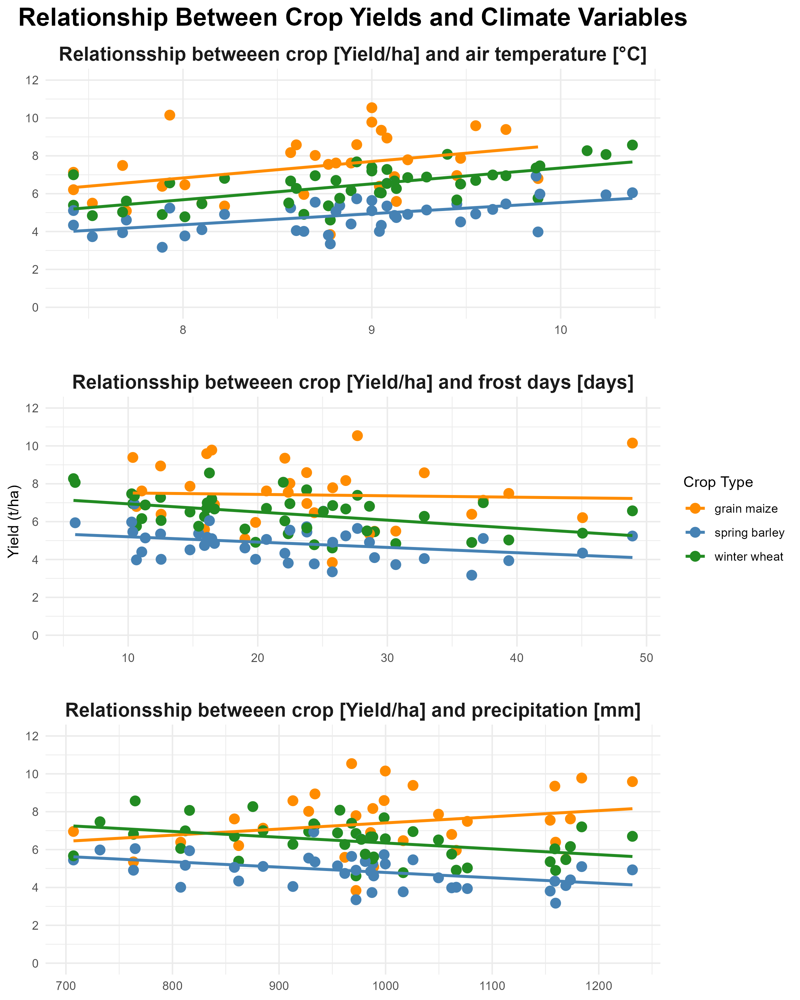
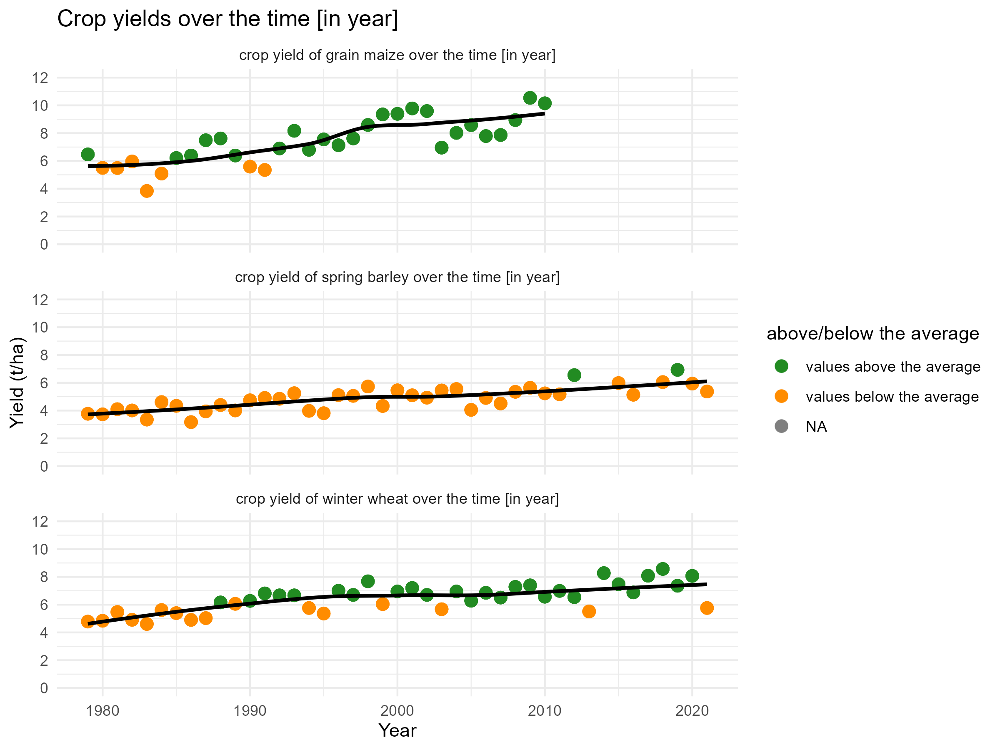
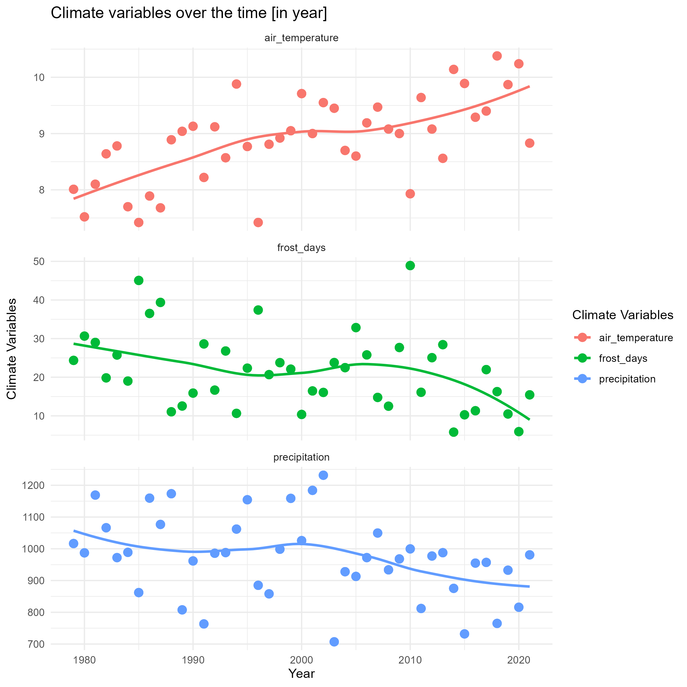

# Project 1: crop vs climate

## solution by paula0013

Climate change is a huge challenge for farmers worldwide. It is causing
extreme weather events, such as droughts and floods, which can have
devastating effects on crops and livestock. This project focuses on
*crop production in the region of Tübingen and how it has been affected
by climate change.*

# Read and transform the data set of the weather data from 1976 to 2021

<table>
<caption>Wetter- und Ertragsdaten Tübingen (1976–2021)</caption>
<colgroup>
<col style="width: 6%" />
<col style="width: 26%" />
<col style="width: 18%" />
<col style="width: 7%" />
<col style="width: 22%" />
<col style="width: 18%" />
</colgroup>
<thead>
<tr class="header">
<th style="text-align: right;">year</th>
<th style="text-align: left;">district</th>
<th style="text-align: left;">species</th>
<th style="text-align: right;">yield</th>
<th style="text-align: left;">climate_variable</th>
<th style="text-align: right;">climate_value</th>
</tr>
</thead>
<tbody>
<tr class="odd">
<td style="text-align: right;">1979</td>
<td style="text-align: left;">Tübingen, Landkreis</td>
<td style="text-align: left;">grain maize</td>
<td style="text-align: right;">6.47</td>
<td style="text-align: left;">precipitation</td>
<td style="text-align: right;">1016.50</td>
</tr>
<tr class="even">
<td style="text-align: right;">1979</td>
<td style="text-align: left;">Tübingen, Landkreis</td>
<td style="text-align: left;">grain maize</td>
<td style="text-align: right;">6.47</td>
<td style="text-align: left;">air_temperature</td>
<td style="text-align: right;">8.01</td>
</tr>
<tr class="odd">
<td style="text-align: right;">1979</td>
<td style="text-align: left;">Tübingen, Landkreis</td>
<td style="text-align: left;">grain maize</td>
<td style="text-align: right;">6.47</td>
<td style="text-align: left;">frost_days</td>
<td style="text-align: right;">24.36</td>
</tr>
<tr class="even">
<td style="text-align: right;">1979</td>
<td style="text-align: left;">Tübingen, Landkreis</td>
<td style="text-align: left;">spring barley</td>
<td style="text-align: right;">3.77</td>
<td style="text-align: left;">precipitation</td>
<td style="text-align: right;">1016.50</td>
</tr>
<tr class="odd">
<td style="text-align: right;">1979</td>
<td style="text-align: left;">Tübingen, Landkreis</td>
<td style="text-align: left;">spring barley</td>
<td style="text-align: right;">3.77</td>
<td style="text-align: left;">air_temperature</td>
<td style="text-align: right;">8.01</td>
</tr>
<tr class="even">
<td style="text-align: right;">1979</td>
<td style="text-align: left;">Tübingen, Landkreis</td>
<td style="text-align: left;">spring barley</td>
<td style="text-align: right;">3.77</td>
<td style="text-align: left;">frost_days</td>
<td style="text-align: right;">24.36</td>
</tr>
<tr class="odd">
<td style="text-align: right;">1979</td>
<td style="text-align: left;">Tübingen, Landkreis</td>
<td style="text-align: left;">winter wheat</td>
<td style="text-align: right;">4.78</td>
<td style="text-align: left;">precipitation</td>
<td style="text-align: right;">1016.50</td>
</tr>
<tr class="even">
<td style="text-align: right;">1979</td>
<td style="text-align: left;">Tübingen, Landkreis</td>
<td style="text-align: left;">winter wheat</td>
<td style="text-align: right;">4.78</td>
<td style="text-align: left;">air_temperature</td>
<td style="text-align: right;">8.01</td>
</tr>
<tr class="odd">
<td style="text-align: right;">1979</td>
<td style="text-align: left;">Tübingen, Landkreis</td>
<td style="text-align: left;">winter wheat</td>
<td style="text-align: right;">4.78</td>
<td style="text-align: left;">frost_days</td>
<td style="text-align: right;">24.36</td>
</tr>
<tr class="even">
<td style="text-align: right;">1980</td>
<td style="text-align: left;">Tübingen, Landkreis</td>
<td style="text-align: left;">grain maize</td>
<td style="text-align: right;">5.50</td>
<td style="text-align: left;">precipitation</td>
<td style="text-align: right;">987.20</td>
</tr>
<tr class="odd">
<td style="text-align: right;">1980</td>
<td style="text-align: left;">Tübingen, Landkreis</td>
<td style="text-align: left;">grain maize</td>
<td style="text-align: right;">5.50</td>
<td style="text-align: left;">air_temperature</td>
<td style="text-align: right;">7.52</td>
</tr>
<tr class="even">
<td style="text-align: right;">1980</td>
<td style="text-align: left;">Tübingen, Landkreis</td>
<td style="text-align: left;">grain maize</td>
<td style="text-align: right;">5.50</td>
<td style="text-align: left;">frost_days</td>
<td style="text-align: right;">30.65</td>
</tr>
<tr class="odd">
<td style="text-align: right;">1980</td>
<td style="text-align: left;">Tübingen, Landkreis</td>
<td style="text-align: left;">spring barley</td>
<td style="text-align: right;">3.73</td>
<td style="text-align: left;">precipitation</td>
<td style="text-align: right;">987.20</td>
</tr>
<tr class="even">
<td style="text-align: right;">1980</td>
<td style="text-align: left;">Tübingen, Landkreis</td>
<td style="text-align: left;">spring barley</td>
<td style="text-align: right;">3.73</td>
<td style="text-align: left;">air_temperature</td>
<td style="text-align: right;">7.52</td>
</tr>
<tr class="odd">
<td style="text-align: right;">1980</td>
<td style="text-align: left;">Tübingen, Landkreis</td>
<td style="text-align: left;">spring barley</td>
<td style="text-align: right;">3.73</td>
<td style="text-align: left;">frost_days</td>
<td style="text-align: right;">30.65</td>
</tr>
</tbody>
</table>

Wetter- und Ertragsdaten Tübingen (1976–2021)

\#Visulisation \# 1. Relationship Between Crop Yields and Climate
Variables

<figure>

<figcaption aria-hidden="true">Relationship Between Crop Yields and
Climate Variables</figcaption>
</figure>

\#2.”Crop yields over the time \[in year\]

<figure>

<figcaption aria-hidden="true">Crop yields over the time</figcaption>
</figure>

\#3.Climate variables over the time \[in year\]

<figure>

<figcaption aria-hidden="true">Climate variables over the
time</figcaption>
</figure>
