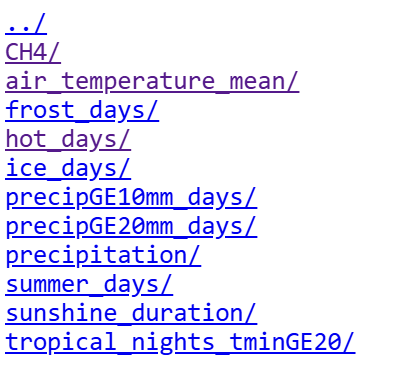

Climate change is a huge challenge for farmers worldwide. It is causing
extreme weather events, such as droughts and floods, which can have
devastating effects on crops and livestock. This project focuses on
**crop production in the region of Tübingen and how it has been affected
by climate change**.

# Data Sets

### Crop Production Data

**Source**: [Duden et al. (2023). *Crop yields and area in Germany from
1979 to 2021 at a harmonized
district-level.*](https://doi.org/10.3220/DATA20231117103252-0)

**Description**: This dataset contains information on crop yields and
area in Germany from 1979 to 2021 at a harmonized district-level. It
includes data on various crops, such as wheat, barley, and maize, as
well as the yield and area harvested. We are interested in the crop
yields in the district of Tübingen, (nuts\_id = DE142).

### Climate Data

**Source**: [Deutscher Wetterdienst
(2023):](https://www.dwd.de/EN/ourservices/cdc/cdc_ueberblick-klimadaten_en.html)
*Average values for the individual federal states and for Germany as a
whole.*

**Description**: The Deutscher Wetterdienst (DWD) provides a wide range
of climate data, including temperature, precipitation, and sunshine
duration:

The data is presented in a table format, with each row representing a
year and each column representing the value of the variable (e.g. mean
temperature) in each federal state. We are interested in the climate
data for the state of Baden-Württemberg.

# Data Manipulation Goals

-   **Select crop yield data:** pick three crops (e.g. wheat, barley,
    maize) and extract their annual yield data for Tübingen (nuts\_id =
    DE142).
-   **Select climate data:** pick a climate variable (e.g. mean
    temperature, precipitation, hot days) and extract the data for
    Baden-Württemberg.
-   **Merge the datasets:** create a tidy tibble (each row is one
    observation).

# Visualization Goals

**Plot the crop yields against the climate variable:**

-   Create a scatter plot with the crop yields on the y-axis and the
    climate variable on the x-axis.
-   Include regression lines for each crop to show a trend.
-   Color the points by crop type.
-   Add a title and labels to the axes.
-   Add a legend to indicate the crop type.
