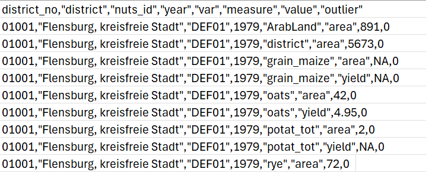
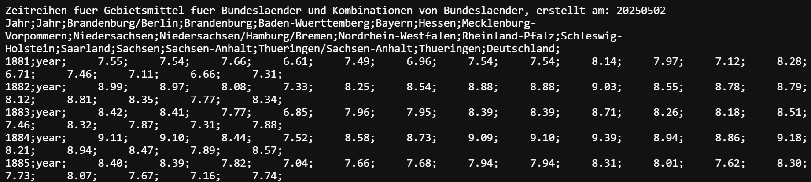

# Crops vs. Climate

Climate change is a huge challenge for farmers worldwide. It is causing
extreme weather events, such as droughts and floods, which can have
devastating effects on crops and livestock. This project focuses on
**crop production in the region of Tübingen and how it has been affected
by climate change**.

## Data Sets

### Crop Production Data

**Source**: [Duden et al. (2023). *Crop yields and area in Germany from
1979 to 2021 at a harmonized
district-level.*](https://doi.org/10.3220/DATA20231117103252-0)

The accompanying documentation
([PDF](https://www.openagrar.de/servlets/MCRFileNodeServlet/openagrar_derivate_00056476/Readme.pdf))
offers a thorough explanation of the dataset’s structure, including
column descriptions, units of measurement, and crop classifications. The
dataset itself is available as a [CSV
file](https://www.openagrar.de/servlets/MCRFileNodeServlet/openagrar_derivate_00056476/Final_data.csv).

**Description**: This dataset contains information on crop yields and
area in Germany from 1979 to 2021 at a harmonized district-level. It
includes data on various crops, such as wheat, barley, and maize,
including their yield (in tons per hectare) and the harvested area (in
hectares). We are interested in the crop yields in the district of
Tübingen.

### Climate Data

**Source**: [Deutscher Wetterdienst
(2023)](https://www.dwd.de/EN/ourservices/cdc/cdc_ueberblick-klimadaten_en.html)

**Description**: The Deutscher Wetterdienst (DWD) provides a wide range
of annual climate data, covering key variables such as mean air
temperature, precipitation, and frost days. These datasets are found
under category 4: *Average values for the individual federal states and
for Germany as a whole*, specifically within the *“annual”* directory:

The datasets are provided as text files (.txt) within their respective
directories. Users can download them easily by right-clicking and
selecting “Save link as…”

The data is organized in table format, where each row corresponds to a
year and each column represents the value of a specific climate variable
(e.g., mean air temperature) for each federal state of Germany. Detailed
information about each variable, including units of measurement, is
available in the accompanying documentation within the respective
directory.

For our analysis, we focus on the climate data specifically for the
federal state of Baden-Württemberg.

## Data Manipulation Goals

-   **Select crop yield data:** extract the annual yield data of *spring
    barley*, *grain maize* and *winter wheat* for Tübingen (nuts\_id =
    DE142).
-   **Select climate data:** extract the annual climate data for the
    variables *mean air temperature*, *precipitation* and *ice days* for
    Baden-Württemberg.
-   **Merge the datasets:** create a tidy tibble (each row is one
    observation).

## Visualization Goals

We want to investigate potential correlations between the crop yields
and climate variables. The goal is to visualize how changes in climate
variables such as mean air temperature, precipitation, and frost days
may have influenced crop yields over the years.

**Create time plots of crop yields and mean air temperature:**

Firstly we want to investigate whether there is a change in crop yields
over time and how they relate to changes in mean air temperature.

-   Create a combined scatter plot for all three crops, with **crop
    yields** (t/ha) on the y-axis and **years** on the x-axis.
-   Use different colors for each crop to distinguish them.
-   In the same plot, add a secondary y-axis for the **mean air
    temperature** (°C) and use a unique symbol to represent the
    temperature data.
-   Add labels for the axes, including the units of measurement if
    necessary.
-   Add a legend to indicate which color corresponds to which crop and
    which symbol corresponds to the temperature data.
-   Can you see changes in crop yields over time? How do they relate to
    changes in mean air temperature?

**Plot the crop yields against the climate variable:**

Next we want to explore the relationship between crop yields and
specific climate variables to identify any potential correlations.

-   Use
    [faceting](https://r-graph-gallery.com/223-faceting-with-ggplot2.html)
    to create separate plots for each climate variable, arranged in
    vertical panels.
-   Create scatter plots with the **yields** of the three crops on the
    y-axis and the respective **climate variable** on the x-axis.
-   Include **regression lines** for each crop to show a trend.
-   Add titles to each plot indicating the climate variable being
    analyzed.
-   Color the points and lines by crop type.
-   Include labels for the axes, including the units of measurement.
-   Add a legend to indicate the crop type.
-   Can you see any correlations between crop yields and the climate
    variables? Do the crops respond differently to changes in the
    climate variables?

**Optional:**

We want to visualize potential correlations between crop yields and
average air temperature over time.

-   Use faceting again to create separate **timeline** scatter plots for
    each variable: one for the **mean air temperature** and one for the
    **yield** of each crop type, arranged in vertical panels.
-   Standardize the y-axis of each plot using the scale() function.
-   Connect the scatter points with smooth, curved lines.
-   Color the lines and dots green for positive values (above average)
    and orange for negative values (below average).
-   Add titles and axis labels to each plot.
-   Do you notice any patterns or correlations over time between
    temperature and crop yield fluctuations?
