## ToC

Part I. Preliminaries and assumptions

1.  The data

-   Loading data and libraries
-   Getting to know the data
    -   Correlation in a dying cell
-   Dying vs viable comparison

1.  The goal

-   Priorities

Part II. The Project

1.  Working on the data as it is
2.  Exploring individual cells
3.  Death or alive: labeling cells
4.  Plotting cell viability

------------------------------------------------------------------------

## Part I. Preliminaries and assumptions

### 1. The data

#### Loading data and libraries

We have four data frames with the following structures:

-   `dying_cell` = Time points observations of a **dying cell’s**
    *intensity* (fluorescence luminosity) and *area* (size). *x* and *y*
    data don\`t really help for analyzing treatment efficacy-only the
    cell’s position in the frame.

-   `viable_cell` = Time points observations of a **viable cell’s**
    *intensity* (fluorescence luminosity) and *area* (size). *x* and *y*
    data don\`t really help for analyzing treatment efficacy-only the
    cell’s position in the frame.

-   `df_treat` = A data frame containing **multiple cells that received
    a treatment** and their **time points observations**. *intensity*
    and *area* are the same as in the individual cell data frames. *x*
    and *y* has been removed.

-   `df_untreat` = A data frame containing **multiple cells from the
    control group** (cells that DON’T received treatment) and their time
    points observations. *intensity* and *area* are the same as in the
    individual cell data frames. *x* and *y* has been removed.

Next, I’ll show their head (three rows).

    ## # A tibble: 3 × 6
    ##   Cell.ID     x     y Time.point Intensity  Area
    ##     <dbl> <dbl> <dbl>      <dbl>     <dbl> <dbl>
    ## 1      57  53.7  55.7       1288     7920.  200.
    ## 2      57  51.6  53.5       1289     7481.  254.
    ## 3      57  53.8  56.6       1290     7797.  204.

    head(dying_cell, n=3)

    ## # A tibble: 3 × 6
    ##   Cell.ID     x     y Time.point Intensity  Area
    ##     <dbl> <dbl> <dbl>      <dbl>     <dbl> <dbl>
    ## 1       0  78.8  61.0          0    12917. 1044 
    ## 2       0  82.2  61.3          1    13110.  910.
    ## 3       0  82.3  61.2          2    13030.  924.

    head(df_treat, n=3)

    ## # A tibble: 3 × 4
    ##   Cell.ID Time.point Intensity  Area
    ##     <dbl>      <dbl>     <dbl> <dbl>
    ## 1       0          0    13966.  545 
    ## 2       1          0    18490.  188.
    ## 3       2          0    12720.  479

    head(df_untreat, n=3)

    ## # A tibble: 3 × 4
    ##   Cell.ID Time.point Intensity  Area
    ##     <dbl>      <dbl>     <dbl> <dbl>
    ## 1       0          0    23587.  656 
    ## 2       1          0    23062. 1184.
    ## 3       2          0    23103.  502

### Getting to know the data

Each column in a data frame are of the same length but the data frames
don’t have the same length. The good news is we don’t have any NA
values.

    lengths <- c(length(dying_cell$Cell.ID),length(viable_cell$Cell.ID),length(df_treat$Cell.ID),length(df_untreat$Cell.ID) )
    any_NA <- c(any(is.na(dying_cell)), any(is.na(viable_cell)),any(is.na(df_treat)),any(is.na(df_untreat)) )
    all_dfs <- data.frame(lengths, any_NA)
    rownames(all_dfs) <- c("dying_cell", "viable_cell", "df_treat", "df_untreat")
    print(all_dfs)

    ##             lengths any_NA
    ## dying_cell     1962  FALSE
    ## viable_cell    1605  FALSE
    ## df_treat      56271  FALSE
    ## df_untreat    50523  FALSE

The data is asymmetric. Even though the time intervals are regular
(equidistant), the number of observations for each cell is not uniform.
That is why the data is not evenly shaped or the observations
consistent. I think it is due to the method the observations are
measured. This hinder my progress a number of times but found ways
around it.

**NOTE on Time**: time points can be deceptive, as we can see
later.Because not all cell have the same time length it is difficult to
determine the duration of the experiment. Nonehteless, here are my
assumtions:

-   Each time point correspond to two minutes
-   The longest observation is *Cell 0*, around 2774 time points or
    5,400 minutes (90 hours)
-   The shortest

The first thing I wanted to understand was the correlation between
variables.

### Correlation in a dying cell

The dying cell data had a `y`column tracking its position but I removed
because it didn’t showed useful information to study the correlation
between its variables.

Accordingly to the following correlation matrix:

-   Time and size (area) are the best correlated variables, a negative
    correlation with an index of **-0.81**. time and intensity show also
    a strong correlation (**-0.69**).

<!-- -->

    # Correlation
    dying_corr <- dying_cell[-1]
    colnames(dying_corr)

    ## [1] "x"          "y"          "Time.point" "Intensity"  "Area"

    corrplot(cor(dying_corr), method = "number")

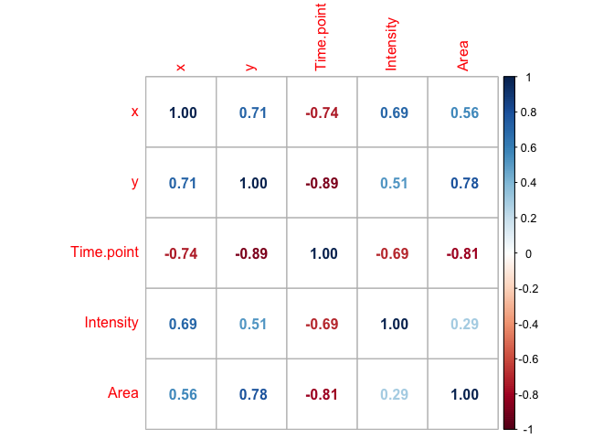

The following plots explore correlation between variables of a dying
cell.

Line plots show a “clear” negative correlation between **time and area**
and **time and intensity**.

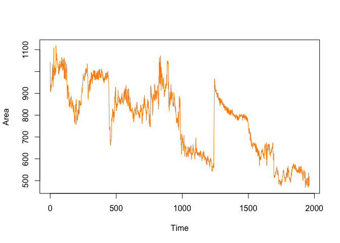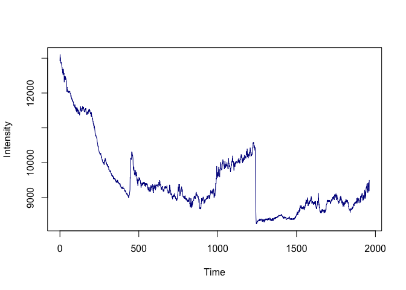

    ## standardGeneric for "plot" defined from package "base"
    ## 
    ## function (x, y, ...) 
    ## standardGeneric("plot")
    ## <environment: 0x145bfe848>
    ## Methods may be defined for arguments: x, y
    ## Use  showMethods(plot)  for currently available ones.

Here are plot one in top of the other. Note that the data is scaled so
the plots have the same proportion.

    ## [1] "x"          "y"          "Time.point" "Intensity"  "Area"

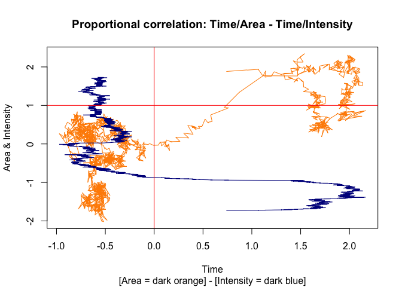

    ## integer(0)

    ## standardGeneric for "plot" defined from package "base"
    ## 
    ## function (x, y, ...) 
    ## standardGeneric("plot")
    ## <environment: 0x145bfe848>
    ## Methods may be defined for arguments: x, y
    ## Use  showMethods(plot)  for currently available ones.

Line plots can be misleading because they trace all observations with
the same “weight,” which makes harder to probe the real correlation in
graphs. So I’ll make an hexabin to count observations and see the real
distribution of variables correlated to time.

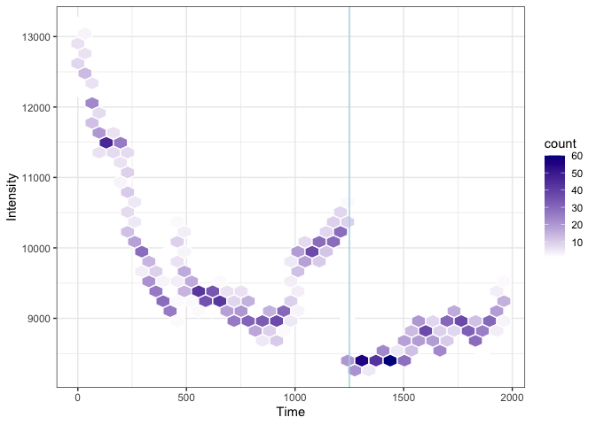

We do find some positive correlation between *area and intensity*
(**0.29**) but with not as significant.

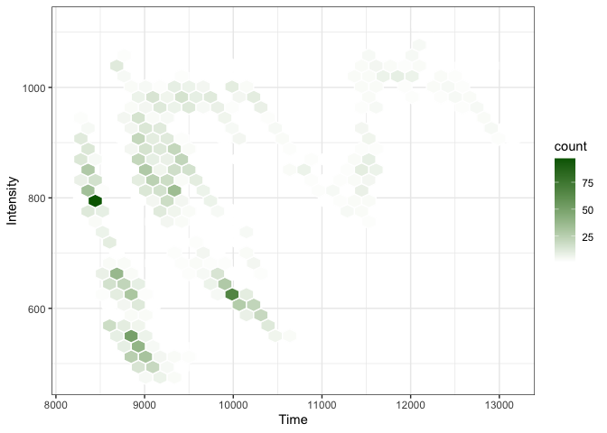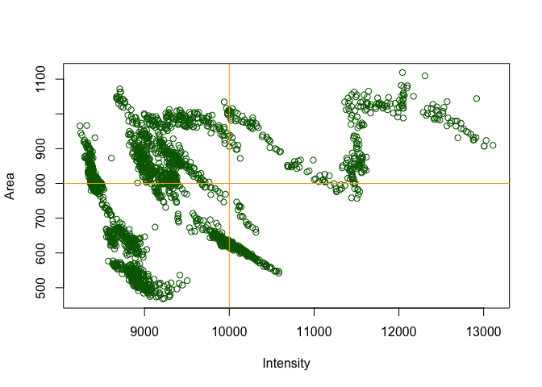

    ## standardGeneric for "plot" defined from package "base"
    ## 
    ## function (x, y, ...) 
    ## standardGeneric("plot")
    ## <environment: 0x145bfe848>
    ## Methods may be defined for arguments: x, y
    ## Use  showMethods(plot)  for currently available ones.

### Dying vs viable comparison

For the last exploratory plot, let’s explore a *dying and a viable cell*
with a line plot of the correlation between time and area and time and
intensity.

**NOTE:** I standardized and make the data frames of the same length.

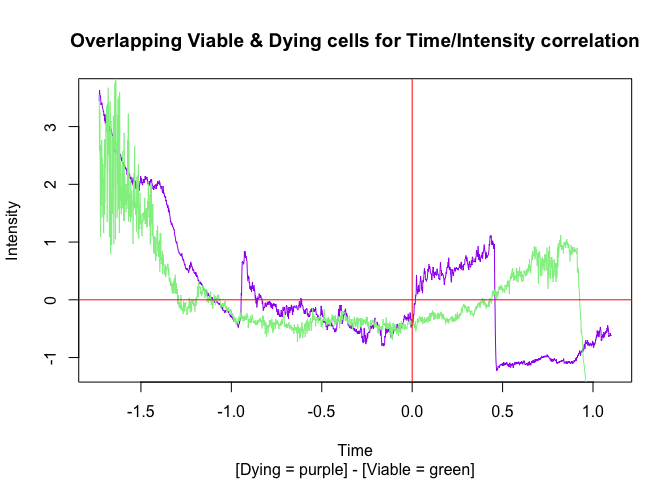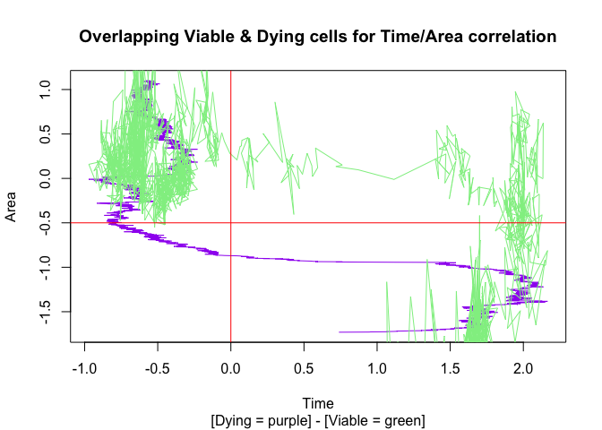

    ## standardGeneric for "plot" defined from package "base"
    ## 
    ## function (x, y, ...) 
    ## standardGeneric("plot")
    ## <environment: 0x145bfe848>
    ## Methods may be defined for arguments: x, y
    ## Use  showMethods(plot)  for currently available ones.

Following Julia’s recommendation and accordingly to what is shown in the
plots above, **size (area) is a good indicator of a cell’s point of
death**.

Now it’s time to tackle the goal.

## The Goal

As Julia requested here are the:

\###Priorities (from high to low)

-   Identify dying tumor cells in the data sets and estimate the point
    of death. One suggestion for the criteria would be:
    -   Observe whether the cell size dropped by 40% or more compared to
        the inital cell size.
    -   Observe whether the fluorescence intensity shows a linear
        downward trend.
-   Count dying tumor cells and compute the relative number of cell
    deaths.
-   Plot the cell survival for both cell populations in one plot. In our
    case, we opt for two colored lines representing the treated cell
    population and the untreated cell population.

### Clustering

**Machine learning to the rescue:** I will use a K-Means algorithms to
cluster the data into to groups, hopefully, those clusters correspond to
the death and alive cells respectively.

*K-Means works by dividing the data into groups (unclassified data). It
assigns means (as many as needed-in this case two) and the organize the
data by the sum of the minimal squared distance to the mean-cluster.*

    ## # A tibble: 3 × 5
    ##   Cell.ID Time.point Intensity  Area cluster
    ##     <dbl>      <dbl>     <dbl> <dbl> <fct>  
    ## 1       0          0    13966.  545  1      
    ## 2       1          0    18490.  188. 1      
    ## 3       2          0    12720.  479  1

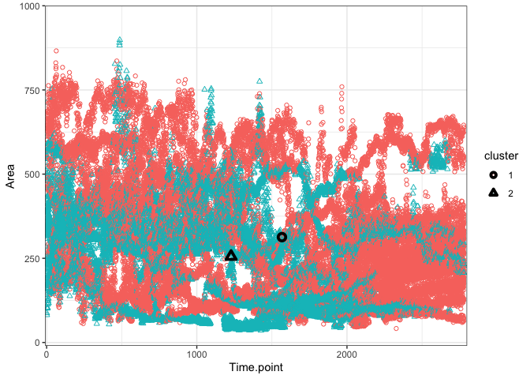

Area-Time make for messy clusters.

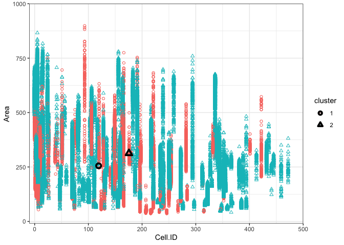

Area-Cell.ID have also mixed values whithin their clusters.

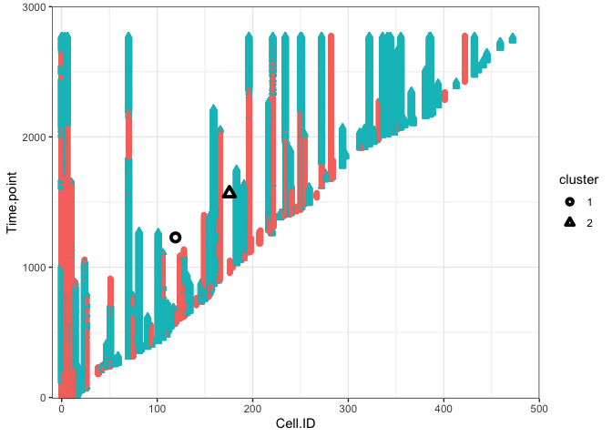

Time - Cell.ID clusters are jumbled together as well.

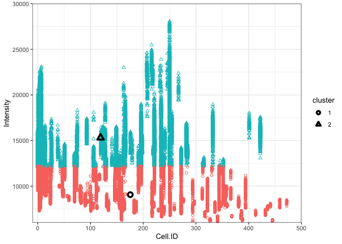

With Intensity - Cell.ID we begin to see a pattern.

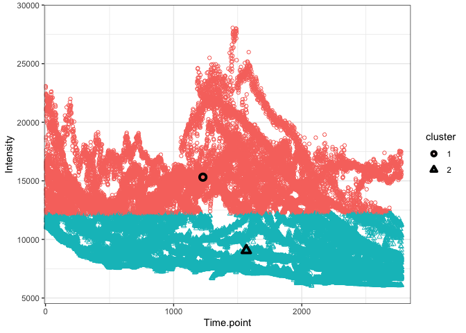

And the pattern is defined when we plot Intensity against Time. So the
K-means algorithm is setting a threshold around 12000 intensity but not
taking into account the other variables.

Studying the centers of the clusters’ mean give more information. And
show intensity as the defining factor.

    ##   cluster  Cell.ID Time.point Intensity     Area
    ## 1       1 119.1074   1228.374 15314.008 255.3668
    ## 2       2 175.5486   1567.044  9066.779 312.8506

The labels are not precise enough nor consistent because of the data
organization.

Before exploring with clustering further, I decided to follow the hard
40% size decrease threshold.

#### Goal 1

So here it is a data frame fulfilling the first goal,

    ##    Cell.ID  Area min_a   die Dying_OR_viable
    ## 1        0 715.0 371.0 286.0          Viable
    ## 2        1 408.0 144.0 163.2           Dying
    ## 3        2 619.5 399.5 247.8          Viable
    ## 4        3 498.0 111.5 199.2           Dying
    ## 5        4 590.5 105.5 236.2           Dying
    ## 6        5 866.0 479.0 346.4          Viable
    ## 7        6 479.0  78.0 191.6           Dying
    ## 8        7 243.0  54.0  97.2           Dying
    ## 9        8 474.5  89.0 189.8           Dying
    ## 10       9 506.0 253.5 202.4          Viable

#### Goal 2

Count dying tumor cells and compute the relative number of cell deaths.

    ##        Count Relat_num
    ## Viable    79  56.02837
    ## Dying     62  43.97163
