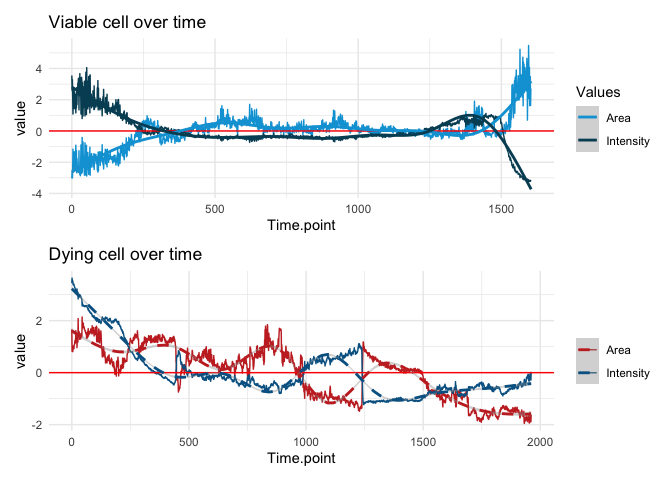
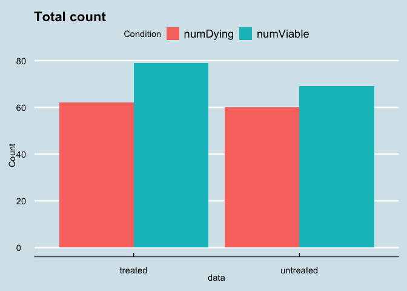

## Cell viability

In the present project we aim to measure how cells react to a certain
treatment by identifying if a cell is viable or dying.

### Goals

-   Identify dying cells in both populations.
-   Count and plot dying treated and untreated cells.

### The data

We have four data sets with observations of a cell’s **intensity**
(fluorescence luminosity) and **area** (size) behaviour during
treatement.

    ## # A tibble: 4 × 5
    ##   data        length numNAs corrTimeIntensity corrTimeArea
    ##   <chr>        <int>  <int>             <dbl>        <dbl>
    ## 1 df_treat     56271      0            -0.250       -0.277
    ## 2 df_untreat   50523      0            -0.754       -0.153
    ## 3 dying_cell    1962      0            -0.692       -0.808
    ## 4 viable_cell   1605      0            -0.465        0.561

Notes:

-   not all cells start at the same time point
-   not same length
-   no NA values.
-   correlation from individual cells is biased

### Visualizing viable and dying cells

Notes:

-   Area and Intensity are scaled.
-   The horizontal red line shows the average size and fluorescence and
    intensity of a cell. A **viable** cell stays around this zone, while
    the **dying** cell steep under it as time passes.  
-   Time has been normalized (starting a zero time point).

### Dying or viable criteria

**Size (area) is a good indicator of a cell’s point of death**. The
recommended threshold is 40% size decrease. So, all cells under the 40
percentile relative to their own size will die.

    ## # A tibble: 2 × 5
    ##   data      `mean(viable)` `sd(viable)` numViable numDying
    ##   <chr>              <dbl>        <dbl>     <int>    <int>
    ## 1 treated            0.560        0.498        79       62
    ## 2 untreated          0.535        0.501        69       60

Notes:

-   The difference between groups is not significant

### Plotting Dying / Viable frequency by size

The following density histogram shows that viable cells tend to be
smaller in size. The relative **area** represents the median size of
each cell.

