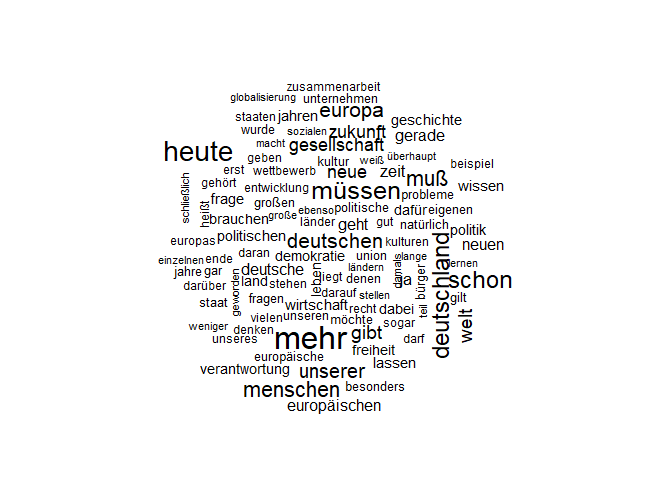
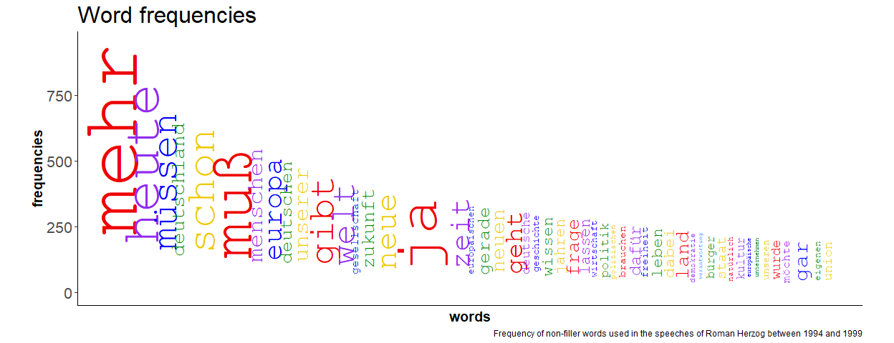

```         
#install.packages("Rtools")
#install.packages("stopwords")
#install.packages("wordcloud")
#install.packages("tm")
options(encoding="utf8")
library('stats')
library('tidyverse')

## ── Attaching core tidyverse packages ──────────────────────── tidyverse 2.0.0 ──
## ✔ dplyr     1.1.2     ✔ readr     2.1.4
## ✔ forcats   1.0.0     ✔ stringr   1.5.0
## ✔ ggplot2   3.4.2     ✔ tibble    3.2.1
## ✔ lubridate 1.9.2     ✔ tidyr     1.3.0
## ✔ purrr     1.0.1     
## ── Conflicts ────────────────────────────────────────── tidyverse_conflicts() ──
## ✖ dplyr::filter() masks stats::filter()
## ✖ dplyr::lag()    masks stats::lag()
## ℹ Use the conflicted package (<http://conflicted.r-lib.org/>) to force all conflicts to become errors
```

Using the predone .csv table, since I can't bring myself to do work that already has be done.

Removing the noise: filtering out stopwords and words and characters without content

```         
library("stopwords")
stopwords_de<-c(stopwords::stopwords("de", source = "marimo"),stopwords::stopwords("de", source = "snowball")) %>% unique()

#set all words to lowercase to not have duplicates because of the word sometimes appearing at the start of the sentence
speech_herzog[,1]<-lapply(speech_herzog[,1],str_to_lower)

#remove punctuation from the set of words
Punctuation_pos<-!lapply(speech_herzog[,1],str_detect,pattern="[[:punct:]]") %>% data.frame()
#Remove all 231 stopwords given in the snowball list
Stopwords_pos<-!lapply(speech_herzog[,1], '%in%', table=stopwords_de) %>% data.frame()
Include_pos<-apply(cbind(Punctuation_pos,Stopwords_pos), 1L,all)

words_freq<-speech_herzog[Include_pos,1] %>% table() %>% data.frame()
colnames(words_freq)<-c("words","freq")
```

A frequency diagram and a word cloud would be sufficient to paint a bird's eye view of the topics discussed in the aggregated speeches

plotting a wordcloud

```         
library("wordcloud")

## Lade nötiges Paket: RColorBrewer

wordcloud(words_freq$words,words_freq$freq, max.words = 100,scale=c(2, .5))
```



A frequency Diagramm:

```         
top_50<-words_freq %>% arrange(desc(freq)) %>% head(50)
top_50$pos<-0
top_50$freq<-top_50$freq*1.1

top_freq<-max(top_50$freq)

sum<-0
add_offset<-0
for (i in 1:50){
  sum<-sum+0.17*top_50$freq[i]/str_length(top_50$words[i])+add_offset
  top_50$pos[i]<-sum
  #add_offset<-min(200/str_length(top_50$words[i])**2.4,top_freq/10)
  add_offset<-max(min(top_freq/(4.65*(str_length(top_50$words[i])**2.4)),top_freq/28),top_freq/156)

}

largest_val<-max(top_50$pos)
smallest_val<-min(top_50$pos)
#color_fd<-rep(c("darkblue","grey5"),25)
color_fd<-rep(c("red2","purple2","blue","green4","gold2"),10)

ggplot(top_50, aes(y=freq, x=pos))+
  #geom_point(show.legend = FALSE,color = color_fd,aes( size=freq*0.005))+
  theme_classic()+
  theme(plot.title=element_text(size=24),axis.text=element_text(size=16),axis.text.x=element_blank(),axis.ticks.x=element_blank(),axis.title=element_text(size=14,face="bold"))+
geom_text(show.legend = FALSE,aes(label=words, angle=90,family="mono",  hjust="top", vjust="middle"), color = color_fd, size=945/max(top_50$freq)*0.125*top_50$freq/str_length(top_50$words))+
labs(x="words", y="frequencies",title="Word frequencies", caption="Frequency of non-filler words used in the speeches of Roman Herzog between 1994 and 1999")+
coord_fixed(ratio=0.31,ylim=c(0,top_freq),xlim=c(smallest_val,largest_val))
```



Improving the result to show relevant information

Note that the `echo = FALSE` parameter was added to the code chunk to prevent printing of the R code that generated the plot.
