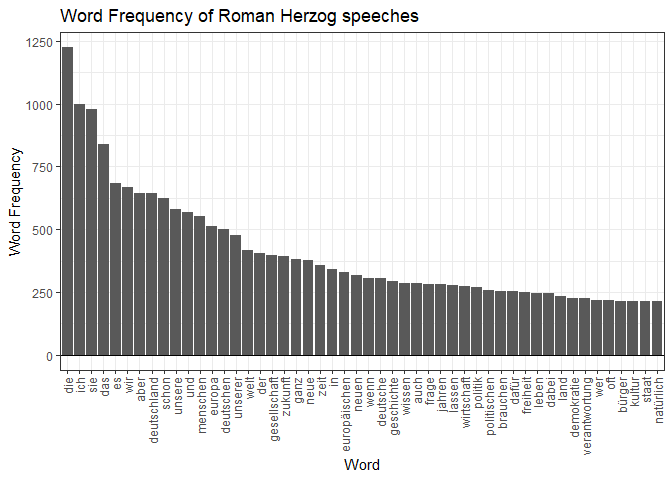

    # Project Daniel
    library(tidyverse)

    ## ── Attaching core tidyverse packages ──────────────────────── tidyverse 2.0.0 ──
    ## ✔ dplyr     1.1.2     ✔ readr     2.1.4
    ## ✔ forcats   1.0.0     ✔ stringr   1.5.0
    ## ✔ ggplot2   3.4.2     ✔ tibble    3.2.1
    ## ✔ lubridate 1.9.2     ✔ tidyr     1.3.0
    ## ✔ purrr     1.0.1     
    ## ── Conflicts ────────────────────────────────────────── tidyverse_conflicts() ──
    ## ✖ dplyr::filter() masks stats::filter()
    ## ✖ dplyr::lag()    masks stats::lag()
    ## ℹ Use the ]8;;http://conflicted.r-lib.org/conflicted package]8;; to force all conflicts to become errors

    library(assertr)
    library(tm)

    ## Lade nötiges Paket: NLP
    ## 
    ## Attache Paket: 'NLP'
    ## 
    ## Das folgende Objekt ist maskiert 'package:ggplot2':
    ## 
    ##     annotate

    library(SnowballC)
    library(qdap)

    ## Lade nötiges Paket: qdapDictionaries
    ## Lade nötiges Paket: qdapRegex
    ## 
    ## Attache Paket: 'qdapRegex'
    ## 
    ## Das folgende Objekt ist maskiert 'package:dplyr':
    ## 
    ##     explain
    ## 
    ## Das folgende Objekt ist maskiert 'package:ggplot2':
    ## 
    ##     %+%
    ## 
    ## Lade nötiges Paket: qdapTools
    ## 
    ## Attache Paket: 'qdapTools'
    ## 
    ## Das folgende Objekt ist maskiert 'package:dplyr':
    ## 
    ##     id
    ## 
    ## Lade nötiges Paket: RColorBrewer
    ## 
    ## Attache Paket: 'qdap'
    ## 
    ## Die folgenden Objekte sind maskiert von 'package:tm':
    ## 
    ##     as.DocumentTermMatrix, as.TermDocumentMatrix
    ## 
    ## Das folgende Objekt ist maskiert 'package:NLP':
    ## 
    ##     ngrams
    ## 
    ## Die folgenden Objekte sind maskiert von 'package:base':
    ## 
    ##     Filter, proportions

    library(stopwords)

    ## 
    ## Attache Paket: 'stopwords'
    ## 
    ## Das folgende Objekt ist maskiert 'package:tm':
    ## 
    ##     stopwords

    library(foreign)

    herzog_data <- read.csv(file = "herzog.csv")
    herzog_data$German.words <- as.character(herzog_data$German.words)
    herzog_data_words <- data.frame(herzog_data$German.words)

    single_string <- paste(herzog_data_words, sep = ",") |>
      str_replace_all('[",]', '') |>
      str_replace_all("\\s{2,}"," ")

    freq_words <- paste0(c("quot", "die", "ich", "sie", "mehr", "das", "heute", "es", "immer", "müssen"))

    freq <- str_c(freq_words, sep = "", collapse = " ")

    single_string_count <- single_string |> VectorSource() |> VCorpus() |> tm_map(removePunctuation) |>
      tm_map(removeNumbers) |> tm_map(stripWhitespace) |>
      tm_map(removeWords, stopwords("de")) |>
      tm_map(removeWords, c("quot", "die", "ich", "sie", "mehr", "das", "heute", "es", "immer", "müssen")) |>     tm_map(removeWords, c("in", "ja", "der"))

    single_string_count |> freq_terms(10000) |> 
      arrange(desc(FREQ)) |> top_n(n = 50) |> 
      ggplot(aes(x = reorder(WORD, desc(FREQ)), y = FREQ)) + geom_col() +
      labs(x = "Word", y = "Word Frequency") + geom_hline(aes(yintercept = 0)) + theme_bw() + 
      theme(axis.text.x = element_text(angle = 90, vjust = 0.5, hjust=1)) +
      ggtitle("Word Frequency of Roman Herzog speeches")

    ## Selecting by FREQ

