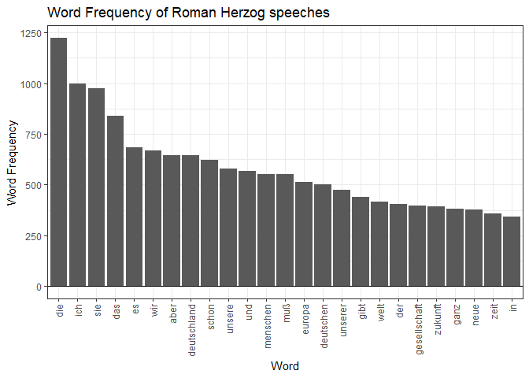

    # Project Daniel
    library(ggplot2)
    library(assertr)
    library(tm)

    ## Lade nötiges Paket: NLP

    ## 
    ## Attache Paket: 'NLP'

    ## Das folgende Objekt ist maskiert 'package:ggplot2':
    ## 
    ##     annotate

    library(SnowballC)
    library(qdap)

    ## Lade nötiges Paket: qdapDictionaries

    ## Lade nötiges Paket: qdapRegex

    ## 
    ## Attache Paket: 'qdapRegex'

    ## Das folgende Objekt ist maskiert 'package:ggplot2':
    ## 
    ##     %+%

    ## Lade nötiges Paket: qdapTools

    ## Lade nötiges Paket: RColorBrewer

    ## 
    ## Attache Paket: 'qdap'

    ## Die folgenden Objekte sind maskiert von 'package:tm':
    ## 
    ##     as.DocumentTermMatrix, as.TermDocumentMatrix

    ## Das folgende Objekt ist maskiert 'package:NLP':
    ## 
    ##     ngrams

    ## Die folgenden Objekte sind maskiert von 'package:base':
    ## 
    ##     Filter, proportions

    library(stopwords)

    ## 
    ## Attache Paket: 'stopwords'

    ## Das folgende Objekt ist maskiert 'package:tm':
    ## 
    ##     stopwords

    library(foreign)
    library(dplyr)

    ## 
    ## Attache Paket: 'dplyr'

    ## Das folgende Objekt ist maskiert 'package:qdapTools':
    ## 
    ##     id

    ## Das folgende Objekt ist maskiert 'package:qdapRegex':
    ## 
    ##     explain

    ## Die folgenden Objekte sind maskiert von 'package:stats':
    ## 
    ##     filter, lag

    ## Die folgenden Objekte sind maskiert von 'package:base':
    ## 
    ##     intersect, setdiff, setequal, union

    herzog_data <- read.csv(file = "herzog.csv")
    herzog_data$German.words <- as.character(herzog_data$German.words)
    herzog_data_words <- data.frame(herzog_data$German.words)

    single_string <- paste(herzog_data_words, sep = ",")

    single_string <- gsub('"', '', single_string)
    single_string <- gsub(",", "", single_string)
    single_string <- gsub(",", "", single_string)
    single_string <- gsub("  ", " ", single_string)

    single_string_source <- VectorSource(single_string)
    single_string_corpus <- VCorpus(single_string_source)
    single_string_corpus <- tm_map(single_string_corpus, removePunctuation)
    single_string_corpus <- tm_map(single_string_corpus, removeNumbers)
    single_string_corpus <- tm_map(single_string_corpus, stripWhitespace)
    single_string_corpus <- tm_map(single_string_corpus, removeWords, stopwords("de"))
    single_string_corpus <- tm_map(single_string_corpus, removeWords, c("quot", "die", "ich", "sie", "mehr", "das", "heute", "es", "immer", "müssen"))
    single_string_corpus <- tm_map(single_string_corpus, removeWords, c("in", "ja", "der"))

    word_count <- freq_terms(single_string_corpus, 10000)

    word_count <- arrange(word_count, desc(FREQ)) 

    word_count_20 <- top_n(word_count, n = 25)

    ## Selecting by FREQ

