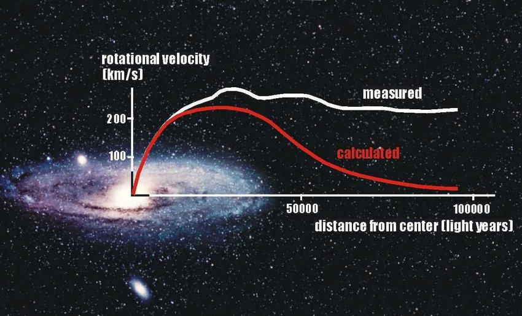

```{r setup, include=FALSE}
knitr::opts_chunk$set(echo = TRUE)
```

# Introduction

Galaxy rotation curves are simple but powerful evidences that Dark Matter exists in our universe. They were in fact one of the first indirect evidences that the visible matter that we observe may not be the whole picture. Basically the rotation curve is a plot of *Rotation Velocity of stars in a galaxy vs. Distance* from the center of the galaxy.

## Deviation from Newtonian Mechanics

A galaxy is much more complicated in its stellar motion around the center. Most galaxies have a "bulge" of tightly packed stars in the center and a "disk" of sparsely packed stars around it.

So there are two things to consider when we apply regular Newtonian mechanics to a galaxy:

1.  The stars in the bulge behave as if they are moving on a rigid sphere. Therefore their velocities increase from the center and reach a peak which is the edge of this sphere.

2.  The stars in the disk behave more or less like our solar system where the velocity drops as we move from the center.

So when we plot the rotation curve of a galaxy we combine the two plots and get a plot that ascends in the beginning but drops off to lower values after the peak.

The following example plot is the rotation curve (theoretical and observed) of the M33 (or Triangulum) galaxy. The expected plot from Newtonian mechanics is the bottom curve. We expect the velocity to increase in the central bulge of the galaxy and then it drops off.


However, the observed plot is far from the expected plot. The velocity does increase in the central bulge but it kind of mellows out into a near constant velocity in the disk. This is unexpected and this result is attributed to the existence of dark matter.

I can explain the mathematics behind this but I think that is not relevant to the project at hand. In short, the deviation from the Newtonian plot is a strong evidence that there is extra non-visible mass that exists inside the galaxy that is speeding up the stars away from the center. In fact the galaxies are assumed to be enclosed inside large Dark Matter Halos. This diagram is from the Wikipedia page of rotation curves and you can find it [here](https://en.wikipedia.org/wiki/Galaxy_rotation_curve) in case you wish to read further.

## Project Description

Now that you are familiar with the rotation curve of Triangulum, let's look at a familiar galaxy known as Andromeda or M31 or NGC224. It is the nearest spiral galaxy to our Milky Way (if you ignore the Magellanic Clouds and other Dwarf Spheroids). It is located about 765 kiloparsecs from us.

The task you must accomplish is pretty simple. You have to use this [data set](http://www.ioa.s.u-tokyo.ac.jp/~sofue/RC99/0224.dat) from the University of Tokyo which includes the radius in kiloparsecs (kpc) and velocities of stars in km/s.

You are supposed to plot a similar rotation curve as above. It obviously will not exactly look like that since both Triangulum and Andromeda are different galaxies. A sample of M31 rotation curve that I found in [Research Gate link](https://www.researchgate.net/profile/Alan-Parry/publication/258849339/figure/fig3/AS:669497048461332@1536631943465/The-rotation-curves-both-observed-and-calculated-for-the-Andromeda-galaxy-Credit.jpg) is as follows:



Here the X-axis is in light years. When you do the plot, you have to convert kiloparsecs to light years.

The following is the list of tasks you must accomplish:

1.  Get the data from the University of Tokyo [link](http://www.ioa.s.u-tokyo.ac.jp/~sofue/RC99/0224.dat).
2.  Perform the appropriate unit conversions of the data.
3.  Plot the rotation curve of M31 galaxy
4.  While plotting, set one color for the ascending part of the plot and another for the remaining part
5.  Label the two parts of the curve in Arial font and give them separate colors as well
6.  Superimpose the plot on top of an image of this galaxy (you can find countless images of Andromeda online)

You **DON'T** need to plot the red Newtonian curve. That's based on theoretical simulations. You just have to plot the white observational curve.

I haven't personally done the plotting but I am interested in whether someone can get a plot similar to the samples.

**Fun Fact:** Both Triangulum and Andromeda galaxies are coming towards us! In a few billion years if humanity doesn't destroy itself, we will have a great spectacle to watch in the sky as our galaxy merges with them. I hope you will have fun with this project.

------------------------------------------------------------------------

Good luck!

\~Pleasant
