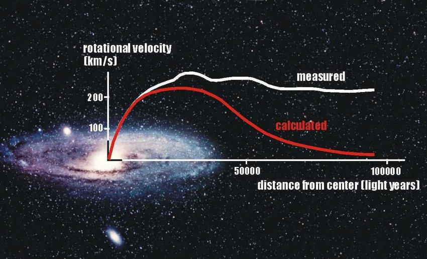

# Introduction

Galaxy rotation curves are simple but powerful evidences that Dark
Matter exists in our universe. They were in fact one of the first
indirect evidences that the visible matter that we observe may not be
the whole picture. Basically it is a plot of Rotation Velocity of stars
in a galaxy vs. Distance from the center of the galaxy.

## Deviation from Newtonian Mechanics

The following plot is for the M33 (or Triangulum) galaxy which is
currently coming towards us! The following plot is something I found on
the [Wiki page of
Triangulum](https://upload.wikimedia.org/wikipedia/commons/c/cd/Rotation_curve_of_spiral_galaxy_Messier_33_%28Triangulum%29.png)
The expected plot from Newtonian mechanics is the bottom curve. We
expect the velocity to increase in the central bulge of the galaxy and
then it drops off. However, the observed plot is far from the expected
plot.

I can explain the physics as to why this happens if you need. In short,
the deviation from the Newtonian plot is a strong evidence that there is
extra non-visible mass that exists inside the galaxy that is speeding up
the stars away from the center. This diagram from Wikipedia page of
rotation curves and you can find it
[here](https://en.wikipedia.org/wiki/Galaxy_rotation_curve). This extra
mass is attributed to Dark Matter. In fact the galaxies are assumed to
be enclosed inside large Dark Matter Halos.

## Project Description

Andromeda Galaxy also known as M31 or NGC224 is the nearest spiral
galaxy to our Milky Way (if you ignore the Magellanic Clouds and other
Dwarf Spheroids). It is located about 765 kiloparsecs from us and it is
also coming towards us!

In this project I am including this [data
set](http://www.ioa.s.u-tokyo.ac.jp/~sofue/RC99/0224.dat) from
University of Tokyo which includes the radius in kpc and velocities of
stars in km/s.

If you are a Windows user you can use the command **curl URL.dat &gt;
filename.dat** to download this file into your hard drive.

You are supposed to plot a similar rotation curve as above. A sample of
M31 rotation curve that I found in [Research Gate
link](https://www.researchgate.net/profile/Alan-Parry/publication/258849339/figure/fig3/AS:669497048461332@1536631943465/The-rotation-curves-both-observed-and-calculated-for-the-Andromeda-galaxy-Credit.jpg)
is as follows:

Here the X-axis is in light years. But it doesn’t matter. One parsec =
3.26 light years. You can use this conversion factor if needed.

You **DON’T** need to plot the red Newtonian curve. That’s based on
theoretical simulations. You just have to plot the white observational
curve.

I haven’t personally done the plotting and you may have to convert .dat
to .csv to proceed.

------------------------------------------------------------------------

Good luck!

~Pleasant
