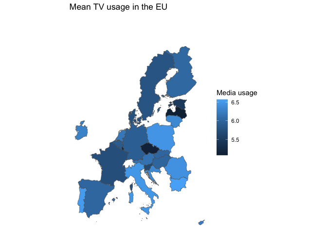
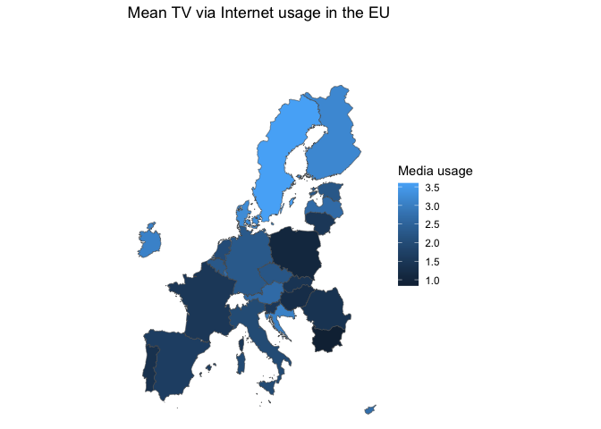
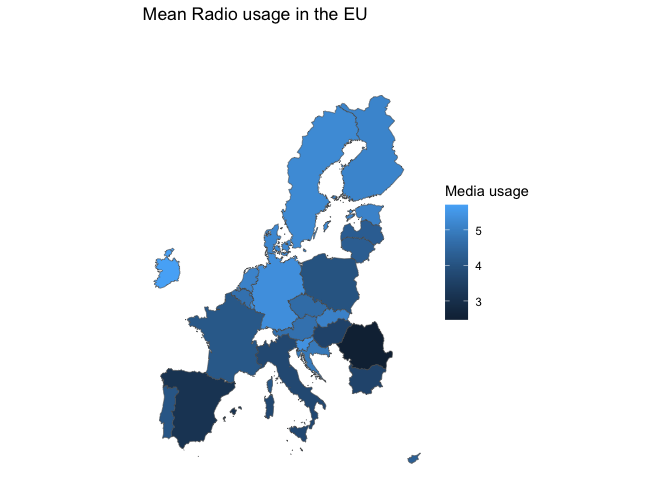
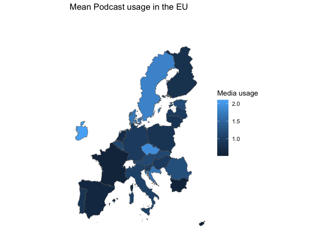
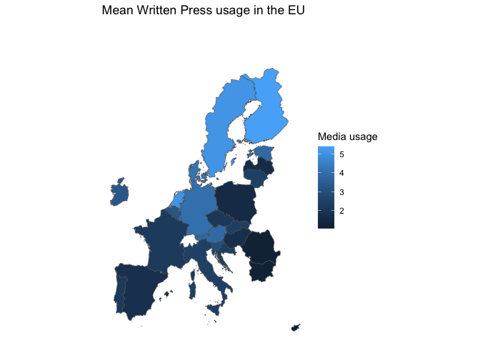
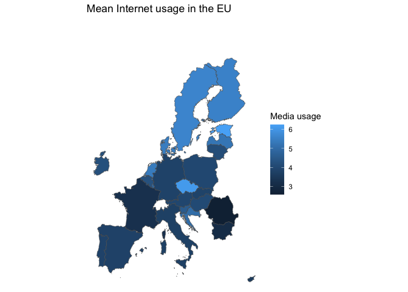
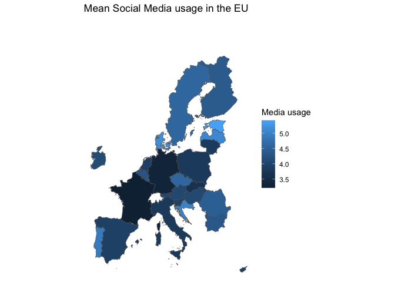
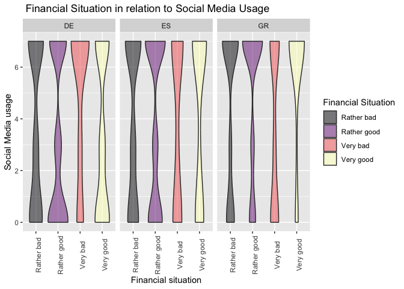

## Initial solution

Here is the data in a table and the maps:

    library(tidyverse)

    ## ── Attaching core tidyverse packages ──────────────────────── tidyverse 2.0.0 ──
    ## ✔ dplyr     1.1.2     ✔ readr     2.1.4
    ## ✔ forcats   1.0.0     ✔ stringr   1.5.0
    ## ✔ ggplot2   3.4.2     ✔ tibble    3.2.1
    ## ✔ lubridate 1.9.2     ✔ tidyr     1.3.0
    ## ✔ purrr     1.0.1     
    ## ── Conflicts ────────────────────────────────────────── tidyverse_conflicts() ──
    ## ✖ dplyr::filter() masks stats::filter()
    ## ✖ dplyr::lag()    masks stats::lag()
    ## ℹ Use the conflicted package (<http://conflicted.r-lib.org/>) to force all conflicts to become errors

    library(maps)

    ## 
    ## Attaching package: 'maps'
    ## 
    ## The following object is masked from 'package:purrr':
    ## 
    ##     map

    library(viridis)

    ## Loading required package: viridisLite
    ## 
    ## Attaching package: 'viridis'
    ## 
    ## The following object is masked from 'package:maps':
    ## 
    ##     unemp

    library(eurostat)
    library(leaflet)
    library(sf)

    ## Linking to GEOS 3.11.0, GDAL 3.5.3, PROJ 9.1.0; sf_use_s2() is TRUE

    library(scales)

    ## 
    ## Attaching package: 'scales'
    ## 
    ## The following object is masked from 'package:viridis':
    ## 
    ##     viridis_pal
    ## 
    ## The following object is masked from 'package:purrr':
    ## 
    ##     discard
    ## 
    ## The following object is masked from 'package:readr':
    ## 
    ##     col_factor

    library(cowplot)

    ## 
    ## Attaching package: 'cowplot'
    ## 
    ## The following object is masked from 'package:lubridate':
    ## 
    ##     stamp

    library(ggthemes)

    ## 
    ## Attaching package: 'ggthemes'
    ## 
    ## The following object is masked from 'package:cowplot':
    ## 
    ##     theme_map

    media_use <- read_csv2("ZA7848_v1-0-0.csv")

    ## ℹ Using "','" as decimal and "'.'" as grouping mark. Use `read_delim()` for more control.
    ## Rows: 37487 Columns: 16── Column specification ────────────────────────────────────────────────────────
    ## Delimiter: ";"
    ## chr (15): country, isocntry, eu27b, d11, d70, d70a, qa1_5, qd3_1, qd3_2, qd3...
    ## dbl  (1): uniqid
    ## ℹ Use `spec()` to retrieve the full column specification for this data.
    ## ℹ Specify the column types or set `show_col_types = FALSE` to quiet this message.

    mean_media <-
      media_use %>% 
      mutate(across(starts_with("qd3_"), as.double),
             isocntry = str_sub(isocntry, start= 1, end = 2)) %>% 

        group_by(isocntry) %>% 
       summarize(mean_TV = mean(qd3_1, na.rm = TRUE),
                 mean_TVviaInternet = mean(qd3_2, na.rm = TRUE),
                 mean_radio = mean(qd3_3, na.rm = TRUE),
                 mean_podcast = mean(qd3_4, na.rm = TRUE),
                 mean_writtenPress = mean(qd3_5, na.rm = TRUE),
                 mean_Internet = mean(qd3_6, na.rm = TRUE),
                 mean_SocialMedia = mean(qd3_8, na.rm = TRUE)
                 )  %>% 
         drop_na()

    ## Warning: There were 7 warnings in `mutate()`.
    ## The first warning was:
    ## ℹ In argument: `across(starts_with("qd3_"), as.double)`.
    ## Caused by warning:
    ## ! NAs introduced by coercion
    ## ℹ Run `dplyr::last_dplyr_warnings()` to see the 6 remaining warnings.

      SHP_0 <- get_eurostat_geospatial(resolution = 10, 
                                       nuts_level = 0, 
                                       year = 2016)

    ## Object cached at /var/folders/_b/0z32vgtj3gg_vrbnw3b6y16c0000gn/T//RtmpRaWFBg/eurostat/sf10020164326.RData
    ## Reading cache file /var/folders/_b/0z32vgtj3gg_vrbnw3b6y16c0000gn/T//RtmpRaWFBg/eurostat/sf10020164326.RData
    ## sf at resolution 1: 10  from year  2016  read from cache file:  /var/folders/_b/0z32vgtj3gg_vrbnw3b6y16c0000gn/T//RtmpRaWFBg/eurostat/sf10020164326.RData

    ## Warning in get_eurostat_geospatial(resolution = 10, nuts_level = 0, year =
    ## 2016): Default of 'make_valid' for 'output_class="sf"' will be changed in the
    ## future (see function details).

    EU28 <- eu_countries %>% 
      select(geo = code, name)
      
    SHP_28 <- get_eurostat_geospatial(resolution = 10, 
                                      nuts_level = 0, 
                                      year = 2016) %>% 
      select(geo = NUTS_ID, geometry) %>% 
      inner_join(EU28, by = "geo") %>% 
      arrange(geo) %>% 
      st_as_sf()

    ## Object cached at /var/folders/_b/0z32vgtj3gg_vrbnw3b6y16c0000gn/T//RtmpRaWFBg/eurostat/sf10020164326.RData
    ## Reading cache file /var/folders/_b/0z32vgtj3gg_vrbnw3b6y16c0000gn/T//RtmpRaWFBg/eurostat/sf10020164326.RData
    ## sf at resolution 1: 10  from year  2016  read from cache file:  /var/folders/_b/0z32vgtj3gg_vrbnw3b6y16c0000gn/T//RtmpRaWFBg/eurostat/sf10020164326.RData

    ## Warning in get_eurostat_geospatial(resolution = 10, nuts_level = 0, year =
    ## 2016): Default of 'make_valid' for 'output_class="sf"' will be changed in the
    ## future (see function details).

      colnames(mean_media)[1] ="geo"

     media_map <- mean_media %>% 
      inner_join(SHP_28, by = "geo") %>% 
      st_as_sf()
     
     media_map %>% 
       ggplot((aes(fill = mean_TV ))) +
       geom_sf() +
       scale_x_continuous(limits = c(-10, 35)) +
       scale_y_continuous(limits = c(35, 75)) +
       theme_void() +
       labs(title="Mean TV usage in the EU",
            fill="Media usage")

     # TV via Internet Usage
     media_map %>% 
       ggplot((aes(fill = mean_TVviaInternet ))) +
       geom_sf() +
       scale_x_continuous(limits = c(-10, 35)) +
       scale_y_continuous(limits = c(35, 75)) +
       theme_void() +
       labs(title="Mean TV via Internet usage in the EU",
            fill="Media usage")

    # Radio Usage  
     media_map %>% 
       ggplot((aes(fill = mean_radio))) +
       geom_sf() +
       scale_x_continuous(limits = c(-10, 35)) +
       scale_y_continuous(limits = c(35, 75)) +
       theme_void() +
       labs(title="Mean Radio usage in the EU",
            fill="Media usage")

    # Podcast Usage  
     media_map %>% 
       ggplot((aes(fill = mean_podcast ))) +
       geom_sf() +
       scale_x_continuous(limits = c(-10, 35)) +
       scale_y_continuous(limits = c(35, 75)) +
       theme_void() +
       labs(title="Mean Podcast usage in the EU",
            fill="Media usage")

    # Written Press Usage  
     media_map %>% 
       ggplot((aes(fill = mean_writtenPress ))) +
       geom_sf() +
       scale_x_continuous(limits = c(-10, 35)) +
       scale_y_continuous(limits = c(35, 75)) +
       theme_void() +
       labs(title="Mean Written Press usage in the EU",
            fill="Media usage")

     # Internet Usage  
     media_map %>% 
       ggplot((aes(fill = mean_Internet ))) +
       geom_sf() +
       scale_x_continuous(limits = c(-10, 35)) +
       scale_y_continuous(limits = c(35, 75)) +
       theme_void() +
       labs(title="Mean Internet usage in the EU",
            fill="Media usage")

     # Social Media 
     media_map %>% 
       ggplot((aes(fill = mean_SocialMedia ))) +
       geom_sf() +
       scale_x_continuous(limits = c(-10, 35)) +
       scale_y_continuous(limits = c(35, 75)) +
       theme_void() +
       labs(title="Mean Social Media usage in the EU",
            fill="Media usage")

And here are the violin plots:

       media_use %>%
      mutate(isocntry = str_sub(isocntry, start= 1, end = 2),
             across(starts_with("qd3_"), as.double) ) %>% 
      select(qa1_5, qd3_8, isocntry) %>%
      filter(isocntry %in% c("GR","ES","DE"), 
      qa1_5 != "Don't know (SPONTANEOUS)") %>%
      drop_na() %>%
      ggplot(aes(x=qa1_5, y=qd3_8, fill=qa1_5)) +
      geom_violin() +
      ggtitle(" Financial Situation in relation to Social Media Usage") +
      labs(fill="Financial Situation", y = "Social Media usage", x = "Financial situation") +
      theme(axis.text.x = element_text(angle = 90)) +
      scale_fill_viridis(discrete = TRUE, alpha = 0.5, option="A") +
      facet_wrap(~isocntry)

    ## Warning: There were 7 warnings in `mutate()`.
    ## The first warning was:
    ## ℹ In argument: `across(starts_with("qd3_"), as.double)`.
    ## Caused by warning:
    ## ! NAs introduced by coercion
    ## ℹ Run `dplyr::last_dplyr_warnings()` to see the 6 remaining warnings.

