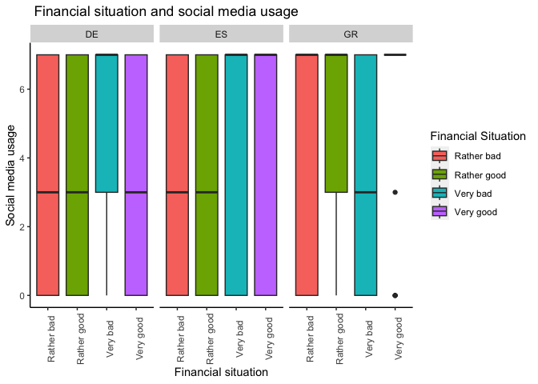

## R Markdown

The maps for the mean media usage:

    SHP_DATA %>%
      ggplot(aes(fill=mean_usage)) +
      geom_sf() +
      scale_x_continuous(limits = c(-10, 35)) +
      scale_y_continuous(limits = c(35, 75)) +
      theme_void() +
      labs(title="Mean Media usage in EU",
           fill="Media usage") +
      facet_wrap(~media_type)

The boxplots for the social media usage and financial situation:

    media_data %>%
      select(qa1_5, qd3_8, isocntry) %>%
      dplyr::filter(isocntry == "GR" | isocntry == "ES" | isocntry =="DE") %>%
      dplyr::filter(qa1_5 != "Don't know (SPONTANEOUS)") %>%
      mutate(qd3_8 = strtoi(qd3_8)) %>%
      drop_na() %>%
      ggplot(aes(x=qa1_5, y=qd3_8, fill=qa1_5)) +
      geom_boxplot() +
      theme(axis.text.x = element_text(angle = 90)) +
      ggtitle(" Financial situation and social media usage") +
      xlab("Financial situation") +
      ylab("Social media usage") +
      labs(fill="Financial Situation") +
      theme(panel.grid.major = element_blank(), panel.grid.minor = element_blank(),
            panel.background = element_blank(), axis.line = element_line(colour = "black")) +
      facet_wrap(~isocntry)

