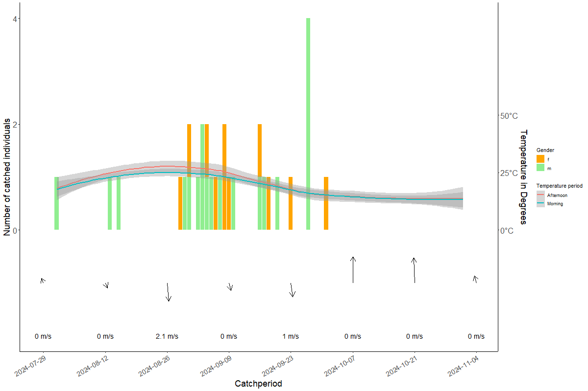
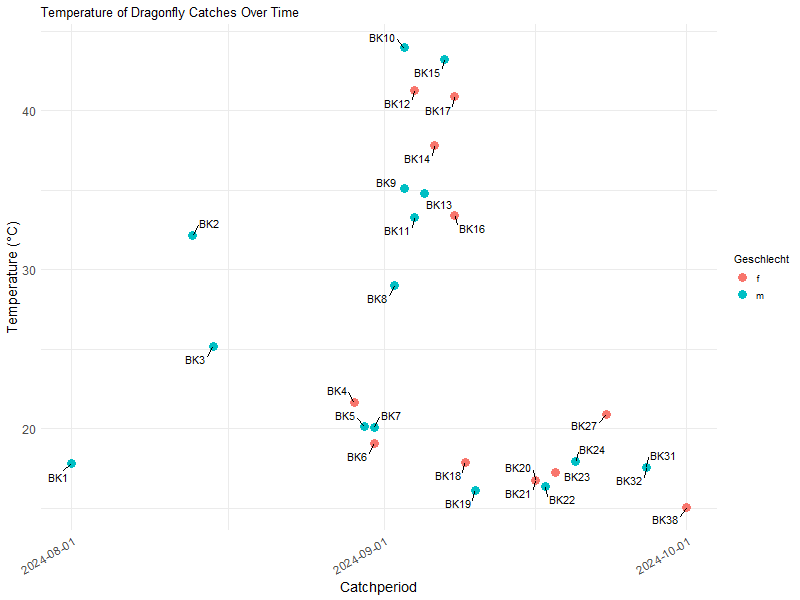

  
# Dragonflies - to find out under which weather conditions autumn mosaic dragonfly prefers to fly

## Data manipulation

```{r data set, echo=TRUE, message=FALSE, warning=FALSE}
library(dplyr)
library(tidyr)
library(tidyverse)
library(kableExtra)
library(knitr)
library(fs)
library(lubridate)
library(ggplot2)
library(ggrepel)
library(hms)

if (!is.null(current_input())) {
  rmd_dir <- path_dir(current_input())
} else {
  rmd_dir <- getwd()
}
weather_data <- read.csv(file.path(rmd_dir, "Weather_Data_Poland.csv"))
```

Form mean values from the extracted and revised weather data for the morning (10 a.m. to 2 p.m.) and midday (2 p.m. to 4 p.m.) periods. Creation of a new column based on the wind direction in degrees (True Dir.) with the wind direction in compass direction (e.g. NW, SSO)
```{r revision, echo=TRUE, message=FALSE, warning=FALSE}
transformed_weather_data <- weather_data %>%
  slice(-1) %>%
  select(Time, Temp, Wind.Speed, True.Dir.) %>%
  rename("Time in yyyy-MM-dd hh:mm:ss" = Time, 
         "Temperature in Celsius" = Temp, 
         "Wind speed in m/s" = Wind.Speed, 
         "Wind direction in degrees" = True.Dir.) %>%
  separate("Time in yyyy-MM-dd hh:mm:ss", into = c("Date", "Time"), sep = " ") %>%
  mutate(Date = as.Date(Date, format = "%Y-%m-%d")) %>%
  mutate(Time = as_hms(Time)) %>%
  mutate(
    period = case_when(
      between(Time, as_hms("10:00:00"), as_hms("13:00:00")) ~ "Morning",
      between(Time, as_hms("13:00:00"), as_hms("16:00:00")) ~ "Afternoon",
      TRUE ~ "Other"
    )
  ) %>%
  #mutate( 
  #  period = case_when(
  #  Time %in% c("10:00:00", "11:00:00", "12:00:00", "13:00:00") ~ "Morning",
  #  Time %in% c("13:00:00", "14:00:00", "15:00:00", "16:00:00") ~ "Afternoon",
  #  TRUE ~ NA_character_)
  #  ) %>%
  filter(period %in% c("Morning", "Afternoon")) %>%
  group_by(Date, period) %>%
  #summarise(across(c(`Temperature in Celsius`, `Wind speed in m/s`, `Wind direction in degrees`), # did not work
  #                   ~ mean(as.numeric(.), na.rm = TRUE)), .groups = "drop") %>%
  #rename_with(~ paste0("Mean ", .), everything()) %>%
  summarise(
    `Mean Temperature in Celsius` = mean(as.numeric(`Temperature in Celsius`), na.rm = TRUE),
    `Mean Wind Speed in m/s` = mean(as.numeric(`Wind speed in m/s`), na.rm = TRUE),
    `Mean Wind Direction in degrees` = mean(as.numeric(`Wind direction in degrees`), na.rm = TRUE)
  ) %>%
  ungroup() %>%
  mutate(
    `Wind direction in compass direction` = case_when(
      `Mean Wind Direction in degrees` >= 337.5 | `Mean Wind Direction in degrees` < 22.5 ~ "N",
      `Mean Wind Direction in degrees` >= 22.5 & `Mean Wind Direction in degrees` < 67.5 ~ "NE",
      `Mean Wind Direction in degrees` >= 67.5 & `Mean Wind Direction in degrees` < 112.5 ~ "E",
      `Mean Wind Direction in degrees` >= 112.5 & `Mean Wind Direction in degrees` < 157.5 ~ "SE",
      `Mean Wind Direction in degrees` >= 157.5 & `Mean Wind Direction in degrees` < 202.5 ~ "S",
      `Mean Wind Direction in degrees` >= 202.5 & `Mean Wind Direction in degrees` < 247.5 ~ "SW",
      `Mean Wind Direction in degrees` >= 247.5 & `Mean Wind Direction in degrees` < 292.5 ~ "W",
      `Mean Wind Direction in degrees` >= 292.5 & `Mean Wind Direction in degrees` < 337.5 ~ "NW",
      TRUE ~ "Unknown"
    ))
```

Merging the data from the revised weather file with the dragonfly catch data
```{r merge, echo=TRUE, message=FALSE, warning=FALSE} 

if (!is.null(current_input())) {
  rmd_dir <- path_dir(current_input())
} else {
  rmd_dir <- getwd()
}
#catch_data <- read.csv(file.path(rmd_dir, "Fangdaten_Poland.csv"), sep = ";")
catch_data <- read_delim(file.path(rmd_dir, "Fangdaten_Poland.csv"), delim = ";" ,na = c("", "NA"))

#revised_catch_data <- catch_data %>%
# mutate(across(everything(), ~na_if(.x, ""))) %>%
# mutate(across(everything(), ~na_if(.x, "NA"))) %>%
 # filter(if_any(everything(), ~ !is.na(.))) %>%
 # mutate(Datum = as.Date(dmy(Datum), format = "%y-%m-%d")) %>% 
#  group_by(Datum, Uhrzeit, Geschlecht) %>% 
#  mutate(Anzahl = n()) %>% 
#  ungroup()
  
revised_catch_data <- catch_data %>%
  mutate(
    Datum = dmy(Datum)
  ) %>%
  drop_na(Datum, Uhrzeit, Geschlecht) %>% 
  group_by(Datum, Uhrzeit, Geschlecht) %>% 
  mutate(Anzahl = n()) %>% 
  ungroup()

merged_data <- left_join(transformed_weather_data, revised_catch_data, by = c("Date" = "Datum", "period" = "Uhrzeit"))

```

## Data visualization

```{r visualization, echo=TRUE, message=FALSE, warning=FALSE}

#merged_data$Date <- as.Date(merged_data$Date)

# Create a new variable for the number of individuals caught that I use as the right y-axis
scaling_factor <- max(merged_data$Anzahl, na.rm = TRUE) / max(merged_data$`Mean Temperature in Celsius`, na.rm = TRUE)

# New variable with scaled temperature for right y-axis
merged_data <- merged_data %>%
  mutate(Date = as.Date(Date)) %>%
  mutate(Temp_scaled = `Mean Temperature in Celsius` * scaling_factor)

# Wind direction in degrees to compass direction
compass <- function(deg) {
  dirs <- c("N", "NE", "E", "SE", "S", "SW", "W", "NW", "N")
  idx <- round(deg / 45) + 1
  return(dirs[idx])
}

#compass direction in merged_data
merged_data <- merged_data %>%
  mutate(
    WindDirection_compass = compass(`Mean Wind Direction in degrees`),
    WindDir_rad = (`Mean Wind Direction in degrees` - 90) * pi / 180
  )

# Create a sequence of dates for the x-axis
sequence_dates <- merged_data %>%
  distinct(Date) %>%
  arrange(Date) %>%
  pull(Date) %>%
  { seq(min(.), max(.), length.out = 8) %>%
      as.Date(round(.), origin = "1970-01-01") }


wind_arrows <- merged_data %>%
  filter(Date %in% sequence_dates,
         period %in% c("Morning", "Afternoon")) %>%
  group_by(Date) %>%
  summarise(
    WindDir_rad = first(WindDir_rad),
    WindSpeed = round(first(`Mean Wind Speed in m/s`), 1),
    WindDirection_compass = first(WindDirection_compass),
    .groups = "drop"
  ) %>%
  mutate(
    arrow_len = 0.5,
    y_base = -1.0,
    xend = Date + arrow_len * cos(WindDir_rad) ,
    yend = y_base + arrow_len * sin(WindDir_rad)
  )

merged_data <- merged_data %>%
  mutate(Geschlecht = ifelse(is.na(Geschlecht), "", Geschlecht))

png("Dragonflies.png", width = 1200, height = 800)

# plot with two y axis
ggplot(merged_data %>%
         arrange(Date) %>%
         filter(Date >= as.Date("2024-08-01") & Date <= as.Date("2024-11-01"),
                period %in% c("Morning", "Afternoon")), 
       aes(x = Date)) +
  
  geom_col(aes(y = Anzahl, fill = Geschlecht), position = "stack") +
  
  scale_fill_manual(values = c("f" = "orange", "m" = "lightgreen")) +
  
  #geom_line(aes(y = Temp_scaled, color = period), size = 1) +
  geom_smooth(aes(y = Temp_scaled, color = period), se = TRUE) +

  scale_y_continuous(
    name = "Number of catched individuals",
    breaks = c(0, 2, 4),
    sec.axis = sec_axis(
      ~ . / scaling_factor, 
      name = "Temperature in Degrees",
    breaks = c(0, 25, 50, 100), 
    labels = c("0°C", "25°C", "50°C", "100°C"))
  ) +

  labs(x = "Catchperiod",
       fill = "Gender",
  color = "Temperature period") +
  scale_x_date(breaks = sequence_dates) +
  theme_classic() +
  theme(
    axis.title.x = element_text(size = 18),
    axis.title.y = element_text(size = 18),
    axis.title.y.right = element_text(size = 18),
    axis.text.x = element_text(size = 14, angle = 30, hjust = 1),
    axis.text.y = element_text(size = 16),
    axis.text.y.right = element_text(size = 16)
  ) +
  geom_segment(data = wind_arrows,
               aes(x = Date, y = y_base, xend = xend, yend = yend),
               arrow = arrow(length = unit(0.4, "cm")), color = "black") +

  #geom_text(data = wind_arrows,
  #          aes(x = Date, y = y_base - 1, label = WindDirection_compass),
  #          size = 3, color = "black") +

  geom_text(data = wind_arrows,
            aes(x = Date, y = y_base -1, label = paste0(WindSpeed, " m/s")),
            size = 5, color = "black")


```



```{r temperature_plot, echo=TRUE, message=FALSE, warning=FALSE}  
png("Temperature_Catch.png", width = 800, height = 600)

ggplot(merged_data %>%
         filter(!is.na(`Mean Temperature in Celsius`), !is.na(ID)),
       aes(x = as.Date(Date), y = `Mean Temperature in Celsius`, label = ID)) +
  geom_point(aes(color = Geschlecht) , size = 4) +
  #geom_text(aes(label = ID), vjust = -0.8, hjust = 0.5, size = 4, angle = 0, check_overlap = FALSE) +
  geom_text_repel(aes(label = ID), size = 4, box.padding = 0.5, max.overlaps = 8) +
  labs(title = "Temperature of Dragonfly Catches Over Time",
       x = "Catchperiod",
       y = "Temperature (°C)") +
  theme_minimal() +
  scale_x_date(breaks = as.Date(c("2024-08-01", "2024-09-01", "2024-10-01"))) +
  theme(
    axis.title = element_text(size = 14),
    axis.text = element_text(size = 12),
    axis.text.x = element_text(angle = 30, hjust = 1)
  )

```
