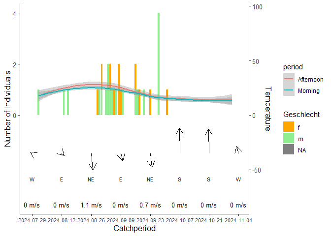
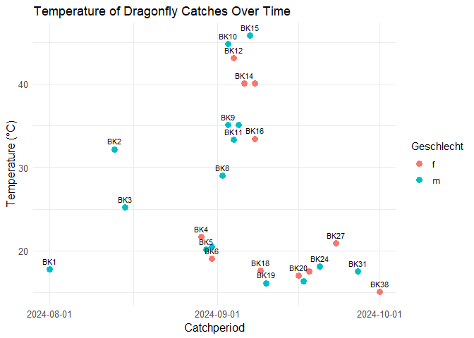

# Dragonflies - to find out under which weather conditions autumn mosaic dragonfly prefers to fly

## Data manipulation

    library(dplyr)
    library(tidyr)
    library(tidyverse)
    library(kableExtra)
    library(knitr)
    library(fs)
    library(lubridate)
    library(ggplot2)

    if (!is.null(current_input())) {
      rmd_dir <- path_dir(current_input())
    } else {
      rmd_dir <- getwd()
    }
    weather_data <- read.csv(file.path(rmd_dir, "Weather_Data_Poland.csv"))

Form mean values from the extracted and revised weather data for the
morning (10 a.m. to 2 p.m.) and midday (2 p.m. to 4 p.m.) periods.
Creation of a new column based on the wind direction in degrees (True
Dir.) with the wind direction in compass direction (e.g. NW, SSO)

    transformed_weather_data <- weather_data %>%
      slice(-1) %>%
      select(Time, Temp, Wind.Speed, True.Dir.) %>%
      rename("Time in yyyy-MM-dd hh:mm:ss" = Time, 
             "Temperature in Celsius" = Temp, 
             "Wind speed in m/s" = Wind.Speed, 
             "Wind direction in degrees" = True.Dir.) %>%
      separate("Time in yyyy-MM-dd hh:mm:ss", into = c("Date", "Time"), sep = " ") %>%
      mutate( 
        period = case_when(
        Time %in% c("10:00:00", "11:00:00", "12:00:00", "13:00:00") ~ "Morning",
        Time %in% c("14:00:00", "15:00:00") ~ "Afternoon",
        TRUE ~ NA_character_)
        ) %>%
      filter(period %in% c("Morning", "Afternoon")) %>%
      group_by(Date, period) %>% # here I changed Midday to Afternoon that both dfs can be merged
      summarise(
        `Mean Temperature in Celsius` = mean(as.numeric(`Temperature in Celsius`), na.rm = TRUE),
        `Mean Wind Speed in m/s` = mean(as.numeric(`Wind speed in m/s`), na.rm = TRUE),
        `Mean Wind Direction in degrees` = mean(as.numeric(`Wind direction in degrees`), na.rm = TRUE)
      ) %>%
      ungroup() %>%
      mutate(
        `Wind direction in compass direction` = case_when(
          `Mean Wind Direction in degrees` >= 337.5 | `Mean Wind Direction in degrees` < 22.5 ~ "N",
          `Mean Wind Direction in degrees` >= 22.5 & `Mean Wind Direction in degrees` < 67.5 ~ "NE",
          `Mean Wind Direction in degrees` >= 67.5 & `Mean Wind Direction in degrees` < 112.5 ~ "E",
          `Mean Wind Direction in degrees` >= 112.5 & `Mean Wind Direction in degrees` < 157.5 ~ "SE",
          `Mean Wind Direction in degrees` >= 157.5 & `Mean Wind Direction in degrees` < 202.5 ~ "S",
          `Mean Wind Direction in degrees` >= 202.5 & `Mean Wind Direction in degrees` < 247.5 ~ "SW",
          `Mean Wind Direction in degrees` >= 247.5 & `Mean Wind Direction in degrees` < 292.5 ~ "W",
          `Mean Wind Direction in degrees` >= 292.5 & `Mean Wind Direction in degrees` < 337.5 ~ "NW",
          TRUE ~ NA_character_
        ))

Merging the data from the revised weather file with the dragonfly catch
data

    if (!is.null(current_input())) {
      rmd_dir <- path_dir(current_input())
    } else {
      rmd_dir <- getwd()
    }
    catch_data <- read.csv(file.path(rmd_dir, "Fangdaten_Poland.csv"), sep = ";")

    revised_catch_data <- catch_data %>%
      mutate(across(everything(), ~na_if(.x, ""))) %>%
      mutate(across(everything(), ~na_if(.x, "NA"))) %>%
      filter(if_any(everything(), ~ !is.na(.))) %>%
      mutate(Datum = format(dmy(Datum), "%Y-%m-%d")) %>%
      group_by(Datum, Uhrzeit, Geschlecht) %>% 
      mutate(Anzahl = n()) %>% 
      ungroup()
      

    merged_data <- left_join(transformed_weather_data, revised_catch_data, by = c("Date" = "Datum", "period" = "Uhrzeit"))

## Data visualization

    merged_data$Date <- as.Date(merged_data$Date)

    scaling_factor <- max(merged_data$Anzahl, na.rm = TRUE) / max(merged_data$`Mean Temperature in Celsius`, na.rm = TRUE)

    # 3. Neue Variable mit skalierter Temperatur
    merged_data <- merged_data %>%
      mutate(Temp_scaled = `Mean Temperature in Celsius` * scaling_factor)

    # 4. Plot mit zwei Y-Achsen (überlagert)
    ggplot(merged_data %>%
             arrange(Date) %>%
             filter(Date >= as.Date("2024-08-01") & Date <= as.Date("2024-11-01"),
                    period %in% c("Morning", "Afternoon")), 
           aes(x = Date)) +
      
      # Balken für Anzahl, gefärbt nach Geschlecht
      geom_col(aes(y = Anzahl, fill = Geschlecht), position = "stack") +
      
      scale_fill_manual(values = c("f" = "orange", "m" = "lightgreen")) +
      
      # Temperaturkurve mit skalierter Temperatur
      #geom_line(aes(y = Temp_scaled, color = period), size = 1) +
      geom_smooth(aes(y = Temp_scaled, color = period), se = TRUE) +

      # Y-Achsen: links = Anzahl, rechts = Temperatur (rücktransformiert)
      scale_y_continuous(
        name = "Number of Individuals",
        sec.axis = sec_axis(~ . / scaling_factor, name = "Temperature")
      ) +

      labs(x = "Catchperiod") +
      scale_x_date(breaks = as.Date(c("2024-08-01", "2024-09-01", "2024-10-01", "2024-11-01"))) +
      theme_minimal() +
      theme(
        axis.title.x = element_text(size = 12),
        axis.title.y = element_text(size = 12),
        axis.title.y.right = element_text(size = 12),
        axis.text.x = element_text(size = 10),
        axis.text.y = element_text(size = 10),
        axis.text.y.right = element_text(size = 10)
      )

    ggplot(merged_data %>%
             filter(!is.na(`Mean Temperature in Celsius`), !is.na(ID)),
           aes(x = as.Date(Date), y = `Mean Temperature in Celsius`, label = ID)) +
      geom_point(aes(color = Geschlecht) , size = 3) +
      geom_text(aes(label = ID), hjust = -0.1, size = 2, angle = 45, check_overlap = TRUE) +
      labs(title = "Temperature of Dragonfly Catches Over Time",
           x = "Catchperiod",
           y = "Temperature (°C)") +
      theme_minimal() +
      theme(
        axis.title = element_text(size = 12),
        axis.text = element_text(size = 10)
      )

