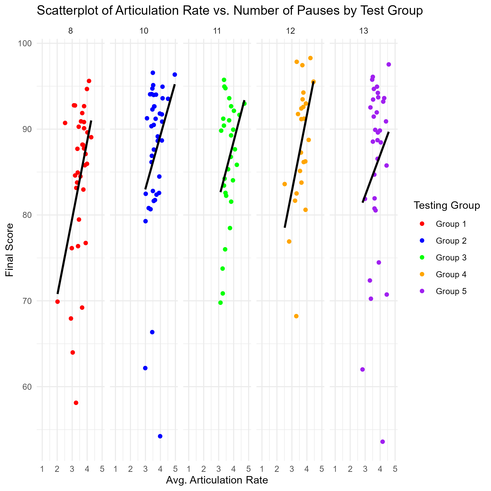
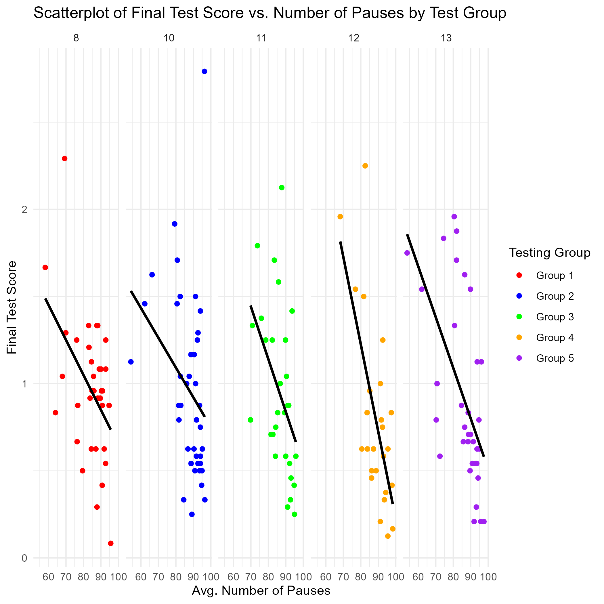
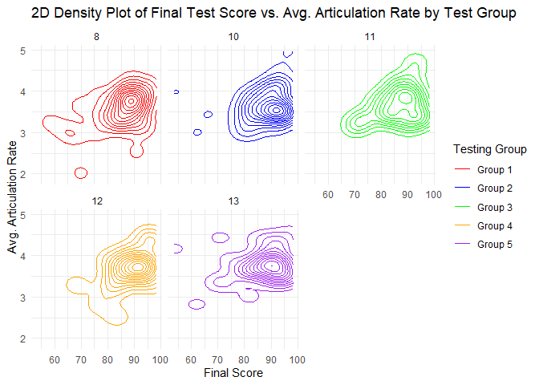
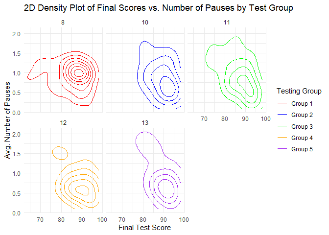

    library(tidyverse)

    ## Warning: package 'ggplot2' was built under R version 4.3.3

    ## Warning: package 'lubridate' was built under R version 4.3.3

    ## ── Attaching core tidyverse packages ──────────────────────── tidyverse 2.0.0 ──
    ## ✔ dplyr     1.1.4     ✔ readr     2.1.5
    ## ✔ forcats   1.0.0     ✔ stringr   1.5.1
    ## ✔ ggplot2   3.5.1     ✔ tibble    3.2.1
    ## ✔ lubridate 1.9.3     ✔ tidyr     1.3.1
    ## ✔ purrr     1.0.2     
    ## ── Conflicts ────────────────────────────────────────── tidyverse_conflicts() ──
    ## ✖ dplyr::filter() masks stats::filter()
    ## ✖ dplyr::lag()    masks stats::lag()
    ## ℹ Use the conflicted package (<http://conflicted.r-lib.org/>) to force all conflicts to become errors

    library(dplyr)
    library(readr)

    dataset_fluency_features <- read.csv("dataset_fluency_features.csv")
    dataset_total_score <- read.csv("dataset_total_score.csv")

    dataset_fluency_features_agg <- dataset_fluency_features %>%
      distinct() %>%
      mutate(articulationrate  = str_replace_all(articulationrate, ",", ".") %>%
               as.numeric(articulationrate)) %>%
      mutate(npause = as.numeric(npause)) %>%
      mutate(test_component_id = as.numeric(test_component_id)) %>%
      mutate(user_id = as.numeric(user_id)) %>%
    aggregate(cbind(articulationrate, npause, test_component_id) ~ user_id, FUN = mean)

    Full_Data <- left_join(dataset_fluency_features_agg, dataset_total_score, by = "user_id") # Left join b/c 4 user_ids missing in total score dataset

    ggplot(Full_Data, aes(x = articulationrate, y = npause, color = factor(test_component_id))) +
      geom_point() +
        geom_smooth(method = "lm", se = FALSE, color = "black") +
      facet_wrap(~ test_component_id, nrow = 1) +
      labs(
        title = "Scatterplot of Articulation Rate vs. Number of Pauses by Test Group",
        x = "Avg. Number of Pauses",
        y = "Avg. Articulation Rate"
      ) +
      theme_minimal()

    ## `geom_smooth()` using formula = 'y ~ x'

    ggplot(Full_Data, aes(x = final_score, y = npause, color = factor(test_component_id))) +
      geom_point() +
        geom_smooth(method = "lm", se = FALSE, color = "black") +
      facet_wrap(~ test_component_id, nrow = 1) +
      labs(
        title = "Scatterplot of Articulation Rate vs. Number of Pauses by Test Group",
        x = "Avg. Number of Pauses",
        y = "Final Test Score"
      ) +
      theme_minimal()

    ## `geom_smooth()` using formula = 'y ~ x'

    ## Warning: Removed 4 rows containing non-finite outside the scale range
    ## (`stat_smooth()`).

    ## Warning: Removed 4 rows containing missing values or values outside the scale range
    ## (`geom_point()`).

    ggplot(Full_Data, aes(x = articulationrate, y = npause, color = factor(test_component_id))) +
      geom_density_2d() +  # Create 2D density plot
      labs(
        title = "2D Density Plot of Articulation Rate vs. Number of Pauses by Test Group",
        x = "Avg. Articulation Rate",
        y = "Avg. Number of Pauses",
        color = "Test Group"
      ) +
      theme_minimal()

    ggplot(Full_Data, aes(x = final_score, y = npause, color = factor(test_component_id))) +
      geom_density_2d() +  # Create 2D density plot
      labs(
        title = "2D Density Plot of Final Scores vs. Number of Pauses by Test Group",
        x = "Final Test Score",
        y = "Avg. Number of Pauses",
        color = "Test Group"
      ) +
      theme_minimal()

    ## Warning: Removed 4 rows containing non-finite outside the scale range
    ## (`stat_density2d()`).

