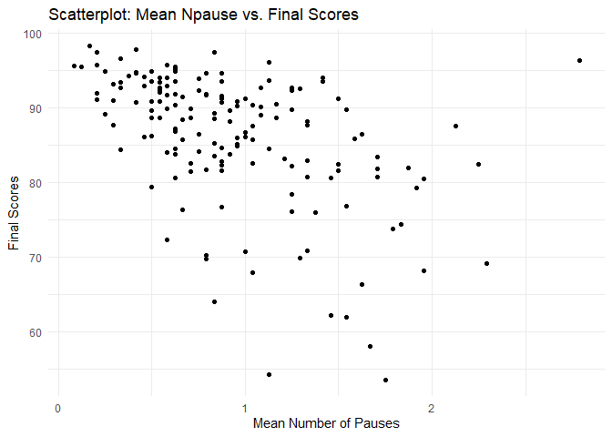
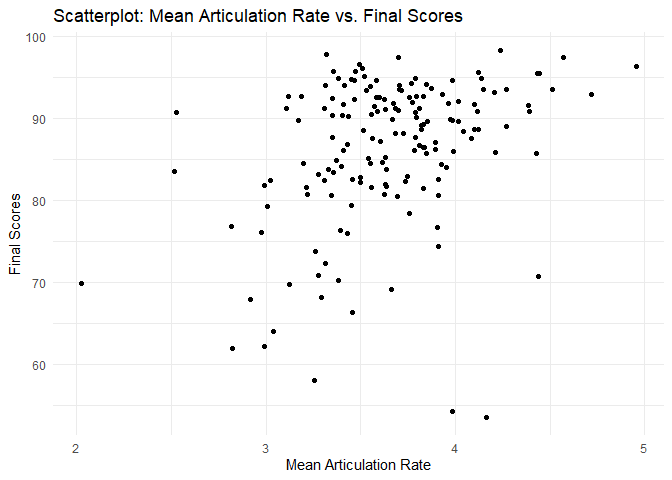
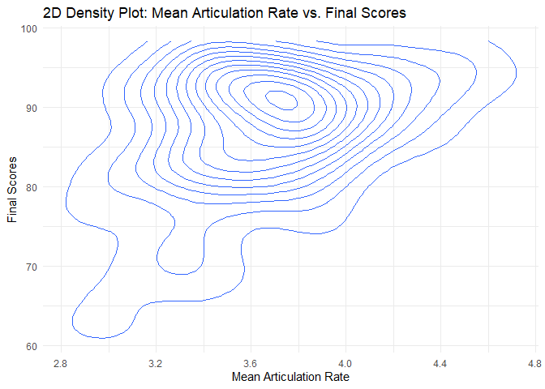

------------------------------------------------------------------------

    library(tidyverse)

    ## Warning: package 'ggplot2' was built under R version 4.3.3

    ## Warning: package 'tidyr' was built under R version 4.3.3

    ## Warning: package 'readr' was built under R version 4.3.3

    ## Warning: package 'purrr' was built under R version 4.3.3

    ## Warning: package 'dplyr' was built under R version 4.3.3

    ## Warning: package 'stringr' was built under R version 4.3.3

    ## Warning: package 'lubridate' was built under R version 4.3.3

    ## ── Attaching core tidyverse packages ──────────────────────── tidyverse 2.0.0 ──
    ## ✔ dplyr     1.1.4     ✔ readr     2.1.5
    ## ✔ forcats   1.0.0     ✔ stringr   1.5.1
    ## ✔ ggplot2   3.5.1     ✔ tibble    3.2.1
    ## ✔ lubridate 1.9.3     ✔ tidyr     1.3.1
    ## ✔ purrr     1.0.2     
    ## ── Conflicts ────────────────────────────────────────── tidyverse_conflicts() ──
    ## ✖ dplyr::filter() masks stats::filter()
    ## ✖ dplyr::lag()    masks stats::lag()
    ## ℹ Use the conflicted package (<http://conflicted.r-lib.org/>) to force all conflicts to become errors

    # Set the working directory to the location of the current script
    setwd(dirname(rstudioapi::getActiveDocumentContext()$path))

    # Load the dataset
    dataset_fluency_features <- read.csv("dataset_fluency_features.csv", header = TRUE, stringsAsFactors = FALSE)

    #' Data preprocessing as following: Remove duplicate rows
    #' Filter dataset to include only specific columns
    #' Strip any leading or trailing whitespace from articulationrate
    #' Replace commas in zeros with periods in articulationrate
    #' Convert articulationrate to numeric then
    #' Drop any NAs
    dataset_fluency_features_filtered <- dataset_fluency_features %>%
      distinct() %>%  # Remove duplicate rows
      select(articulationrate, npause, user_id, test_component_id) %>%  # Select specific columns
      mutate(
        articulationrate = articulationrate %>%
          trimws() %>%  # Remove leading and trailing whitespace
          gsub(",", ".", .) %>%  # Replace commas with periods
          as.numeric()  # Convert to numeric
      ) %>% 
      drop_na()  # Drop rows with any NA values

    # Aggregate the dataset by user_id 
    dataset_aggregated <- dataset_fluency_features_filtered %>%
      group_by(user_id, test_component_id) %>%
      summarise(
        mean_articulationrate = mean(articulationrate, na.rm = TRUE),
        mean_npause = mean(npause, na.rm = TRUE)
      )

    ## `summarise()` has grouped output by 'user_id'. You can override using the
    ## `.groups` argument.

    # Load dataset 
    dataset_total_score <- read.csv("dataset_total_score.csv", header = TRUE, stringsAsFactors = FALSE)

    # Perform left join and remove NA values in a pipeline
    merged_datasets <- dataset_aggregated %>%
      left_join(dataset_total_score, by = "user_id") %>%  # Perform left join
      na.omit()  # Drop rows with any NA values

    # Check data structure of merged dataset
    str(merged_datasets)

    ## gropd_df [163 × 5] (S3: grouped_df/tbl_df/tbl/data.frame)
    ##  $ user_id              : int [1:163] 28 29 30 31 32 37 38 39 41 42 ...
    ##  $ test_component_id    : int [1:163] 10 11 10 12 10 8 13 11 12 8 ...
    ##  $ mean_articulationrate: num [1:163] 3.64 4.39 4.15 3.32 3.34 ...
    ##  $ mean_npause          : num [1:163] 0.792 0.875 0.5 0.417 1.458 ...
    ##  $ final_score          : num [1:163] 81.7 91.7 93.6 97.8 80.7 ...
    ##  - attr(*, "groups")= tibble [163 × 2] (S3: tbl_df/tbl/data.frame)
    ##   ..$ user_id: int [1:163] 28 29 30 31 32 37 38 39 41 42 ...
    ##   ..$ .rows  : list<int> [1:163] 
    ##   .. ..$ : int 1
    ##   .. ..$ : int 2
    ##   .. ..$ : int 3
    ##   .. ..$ : int 4
    ##   .. ..$ : int 5
    ##   .. ..$ : int 6
    ##   .. ..$ : int 7
    ##   .. ..$ : int 8
    ##   .. ..$ : int 9
    ##   .. ..$ : int 10
    ##   .. ..$ : int 11
    ##   .. ..$ : int 12
    ##   .. ..$ : int 13
    ##   .. ..$ : int 14
    ##   .. ..$ : int 15
    ##   .. ..$ : int 16
    ##   .. ..$ : int 17
    ##   .. ..$ : int 18
    ##   .. ..$ : int 19
    ##   .. ..$ : int 20
    ##   .. ..$ : int 21
    ##   .. ..$ : int 22
    ##   .. ..$ : int 23
    ##   .. ..$ : int 24
    ##   .. ..$ : int 25
    ##   .. ..$ : int 26
    ##   .. ..$ : int 27
    ##   .. ..$ : int 28
    ##   .. ..$ : int 29
    ##   .. ..$ : int 30
    ##   .. ..$ : int 31
    ##   .. ..$ : int 32
    ##   .. ..$ : int 33
    ##   .. ..$ : int 34
    ##   .. ..$ : int 35
    ##   .. ..$ : int 36
    ##   .. ..$ : int 37
    ##   .. ..$ : int 38
    ##   .. ..$ : int 39
    ##   .. ..$ : int 40
    ##   .. ..$ : int 41
    ##   .. ..$ : int 42
    ##   .. ..$ : int 43
    ##   .. ..$ : int 44
    ##   .. ..$ : int 45
    ##   .. ..$ : int 46
    ##   .. ..$ : int 47
    ##   .. ..$ : int 48
    ##   .. ..$ : int 49
    ##   .. ..$ : int 50
    ##   .. ..$ : int 51
    ##   .. ..$ : int 52
    ##   .. ..$ : int 53
    ##   .. ..$ : int 54
    ##   .. ..$ : int 55
    ##   .. ..$ : int 56
    ##   .. ..$ : int 57
    ##   .. ..$ : int 58
    ##   .. ..$ : int 59
    ##   .. ..$ : int 60
    ##   .. ..$ : int 61
    ##   .. ..$ : int 62
    ##   .. ..$ : int 63
    ##   .. ..$ : int 64
    ##   .. ..$ : int 65
    ##   .. ..$ : int 66
    ##   .. ..$ : int 67
    ##   .. ..$ : int 68
    ##   .. ..$ : int 69
    ##   .. ..$ : int 70
    ##   .. ..$ : int 71
    ##   .. ..$ : int 72
    ##   .. ..$ : int 73
    ##   .. ..$ : int 74
    ##   .. ..$ : int 75
    ##   .. ..$ : int 76
    ##   .. ..$ : int 77
    ##   .. ..$ : int 78
    ##   .. ..$ : int 79
    ##   .. ..$ : int 80
    ##   .. ..$ : int 81
    ##   .. ..$ : int 82
    ##   .. ..$ : int 83
    ##   .. ..$ : int 84
    ##   .. ..$ : int 85
    ##   .. ..$ : int 86
    ##   .. ..$ : int 87
    ##   .. ..$ : int 88
    ##   .. ..$ : int 89
    ##   .. ..$ : int 90
    ##   .. ..$ : int 91
    ##   .. ..$ : int 92
    ##   .. ..$ : int 93
    ##   .. ..$ : int 94
    ##   .. ..$ : int 95
    ##   .. ..$ : int 96
    ##   .. ..$ : int 97
    ##   .. ..$ : int 98
    ##   .. ..$ : int 99
    ##   .. .. [list output truncated]
    ##   .. ..@ ptype: int(0) 
    ##   ..- attr(*, ".drop")= logi TRUE
    ##  - attr(*, "na.action")= 'omit' Named int [1:4] 17 142 153 157
    ##   ..- attr(*, "names")= chr [1:4] "17" "142" "153" "157"

    #################  Visualization #################
    # Create scatterplot with facets one for each test component
    scatterplot_faceted <- ggplot(merged_datasets, aes(x = mean_articulationrate, y = mean_npause, color = factor(test_component_id))) +
      geom_point() +
      labs(title = "Scatterplot",
           x = "Mean Articulation Rate",
           y = "Mean Npause",
           color = "Test Component ID") +
      theme_minimal() +
      facet_wrap(~ test_component_id, nrow = 1)

    print(scatterplot_faceted)

    # Create 2D density plot with filled faces and no color legend
    density_plot_filled <- ggplot(dataset_aggregated, aes(x = mean_articulationrate, y = mean_npause, fill = factor(test_component_id))) +
      geom_density_2d() +
      labs(title = "2D Density Plot",
           x = "Mean Articulation Rate",
           y = "Mean Npause",
           fill = "Test Component ID") +
      theme_minimal() +
      guides(fill = FALSE)  # Remove fill legend

    ## Warning: The `<scale>` argument of `guides()` cannot be `FALSE`. Use "none" instead as
    ## of ggplot2 3.3.4.
    ## This warning is displayed once every 8 hours.
    ## Call `lifecycle::last_lifecycle_warnings()` to see where this warning was
    ## generated.

    print(density_plot_filled)

    ########### Sarah's Recommendations #########

    # Create scatterplot of Number of Pauses vs. Final Scores
    scatterplot_npause <- ggplot(merged_datasets, aes(x = mean_npause, y = final_score)) +
      geom_point() +
      labs(title = "Scatterplot: Mean Npause vs. Final Scores",
           x = "Mean Number of Pauses",
           y = "Final Scores") +
      theme_minimal()

    print(scatterplot_npause)

    # Create scatterplot of Articulation Rate vs. Final Scores
    scatterplot_articulation <- ggplot(merged_datasets, aes(x = mean_articulationrate, y = final_score)) +
      geom_point() +
      labs(title = "Scatterplot: Mean Articulation Rate vs. Final Scores",
           x = "Mean Articulation Rate",
           y = "Final Scores") +
      theme_minimal()

    print(scatterplot_articulation)

    # Create 2D density plot of Number of Pauses and Final Scores
    density_plot_npause <- ggplot(merged_datasets, aes(x = mean_npause, y = final_score)) +
      geom_density_2d() +
      labs(title = "2D Density Plot: Mean Npause vs. Final Scores",
           x = "Mean Number of Pauses",
           y = "Final Scores") +
      theme_minimal()

    print(density_plot_npause)

    # Create 2D density plot of Articulation Rate and Final Scores
    density_plot_articulation <- ggplot(merged_datasets, aes(x = mean_articulationrate, y = final_score)) +
      geom_density_2d() +
      labs(title = "2D Density Plot: Mean Articulation Rate vs. Final Scores",
           x = "Mean Articulation Rate",
           y = "Final Scores") +
      theme_minimal()

    print(density_plot_articulation)

End of Solution
