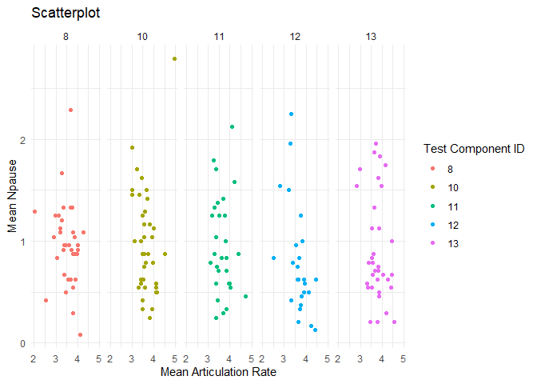
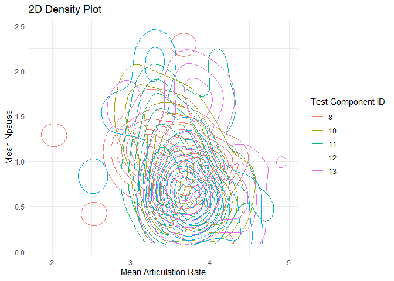

------------------------------------------------------------------------

    library(readr)

    ## Warning: package 'readr' was built under R version 4.3.3

    library(ggplot2)

    ## Warning: package 'ggplot2' was built under R version 4.3.3

    library(dplyr)

    ## Warning: package 'dplyr' was built under R version 4.3.3

    ## 
    ## Attaching package: 'dplyr'

    ## The following objects are masked from 'package:stats':
    ## 
    ##     filter, lag

    ## The following objects are masked from 'package:base':
    ## 
    ##     intersect, setdiff, setequal, union

    library(tidyverse)

    ## Warning: package 'tidyr' was built under R version 4.3.3

    ## Warning: package 'purrr' was built under R version 4.3.3

    ## Warning: package 'stringr' was built under R version 4.3.3

    ## Warning: package 'lubridate' was built under R version 4.3.3

    ## ── Attaching core tidyverse packages ──────────────────────── tidyverse 2.0.0 ──
    ## ✔ forcats   1.0.0     ✔ stringr   1.5.1
    ## ✔ lubridate 1.9.3     ✔ tibble    3.2.1
    ## ✔ purrr     1.0.2     ✔ tidyr     1.3.1

    ## ── Conflicts ────────────────────────────────────────── tidyverse_conflicts() ──
    ## ✖ dplyr::filter() masks stats::filter()
    ## ✖ dplyr::lag()    masks stats::lag()
    ## ℹ Use the conflicted package (<http://conflicted.r-lib.org/>) to force all conflicts to become errors

    # Load dataset 
    file_path <- "C:/Users/Admin/Downloads/dataset_fluency_features.csv"
    dataset_fluency_features <- read.csv(file_path, header = TRUE, stringsAsFactors = FALSE)

    # Remove duplicate rows
    dataset_fluency_features_clean <- unique(dataset_fluency_features)

    # Filter dataset to include only specific columns
    dataset_fluency_features_filtered <- dataset_fluency_features_clean[c("articulationrate", "npause", "user_id", "test_component_id")]

    # Check data structures of the dataset 
    str(dataset_fluency_features_filtered)

    ## 'data.frame':    4008 obs. of  4 variables:
    ##  $ articulationrate : chr  " 3.54" " 3.14" " 3.49" " 3.17" ...
    ##  $ npause           : int  0 1 0 1 1 0 0 2 3 0 ...
    ##  $ user_id          : int  153 179 278 192 155 29 71 267 133 120 ...
    ##  $ test_component_id: int  12 10 11 13 10 11 13 11 11 13 ...

    # Strip any leading or trailing whitespace from articulationrate
    dataset_fluency_features_filtered$articulationrate <- trimws(dataset_fluency_features_filtered$articulationrate)

    # Replace commas in zeros with periods in articulationrate
    dataset_fluency_features_filtered$articulationrate <- gsub(",", ".", dataset_fluency_features_filtered$articulationrate)

    # Convert articulationrate to numeric
    dataset_fluency_features_filtered$articulationrate <- as.numeric(dataset_fluency_features_filtered$articulationrate)

    # Aggregate the dataset by user_id 
    dataset_aggregated <- dataset_fluency_features_filtered %>%
      group_by(user_id, test_component_id) %>%
      summarise(
        mean_articulationrate = mean(articulationrate, na.rm = TRUE),
        mean_npause = mean(npause, na.rm = TRUE)
      )

    ## `summarise()` has grouped output by 'user_id'. You can override using the
    ## `.groups` argument.

    # Load dataset 
    file_path2 <- "C:/Users/Admin/Downloads/dataset_total_score.csv"
    dataset_total_score <- read.csv(file_path2, header = TRUE, stringsAsFactors = FALSE)

    # Perform a left join to include columns from dataset_total_score
    merged_datasets <- left_join(dataset_aggregated, dataset_total_score, by = "user_id")

    # NAs were generated in the total_score column because the features dataset has more row
    # Therefore, I dropped those few rows
    merged_datasets <- na.omit(merged_datasets)

    #################  Visualization #################
    # Create scatterplot with facets one for each test component
    scatterplot_faceted <- ggplot(merged_datasets, aes(x = mean_articulationrate, y = mean_npause, color = factor(test_component_id))) +
      geom_point() +
      labs(title = "Scatterplot",
           x = "Mean Articulation Rate",
           y = "Mean Npause",
           color = "Test Component ID") +
      theme_minimal() +
      facet_wrap(~ test_component_id, nrow = 1)

    print(scatterplot_faceted)

    # Create 2D density plot colored by test_component_id
    density_plot_colored <- ggplot(dataset_aggregated, aes(x = mean_articulationrate, y = mean_npause, color = factor(test_component_id))) +
      geom_density_2d() +
      labs(title = "2D Density Plot",
           x = "Mean Articulation Rate",
           y = "Mean Npause",
           color = "Test Component ID") +
      theme_minimal()

    print(density_plot_colored)

End of Solution
