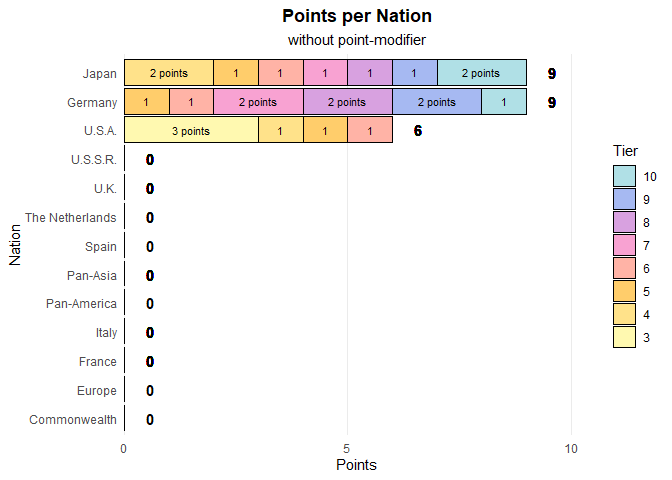
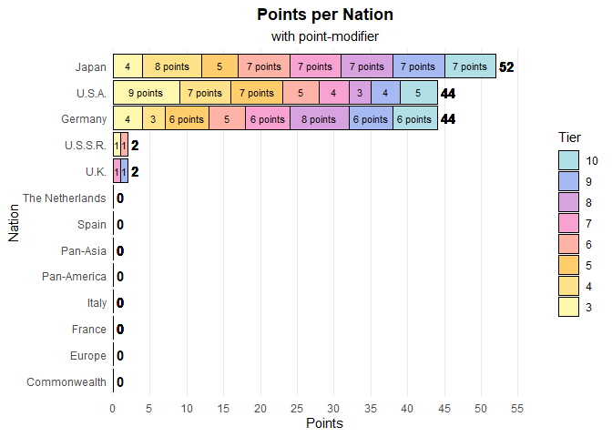

# My solution of Dennis Project

### 1: Tidying the Data

This is how it worked:

    data <- read_csv2(here("Projects", "shad-lad-flad", "wows_playerbase_data.CSV"), 
                      na = "-", trim_ws = T) %>% 
      select(Nation, Tier, Type, Battles) %>% 
      
      mutate(
        Battles = as.integer(gsub("\\s+", "", Battles)),
        Type = trimws(Type)
      ) %>% 
      
      filter(Tier >= 3 & Tier < 11) %>%  
      filter(Type %in% c("Battleship", "Cruiser", "Destroyer")) %>% 
      filter(Battles > 200000) %>% 
      drop_na() %>% 
      
      group_by(Nation, Tier) %>% 
      filter(n_distinct(Type) >= 2) %>%  
      ungroup() %>% 

      glimpse()

    ## Rows: 414
    ## Columns: 4
    ## $ Nation  <chr> "Germany", "Japan", "Japan", "Germany", "Germany", "Germany", …
    ## $ Tier    <dbl> 8, 10, 10, 10, 8, 7, 8, 10, 6, 10, 6, 6, 7, 9, 5, 6, 10, 9, 5,…
    ## $ Type    <chr> "Battleship", "Destroyer", "Battleship", "Battleship", "Battle…
    ## $ Battles <int> 22576493, 20507223, 17459481, 17156234, 16139165, 14618949, 14…

This is how it didn’t work:

    data._. <- read_csv2(here("Projects", "shad-lad-flad", "wows_playerbase_data.CSV"),
                         na = "-", trim_ws = T) %>% 
      select(Nation, Tier, Type, Battles) %>% 
      
      # mutate(
      #   Battles = as.integer(gsub("\\s+", "", Battles)),
      #   Type = trimws(Type)
      # ) %>% 
      
      filter(Tier >= 3 & Tier < 11) %>%  
      filter(Type %in% c("Battleship", "Cruiser", "Destroyer")) %>% 
      filter(Battles > 200000) %>% 
      drop_na() %>% 
      
      group_by(Nation, Tier) %>% 
      filter(n_distinct(Type) >= 2) %>%  
      ungroup() %>% 

      glimpse()

    ## Rows: 284
    ## Columns: 4
    ## $ Nation  <chr> "Germany", "U.S.A.", "Germany", "Japan", "U.K.", "U.S.A.", "U.…
    ## $ Tier    <dbl> 7, 5, 5, 10, 10, 10, 4, 5, 8, 5, 7, 8, 7, 7, 9, 9, 6, 5, 9, 7,…
    ## $ Type    <chr> "Cruiser", "Battleship", "Battleship", "Cruiser", "Cruiser", "…
    ## $ Battles <chr> "9 987 391", "9 833 374", "9 711 032", "9 527 446", "9 094 593…

### 2: Visualisation without point modifier

### 2: With optional point modifier

### How I assigned the points

      # 1: Group by Tier and Type
      group_by(Tier, Type) %>% 
      # 1: Rank based on Battles
      mutate(rank = rank(-Battles, ties.method = "min")) %>%  
      # 2: Points based on Rank
      mutate(points = case_when(
        rank == 1 ~ 3,  # 1. Platz: 3 Punkte
        rank == 2 ~ 2,  # 2. Platz: 2 Punkte
        rank == 3 ~ 1,   # 3. Platz: 1 Punkt
        TRUE ~ 0
      )) %>% 
      ungroup() %>% 
