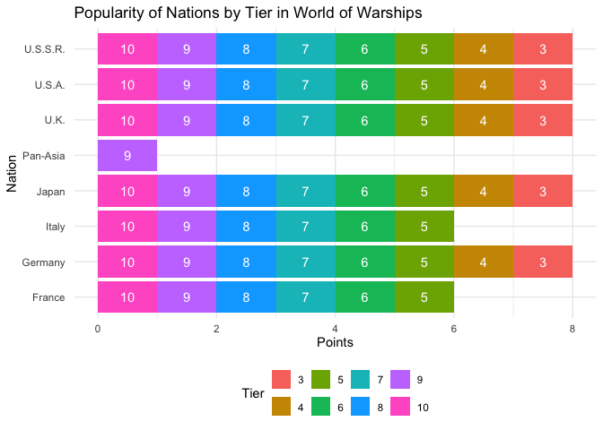

    library(dplyr)

    ## 
    ## Attaching package: 'dplyr'

    ## The following objects are masked from 'package:stats':
    ## 
    ##     filter, lag

    ## The following objects are masked from 'package:base':
    ## 
    ##     intersect, setdiff, setequal, union

    library(readr)
    library(ggplot2)

    dat <- read.csv2("wows_playerbase_data.csv", stringsAsFactors = FALSE)
    dat <- dat[-c(762:805), ]

    dat$Battles <- gsub(" ", "", dat$Battles) 
    dat$Avg..damage <- gsub(" ", "", dat$Avg..damage) 
    dat$Win.rate <- gsub("%", "", dat$Win.rate)  
    dat$Win.rate <- gsub(" ", "", dat$Win.rate)

    dat$Battles <- as.numeric(dat$Battles) 
    dat$Avg..damage <- as.numeric(dat$Avg..damage) 
    dat$Win.rate <- as.numeric(dat$Win.rate) 

    dat <- dat %>% filter(Tier >= 3 & Tier <= 10)

    dat <- dat %>% filter(Battles >= 200000)

    dat <- subset(dat, !(Type %in% c("Submarine ", "Aircraft Carrier ")))

    dat1 <- dat %>%
      group_by(Nation, Tier, Type) %>%
      filter(Battles == max(Battles, na.rm = TRUE)) %>%
      ungroup()

    dat1 <- dat1 %>%
      group_by(Nation, Tier) %>%
      mutate(ship_type_count = n_distinct(Type)) %>%
      filter(ship_type_count == 3) %>%
      ungroup()

    dat_groups <- dat1 %>%
      group_by(Nation, Tier) %>%
      slice_head(n = 3) %>%  
      ungroup()

    dat_grouped <- dat_groups %>%
      group_by(Nation, Tier, Type) %>%
      summarise(
        total_battles = sum(Battles, na.rm = TRUE), 
        avg_winrate = mean(Win.rate, na.rm = TRUE), 
        avg_damage = mean(Avg..damage, na.rm = TRUE))

    ## `summarise()` has grouped output by 'Nation', 'Tier'. You can override using
    ## the `.groups` argument.

    dat_grouped <- dat_grouped %>%
      group_by(Nation, Tier) %>%
      mutate(
        points = ifelse(total_battles == max(total_battles), 1, 0)
      ) %>%
      ungroup()

    nation_points <- dat_grouped %>%
      group_by(Nation) %>%
      summarise(
        total_points = sum(points)
      ) %>%
      arrange(desc(total_points))  # Sort nations by total points, descending order

    most_unpopular_nation <- nation_points %>%
      filter(total_points == min(total_points))

    top_3_nations <- nation_points %>%
      slice_head(n = 3)  # Select the top 3 nations based on total points

    top_3_nations

    ## # A tibble: 3 × 2
    ##   Nation     total_points
    ##   <chr>             <dbl>
    ## 1 "Germany "            8
    ## 2 "Japan "              8
    ## 3 "U.K. "               8

    most_unpopular_nation

    ## # A tibble: 1 × 2
    ##   Nation      total_points
    ##   <chr>              <dbl>
    ## 1 "Pan-Asia "            1

    top_ships <- dat_grouped %>%
      group_by(Nation, Tier, Type) %>%
      filter(total_battles == max(total_battles)) %>% 
      slice(1) 

    head(top_ships)

    ## # A tibble: 6 × 7
    ## # Groups:   Nation, Tier, Type [6]
    ##   Nation     Tier Type          total_battles avg_winrate avg_damage points
    ##   <chr>     <int> <chr>                 <dbl>       <dbl>      <dbl>  <dbl>
    ## 1 "France "     5 "Battleship "       2164223        49.7      36275      0
    ## 2 "France "     5 "Cruiser "          3956587        52.2      25688      1
    ## 3 "France "     5 "Destroyer "         794031        51.1      22116      0
    ## 4 "France "     6 "Battleship "       3650246        52.3      47474      0
    ## 5 "France "     6 "Cruiser "          4357927        50.6      28773      1
    ## 6 "France "     6 "Destroyer "        2167144        50.6      24839      0

    dat_points_summary <- dat_grouped %>%
      group_by(Nation, Tier) %>%
      summarise(tier_points = sum(points)) %>%
      ungroup()

    ## `summarise()` has grouped output by 'Nation'. You can override using the
    ## `.groups` argument.

    nation_total_points <- dat_points_summary %>%
      group_by(Nation) %>%
      summarise(total_points = sum(tier_points)) %>%
      ungroup() %>%
      arrange(desc(total_points))

    ggplot(dat_points_summary, aes(x = tier_points, y = reorder(Nation, -tier_points), fill = factor(Tier))) +
      geom_bar(stat = "identity") +
        geom_text(aes(label = Tier), position = position_stack(vjust = 0.5), color = "white") +  # Add tier labels on the bars

      labs(
        x = "Points",
        y = "Nation",
        title = "Popularity of Nations by Tier in World of Warships",
        fill = "Tier"
      ) +
      theme_minimal() +
      theme(legend.position = "bottom")

