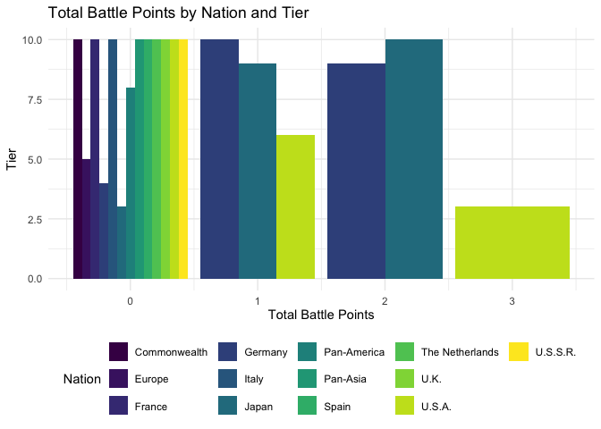
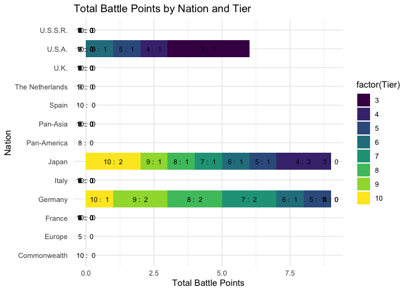

    library(dplyr)

    ## 
    ## Attaching package: 'dplyr'

    ## The following objects are masked from 'package:stats':
    ## 
    ##     filter, lag

    ## The following objects are masked from 'package:base':
    ## 
    ##     intersect, setdiff, setequal, union

    library(ggplot2)

Reading the data, and cleaning from na values

    dat <- read.csv2("wows_playerbase_data.csv", stringsAsFactors = FALSE)
    dat <- dat[!apply(dat == "-", 1, any), ]
     #dropping rows where we have "-" instead of actual value

Since we are going to use the values from tables Battles, Avg.Damage,
and Win.rate, I am removing any white spaces, percentage values and
making them numeric.

    dat$Battles <- gsub(" ", "", dat$Battles) 
    dat$Avg..damage <- gsub(" ", "", dat$Avg..damage) 
    dat$Win.rate <- gsub("%", "", dat$Win.rate)  
    dat$Win.rate <- gsub(" ", "", dat$Win.rate)

    dat$Battles <- as.numeric(dat$Battles) 
    dat$Avg..damage <- as.numeric(dat$Avg..damage) 
    dat$Win.rate <- as.numeric(dat$Win.rate) 

Restrictions: Data cleaning for necessary information only:

    dat_grouped <- dat %>% 
      filter(
        Tier >= 3 & Tier <= 10,    # Exclude ships below Tier 3 and above Tier 10 
        Battles >= 200000,         # Exclude ships with fewer than 200 000 battles
        !(Type %in% c("Submarine ", "Aircraft Carrier "))  # Exclude Submarines and Aircraft Carriers
      ) %>% 
      group_by(Nation, Tier, Type) %>%  # Group by Nation, Tier, and Ship Type
      filter(Battles == max(Battles, na.rm = TRUE)) %>%  # Keep only the ship with the max Battles per ship type
      ungroup() %>% 
      group_by(Nation, Tier) %>%  # Group by Nation and Tier again
      mutate(ship_type_count = n_distinct(Type)) %>%  # Count distinct ship types within each Nation and Tier
      filter(ship_type_count >= 2) %>%  # Keep only nations with at least 2 ship types present in a tier
      mutate(  # Add necessary columns using mutate
        total_battles = sum(Battles, na.rm = TRUE),  # Sum of battles for each Nation and Tier
        avg_winrate = mean(Win.rate, na.rm = TRUE),  # Average win rate for each Nation and Tier
        avg_damage = mean(Avg..damage, na.rm = TRUE),  # Average damage for each Nation and Tier
        max_battles = max(Battles, na.rm = TRUE)  # Max battles per ship type
      ) %>% 
      ungroup() 
      

    dat_grouped

    ## # A tibble: 187 × 16
    ##    Warship             Tier Type  Nation Battles Win.rate Avg..frags Avg..damage
    ##    <chr>              <int> <chr> <chr>    <dbl>    <dbl> <chr>            <dbl>
    ##  1 "Bismarck "            8 "Bat… "Germ…  2.26e7     49.6 "0.65 "          51406
    ##  2 "Shimakaze "          10 "Des… "Japa…  2.05e7     48.6 "0.7 "           44588
    ##  3 "Yamato "             10 "Bat… "Japa…  1.75e7     48.0 "0.7 "           83570
    ##  4 "Grosser Kurf\xfc…    10 "Bat… "Germ…  1.72e7     49.1 "0.69 "          74377
    ##  5 "Gneisenau "           7 "Bat… "Germ…  1.46e7     50.0 "0.7 "           43851
    ##  6 "North Carolina "      8 "Bat… "U.S.…  1.41e7     48.8 "0.67 "          52844
    ##  7 "Montana "            10 "Bat… "U.S.…  1.37e7     48.8 "0.77 "          81716
    ##  8 "N\xfcrnberg "         6 "Cru… "Germ…  1.28e7     49.2 "0.53 "          25825
    ##  9 "Hindenburg "         10 "Cru… "Germ…  1.27e7     48.4 "0.66 "          72320
    ## 10 "New Mexico "          6 "Bat… "U.S.…  1.24e7     50.0 "0.72 "          39705
    ## # ℹ 177 more rows
    ## # ℹ 8 more variables: Avg..experience <chr>, Avg..planes.destroyed <chr>,
    ## #   Kills...deaths <chr>, ship_type_count <int>, total_battles <dbl>,
    ## #   avg_winrate <dbl>, avg_damage <dbl>, max_battles <dbl>

Contest. Awarding Points:

    dat_points <- dat_grouped %>%
      # Group by Tier and Ship Type to evaluate the ship types across nations within the same tier
      group_by(Tier, Type) %>%
      # Find the nation(s) with the maximum number of battles for each ship type within each tier
      mutate(max_battles = max(Battles, na.rm = TRUE)) %>%
      
      # Assign points to the nations that have the highest battles in the tier for each ship type
      mutate(battle_points = case_when(
        Battles == max_battles ~ 1,        # Assign 1 point to the nation with the highest battles for this ship type
        TRUE ~ 0   # No points for other nations or ship types
      )) %>%
      ungroup() %>%
      # Summarize the total points per nation and tier
      group_by(Nation, Tier) %>%
      summarise(
        total_battle_points = sum(battle_points, na.rm = TRUE),  # Sum up the points awarded for each ship type
        .groups = "drop"  # Drop grouping after summarizing
      ) %>%
      ungroup()

    dat_points

    ## # A tibble: 67 × 3
    ##    Nation           Tier total_battle_points
    ##    <chr>           <int>               <dbl>
    ##  1 "Commonwealth "    10                   0
    ##  2 "Europe "           5                   0
    ##  3 "France "           3                   0
    ##  4 "France "           4                   0
    ##  5 "France "           5                   0
    ##  6 "France "           6                   0
    ##  7 "France "           7                   0
    ##  8 "France "           8                   0
    ##  9 "France "           9                   0
    ## 10 "France "          10                   0
    ## # ℹ 57 more rows

    # Top 3 Nations based on total battle points
    top_3_nations <- dat_points %>%
      group_by(Nation) %>%
      summarise(total_points = sum(total_battle_points, na.rm = TRUE)) %>%
      arrange(desc(total_points)) %>%
      head(3)  # Get the top 3 nations

    top_3_nations

    ## # A tibble: 3 × 2
    ##   Nation     total_points
    ##   <chr>             <dbl>
    ## 1 "Germany "            9
    ## 2 "Japan "              9
    ## 3 "U.S.A. "             6

    # Top Ship (Ship with the highest battle points for each nation and tier)
    top_ship <- dat_points %>%
      group_by(Nation, Tier) %>%
      filter(total_battle_points == max(total_battle_points, na.rm = TRUE)) %>%
      ungroup()  

    top_ship

    ## # A tibble: 67 × 3
    ##    Nation           Tier total_battle_points
    ##    <chr>           <int>               <dbl>
    ##  1 "Commonwealth "    10                   0
    ##  2 "Europe "           5                   0
    ##  3 "France "           3                   0
    ##  4 "France "           4                   0
    ##  5 "France "           5                   0
    ##  6 "France "           6                   0
    ##  7 "France "           7                   0
    ##  8 "France "           8                   0
    ##  9 "France "           9                   0
    ## 10 "France "          10                   0
    ## # ℹ 57 more rows

    # Accumulating points per nation from lowest to highest tier
    dat_points_accumulated <- dat_points %>%
      arrange(Nation, Tier) %>%  # Sort by Nation and Tier (from lowest to highest)
      group_by(Nation) %>% 
      mutate(accumulated_points = cumsum(total_battle_points)) %>%  # Calculate cumulative points per nation
      ungroup()

    head(dat_points_accumulated)

    ## # A tibble: 6 × 4
    ##   Nation           Tier total_battle_points accumulated_points
    ##   <chr>           <int>               <dbl>              <dbl>
    ## 1 "Commonwealth "    10                   0                  0
    ## 2 "Europe "           5                   0                  0
    ## 3 "France "           3                   0                  0
    ## 4 "France "           4                   0                  0
    ## 5 "France "           5                   0                  0
    ## 6 "France "           6                   0                  0

Plot: option 1

    library(ggplot2)
    library(viridis)

    ## Loading required package: viridisLite

    ggplot(dat_points, aes(x = total_battle_points, y = Tier, fill = Nation)) +
      geom_bar(stat = "identity", position = "dodge") +  # 'identity' to use actual values of total_battle_points
      scale_x_continuous(name = "Total Battle Points") +  
      labs(title = "Total Battle Points by Nation and Tier") +  
      scale_fill_viridis(discrete = TRUE) +  # Apply the viridis color palette
      theme_minimal() +  # Minimal theme for clarity
      theme(legend.position = "bottom") 

Plot: option2

    library(ggplot2)
    library(viridis)

    ggplot(dat_points, aes(x = total_battle_points, y = Nation, fill = factor(Tier))) + 
      geom_bar(stat = "identity", position = "stack") +  # Stack the bars by Tier
      geom_text(aes(label = paste(Tier, ": ", total_battle_points)), 
                position = position_stack(vjust = 0.5), color = "black", size = 3) +  # Add labels with Tier and battle points
      scale_x_continuous(name = "Total Battle Points") +  # Label for x-axis (Total Battle Points)
      scale_y_discrete(name = "Nation") +  # Label for y-axis (Nations)
      labs(title = "Total Battle Points by Nation and Tier") +  # Plot title
      scale_fill_viridis(discrete = TRUE) +  # Apply viridis color palette for better visual clarity
      theme_minimal() 

