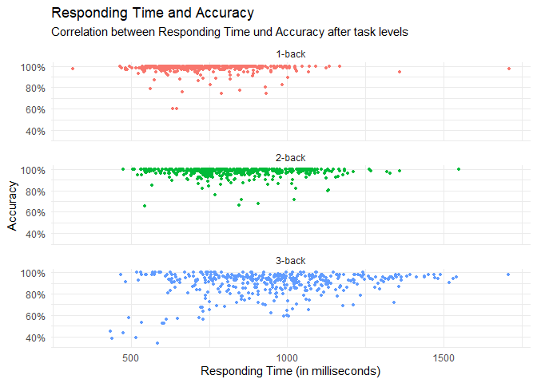
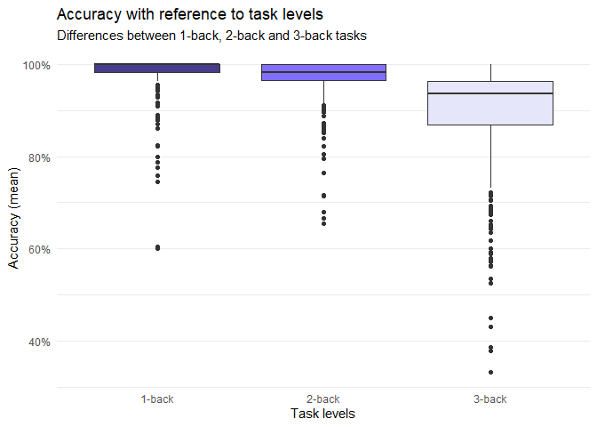

# Sonjas Project: Working Memory Capacity

## Working Memory Capacity Test

The working memory capacity test is a self programmed **n-back task**.
The test consisted of three tasks which differed in their cognitive
load. More precisely, this n-back task was divided in 1-back, 2-back,
and 3-back. The stimuli were 20 uppercase letters, excluding vocals and
the letter X. One of six randomly chosen sequence of letters was shown
on the screen, where only one letter appeared at a time.  
Below the stimulus, a button was displayed. Each task was preceded by
instructions, an example sequence of 10 trials with 2 matching letters
(20% targets), followed by 60 task trials including 20 matching letters
(30% targets). The first task (1-back) was to press the button everytime
a presented letter was the same as the previous letter. In the second
task (2-back), participants had to press the button if the presented
letter matched the one presented two trials before. The third task was a
3-back, where the presented letter had to match the one presented three
trials before.  
The letters were presented 500 milliseconds and the inter-stimulus
duration, in which participants were able to press the button, was 2500
milliseconds. The collected data contains information about reaction
time and response (i. e., whether the button was clicked or not).

## Data Set

The data set contains the following variables:

<table>
<thead>
<tr class="header">
<th style="text-align: center;">Variable</th>
<th style="text-align: left;">Information</th>
</tr>
</thead>
<tbody>
<tr class="odd">
<td style="text-align: center;"><code>SID</code></td>
<td style="text-align: left;">student ID</td>
</tr>
<tr class="even">
<td style="text-align: center;"><code>timestamp</code></td>
<td style="text-align: left;">timestamp of start of trial</td>
</tr>
<tr class="odd">
<td style="text-align: center;"><code>trial_index</code></td>
<td style="text-align: left;">number of trial (0-221)</td>
</tr>
<tr class="even">
<td style="text-align: center;"><code>trial_type</code></td>
<td style="text-align: left;">type of trial (html-button-response, survey-multi-choice)</td>
</tr>
<tr class="odd">
<td style="text-align: center;"><code>stim</code></td>
<td style="text-align: left;">stimulus presented on screen</td>
</tr>
<tr class="even">
<td style="text-align: center;"><code>response</code></td>
<td style="text-align: left;">response given to stimulus (none, button clicked, survey choice)</td>
</tr>
<tr class="odd">
<td style="text-align: center;"><code>rt</code></td>
<td style="text-align: left;">response time</td>
</tr>
<tr class="even">
<td style="text-align: center;"><code>time_elapsed</code></td>
<td style="text-align: left;">time passed since the start of the test</td>
</tr>
</tbody>
</table>

## Data Preparation

**Timestamp**  
The timestamp is a number in Unix format. It shows the time as a running
total of seconds since the Unix epoch on January 1, 1970 in UTC
([unixtimestamp.com](https://www.unixtimestamp.com/)). In our case, the
timestamp also includes milliseconds. If this additional information
causes problems during data preparation, the last three digits of each
timestamp should be removed.

**Performance**  
Performance can be measured as *accuracy* and *efficiency*. In order to
calculate accuracy, the correctness of each trial has to be calculated
first. For the calculation you have to know with which letter the
respective stimulus has to be compared, if a trial is a target trial and
if the button was clicked or not clicked correctly in each case.
Efficiency refers to high accuracy in a short time.

**Test Levels**  
The n-back task consists of three levels. The following overview is
intended to make working with the data set easier:

<table>
<thead>
<tr class="header">
<th style="text-align: center;">Trial Index</th>
<th style="text-align: left;">Type of Trial</th>
</tr>
</thead>
<tbody>
<tr class="odd">
<td style="text-align: center;">0</td>
<td style="text-align: left;">instruction</td>
</tr>
<tr class="even">
<td style="text-align: center;">1</td>
<td style="text-align: left;">multiple choice survey about the device used</td>
</tr>
<tr class="odd">
<td style="text-align: center;">2-3</td>
<td style="text-align: left;">instruction</td>
</tr>
<tr class="even">
<td style="text-align: center;">4-13</td>
<td style="text-align: left;">1-back example</td>
</tr>
<tr class="odd">
<td style="text-align: center;">14</td>
<td style="text-align: left;">instruction</td>
</tr>
<tr class="even">
<td style="text-align: center;">15-74</td>
<td style="text-align: left;"><strong>1-back task</strong></td>
</tr>
<tr class="odd">
<td style="text-align: center;">75-76</td>
<td style="text-align: left;">instruction</td>
</tr>
<tr class="even">
<td style="text-align: center;">77-86</td>
<td style="text-align: left;">2-back example</td>
</tr>
<tr class="odd">
<td style="text-align: center;">87</td>
<td style="text-align: left;">instruction</td>
</tr>
<tr class="even">
<td style="text-align: center;">88-147</td>
<td style="text-align: left;"><strong>2-back task</strong></td>
</tr>
<tr class="odd">
<td style="text-align: center;">148-149</td>
<td style="text-align: left;">instruction</td>
</tr>
<tr class="even">
<td style="text-align: center;">150-159</td>
<td style="text-align: left;">3-back example</td>
</tr>
<tr class="odd">
<td style="text-align: center;">160</td>
<td style="text-align: left;">instruction</td>
</tr>
<tr class="even">
<td style="text-align: center;">161-220</td>
<td style="text-align: left;"><strong>3-back task</strong></td>
</tr>
</tbody>
</table>

## Project goals

Project goals were to create

-   A clean dataset contaning Accuracy and Efficiency per student
-   A plot showing relationship between Accuracy and Responding Time
-   A plot showing differences in Accuracy per task level

## Final solution

After transformation data looked like the following:

    ## # A tibble: 6 × 4
    ##        ID Accuracy  Time Back  
    ##     <int>    <dbl> <dbl> <fct> 
    ## 1 1111103    0.759  665. 1-back
    ## 2 1111104    1      637. 1-back
    ## 3 1111106    0.983  681. 1-back
    ## 4 1111107    1      655. 1-back
    ## 5 1111108    1      772. 1-back
    ## 6 1111109    0.966  833. 1-back

First plot shows relationship between Accuracy and Responding Time:

Second plot shows differences in Accuracy per task level:

