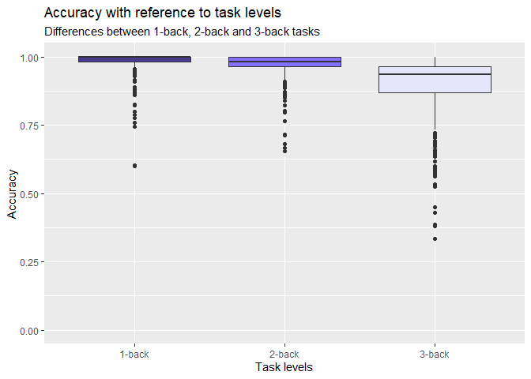
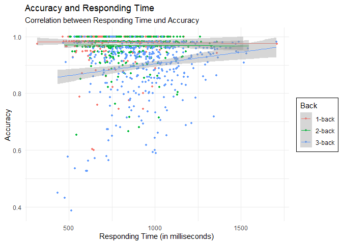

**Preparations**

    rm (list = ls())
    cat ("\14")



    graphics.off()

**Packages**

    if (!require(ggpubr)) install.packages("ggpubr")
    library(ggpubr)
    if (!require(dplyr)) install.packages("dplyr")
    library(dplyr)
    if (!require(tidyverse)) install.packages("tidyverse")
    library(tidyverse)

**Insert dataset**

    data <- read.csv("https://raw.githubusercontent.com/Dr-Eberle-Zentrum/Advanced-data-processing-with-R/main/Projects/sonji-uni/I4S_workingMemory_2023-02-26.csv", 
                     sep = ";", na.strings = "null")

**Prepare data**

    names(data) <- c("ID", "Start", "Trial","Type", "Stimulus", "Answer", "Time", "End")

**Accuracy back\_1**

    data %>% 
      subset (Trial > 14) %>% 
      subset (Trial < 75) %>% 
      mutate (back = lag(Stimulus, 1),
              correct = (Stimulus == back & Answer == "0")|(Stimulus != back & is.na(Answer))) %>% 
      # Grouping by mean:
      group_by (ID) %>% 
      summarize(Accuracy = mean(correct, na.rm = T),
                Time = mean (Time, na.rm = T),
                Back = "1-back")-> df1

**Accuracy back\_2**

    data %>% 
      subset (Trial >  87) %>% 
      subset (Trial < 148) %>% 
      mutate (back = lag(Stimulus, 2),
              correct = (Stimulus == back & Answer == "0")|(Stimulus != back & is.na(Answer))) %>% 
      # Grouping by mean:
      group_by (ID) %>% 
      summarize(Accuracy = mean(correct, na.rm = T),
                Time = mean (Time, na.rm = T),
                Back = "2-back")-> df2

**Accuracy back\_3**

    data %>% 
      subset (Trial > 160) %>% 
      mutate (back = lag(Stimulus, 3),
              correct = (Stimulus == back & Answer == "0")|(Stimulus != back & is.na(Answer))) %>% 
      # Grouping by mean:
      group_by (ID) %>% 
      summarize(Accuracy = mean(correct, na.rm = T),
                Time = mean (Time, na.rm = T),
                Back = "3-back")-> df3

**Combining datasets**

    bind_rows(list(df1, df2, df3))->df
    factor(df$Back) -> df$Back

**Plotting correlation between Accuracy and task levels**

    df %>% 
      ggplot (aes (x = Back, y = Accuracy)) +
      geom_boxplot(fill = c("slateblue4", "slateblue1", "lavender")) +
      labs (title = "Accuracy with reference to task levels",
            subtitle = "Differences between 1-back, 2-back and 3-back tasks") +
      ylab ("Accuracy") +
      xlab ("Task levels") +
      ylim (0, 1)

**Plotting correlation between Accuracy and Responding Time**

    df %>% 
      ggplot (aes (x = Time, y = Accuracy, colour = Back)) +
      geom_jitter(size = 1) +
      geom_smooth(method = "lm", linewidth = 0.5) +
      labs (title = "Accuracy and Responding Time",
            subtitle = "Correlation between Responding Time und Accuracy") +
      ylab ("Accuracy") +
      xlab ("Responding Time (in milliseconds)") +
      ylim (0.38, 1) +
      theme_minimal() +
      theme(legend.background = element_rect(fill = "white", colour = "black"))

