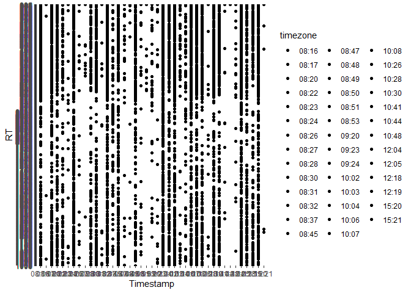
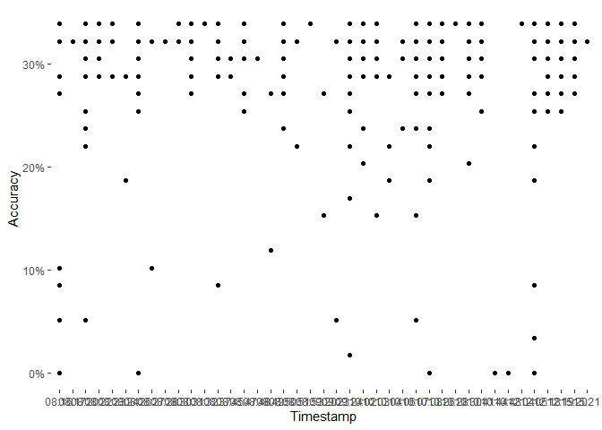
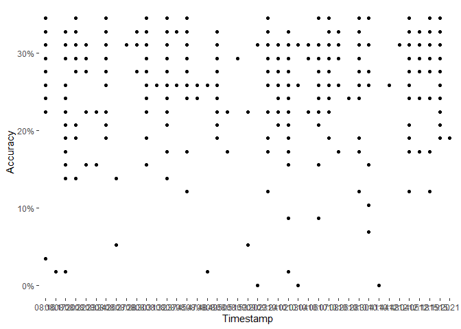
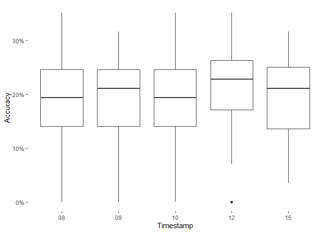

## Sonja’s project

    ## 载入需要的程辑包：ggpubr

    ## Warning: 程辑包'ggpubr'是用R版本4.2.3 来建造的

    ## 载入需要的程辑包：ggplot2

    ## 载入需要的程辑包：dplyr

    ## 
    ## 载入程辑包：'dplyr'

    ## The following objects are masked from 'package:stats':
    ## 
    ##     filter, lag

    ## The following objects are masked from 'package:base':
    ## 
    ##     intersect, setdiff, setequal, union

    ## 载入需要的程辑包：tidyverse

    ## ── Attaching core tidyverse packages ──────────────────────── tidyverse 2.0.0 ──
    ## ✔ forcats   1.0.0     ✔ stringr   1.5.0
    ## ✔ lubridate 1.9.2     ✔ tibble    3.1.8
    ## ✔ purrr     1.0.1     ✔ tidyr     1.3.0
    ## ✔ readr     2.1.4     
    ## ── Conflicts ────────────────────────────────────────── tidyverse_conflicts() ──
    ## ✖ dplyr::filter() masks stats::filter()
    ## ✖ dplyr::lag()    masks stats::lag()
    ## ℹ Use the ]8;;http://conflicted.r-lib.org/conflicted package]8;; to force all conflicts to become errors
    ## 载入需要的程辑包：ggrepel

    ## Warning: 程辑包'ggrepel'是用R版本4.2.3 来建造的

    ## [1] "D:/WiSe2022-23/R2Course/Advanced-data-processing-with-R/Projects/sonji-uni"

    ## Warning: Returning more (or less) than 1 row per `summarise()` group was deprecated in
    ## dplyr 1.1.0.
    ## ℹ Please use `reframe()` instead.
    ## ℹ When switching from `summarise()` to `reframe()`, remember that `reframe()`
    ##   always returns an ungrouped data frame and adjust accordingly.

    ## `summarise()` has grouped output by 'SID'. You can override using the `.groups`
    ## argument.

    ## Warning: Returning more (or less) than 1 row per `summarise()` group was deprecated in
    ## dplyr 1.1.0.
    ## ℹ Please use `reframe()` instead.
    ## ℹ When switching from `summarise()` to `reframe()`, remember that `reframe()`
    ##   always returns an ungrouped data frame and adjust accordingly.

    ## `summarise()` has grouped output by 'SID'. You can override using the `.groups`
    ## argument.

    ## Warning: Returning more (or less) than 1 row per `summarise()` group was deprecated in
    ## dplyr 1.1.0.
    ## ℹ Please use `reframe()` instead.
    ## ℹ When switching from `summarise()` to `reframe()`, remember that `reframe()`
    ##   always returns an ungrouped data frame and adjust accordingly.

    ## `summarise()` has grouped output by 'SID'. You can override using the `.groups`
    ## argument.

