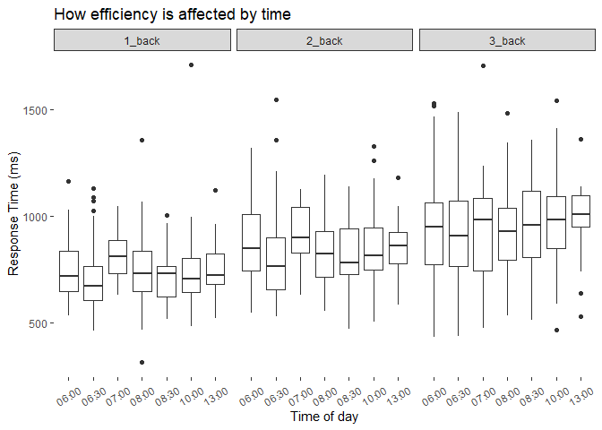
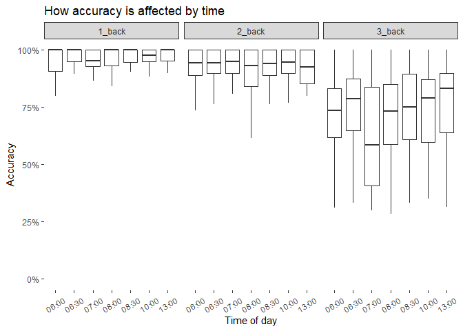

## Sonja’s project

    # set timestamp
    dataRaw$timestamp<-dataRaw$timestamp/1000
    dataRaw$timestamp<-as.POSIXlt(dataRaw$timestamp,origin="1970-01-01",tz = "GMT")

    # remove all instructions and examples
    data<- dataRaw %>% 
      select(-c(time_elapsed, trial_type)) %>%
      filter((between(trial_index, 88,147)) |between(trial_index, 15,74)|between(trial_index, 161,220))%>%
      mutate(timestamp = floor_date(as.POSIXct(timestamp, format = "%Y-%m-%d %H:%M:%S"),"30 mins"))

    # n_back sub_dataframe
    back_1<-data %>% 
      filter(trial_index >14 & trial_index<75)%>%
      group_by(SID)%>%
      mutate(same_stim= lag(stim,1),oneBack= stim==same_stim)%>%
      drop_na(oneBack)%>%
      mutate(correct=(oneBack&response==0)|(!oneBack&is.na(response)))%>%
      filter(rt != "null") |> 
      summarise(accuracy =mean(correct,na.rm=T),
                timezone=format(min(timestamp),'%H:%M'),
                rt=mean(as.numeric(rt))
                )%>%
      filter(!is.nan(rt)) |> 
      arrange(timezone)%>%
      mutate(type="1_back")

     back_2<- data %>% 
       filter(between(trial_index, 88,147))%>%
       group_by(SID)%>%
       mutate(same_stim= lag(stim,2),twoBack= stim==same_stim)%>%
       drop_na(twoBack)%>%
       mutate(correct=(twoBack&response==0)|(!twoBack&is.na(response)))%>%
       filter(rt != "null") |> 
       summarise(accuracy =mean(correct,na.rm=T),
                 timezone=format(min(timestamp),'%H:%M'),
                 rt=mean(as.numeric(rt))
       )%>%
       filter(!is.nan(rt)) |> 
       arrange(timezone)%>%
       mutate(type="2_back")
     
     back_3<- data %>% 
       filter(between(trial_index, 161,220))%>%
       group_by(SID)%>%
       mutate(same_stim= lag(stim,3),threeBack= stim==same_stim)%>%
       drop_na(threeBack)%>%
       mutate(correct=(threeBack&response==0)|(!threeBack&is.na(response)))%>%
       filter(rt != "null") |> 
       summarise(accuracy =mean(correct,na.rm=T),
                 timezone=format(min(timestamp),'%H:%M'),
                 rt=mean(as.numeric(rt))
       )%>%
       filter(!is.nan(rt)) |> 
       arrange(timezone)%>%
       mutate(type="3_back")

    dataNew<-bind_rows(back_1,back_2,back_3)
    print(dataNew)

    ## # A tibble: 1,266 × 5
    ##        SID accuracy timezone    rt type  
    ##      <int>    <dbl> <chr>    <dbl> <chr> 
    ##  1 1411101    1     06:00     648. 1_back
    ##  2 1411103    0.944 06:00     810. 1_back
    ##  3 1411104    1     06:00     947. 1_back
    ##  4 1411105    1     06:00     721. 1_back
    ##  5 1411106    0.630 06:00     984. 1_back
    ##  6 1411107    0.944 06:00     695. 1_back
    ##  7 1411108    0.909 06:00     845. 1_back
    ##  8 1411109    0.857 06:00     580. 1_back
    ##  9 1411110    0.95  06:00     653. 1_back
    ## 10 1411112    1     06:00     833. 1_back
    ## # … with 1,256 more rows

## plot

    # Plot efficiency against timestamp
    p1<- 
    ggplot(dataNew, aes(x=timezone, y=rt))+
      geom_boxplot(outlier.shape = NA)+
      labs(x = "Time of day", y = "Response Time (ms)", title = "How efficiency is affected by time")+
      facet_wrap(~type)+
      theme_bw()+
      theme(
        panel.border = element_blank(),
        panel.grid.major = element_blank(),
        panel.grid.minor = element_blank(),
        panel.background = element_rect(fill = NA),
        axis.text.x = element_text(angle = 30, vjust = 0.5))

     

    # Plot accuracy against timestamp
    p2<-
    ggplot(dataNew, aes(x=timezone, y=accuracy))+
      geom_boxplot(outlier.shape = NA)+
      labs(x = "Time of day", y = "Accuracy", title = "How accuracy is affected by time")+
      facet_wrap(~type)+
      scale_y_continuous(label=scales::percent)+
      theme_bw()+
      theme(
        panel.border = element_blank(),
        panel.grid.major = element_blank(),
        panel.grid.minor = element_blank(),
        panel.background = element_rect(fill = NA),
        axis.text.x = element_text(angle = 30, vjust = 0.5))

    print(p1) 

    print(p2)

