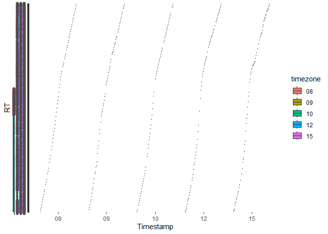
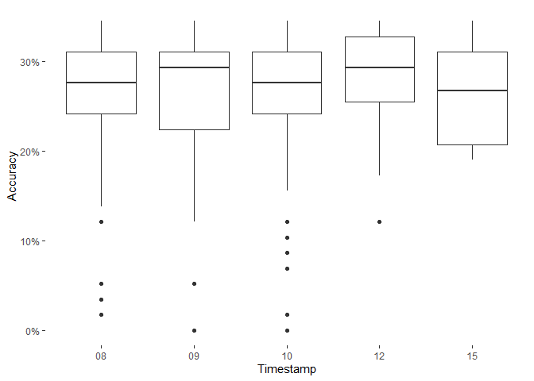

## Sonja’s project

    knitr::opts_chunk$set(echo = FALSE)
    #Sonja's project

    #packages
    if (!require(ggpubr)) install.packages("ggpubr")

    ## 载入需要的程辑包：ggpubr

    ## Warning: 程辑包'ggpubr'是用R版本4.2.3 来建造的

    ## 载入需要的程辑包：ggplot2

    library(ggpubr)
    if (!require(dplyr)) install.packages("dplyr")

    ## 载入需要的程辑包：dplyr

    ## 
    ## 载入程辑包：'dplyr'

    ## The following objects are masked from 'package:stats':
    ## 
    ##     filter, lag

    ## The following objects are masked from 'package:base':
    ## 
    ##     intersect, setdiff, setequal, union

    library(dplyr)
    if (!require(tidyverse)) install.packages("tidyverse")

    ## 载入需要的程辑包：tidyverse

    ## ── Attaching core tidyverse packages ──────────────────────── tidyverse 2.0.0 ──
    ## ✔ forcats   1.0.0     ✔ stringr   1.5.0
    ## ✔ lubridate 1.9.2     ✔ tibble    3.1.8
    ## ✔ purrr     1.0.1     ✔ tidyr     1.3.0
    ## ✔ readr     2.1.4     
    ## ── Conflicts ────────────────────────────────────────── tidyverse_conflicts() ──
    ## ✖ dplyr::filter() masks stats::filter()
    ## ✖ dplyr::lag()    masks stats::lag()
    ## ℹ Use the ]8;;http://conflicted.r-lib.org/conflicted package]8;; to force all conflicts to become errors

    library(tidyverse)
    if (!require(ggrepel)) install.packages("ggrepel")

    ## 载入需要的程辑包：ggrepel

    ## Warning: 程辑包'ggrepel'是用R版本4.2.3 来建造的

    library(ggrepel)
    if (!require(lubridate)) install.packages("lubridate")
    library(lubridate)

    # set directory
    setwd("D:/WiSe2022-23/R2Course/Advanced-data-processing-with-R/Projects/sonji-uni")
    getwd()

    ## [1] "D:/WiSe2022-23/R2Course/Advanced-data-processing-with-R/Projects/sonji-uni"

    # read data
    dataRaw <- read.csv("I4S_workingMemory_2023-02-26.csv",header=TRUE,sep=';')

    # set timestamp
    dataRaw$timestamp <- as.POSIXct(dataRaw$timestamp/1000, origin="1970-01-01")
    dataRaw$timestamp <- trunc(dataRaw$timestamp)
    dataRaw$timestamp<- as_datetime(dataRaw$timestamp)

    # remove all instructions and examples
    data<- dataRaw %>% 
      select(!time_elapsed & !trial_type) %>%
      filter((trial_index >14 & trial_index<75) |(trial_index >87 & trial_index<148)|(trial_index >160 & trial_index<=220))

    # n_back sub_dataframe
    back_1<-dataRaw %>% 
      select(!time_elapsed & !trial_type) %>%
      filter(trial_index >14 & trial_index<75)%>%
      group_by(SID)%>%
      mutate(same_stim= lag(stim,1),oneBack= stim==same_stim)%>%
      drop_na(oneBack)%>%
      mutate(correct=(oneBack&response==0)|(!oneBack&is.na(response)))%>%
      summarise(accuracy =mean(correct,na.rm=T),timezone=format(min(timestamp),'%H:%M'),rt=rt)%>%
      arrange(timezone)

    ## Warning: Returning more (or less) than 1 row per `summarise()` group was deprecated in
    ## dplyr 1.1.0.
    ## ℹ Please use `reframe()` instead.
    ## ℹ When switching from `summarise()` to `reframe()`, remember that `reframe()`
    ##   always returns an ungrouped data frame and adjust accordingly.

    ## `summarise()` has grouped output by 'SID'. You can override using the `.groups`
    ## argument.

    back_2<- dataRaw %>% 
      select(!time_elapsed & !trial_type) %>%
      filter(trial_index >87 & trial_index<148)%>%
      group_by(SID)%>%
      mutate(same_stim= lag(stim,2),twoBack= stim==same_stim)%>%
      drop_na(twoBack)%>%
      mutate(correct=(twoBack&response==0)|(!twoBack&is.na(response)))%>%
      summarise(accuracy =mean(correct,na.rm=T),timezone=format(min(timestamp),'%H:%M'),rt=rt)%>%
      arrange(timezone)

    ## Warning: Returning more (or less) than 1 row per `summarise()` group was deprecated in
    ## dplyr 1.1.0.
    ## ℹ Please use `reframe()` instead.
    ## ℹ When switching from `summarise()` to `reframe()`, remember that `reframe()`
    ##   always returns an ungrouped data frame and adjust accordingly.

    ## `summarise()` has grouped output by 'SID'. You can override using the `.groups`
    ## argument.

    back_3<- dataRaw %>% 
      select(!time_elapsed & !trial_type) %>%
      filter(trial_index >160 & trial_index<=220)%>%
      group_by(SID)%>%
      mutate(same_stim= lag(stim,3),threeBack= stim==same_stim)%>%
      drop_na(threeBack)%>%
      mutate(correct=(threeBack&response==0)|(!threeBack&is.na(response)))%>%
      summarise(accuracy =mean(correct,na.rm=T),timezone=format(min(timestamp),'%H:%M'),rt=rt)%>%
      arrange(timezone)

    ## Warning: Returning more (or less) than 1 row per `summarise()` group was deprecated in
    ## dplyr 1.1.0.
    ## ℹ Please use `reframe()` instead.
    ## ℹ When switching from `summarise()` to `reframe()`, remember that `reframe()`
    ##   always returns an ungrouped data frame and adjust accordingly.

    ## `summarise()` has grouped output by 'SID'. You can override using the `.groups`
    ## argument.

    # Plot efficiency against timestamp
    p1<- ggplot(back_1, aes(x=timezone, y=rt,fill=timezone)) +
      geom_point()+
      labs(x = "Timestamp", y = "RT") +
      theme_bw()+
      theme(
        panel.border = element_blank(),
        panel.grid.major = element_blank(),
        panel.grid.minor = element_blank(),
        panel.background = element_rect(fill = NA))
    print(p1)

    p2<- ggplot(back_2, aes(x=timezone, y=rt,fill=timezone)) +
      geom_point() +
      labs(x = "Timestamp", y = "RT") +
      theme_bw()+
      theme(
        panel.border = element_blank(),
        panel.grid.major = element_blank(),
        panel.grid.minor = element_blank(),
        panel.background = element_rect(fill = NA))
    print(p2)

    p3<- ggplot(back_3, aes(x=timezone, y=rt,fill=timezone)) +
      geom_point() +
      labs(x = "Timestamp", y = "RT") +
      theme_bw()+
      theme(
        panel.border = element_blank(),
        panel.grid.major = element_blank(),
        panel.grid.minor = element_blank(),
        panel.background = element_rect(fill = NA))
    print(p3)

    # Plot accuracy against timestamp
    p4<-ggplot(back_1, aes(x=timezone, y=accuracy)) +
      geom_point()
      labs(x = "Timestamp", y = "Accuracy") +
      scale_y_continuous(label=scales::percent)+
      theme_bw()+
      theme(
        panel.border = element_blank(),
        panel.grid.major = element_blank(),
        panel.grid.minor = element_blank(),
        panel.background = element_rect(fill = NA))

    ## NULL

    print(p4)

    p5<-ggplot(back_2, aes(x=timezone, y=accuracy)) +
      geom_point()
    labs(x = "Timestamp", y = "Accuracy") +
      scale_y_continuous(label=scales::percent)+
      theme_bw()+
      theme(
        panel.border = element_blank(),
        panel.grid.major = element_blank(),
        panel.grid.minor = element_blank(),
        panel.background = element_rect(fill = NA))

    ## NULL

    print(p5)

    p6<-ggplot(back_3, aes(x=timezone, y=accuracy)) +
      geom_point()
    labs(x = "Timestamp", y = "Accuracy") +
      scale_y_continuous(label=scales::percent)+
      theme_bw()+
      theme(
        panel.border = element_blank(),
        panel.grid.major = element_blank(),
        panel.grid.minor = element_blank(),
        panel.background = element_rect(fill = NA))

    ## NULL

    print(p6)

