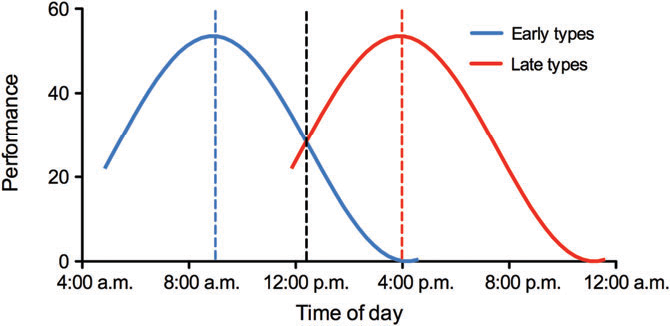
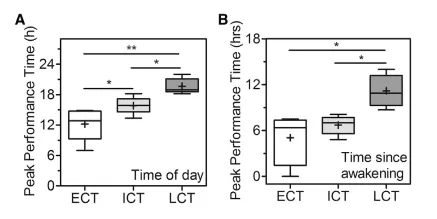

# Working Memory Capacity  

How does the performance on a computerized working memory capacity test differ depending on the time of test performance?   

*Working memory* is a limited cognitive system responsible for temporarily storing and updating information. It plays a critical role in various cognitive processes such as language comprehension, problem-solving, decision making, and learning.    

*Working memory capacity (WMC)* refers to an individual's ability to hold and update a limited amount of information in working memory. It is associated to a wide range of cognitive abilities, including fluid intelligence, learning, and academic achievement. WMC is typically assessed through a variety of standardized tests that require participants to hold and update information in working memory, such as the *n-back task*.   

WMC is often collected as a control variable / additional variable in research studies. The timing of the test often differs between participant groups (in this case school classes). Nevertheless, performance is often crucial for further analyses. Does the timing of data collection affect performance on an n-back task?

# Data

## Intervention Study

The *FeedBook* is an intelligent tutoring system for second language aquisition. Used in seventh grade English classes, FeedBook is capable of providing automated, individualized, scaffolded feedback on incorrectly completed tasks within the system.   

The data provided were collected as part of the [*Interact4School*](https://interact4school.de/) intervention study. In Interact4School, a new version of a previously tested FeedBook ([Meurers et al., 2019](https://doi.org/10.1017/S0267190519000126)) is examined, in which the original web-based English workbook has been expanded to include critical feedback and motivational elements. To evaluate the effects of the intervention, several types of data (i.e., language proficiency tests, surveys, short questionaires, logfiles, interviews) were collected during the school year 2021/2022 ([Parrisius et al., 2022](https://doi.org/10.23668/psycharchives.8152)). This project will have a closer look on the data from the working memory capacity test administered at data collection timepoint 4 of 5.   

## Working Memory Capacity Test

The working memory capacity test is a self programmed **n-back task**. The test consisted of three tasks which differed in their cognitive load. More precisely, this n-back task was divided in 1-back, 2-back, and 3-back. The stimuli were 20 uppercase letters, excluding vocals and the letter X. One of six randomly chosen sequence of letters was shown on the screen, where only one letter appeared at a time.   
Below the stimulus, a button was displayed. Each task was preceded by instructions, an example sequence of 10 trials with 2 matching letters (20% targets), followed by 60 task trials including 20 matching letters (30% targets). The first task (1-back) was to press the button everytime a presented letter was the same as the previous letter. In the second task (2-back), participants had to press the button if the presented letter matched the one presented two trials before. The third task was a 3-back, where the presented letter had to match the one presented three trials before.    
The letters were presented 500 milliseconds and the inter-stimulus duration, in which participants were able to press the button, was 2500 milliseconds. The collected data contains information about reaction time and response (i. e., whether the button was clicked or not).    

## Data Set

The data set contains the following variables:    

| Variable | Information |
| :--: | :--- |
| `SID` | student ID |
| `timestamp` | timestamp of start of trial |
| `trial_index` | number of trial (0-221) |
| `trial_type` | type of trial (html-button-response, survey-multi-choice) |
| `stim` | stimulus presented on screen |
| `response` | response given to stimulus (none, button clicked, survey choice) |
| `rt` | response time |
| `time_elapsed` | time passed since the start of the test |
: Variables contained in dataset

## Data Preparation

**Timestamp**   
The timestamp is a number in Unix format. It shows the time as a running total of seconds since the Unix epoch on January 1, 1970 in UTC ([unixtimestamp.com](https://www.unixtimestamp.com/)). In our case, the timestamp also includes milliseconds. If this additional information causes problems during data preparation, the last three digits of each timestamp should be removed.    

**Performance**   
Performance can be measured as *accuracy* and *efficiency*. In order to calculate accuracy, the correctness of each trial has to be calculated first. For the calculation you have to know with which letter the respective stimulus has to be compared, if a trial is a target trial and if the button was clicked or not clicked correctly in each case. Efficiency refers to high accuracy in a short time.   

**Test Levels**   
The n-back task consists of three levels. The following overview is intended to make working with the data set easier:

| Trial Index | Type of Trial |
| :--: | :--- |
| 0 | instruction |
| 1 | multiple choice survey about the device used |
| 2-3 | instruction |
| 4-13 | 1-back example |
| 14 | instruction |
| 15-74 | **1-back task** |
| 75-76 | instruction |
| 77-86 | 2-back example |
| 87 | instruction |
| 88-147 | **2-back task** |
| 148-149 | instruction |
| 150-159 | 3-back example |
| 160 | instruction |
| 161-220 | **3-back task** |
: Types of Trial

# Visualization Goals

To visualize the differences in performance depending on the time of day, a graph like the following can be useful:   

```{r figure-1,echo=FALSE, fig.cap='**Figure 1.** Interaction effect between chronotype and time of day on school grades based on the daily variation in (cognitive) performance in early (blue curve) and late (red curve) chronotypes ([Zerbini, 2017](https://doi.org/10.1002/pchj.178))', out.width='60%'}

```


To investigate whether there are differences between the levels of the test , the following figure can serve as a template:   

```{r figure-2,echo=FALSE, fig.cap='**Figure 2.** Peak Performance Times as Functions of Time of Day expressed as real-time (A) and Time since Entrained Awakening expressed as relative time since entrained (B) between different chronotypes ([Carbone, 2019](https://vitruve.fit/blog/time-in-training-performance/))', out.width='60%'}

```   


Some changes.

