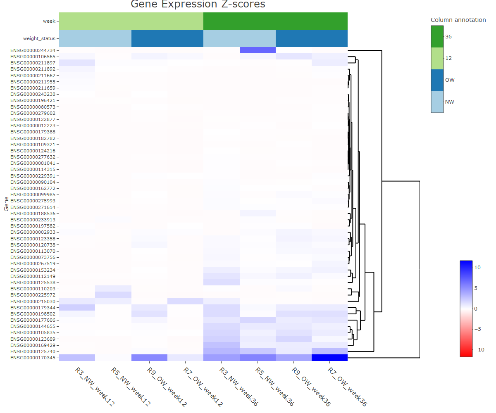

```{r setup, include=FALSE}

knitr::opts_chunk$set(echo = FALSE)
library(readxl)
library(knitr)
library(tidyverse)
library(kableExtra)
library(png)
library(httr)
library(ggimage)
library(patchwork)  
library(grid)
library(ggrepel)
library(fs)
library(heatmaply)
library(htmlwidgets)


```

```{r Csv, warning=FALSE, message=FALSE}
if (!is.null(current_input())) {
  rmd_dir <- path_dir(current_input())
} else {
  rmd_dir <- getwd()
}

count_data_all  <- read_csv("GSE273780_EukmRNAseq_counts.csv")
```


These are the samples, I have chosen for this task.


```{r samples, warning=FALSE, message=FALSE}


sample_selection <- tibble(
  sample = c("G38", "G49", "G83", "G61", "G34", "G41", "G90", "G84"),
  week = rep(c("12","36"), each = 4), 
  replicate = rep(c(3,5,9,7), times = 2),
  weight_status = rep(c("NW", "NW", "OW", "OW"), times = 2)
)


sample_table<-kable(sample_selection, caption = "Selection of the samples", align = "lccc")
print(sample_table)

```


```{r data_sample, warning=FALSE, message=FALSE}
rename_cols <- setNames(
  paste0(
    "R", sample_selection$replicate, "_",
    sample_selection$weight_status, "_week", 
    sample_selection$week
  ),
  sample_selection$sample
)
```

## Code for the data adjustment

```{r data_adjustment, warning=FALSE, message=FALSE, echo=TRUE}
count_data_sel <- count_data_all %>% 
  select(all_of(c("Row.names", sample_selection$sample))) %>%
  rename(gene_code = "Row.names") %>%
  rename_with(~ rename_cols[.x], .cols = sample_selection$sample) %>%
  pivot_longer(-gene_code, names_to = "sample", values_to = "count") %>%
  filter(!is.na(gene_code) & gene_code != "") %>%
  filter(count > 2) %>%
  group_by(sample) %>%
  mutate(counts_total = sum(count, na.rm = TRUE), 
         counts_norm = (count / counts_total) * 10**6,
         counts_norm_log2 = log2(counts_norm +1),
         z_value = scale(counts_norm)[, 1]
         ) %>%
  ungroup() %>%
  group_by(gene_code) %>%
  mutate(variance = var(counts_norm_log2, na.rm = TRUE)) %>%
  ungroup()


```

```{r Heatmap, warning=FALSE, message=FALSE}
top_genes <- count_data_sel %>%
  group_by(gene_code) %>%
  filter(n() == 8) %>%       # i just want to have complete sets, so i have no NA-values, because there were a few otherwise, maybe you could comment if thats ok or if i shall include all in my analysis
  ungroup() %>%
  distinct(gene_code, variance) %>%
  slice_max(variance, n = 50) 


heatmap_data <- count_data_sel %>%
  filter(gene_code %in% top_genes$gene_code) %>%
  select(gene_code, sample, z_value) %>%
  pivot_wider(names_from = sample, values_from = z_value) %>%
  column_to_rownames(var = "gene_code") %>%
  as.matrix()


max_abs <- max(abs(heatmap_data), na.rm = TRUE)

sample_info <- sample_selection %>%
  mutate(sample_name = paste0("R", replicate, "_", weight_status, "_week", week)) %>%
  select(sample_name, weight_status, week) %>%
  mutate(weight_status = factor(weight_status), week = factor(week)) %>%
  column_to_rownames("sample_name") %>%
  as.data.frame()

annotation_colors <- list(
  weight_status = c("NW" = "yellow", "OW" = "orange"),
  week = c("12" = "lightgrey", "36" = "darkgray")
)


#vline_pos <- length(sample_selection$sample[sample_selection$week == "12"]) + 0.5
```

## Code for the Visualisation


```{r Heatmap_ceation, warning=FALSE, message=FALSE, echo=TRUE}


p <- heatmaply(
  heatmap_data,
  dendrogram = "row",                      
  xlab = "Sample", ylab = "Gene",
  main = "Gene Expression Z-scores",
  scale = "none",                          
  grid_color = "grey",
  grid_width = 0.00001,
  titleX = FALSE,
  branches_lwd = 0.3,
  label_names = c("Gene", "Sample", "Z-value"),
  fontsize_row = 11, fontsize_col = 15,
  labCol = colnames(heatmap_data),
  labRow = rownames(heatmap_data),
  colors = colorRampPalette(c("red", "white", "blue"))(256),
  limits = c(-max_abs, max_abs),
  col_side_colors = sample_info[colnames(heatmap_data), , drop = FALSE],
  #col_side_palette = annotation_colors,  ## i don't know, why this does not work
  heatmap_layers = list(
      theme(
      legend.text = element_text(size = 20),      
      legend.title = element_text(size = 22),
      legend.position = "bottom"
    )),
  plot_method = "plotly"
)
```

## Visualisation

```{r Heatmap_storage, warning=FALSE, message=FALSE}
#vline_pos <- sum(sample_selection$week == "12") + 0.5

# Add vertical line using plotly::layout()
p <- plotly::layout(p, shapes = list(
   list(type="line",
    x0 = 0.4,
    x1 = 0.4,
    y0 = 0,
    y1 = 0.99,
    xref = "paper",
    yref = "paper",
    xsizemode="pixel",
    ysizemode="pixel",
    yanchor="top",
    xanchor="center"
  )
))
#p <- plotly::layout(p, legend = list(
 # font = list(
   # size = 20 , color="red"       
  #),
 # title = list(
 #   font = list(size = 22)  #  Legend title size
 # )
#))

p <- plotly::layout(p, title = list(
  text = "Gene Expression Z-scores",
  x = 0.4,               
  xanchor = "center",   
  y=1,
  yanchor = "top",
  font = list(size = 25) 
))

saveWidget(p, "heatmap_interactive.html", selfcontained = TRUE)

webshot::webshot("heatmap_interactive.html", "heatmap_static.png", vwidth = 1200, vheight = 1000)


```

<br>
For the interactive heatmap, click [here](heatmap_interactive.html).
!HTML isnot rendered, so you won't see an interactive Map!