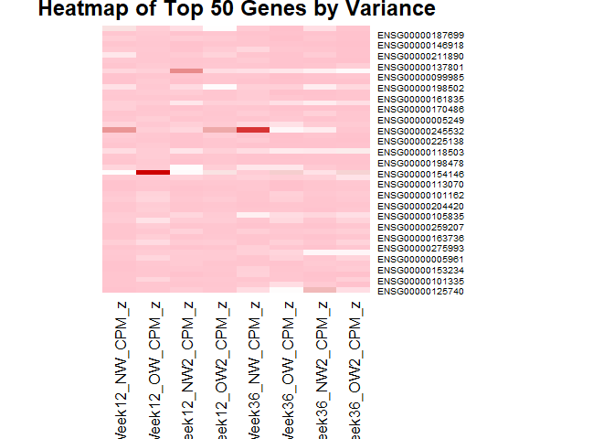

## Data manipulation

Import the data

    library(dplyr)
    library(tidyverse)
    library(kableExtra)

    data <- read.csv("GSE273780_EukmRNAseq_counts.csv")
    head(data)

    ##   X       Row.names  G58   G52  G25   G84    G2  G60   G41   G36   G73   G79
    ## 1 1 ENSG00000000003   23     0   23     7    14   18    15     3     0    12
    ## 2 2 ENSG00000000005    0     0    0     0     0    0     0     0     0     0
    ## 3 3 ENSG00000000419  469   348  494   334   567  616   342   383   363   409
    ## 4 4 ENSG00000000457  196   198  403   202   382  166   240   168   124   244
    ## 5 5 ENSG00000000460   40    45   82    38    70   36    40    26    33    52
    ## 6 6 ENSG00000000938 9567 14297 8058 13908 10128 6291 14438 10547 10985 15057
    ##     G74   G90   G31   G46   G83   G89   G67   G28   G55   G26   G63   G69   G87
    ## 1     5     4    11    19     8     3     8    16    24    10    27    16     3
    ## 2     0     0     0     0     0     0     0     0     0     0     0     0     0
    ## 3   402   317   382   387   443   424   444   632   813   373  1247   375   290
    ## 4   245   137   205   193   313   236   297   270   559   295   455   179   191
    ## 5    73    21    29    29    66    68    68    54   119    60   107    40    60
    ## 6 17799 13046 11323 11466 12620 23353 15412 13253 15210 12301 19379 17768 19190
    ##     G48  G35   G42   G77   G38  G45   G32   G64   G80   G88   G11  G66   G54
    ## 1    16   23     4     5    16    6    14     4     7     3    34   15    15
    ## 2     0    0     0     0     0    0     0     0     0     0     0    0     0
    ## 3   387  443   345   470   555  399   480   557   418   298  1024  386   530
    ## 4   187  165   213   340   356  326   388   261   297   165   633  190   306
    ## 5    28   23    40    71    78   90    84    65    37    33   132   22    65
    ## 6 11581 7793 13080 29079 14459 9630 14931 12419 17088 18538 52130 9577 15986
    ##     G75   G30   G40  G78   G72   G59   G61   G9   G85   G81   G65  G12   G57
    ## 1     1     3    24    8     7    16    27   13     0    18    11    6     1
    ## 2     0     0     0    0     0     0     0    0     0     0     0    0     0
    ## 3   359   450   422  362   417   468   589  631   319   426   473  372   374
    ## 4   265   278   385  290   195   253   309  400   133   253   306  192   271
    ## 5    84    61    69   75    35    82    53   99    24    49    96   54    37
    ## 6 15436 13094 14061 9874 12515 11256 12136 8428 15919 14224 13083 8108 12489
    ##     G76  G44   G43   G34   G49   G50   G27   G68  G86   G62 hgnc_symbol
    ## 1     4   21    18     2    15     0     7     4   12    13      TSPAN6
    ## 2     0    0     0     0     0     0     0     0    0     0        TNMD
    ## 3   390  518   426   389   483   375   525   435  460   514        DPM1
    ## 4   251  327   309   153   317   246   281   329  194   272       SCYL3
    ## 5    38  110    92    26    47    64    58    47   48    53    C1orf112
    ## 6 16111 9555 11428 12809 10459 19620 13108 15107 7133 12090         FGR
    ##                                                                                      description
    ## 1                                              tetraspanin 6 [Source:HGNC Symbol;Acc:HGNC:11858]
    ## 2                                                tenomodulin [Source:HGNC Symbol;Acc:HGNC:17757]
    ## 3 dolichyl-phosphate mannosyltransferase subunit 1, catalytic [Source:HGNC Symbol;Acc:HGNC:3005]
    ## 4                                   SCY1 like pseudokinase 3 [Source:HGNC Symbol;Acc:HGNC:19285]
    ## 5                        chromosome 1 open reading frame 112 [Source:HGNC Symbol;Acc:HGNC:25565]
    ## 6              FGR proto-oncogene, Src family tyrosine kinase [Source:HGNC Symbol;Acc:HGNC:3697]
    ##   chromosome_name strand external_gene_name
    ## 1               X     -1             TSPAN6
    ## 2               X      1               TNMD
    ## 3              20     -1               DPM1
    ## 4               1     -1              SCYL3
    ## 5               1      1           C1orf112
    ## 6               1     -1                FGR

Filter out the count data of the following columns (G25, G26, G27, G30,
G9, G12, G32, G45). Rename the columns.

<table>
<thead>
<tr class="header">
<th>Time point</th>
<th>Normal weight</th>
<th>Overweight</th>
</tr>
</thead>
<tbody>
<tr class="odd">
<td>week 12</td>
<td>G25</td>
<td>G27</td>
</tr>
<tr class="even">
<td>week 12</td>
<td>G26</td>
<td>G30</td>
</tr>
<tr class="odd">
<td>week 36</td>
<td>G9</td>
<td>G32</td>
</tr>
<tr class="even">
<td>week 36</td>
<td>G12</td>
<td>G45</td>
</tr>
</tbody>
</table>

    filtered_data <- data %>%
      select(Row.names, G25, G26, G27, G30, G9, G12, G32, G45) %>%
      rename(Gene = Row.names, 
             Week12_NW = G25, 
             Week12_OW = G26, 
             Week12_NW2 = G27, 
             Week12_OW2 = G30, 
             Week36_NW = G9, 
             Week36_OW = G12, 
             Week36_NW2 = G32, 
             Week36_OW2 = G45)

Normalize the data from counts to counts per million (add up all the
counts per sample and divide each sample by this, then multiply by
1.000.000). log2 transformation of the counts per million to make the
data more symmetric.

    count_columns <- names(filtered_data)[startsWith(names(filtered_data), "Week")]

    total_counts_per_replicate <- colSums(filtered_data[, count_columns], na.rm = TRUE)

    for (i in count_columns) {
      new_col <- paste0(i, "_cpm")
      filtered_data[[new_col]] <- filtered_data[[i]] / total_counts_per_replicate[i] * 1e6
    }

    normalized_log2_data <- filtered_data %>%
      mutate(across(ends_with("_CPM"), ~ log2(. + 1), .names = "{.col}_log2"))

Drop any rows with blank names and count values between 0 and 2.

    normalized_log2_data <- normalized_log2_data %>%
      filter(!is.na(Gene) & Gene != "") %>%
      rowwise() %>%
      filter(all(c_across(ends_with("_log2")) >= 2)) %>%
      ungroup()

Calculate the z-Value of each count in new columns by subtracting the
normalized count value by the mean of the column and divide by the
columns standard deviation.

    heatmap_data <- normalized_log2_data %>%
      mutate(across(
        ends_with("_CPM"),
        ~ (. - mean(., na.rm = TRUE)) / sd(., na.rm = TRUE),
        .names = "{.col}_z"
      ))

    heatmap_data %>%
      select(Gene, ends_with("_CPM_z")) %>%
      head(10)

    ## # A tibble: 10 × 9
    ##    Gene        Week12_NW_cpm_z Week12_OW_cpm_z Week12_NW2_cpm_z Week12_OW2_cpm_z
    ##    <chr>                 <dbl>           <dbl>            <dbl>            <dbl>
    ##  1 ENSG000000…         -0.196          -0.124            -0.150          -0.134 
    ##  2 ENSG000000…         -0.211          -0.132            -0.180          -0.154 
    ##  3 ENSG000000…         -0.263          -0.155            -0.207          -0.178 
    ##  4 ENSG000000…          1.04            1.05              1.39            1.32  
    ##  5 ENSG000000…         -0.228          -0.123            -0.150          -0.135 
    ##  6 ENSG000000…         -0.197          -0.116            -0.166          -0.150 
    ##  7 ENSG000000…         -0.159          -0.0992           -0.163          -0.136 
    ##  8 ENSG000000…         -0.0648         -0.103            -0.162          -0.136 
    ##  9 ENSG000000…         -0.114          -0.0902           -0.102          -0.0935
    ## 10 ENSG000000…         -0.179          -0.138            -0.190          -0.153 
    ## # ℹ 4 more variables: Week36_NW_cpm_z <dbl>, Week36_OW_cpm_z <dbl>,
    ## #   Week36_NW2_cpm_z <dbl>, Week36_OW2_cpm_z <dbl>

Calculate the variance of the log2 transformed counts by rows and put it
in a new column.

    heatmap_data <- heatmap_data %>%
      rowwise() %>%
      mutate(log2_CPM_variance = var(c_across(ends_with("_log2")), na.rm = TRUE)) %>%
      ungroup()

    heatmap_data %>%
      select(Gene, log2_CPM_variance, ends_with("_CPM_z")) %>%
      head(10)

    ## # A tibble: 10 × 10
    ##    Gene       log2_CPM_variance Week12_NW_cpm_z Week12_OW_cpm_z Week12_NW2_cpm_z
    ##    <chr>                  <dbl>           <dbl>           <dbl>            <dbl>
    ##  1 ENSG00000…            0.0961         -0.196          -0.124            -0.150
    ##  2 ENSG00000…            0.102          -0.211          -0.132            -0.180
    ##  3 ENSG00000…            0.0806         -0.263          -0.155            -0.207
    ##  4 ENSG00000…            0.0794          1.04            1.05              1.39 
    ##  5 ENSG00000…            0.0685         -0.228          -0.123            -0.150
    ##  6 ENSG00000…            0.106          -0.197          -0.116            -0.166
    ##  7 ENSG00000…            0.162          -0.159          -0.0992           -0.163
    ##  8 ENSG00000…            0.296          -0.0648         -0.103            -0.162
    ##  9 ENSG00000…            0.0331         -0.114          -0.0902           -0.102
    ## 10 ENSG00000…            0.428          -0.179          -0.138            -0.190
    ## # ℹ 5 more variables: Week12_OW2_cpm_z <dbl>, Week36_NW_cpm_z <dbl>,
    ## #   Week36_OW_cpm_z <dbl>, Week36_NW2_cpm_z <dbl>, Week36_OW2_cpm_z <dbl>

## Data visualization

    heatmap_data <- heatmap_data %>%
      select(Gene, log2_CPM_variance, ends_with("_CPM_z")) %>%
      arrange(desc(log2_CPM_variance)) %>%
      slice_head(n = 50)

    heatmap_matrix <- heatmap_data %>%
      column_to_rownames("Gene") %>%
      select(-log2_CPM_variance) %>%
      as.matrix()

    heatmap(heatmap_matrix,
      scale = "column",
      Rowv = NA,
      Colv = NA,
      col = colorRampPalette(c("pink", "white", "red3"))(100),
      margins = c(10, 10),
      main = "Heatmap of Top 50 Genes by Variance"
    )

#### Conclusion

Even though the heatmap is still very simple, it is interesting to see
that some genes have different expressions between the groups, which
also have a temporal component.
