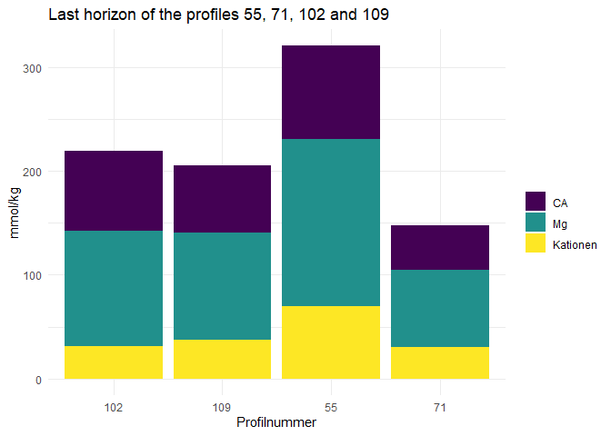
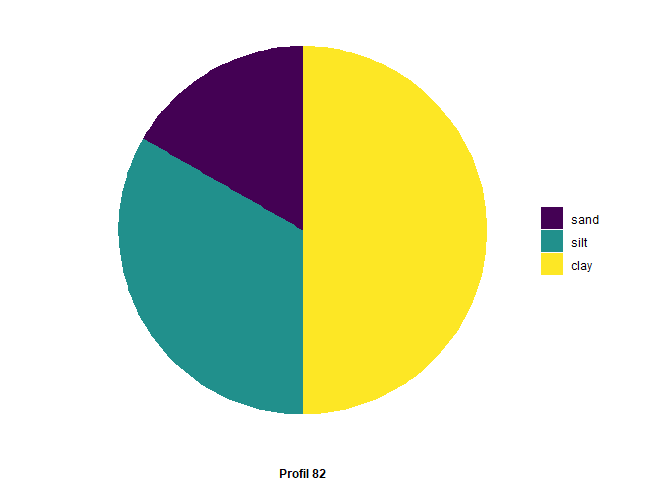

# Solution for Soil Data Project

    # get data from .csv
    soilData <- read_delim("SoilData.csv", delim = ";", col_types = list(.default = col_character()),
    escape_double = FALSE,  trim_ws = TRUE)

## 1. Data cleanup

**1.1 the column KAKpot2** is not needed

    # delete column KAKpot2
      soilData <- subset(soilData, select=-c(`KAKpot 2`))

**1.2 the header** displays numbers which do not make much sense. I
would like to get rid of them by using rename\_with() in combination
with regular expressions.

    # delete numbers at end of column names
    soilData <- rename_with(soilData , .fn=str_replace, pattern = "_\\d*", replacement='')

**1.3 there is a second header** with the respective units. Leaving this
line will interfere with the datatype in R, that’s why I want to delete
this line and instead integrate the unit into the header such like this:
Tiefe\_
*c**m*
. For this dataset you will need to work with backticks. If you are not
familiar with them, you can read about them
[here](https://jhudatascience.org/intro_to_r/resources/quotes_vs_backticks.html).
Also, the function scan() could be useful (depending on your aproach)
because it enables you to read for example specific data rows directly
from the source file.

     # add units to header 
     colnames(soilData)   <- paste(colnames(soilData), soilData[1,], sep = "_")

     # clean header columns without units of unnecessary characters
     colnames(soilData) <- gsub(("_\\[\\]"), "", colnames(soilData))
     
     # Replace whitespace in between header parts for "_"
     colnames(soilData) <- str_replace_all(colnames(soilData), '([:alpha:]+)(\\s)([:upper:][:lower:]+)', '\\1_\\3')
     
     # clean header columns of unnecessary whitespaces
     colnames(soilData) <- gsub(("\\s"), "", colnames(soilData))

    # delete first row
     soilData <- soilData[-c(1),]

**1.4 there is a typo in the column “Expozition”**. It should actually
be “Exposition”

    names(soilData)[names(soilData) == "Expozition"] <- "Exposition"

**1.5 99999 and 99999,99 are the NA values**, but R does not know this,
so all these values need to be set to NA. It should be noted that some
of these NA values might be actual numbers, but some might also be of
datatype character.

    # uncertain if this ignores cases depending on the data type but the result looks like it worked
    soilData[soilData=="99999" | soilData=="99999,99" ] <- NA

**1.6 two columns need to be calculated**: base\_saturation\_
%
by dividing “Kationen” by “KAKpot” and SOM\_
%
by multiplying Corg with 1,72

    # convert numbers to use "." instead of ","
    soilData <- as.data.frame(sapply(soilData, gsub,pattern=",", replacement="."))
    soilData <- soilData %>%
      mutate(`base_saturation_[%]` = round(as.numeric(`Kationen_[mmol/kg]`)/as.numeric(`KAKpot_[mmol/kg]`), digits=2)) %>%
      mutate(`SOM_[%]` = round(as.numeric(`Corg_[%]`)*1.72, digits=2))

**1.7 Column S+U+T is not always 100%**. I would like to see how often I
got more, less and exactly 100%. Write a new column and put in “more”,
“less” and “exactly” depending on the value in the column S+U+T. Then,
write a query that counts and prints the number of values (for example
“10x less than 100%, 3x exactly 100% and 24x more than 100%”)

    #TODO

## Dataset after Cleanup

<table>
<caption>Table: SoilData.csv</caption>
<colgroup>
<col style="width: 6%" />
<col style="width: 2%" />
<col style="width: 2%" />
<col style="width: 3%" />
<col style="width: 5%" />
<col style="width: 2%" />
<col style="width: 2%" />
<col style="width: 3%" />
<col style="width: 3%" />
<col style="width: 2%" />
<col style="width: 2%" />
<col style="width: 3%" />
<col style="width: 3%" />
<col style="width: 3%" />
<col style="width: 3%" />
<col style="width: 5%" />
<col style="width: 5%" />
<col style="width: 2%" />
<col style="width: 2%" />
<col style="width: 2%" />
<col style="width: 1%" />
<col style="width: 2%" />
<col style="width: 2%" />
<col style="width: 2%" />
<col style="width: 1%" />
<col style="width: 2%" />
<col style="width: 2%" />
<col style="width: 1%" />
<col style="width: 2%" />
<col style="width: 2%" />
<col style="width: 5%" />
<col style="width: 2%" />
</colgroup>
<thead>
<tr class="header">
<th style="text-align: left;">Labornummer_Tübingen</th>
<th style="text-align: left;">Profil</th>
<th style="text-align: left;">Horizont</th>
<th style="text-align: left;">Tiefe_[cm]</th>
<th style="text-align: left;">Horizontbezeichnung</th>
<th style="text-align: left;">East</th>
<th style="text-align: left;">North</th>
<th style="text-align: left;">Neigung_[%]</th>
<th style="text-align: left;">Exposition</th>
<th style="text-align: left;">Corg_[%]</th>
<th style="text-align: left;">CaCO3_[%]</th>
<th style="text-align: left;">Ca_[mmol/kg]</th>
<th style="text-align: left;">Mg_[mmol/kg]</th>
<th style="text-align: left;">K_[mmol/kg]</th>
<th style="text-align: left;">Na_[mmol/kg]</th>
<th style="text-align: left;">Kationen_[mmol/kg]</th>
<th style="text-align: left;">KAKpot_[mmol/kg]</th>
<th style="text-align: left;">gS_[%]</th>
<th style="text-align: left;">mS_[%]</th>
<th style="text-align: left;">fS_[%]</th>
<th style="text-align: left;">S_[%]</th>
<th style="text-align: left;">gU_[%]</th>
<th style="text-align: left;">mU_[%]</th>
<th style="text-align: left;">fU_[%]</th>
<th style="text-align: left;">U_[%]</th>
<th style="text-align: left;">gT_[%]</th>
<th style="text-align: left;">mT+fT_[%]</th>
<th style="text-align: left;">T_[%]</th>
<th style="text-align: left;">S+U+T_[%]</th>
<th style="text-align: left;">Bodenart</th>
<th style="text-align: right;">base_saturation_[%]</th>
<th style="text-align: right;">SOM_[%]</th>
</tr>
</thead>
<tbody>
<tr class="odd">
<td style="text-align: left;">50300</td>
<td style="text-align: left;">2</td>
<td style="text-align: left;">1</td>
<td style="text-align: left;">5</td>
<td style="text-align: left;">Aeh</td>
<td style="text-align: left;">498818</td>
<td style="text-align: left;">5380428</td>
<td style="text-align: left;">0</td>
<td style="text-align: left;">NA</td>
<td style="text-align: left;">3.99</td>
<td style="text-align: left;">0</td>
<td style="text-align: left;">20.56</td>
<td style="text-align: left;">3.79</td>
<td style="text-align: left;">1.12</td>
<td style="text-align: left;">0.50</td>
<td style="text-align: left;">25.46</td>
<td style="text-align: left;">110.85</td>
<td style="text-align: left;">40.86</td>
<td style="text-align: left;">27.71</td>
<td style="text-align: left;">10.97</td>
<td style="text-align: left;">79.50</td>
<td style="text-align: left;">3.40</td>
<td style="text-align: left;">5.60</td>
<td style="text-align: left;">4.00</td>
<td style="text-align: left;">13.00</td>
<td style="text-align: left;">3.60</td>
<td style="text-align: left;">3.70</td>
<td style="text-align: left;">7.30</td>
<td style="text-align: left;">99.80</td>
<td style="text-align: left;">Sl2</td>
<td style="text-align: right;">0.23</td>
<td style="text-align: right;">6.86</td>
</tr>
<tr class="even">
<td style="text-align: left;">50301</td>
<td style="text-align: left;">2</td>
<td style="text-align: left;">2</td>
<td style="text-align: left;">26</td>
<td style="text-align: left;">Bv</td>
<td style="text-align: left;">498818</td>
<td style="text-align: left;">5380428</td>
<td style="text-align: left;">0</td>
<td style="text-align: left;">NA</td>
<td style="text-align: left;">0.13</td>
<td style="text-align: left;">0</td>
<td style="text-align: left;">0.05</td>
<td style="text-align: left;">0.41</td>
<td style="text-align: left;">0.25</td>
<td style="text-align: left;">0.50</td>
<td style="text-align: left;">0.50</td>
<td style="text-align: left;">33.14</td>
<td style="text-align: left;">57.34</td>
<td style="text-align: left;">19.04</td>
<td style="text-align: left;">6.72</td>
<td style="text-align: left;">83.10</td>
<td style="text-align: left;">2.50</td>
<td style="text-align: left;">3.50</td>
<td style="text-align: left;">3.30</td>
<td style="text-align: left;">9.30</td>
<td style="text-align: left;">3.40</td>
<td style="text-align: left;">4.10</td>
<td style="text-align: left;">7.50</td>
<td style="text-align: left;">99.90</td>
<td style="text-align: left;">St2</td>
<td style="text-align: right;">0.02</td>
<td style="text-align: right;">0.22</td>
</tr>
<tr class="odd">
<td style="text-align: left;">50302</td>
<td style="text-align: left;">2</td>
<td style="text-align: left;">3</td>
<td style="text-align: left;">40</td>
<td style="text-align: left;">II Bv</td>
<td style="text-align: left;">498818</td>
<td style="text-align: left;">5380428</td>
<td style="text-align: left;">0</td>
<td style="text-align: left;">NA</td>
<td style="text-align: left;">0.70</td>
<td style="text-align: left;">0</td>
<td style="text-align: left;">0.05</td>
<td style="text-align: left;">0.10</td>
<td style="text-align: left;">0.25</td>
<td style="text-align: left;">0.50</td>
<td style="text-align: left;">0.50</td>
<td style="text-align: left;">49.16</td>
<td style="text-align: left;">33.65</td>
<td style="text-align: left;">30.71</td>
<td style="text-align: left;">10.37</td>
<td style="text-align: left;">74.72</td>
<td style="text-align: left;">3.70</td>
<td style="text-align: left;">6.10</td>
<td style="text-align: left;">5.30</td>
<td style="text-align: left;">15.10</td>
<td style="text-align: left;">4.30</td>
<td style="text-align: left;">5.70</td>
<td style="text-align: left;">10.00</td>
<td style="text-align: left;">99.82</td>
<td style="text-align: left;">Sl3</td>
<td style="text-align: right;">0.01</td>
<td style="text-align: right;">1.20</td>
</tr>
<tr class="even">
<td style="text-align: left;">50303</td>
<td style="text-align: left;">2</td>
<td style="text-align: left;">4</td>
<td style="text-align: left;">58</td>
<td style="text-align: left;">III Sd-P-lCv</td>
<td style="text-align: left;">498818</td>
<td style="text-align: left;">5380428</td>
<td style="text-align: left;">0</td>
<td style="text-align: left;">NA</td>
<td style="text-align: left;">0.14</td>
<td style="text-align: left;">0</td>
<td style="text-align: left;">58.55</td>
<td style="text-align: left;">40.37</td>
<td style="text-align: left;">2.14</td>
<td style="text-align: left;">0.50</td>
<td style="text-align: left;">101.07</td>
<td style="text-align: left;">143.74</td>
<td style="text-align: left;">21.17</td>
<td style="text-align: left;">23.79</td>
<td style="text-align: left;">9.44</td>
<td style="text-align: left;">54.40</td>
<td style="text-align: left;">1.50</td>
<td style="text-align: left;">2.20</td>
<td style="text-align: left;">2.50</td>
<td style="text-align: left;">6.20</td>
<td style="text-align: left;">4.20</td>
<td style="text-align: left;">35.10</td>
<td style="text-align: left;">39.30</td>
<td style="text-align: left;">99.90</td>
<td style="text-align: left;">Ts3</td>
<td style="text-align: right;">0.70</td>
<td style="text-align: right;">0.24</td>
</tr>
<tr class="odd">
<td style="text-align: left;">50304</td>
<td style="text-align: left;">2</td>
<td style="text-align: left;">5</td>
<td style="text-align: left;">90</td>
<td style="text-align: left;">III lCv</td>
<td style="text-align: left;">498818</td>
<td style="text-align: left;">5380428</td>
<td style="text-align: left;">0</td>
<td style="text-align: left;">NA</td>
<td style="text-align: left;">0.12</td>
<td style="text-align: left;">0</td>
<td style="text-align: left;">122.43</td>
<td style="text-align: left;">75</td>
<td style="text-align: left;">0.25</td>
<td style="text-align: left;">0.50</td>
<td style="text-align: left;">197.43</td>
<td style="text-align: left;">212.45</td>
<td style="text-align: left;">8</td>
<td style="text-align: left;">7.28</td>
<td style="text-align: left;">10.78</td>
<td style="text-align: left;">26.06</td>
<td style="text-align: left;">3.90</td>
<td style="text-align: left;">9.30</td>
<td style="text-align: left;">14.70</td>
<td style="text-align: left;">27.90</td>
<td style="text-align: left;">14.20</td>
<td style="text-align: left;">31.80</td>
<td style="text-align: left;">46.00</td>
<td style="text-align: left;">99.96</td>
<td style="text-align: left;">Tl</td>
<td style="text-align: right;">0.93</td>
<td style="text-align: right;">0.21</td>
</tr>
<tr class="even">
<td style="text-align: left;">50305</td>
<td style="text-align: left;">2</td>
<td style="text-align: left;">6</td>
<td style="text-align: left;">100</td>
<td style="text-align: left;">IV elCn</td>
<td style="text-align: left;">498818</td>
<td style="text-align: left;">5380428</td>
<td style="text-align: left;">0</td>
<td style="text-align: left;">NA</td>
<td style="text-align: left;">0.04</td>
<td style="text-align: left;">0.81</td>
<td style="text-align: left;">143.19</td>
<td style="text-align: left;">77.98</td>
<td style="text-align: left;">0.25</td>
<td style="text-align: left;">0.50</td>
<td style="text-align: left;">221.17</td>
<td style="text-align: left;">221.25</td>
<td style="text-align: left;">5.90</td>
<td style="text-align: left;">3.40</td>
<td style="text-align: left;">5.70</td>
<td style="text-align: left;">15.00</td>
<td style="text-align: left;">3.50</td>
<td style="text-align: left;">13.60</td>
<td style="text-align: left;">19.60</td>
<td style="text-align: left;">36.70</td>
<td style="text-align: left;">17.20</td>
<td style="text-align: left;">30.40</td>
<td style="text-align: left;">47.60</td>
<td style="text-align: left;">99.30</td>
<td style="text-align: left;">Tu2</td>
<td style="text-align: right;">1.00</td>
<td style="text-align: right;">0.07</td>
</tr>
<tr class="odd">
<td style="text-align: left;">50315</td>
<td style="text-align: left;">5</td>
<td style="text-align: left;">1</td>
<td style="text-align: left;">5</td>
<td style="text-align: left;">Ah</td>
<td style="text-align: left;">498795</td>
<td style="text-align: left;">5380779</td>
<td style="text-align: left;">1</td>
<td style="text-align: left;">E</td>
<td style="text-align: left;">4.69</td>
<td style="text-align: left;">0</td>
<td style="text-align: left;">9.59</td>
<td style="text-align: left;">2.49</td>
<td style="text-align: left;">0.64</td>
<td style="text-align: left;">0.50</td>
<td style="text-align: left;">12.71</td>
<td style="text-align: left;">152.26</td>
<td style="text-align: left;">16.61</td>
<td style="text-align: left;">32.35</td>
<td style="text-align: left;">13.49</td>
<td style="text-align: left;">62.50</td>
<td style="text-align: left;">5.10</td>
<td style="text-align: left;">6.10</td>
<td style="text-align: left;">6.70</td>
<td style="text-align: left;">17.90</td>
<td style="text-align: left;">6.60</td>
<td style="text-align: left;">13.20</td>
<td style="text-align: left;">19.80</td>
<td style="text-align: left;">100.20</td>
<td style="text-align: left;">Ls4</td>
<td style="text-align: right;">0.08</td>
<td style="text-align: right;">8.07</td>
</tr>
<tr class="even">
<td style="text-align: left;">50316</td>
<td style="text-align: left;">5</td>
<td style="text-align: left;">2</td>
<td style="text-align: left;">20</td>
<td style="text-align: left;">Bv</td>
<td style="text-align: left;">498795</td>
<td style="text-align: left;">5380779</td>
<td style="text-align: left;">1</td>
<td style="text-align: left;">E</td>
<td style="text-align: left;">0.91</td>
<td style="text-align: left;">0</td>
<td style="text-align: left;">7.09</td>
<td style="text-align: left;">2.55</td>
<td style="text-align: left;">0.25</td>
<td style="text-align: left;">0.50</td>
<td style="text-align: left;">9.64</td>
<td style="text-align: left;">86.33</td>
<td style="text-align: left;">18.78</td>
<td style="text-align: left;">26.12</td>
<td style="text-align: left;">12.39</td>
<td style="text-align: left;">57.30</td>
<td style="text-align: left;">4.50</td>
<td style="text-align: left;">6.20</td>
<td style="text-align: left;">8</td>
<td style="text-align: left;">18.70</td>
<td style="text-align: left;">7.80</td>
<td style="text-align: left;">16.40</td>
<td style="text-align: left;">24.20</td>
<td style="text-align: left;">100.20</td>
<td style="text-align: left;">Ls4</td>
<td style="text-align: right;">0.11</td>
<td style="text-align: right;">1.57</td>
</tr>
<tr class="odd">
<td style="text-align: left;">50317</td>
<td style="text-align: left;">5</td>
<td style="text-align: left;">3</td>
<td style="text-align: left;">47</td>
<td style="text-align: left;">II Swd-P-Bv</td>
<td style="text-align: left;">498795</td>
<td style="text-align: left;">5380779</td>
<td style="text-align: left;">1</td>
<td style="text-align: left;">E</td>
<td style="text-align: left;">0.44</td>
<td style="text-align: left;">0</td>
<td style="text-align: left;">128.22</td>
<td style="text-align: left;">27.04</td>
<td style="text-align: left;">0.25</td>
<td style="text-align: left;">0.50</td>
<td style="text-align: left;">155.26</td>
<td style="text-align: left;">207.79</td>
<td style="text-align: left;">2.41</td>
<td style="text-align: left;">26.98</td>
<td style="text-align: left;">4.74</td>
<td style="text-align: left;">34.13</td>
<td style="text-align: left;">1.70</td>
<td style="text-align: left;">2.50</td>
<td style="text-align: left;">4.30</td>
<td style="text-align: left;">8.50</td>
<td style="text-align: left;">8.10</td>
<td style="text-align: left;">49.10</td>
<td style="text-align: left;">57.20</td>
<td style="text-align: left;">99.83</td>
<td style="text-align: left;">Ts2</td>
<td style="text-align: right;">0.75</td>
<td style="text-align: right;">0.76</td>
</tr>
<tr class="even">
<td style="text-align: left;">50318</td>
<td style="text-align: left;">5</td>
<td style="text-align: left;">4</td>
<td style="text-align: left;">68</td>
<td style="text-align: left;">II elCv</td>
<td style="text-align: left;">498795</td>
<td style="text-align: left;">5380779</td>
<td style="text-align: left;">1</td>
<td style="text-align: left;">E</td>
<td style="text-align: left;">0.19</td>
<td style="text-align: left;">15.49</td>
<td style="text-align: left;">110.27</td>
<td style="text-align: left;">17.20</td>
<td style="text-align: left;">0.25</td>
<td style="text-align: left;">0.50</td>
<td style="text-align: left;">128.21</td>
<td style="text-align: left;">127.47</td>
<td style="text-align: left;">7.72</td>
<td style="text-align: left;">25.86</td>
<td style="text-align: left;">10.98</td>
<td style="text-align: left;">44.56</td>
<td style="text-align: left;">4.80</td>
<td style="text-align: left;">7.00</td>
<td style="text-align: left;">8.00</td>
<td style="text-align: left;">19.80</td>
<td style="text-align: left;">8.70</td>
<td style="text-align: left;">26.80</td>
<td style="text-align: left;">35.50</td>
<td style="text-align: left;">99.86</td>
<td style="text-align: left;">Lts</td>
<td style="text-align: right;">1.01</td>
<td style="text-align: right;">0.33</td>
</tr>
</tbody>
</table>

Table: SoilData.csv

# 2. Visualisation

**2.1 Stacked Barplot**

I would like to have a stacked barplot that shows the values for Ca, Mg
and Kationen of the **last** horizon of the profiles 55, 71, 102 and
109 - for every last horizon of these profiles in the data table one
stacked barplot. Here is an example for such an barplot. I would also
like to have the same colors as in the example plot (viridis).

    data <- soilData |> 
      filter(Profil == 55 | Profil == 71 | Profil == 102 | Profil == 109) |> 
      group_by(Profil) |> 
      filter(Horizont == max(Horizont)) |> 
      select( Profil, Horizont, Horizontbezeichnung, `Ca_[mmol/kg]`, `Mg_[mmol/kg]`, `Kationen_[mmol/kg]`)

    # change data to numeric values
    data$`Ca_[mmol/kg]` <- as.numeric(data$`Ca_[mmol/kg]`)
    data$`Mg_[mmol/kg]` <- as.numeric(data$`Mg_[mmol/kg]`)
    data$`Kationen_[mmol/kg]` <- as.numeric(data$`Kationen_[mmol/kg]`)

    # create long table for plotting
    dataPlot <- pivot_longer(data, cols = c(`Ca_[mmol/kg]`, `Mg_[mmol/kg]`, `Kationen_[mmol/kg]`), names_to = "group", values_to = "value")

    ggplot( dataPlot, aes(x=Profil, y= value, fill=group)) + 
      geom_bar(position = "stack", stat = "identity") +
    #  scale_colour_continuous(type=scale_fill_viridis_b()) +
      # TODO: color scale is not used in plot
      scale_color_viridis_d(option="viridis", aesthetics = "fill", labels=c("CA", "Mg", "Kationen"))+
      ggtitle("Last horizon of the profiles 55, 71, 102 and 109") +
      theme_minimal() +
      labs(fill = "") +
      ylab("mmol/kg") +
      xlab("Profilnummer")

**2.2 Piechart of grain sizes**  
Then I would like to have 3 piecharts of the “Ah” horizons of the
profiles 82, 111 and 134 next to each other where I can see the portion
of S (Sand), U (silt) and T (clay).

**Die Ausgabe mehrerer Plots nebeneinander funktioniert noch nicht**

    toDraw <- c(82, 111, 134)

    piechart <- function(profil){
      data <- soilData |> 
      filter(Profil == profil) |> 
      filter( str_detect("Ah", Horizontbezeichnung) )
      # select only relevant columns
      data <-  data |> 
      select( Profil, Horizont, Horizontbezeichnung, `S_[%]`, `U_[%]`, `T_[%]`)

      # create long table for plotting
      dataPlot <- pivot_longer(data, cols = c(`S_[%]`, `U_[%]`, `T_[%]`), names_to = "group", values_to = "value")

     # Compute the position of labels
      dataPlot <- dataPlot  |>  
       arrange(desc(group)) |> 
       mutate(prop = as.numeric(value) / sum(as.numeric(value)) *100) |> 
       mutate(ypos = cumsum(prop)- 0.5*prop )

      return (
        ggplot(dataPlot, aes(x="", y = c(group),  fill=group)) +
        geom_bar(stat="identity", width=1) +
        coord_polar("y", start=0) +
        #geom_text(aes(y = ypos, label = group), color = "white", size=6) +
        scale_color_viridis_d(option="viridis", aesthetics = "fill",
                              labels=c("sand", "silt", "clay")) +
        theme_void() +
        theme(plot.caption = element_text(hjust = 0.5, face = "bold")  ) +
        labs(fill="", 
             caption = str_c("Profil ", profil))
      )
    }

    # TODO: Ausgabe nebeneinander
     par(mfrow = c(1, 2))
    piechart(82)

    piechart(111)

     for(p in toDraw){
       piechart(p)
     }
