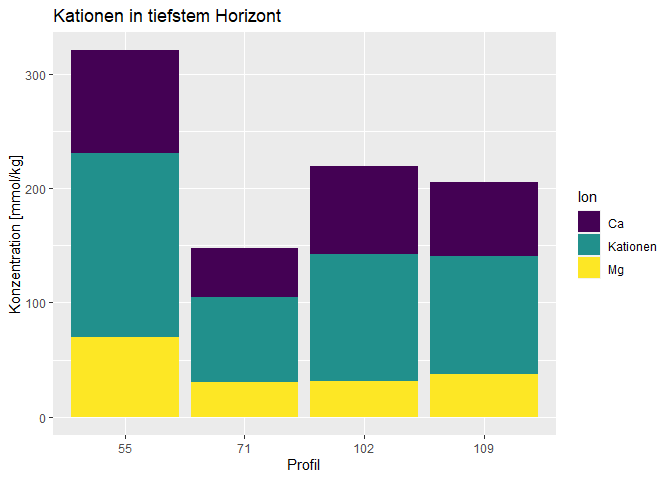
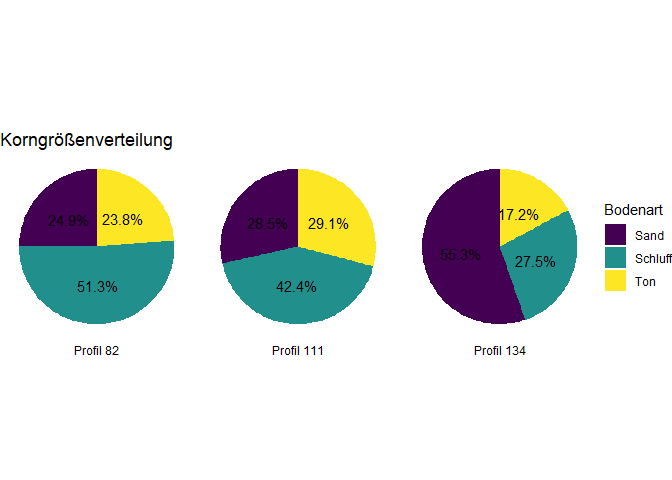
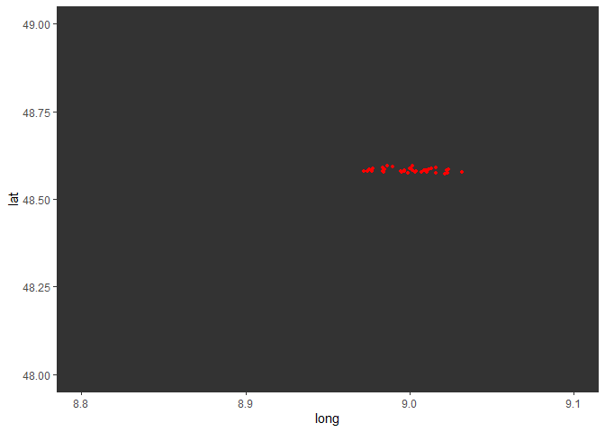

# (1) Data import and clean up

    # read file
    soilData <-
      read_delim("SoilData.csv",
                 delim=";",
                # (1.5) deal with NA values
                na = c("","NA","99999","99999,99"),
                show_col_types  = F) |>
      # (1.1) drop KAKpot2 column
      select(-`KAKpot 2`) |>
      # (1.2) drop numbers in column names
      rename_with(~str_replace(., "_\\d+$", ""))

    soilDataHeader <-
      soilData |>
      # get unit information
      slice(1) |>
      # join unit and column information rowwise
      pivot_longer(cols = everything(), names_to = "col", values_to = "unit") |>
      # (1.4) fix typo in header
      mutate(col = ifelse(col == "Expozition","Exposition",col)) |>
      # (1.3) append unit to column name if not empty
      transmute(
        header = str_c(
          str_trim(col),
          ifelse(str_detect(unit, "^\\s*\\[\\s*\\]\\s*$"),"","_"),
          ifelse(str_detect(unit, "^\\s*\\[\\s*\\]\\s*$"),"",str_remove_all(unit,"\\s"))
          )) |>
      pull(header)

    # cleanup data
    soilDataRefined <-
      soilData |>
      setNames(soilDataHeader) |>
      slice(-1) |>
      # reparse data types of all columns
      mutate(across(everything(), \(x) parse_guess(x,locale=locale(grouping_mark = ".",decimal_mark = ",")))) |>
      # (1.6) final computations
      mutate(
        `base_saturation_[%]` = `Kationen_[mmol/kg]` / `KAKpot_[mmol/kg]`,
        `SOM_[%]` = `Corg_[%]` * 1.72
      )

    # print nice table
    soilDataRefined |>
      slice_head(n=5) |>
      knitr::kable()

<table>
<colgroup>
<col style="width: 6%" />
<col style="width: 2%" />
<col style="width: 2%" />
<col style="width: 3%" />
<col style="width: 5%" />
<col style="width: 2%" />
<col style="width: 2%" />
<col style="width: 3%" />
<col style="width: 3%" />
<col style="width: 2%" />
<col style="width: 2%" />
<col style="width: 3%" />
<col style="width: 3%" />
<col style="width: 3%" />
<col style="width: 3%" />
<col style="width: 5%" />
<col style="width: 5%" />
<col style="width: 2%" />
<col style="width: 2%" />
<col style="width: 2%" />
<col style="width: 1%" />
<col style="width: 2%" />
<col style="width: 2%" />
<col style="width: 2%" />
<col style="width: 1%" />
<col style="width: 2%" />
<col style="width: 2%" />
<col style="width: 1%" />
<col style="width: 2%" />
<col style="width: 2%" />
<col style="width: 5%" />
<col style="width: 2%" />
</colgroup>
<thead>
<tr class="header">
<th style="text-align: right;">Labornummer Tübingen</th>
<th style="text-align: right;">Profil</th>
<th style="text-align: right;">Horizont</th>
<th style="text-align: right;">Tiefe_[cm]</th>
<th style="text-align: left;">Horizontbezeichnung</th>
<th style="text-align: right;">East</th>
<th style="text-align: right;">North</th>
<th style="text-align: right;">Neigung_[%]</th>
<th style="text-align: left;">Exposition</th>
<th style="text-align: right;">Corg_[%]</th>
<th style="text-align: right;">CaCO3_[%]</th>
<th style="text-align: right;">Ca_[mmol/kg]</th>
<th style="text-align: right;">Mg_[mmol/kg]</th>
<th style="text-align: right;">K_[mmol/kg]</th>
<th style="text-align: right;">Na_[mmol/kg]</th>
<th style="text-align: right;">Kationen_[mmol/kg]</th>
<th style="text-align: right;">KAKpot_[mmol/kg]</th>
<th style="text-align: right;">gS_[%]</th>
<th style="text-align: right;">mS_[%]</th>
<th style="text-align: right;">fS_[%]</th>
<th style="text-align: right;">S_[%]</th>
<th style="text-align: right;">gU_[%]</th>
<th style="text-align: right;">mU_[%]</th>
<th style="text-align: right;">fU_[%]</th>
<th style="text-align: right;">U_[%]</th>
<th style="text-align: right;">gT_[%]</th>
<th style="text-align: right;">mT+fT_[%]</th>
<th style="text-align: right;">T_[%]</th>
<th style="text-align: right;">S+U+T_[%]</th>
<th style="text-align: left;">Bodenart</th>
<th style="text-align: right;">base_saturation_[%]</th>
<th style="text-align: right;">SOM_[%]</th>
</tr>
</thead>
<tbody>
<tr class="odd">
<td style="text-align: right;">50300</td>
<td style="text-align: right;">2</td>
<td style="text-align: right;">1</td>
<td style="text-align: right;">5</td>
<td style="text-align: left;">Aeh</td>
<td style="text-align: right;">498818</td>
<td style="text-align: right;">5380428</td>
<td style="text-align: right;">0</td>
<td style="text-align: left;">NA</td>
<td style="text-align: right;">3.99</td>
<td style="text-align: right;">0</td>
<td style="text-align: right;">20.56</td>
<td style="text-align: right;">3.79</td>
<td style="text-align: right;">1.12</td>
<td style="text-align: right;">0.5</td>
<td style="text-align: right;">25.46</td>
<td style="text-align: right;">110.85</td>
<td style="text-align: right;">40.86</td>
<td style="text-align: right;">27.71</td>
<td style="text-align: right;">10.97</td>
<td style="text-align: right;">79.50</td>
<td style="text-align: right;">3.4</td>
<td style="text-align: right;">5.6</td>
<td style="text-align: right;">4.0</td>
<td style="text-align: right;">13.0</td>
<td style="text-align: right;">3.6</td>
<td style="text-align: right;">3.7</td>
<td style="text-align: right;">7.3</td>
<td style="text-align: right;">99.80</td>
<td style="text-align: left;">Sl2</td>
<td style="text-align: right;">0.2296797</td>
<td style="text-align: right;">6.8628</td>
</tr>
<tr class="even">
<td style="text-align: right;">50301</td>
<td style="text-align: right;">2</td>
<td style="text-align: right;">2</td>
<td style="text-align: right;">26</td>
<td style="text-align: left;">Bv</td>
<td style="text-align: right;">498818</td>
<td style="text-align: right;">5380428</td>
<td style="text-align: right;">0</td>
<td style="text-align: left;">NA</td>
<td style="text-align: right;">0.13</td>
<td style="text-align: right;">0</td>
<td style="text-align: right;">0.05</td>
<td style="text-align: right;">0.41</td>
<td style="text-align: right;">0.25</td>
<td style="text-align: right;">0.5</td>
<td style="text-align: right;">0.50</td>
<td style="text-align: right;">33.14</td>
<td style="text-align: right;">57.34</td>
<td style="text-align: right;">19.04</td>
<td style="text-align: right;">6.72</td>
<td style="text-align: right;">83.10</td>
<td style="text-align: right;">2.5</td>
<td style="text-align: right;">3.5</td>
<td style="text-align: right;">3.3</td>
<td style="text-align: right;">9.3</td>
<td style="text-align: right;">3.4</td>
<td style="text-align: right;">4.1</td>
<td style="text-align: right;">7.5</td>
<td style="text-align: right;">99.90</td>
<td style="text-align: left;">St2</td>
<td style="text-align: right;">0.0150875</td>
<td style="text-align: right;">0.2236</td>
</tr>
<tr class="odd">
<td style="text-align: right;">50302</td>
<td style="text-align: right;">2</td>
<td style="text-align: right;">3</td>
<td style="text-align: right;">40</td>
<td style="text-align: left;">II Bv</td>
<td style="text-align: right;">498818</td>
<td style="text-align: right;">5380428</td>
<td style="text-align: right;">0</td>
<td style="text-align: left;">NA</td>
<td style="text-align: right;">0.70</td>
<td style="text-align: right;">0</td>
<td style="text-align: right;">0.05</td>
<td style="text-align: right;">0.10</td>
<td style="text-align: right;">0.25</td>
<td style="text-align: right;">0.5</td>
<td style="text-align: right;">0.50</td>
<td style="text-align: right;">49.16</td>
<td style="text-align: right;">33.65</td>
<td style="text-align: right;">30.71</td>
<td style="text-align: right;">10.37</td>
<td style="text-align: right;">74.72</td>
<td style="text-align: right;">3.7</td>
<td style="text-align: right;">6.1</td>
<td style="text-align: right;">5.3</td>
<td style="text-align: right;">15.1</td>
<td style="text-align: right;">4.3</td>
<td style="text-align: right;">5.7</td>
<td style="text-align: right;">10.0</td>
<td style="text-align: right;">99.82</td>
<td style="text-align: left;">Sl3</td>
<td style="text-align: right;">0.0101709</td>
<td style="text-align: right;">1.2040</td>
</tr>
<tr class="even">
<td style="text-align: right;">50303</td>
<td style="text-align: right;">2</td>
<td style="text-align: right;">4</td>
<td style="text-align: right;">58</td>
<td style="text-align: left;">III Sd-P-lCv</td>
<td style="text-align: right;">498818</td>
<td style="text-align: right;">5380428</td>
<td style="text-align: right;">0</td>
<td style="text-align: left;">NA</td>
<td style="text-align: right;">0.14</td>
<td style="text-align: right;">0</td>
<td style="text-align: right;">58.55</td>
<td style="text-align: right;">40.37</td>
<td style="text-align: right;">2.14</td>
<td style="text-align: right;">0.5</td>
<td style="text-align: right;">101.07</td>
<td style="text-align: right;">143.74</td>
<td style="text-align: right;">21.17</td>
<td style="text-align: right;">23.79</td>
<td style="text-align: right;">9.44</td>
<td style="text-align: right;">54.40</td>
<td style="text-align: right;">1.5</td>
<td style="text-align: right;">2.2</td>
<td style="text-align: right;">2.5</td>
<td style="text-align: right;">6.2</td>
<td style="text-align: right;">4.2</td>
<td style="text-align: right;">35.1</td>
<td style="text-align: right;">39.3</td>
<td style="text-align: right;">99.90</td>
<td style="text-align: left;">Ts3</td>
<td style="text-align: right;">0.7031446</td>
<td style="text-align: right;">0.2408</td>
</tr>
<tr class="odd">
<td style="text-align: right;">50304</td>
<td style="text-align: right;">2</td>
<td style="text-align: right;">5</td>
<td style="text-align: right;">90</td>
<td style="text-align: left;">III lCv</td>
<td style="text-align: right;">498818</td>
<td style="text-align: right;">5380428</td>
<td style="text-align: right;">0</td>
<td style="text-align: left;">NA</td>
<td style="text-align: right;">0.12</td>
<td style="text-align: right;">0</td>
<td style="text-align: right;">122.43</td>
<td style="text-align: right;">75.00</td>
<td style="text-align: right;">0.25</td>
<td style="text-align: right;">0.5</td>
<td style="text-align: right;">197.43</td>
<td style="text-align: right;">212.45</td>
<td style="text-align: right;">8.00</td>
<td style="text-align: right;">7.28</td>
<td style="text-align: right;">10.78</td>
<td style="text-align: right;">26.06</td>
<td style="text-align: right;">3.9</td>
<td style="text-align: right;">9.3</td>
<td style="text-align: right;">14.7</td>
<td style="text-align: right;">27.9</td>
<td style="text-align: right;">14.2</td>
<td style="text-align: right;">31.8</td>
<td style="text-align: right;">46.0</td>
<td style="text-align: right;">99.96</td>
<td style="text-align: left;">Tl</td>
<td style="text-align: right;">0.9293010</td>
<td style="text-align: right;">0.2064</td>
</tr>
</tbody>
</table>

## (1.7) get SUT statistics

    soilDataRefined |>
      transmute(`SUT==100%` =
                  case_when(
                    near(`S+U+T_[%]`,100) ~ "exact",
                    (!near(`S+U+T_[%]`,100) & `S+U+T_[%]`<100) ~ "less",
                    TRUE ~ "more"
                  )) |>
      group_by(`SUT==100%`) |>
      count() |> 
      ungroup() |> 
      knitr::kable()

<table>
<thead>
<tr class="header">
<th style="text-align: left;">SUT==100%</th>
<th style="text-align: right;">n</th>
</tr>
</thead>
<tbody>
<tr class="odd">
<td style="text-align: left;">exact</td>
<td style="text-align: right;">20</td>
</tr>
<tr class="even">
<td style="text-align: left;">less</td>
<td style="text-align: right;">69</td>
</tr>
<tr class="odd">
<td style="text-align: left;">more</td>
<td style="text-align: right;">64</td>
</tr>
</tbody>
</table>

# (2) visualization

## (2.1) stacked barplot

    soilDataRefined |>
      filter( Profil %in% c(55,71,102,109)) |>
      group_by(Profil) |>
      slice_max(Horizont, n = 1) |>
      pivot_longer(cols = str_c(c("Ca","Mg","Kationen"),"_[mmol/kg]"),
                   names_to = "Ion", values_to = "value") |>
      mutate(Ion = str_remove(Ion,"_\\[mmol/kg\\]")) |>
      # plotting
      ggplot( aes(x = factor(Profil), y=value, fill=Ion)) +
      geom_bar( stat="identity") +
      labs(title = "Kationen in tiefstem Horizont",
           x = "Profil",
           y = "Konzentration [mmol/kg]") +
      # set fill color to viridis palette
      scale_fill_viridis_d(option = "D")

## (2.2) pie chart of grain sizes

    soilDataRefined |>
      filter(Profil %in% c(82,111,134),
             Horizontbezeichnung=="Ah") |>
      select(Profil, `S_[%]`, `U_[%]`, `T_[%]`) |>
      pivot_longer(cols = -Profil,
                   names_to = "GrainSize", values_to = "value") |>
      mutate(GrainSize = str_remove(GrainSize,"_\\[\\%\\]")) |>
      mutate(
        GrainSize = case_when(
          GrainSize == "S" ~ "Sand",
          GrainSize == "U" ~ "Schluff",
          GrainSize == "T" ~ "Ton"
        )) |>
      # add profile to facet name and put in correct order
      mutate(Profil = factor(str_c("Profil ",Profil)) |> fct_reorder(Profil)) |>
      # plotting
      ggplot(aes(x="", y=value, fill=GrainSize)) +
      geom_bar(width = 1, stat = "identity") +
      # make it a pie chart
      coord_polar("y", start=0) +
      theme_void() +
      labs(title = "Korngrößenverteilung",
           fill = "Bodenart",
           x = NULL,
           y = NULL) +
      scale_fill_viridis_d(option = "D") +
      # faceting with label below chart
      facet_wrap(~Profil, strip.position = "bottom") +
      # add label in segments
      geom_text(aes(label = str_c(round(value,1),"%")),
                position = position_stack(vjust = 0.5))

## (2.3) location plotting

    #library(terra)
    soilDataProjected <-
      soilDataRefined |>
      # convert UTM geo encoding into long/lat-based encoding
      select(East, North) |>
      rename(x=East, y=North) |>
      as.matrix() |>
      terra::vect(crs="+proj=utm +zone=32 +datum=WGS84 +units=m +no_defs") |>
      terra::project("+proj=longlat +datum=WGS84") |>
      terra::geom() |>
      as_tibble() |>
      select(lat = y, long = x) |>
      # join with original table
      bind_cols(soilDataRefined)

    library(sf)

    ## Linking to GEOS 3.9.3, GDAL 3.5.2, PROJ 8.2.1; sf_use_s2() is TRUE

    #https://r-charts.com/spatial/maps-ggplot2/

    map_data("world", "Germany") |>
      ggplot(aes(x = long, y = lat)) +
      geom_polygon(aes(group = group))+
      geom_point(
        data = soilDataProjected,
        aes( x=long, y=lat),
        col="red", size=1
      ) +
      coord_cartesian(xlim=c(8.8,9.1), ylim=c(48,49))

