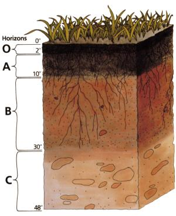
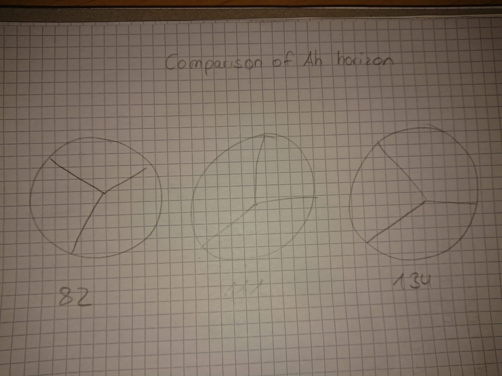

```{r setup, include=FALSE}
knitr::opts_chunk$set(echo = TRUE)
knitr::opts_knit$set(root.dir = "~/Family/Timo/Studium/Master/R2/Data-projects-with-R-and-GitHub")
options(repos = c(CRAN = "https://cran.r-project.org"))
install.packages("tidyverse")
library(tidyverse)
```

## About the Data
The dataset ([SoilData.csv](SoilData.csv)) contains information about soil. The data table was not managed well and is incomplete, which means there is some cleaning to do. But first we need to understand what this is all about: Soil samples where taken from soil profiles somewhere in the Naturpark Schönbuch and analysed in a laboratory. Soil profiles can be seen when you dig a hole in the ground. Each soil profile consists of several horizons (see below) and samples where taken from every horizon, so the rows in the data table represent the horizons of all the profiles.

This is what a soil profile looks like  
  
As you can see, a profile can often be visually divided into several horizons (O,A,B,C) as mentioned above. There might even be subdivisions of these horizons. Of course it is not only the colour but also for example the chemical composition that is different for each horizon. All these things are written down in the data table. Here is a preview of the first few lines of the dataset: 
```{r, include=F}
SoilData <- read_delim("Projects/timow98/SoilData.csv", delim = ";", 
escape_double = FALSE, trim_ws = TRUE)
```

```{r, echo=F}
knitr::kable(
  SoilData[1:10, ], 
  caption = "Table: SoilData.csv"
)
```

The first line contains the column names. The second line contains the units ([] means that is does not have a unit). But we can only have one header and we do not want the second line as it messes up the data type of the columns.
  
  
## Columns explained
- `Labornummer Tübingen`: individual sample number
- `Profil_2`: number of the profile
- `Horizont_43`: number of horizon (per profile)
example: as you see in the preview above, the profile number two was divided into 6 horizons and there was a sample taken from each of these horizons. This means, that if I want to compare profile, I will need to calculate the data from all its horizons
- `Tiefe_44`: accumulated depth of the horizons in cm
- `Horizontbezeichnung_45`: type of horizon (each main horizon as shown above can be divided into subhorizonts like Ah and Al for example)
- `East_84`: Coordinates "Easting" in meters (UTM coordinates)
- `North_85`: Coordinates "Northing" in meters (UTM coordinates)
- `Neigung_16`: slope in %
- `Expozition_17`: direction (North, Northeast, ...)
- `Corg`: percentage of organic carbon in %
- `CaCO3`: percentage of carbonate in %
- `Ca`, `Mg`, `K`, `Na`: calcium, magnesium, potassium and sodium in mmol/kg
- `Kationen`: cations in mmol/kg
- `KAKpot`, `KAKpot2`: potential cation exchange capacity - same data but the first is in mmol/kg and the second one is in cmol/kg
- `gS`, `mS`, `fS`, `S`: coarse, middle and fine fraction of sand in % - added together to Sand (S)
- `gU`, `mU`, `fU`, `U`: coarse, middle and fine fraction of silt in % - added together to silt (U)
- `gT`, `mT+fT`, `T`: coarse and middle + fine fraction of clay in % - added together to clay (T)
- `S+U+T`: all portions of grain sizes together in % (theoretically 100%)
- `Bodenart`: soil type according to Kartieranleitung 5 (sand, silt, clay)  
Soil consists of the grain sizes Sand (S), Silt (U) and Clay (T). The three fractions can be divided into subcategories (coarse (g), middle (m), fine (f)). Knowing the proportions can tell us a lot about the soil. For example the fertility, water capacity and infiltration rate. Theoretically it adds up to 100% (column S+U+T) but in reality there might be some loss or it might even be more than 100% which is due to the laboratory method.
  
  
## What to do
### 1. The data needs some cleanup
**1.1 the column KAKpot2** is not needed  
**1.2 the header** displays numbers which do not make much sense. I would like to get rid of them by using rename_with() in combination with regular expressions.  
**1.3 there is a second header** with the respective units. Leaving this line will interfere with the datatype in R, that's why I want to delete this line and instead integrate the unit into the header such like this: Tiefe_[cm]. For this dataset you will need to work with backticks. If you are not familiar with them, you can read about them [<span style="color:blue">here</span>](https://jhudatascience.org/intro_to_r/resources/quotes_vs_backticks.html).  
**1.4 there is a typo in the column "Expozition"**. It should actually be "Exposition"  
**1.5 99999 and 99999,99 are the NA values**, but R does not know this, so all these values need to be set to NA. It should be noted that some of these NA values might be actual numbers, but some might also be of datatype character.  
**1.6 two columns need to be calculated**: base_saturation_[%] by dividing "Kationen" by "KAKpot" and SOM_[%] by multiplying Corg with 1,72    
**1.7 Column S+U+T is not always 100%**. I would like to see how often I got more, less and exactly 100%. Write a new column and put in "more", "less" and "exactly" depending on the value in the column S+U+T. Then, write a query that counts and prints the number of values (for example "10x less than 100%, 3x exactly 100% and 24x more than 100%")  
  
### 2. Visualisation
**2.1 Stacked Barplot**  
I would like to aggregate (summarize) the columns Ca, Mg, K, Na and Kationen by profile number and visualize them for profiles 55, 71, 102 and 109 with a stacked barplot like this (example): 
  
**2.2 Piechart of grain sizes**  
Then I would like to have 3 piecharts of the "Ah" horizons of the profiles 82, 111 and 134 next to each other where I can see the portion of S (Sand), U (silt) and T (clay). See below:
  
  
**2.3 Map of profile location**  
I would like to know where the profiles are. There are columns with coordinates which can be used to map the profiles. There are several packages for this, for example [<span style="color:blue">openstreetmap</span>](https://ajsmit.github.io/Intro_R_Official/mapping-google.html), mapview, ggplot2 and sf. [<span style="color:blue">This</span>](https://stackoverflow.com/questions/66827313/plotting-utm-coordinates) might be a good point to start. Depending on your way to do it you might need additional information:  
Coordinate Reference System: UTM Zone 32 N WGS 84  
EPSG: 25832  
proj4string: "+proj=utm +zone=32 +datum=WGS84 +units=m +no_defs"  