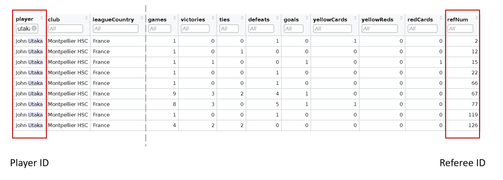
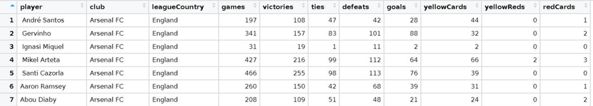
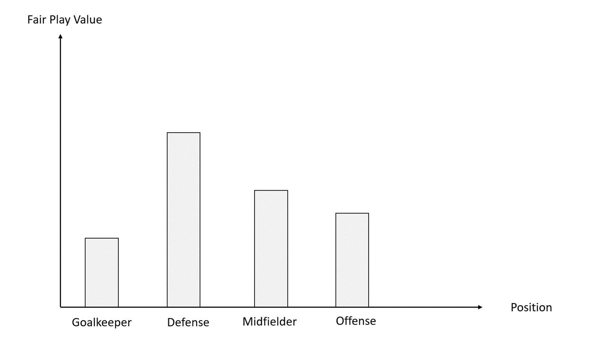
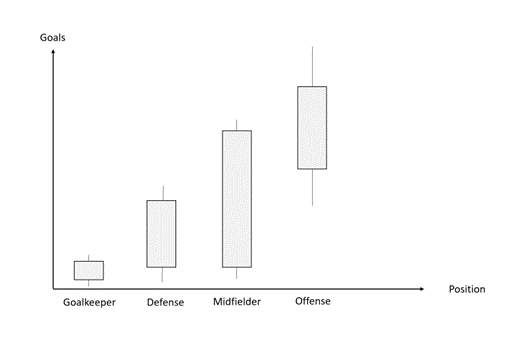

```{r setup, include=FALSE}
setwd("C:\\Users\\alexa\\Documents\\01_Universität\\01_B. Sc. International Business Administration\\07_7. Semester\\05_Advanced Data Processing with R")
```
## **Analyzing Soccer Data**
________________________________________________________________________________
The dataset contains information on soccer-referee pairings during a soccer season. One row has a player-referee pairing (if a player encountered 32 different referees in the saison, then there are 32 rows for the repsective player). The indicating columsn in this case are "playerShort" and "refNum". Further information on the data can be found via the file "Description.docx". It would now be interesting to draw insights from these pairings (soccer player & referee) regarding the success of clubs or the player or how the leagues differ from one another.

```{r img-with-knitr, echo=FALSE, fig.align='center', out.width='100%'}

```


## Prepare the data
________________________________________________________________________________


#### Exercise 1.1 - Group the positions
First let's summarize the various soccer positions into four groups.
Please create a new column ```general_position``` and assign the positions in the following way based on the column ```position```.

| ```general_position``` | Goalkeeper    | Defensive            | Midfielder       | Offense
|:---------------:|:-------------:|:--------------------:|:----------------:|:----------------:|
|```position```| Goalkeeper    | Center Back          | Right Midfielder | Center Forward   |
|```position```| |Right Fullback       | Left Midfielder  | Attacking Midfielder|
|```position```| |Left Fullback        | Center Midfielder| Right Winger     |
|```position```| |Defensive Midfielder |                  | Left Winger      |
 


#### Exercise 1.2 - Calculate the age of each player
Transform the date column into a date-data type. Afterwards create the column ```age``` by calculating the age of the players in years (use as a reference the date "2012-12-31", because the data is already 10 years old).

Note: The ```age``` should be in years

```age```: "2012-12-31" - ```birthday```


#### Exercise 1.3 - Aggregate the data on a player base
Create a new dataframe by aggregating the data in a way that there is only one row per soccer player [keep the columns ```victories```, ```ties```, ```loses```, ```redCards```, ```yellowCards```, ```yellowReds```].
This way we can see how often a player wins/draws/loses and how often he receives a yellow/yellowRed/Red card

```{r, echo=FALSE, fig.align='center', out.width='100%'}

```


#### Exercise 1.4 - Fair Play value
Create a new column ```fair_play``` that evaluates how fair a player plays.
yellow = 0.5 points per card
yellowRed = 1 points per card
Red = 2 points per card

This means that players ho receive more cards have a higher fair_play value.


## Visualization
________________________________________________________________________________


#### Exercise 2.1 - Provide an age distribution of the five leagues

Calculate a histogram that shows the age distribution of the five major leagues in the data set in one plot (use [ggplot] + geom_histogram + facet_wrap(. ~))
Have one red line that shows the mean age and one blue line that shows the median age

__*Statement: "Players are youngest in the Spanish League while they are oldest in the Italian League"*__


#### Exercise 2.2 - Fair Play within the Bundesliga

Visualize for the German league the average ```fair_play``` value for each position.

__*Statement: "Defense players have the highest ```fair_play``` value.*__

```{r, echo=FALSE, fig.align='center', out.width='100%'}

```

#### Exercise 2.3 - Who scores the most goals
Create a boxplot for each ```general_position``` regarding how many goals players in these positions score, regardless to which league they belong.

__*Statement: "Offense players score the most goals, while Goalkeepers have the smallest variation"*__

```{r, echo=FALSE, fig.align='center', out.width='100%'}

```
