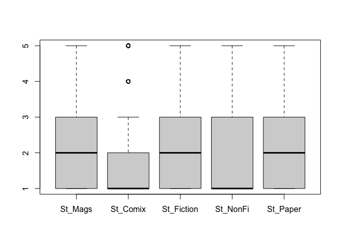
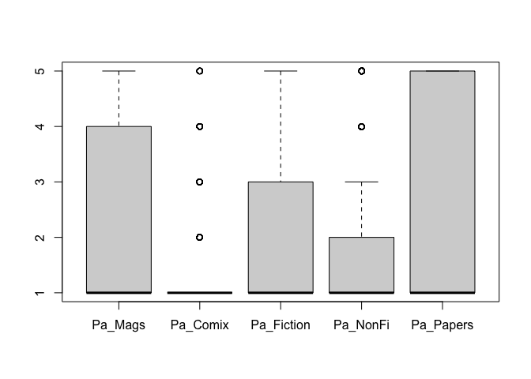
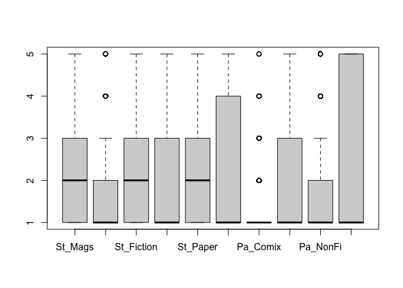
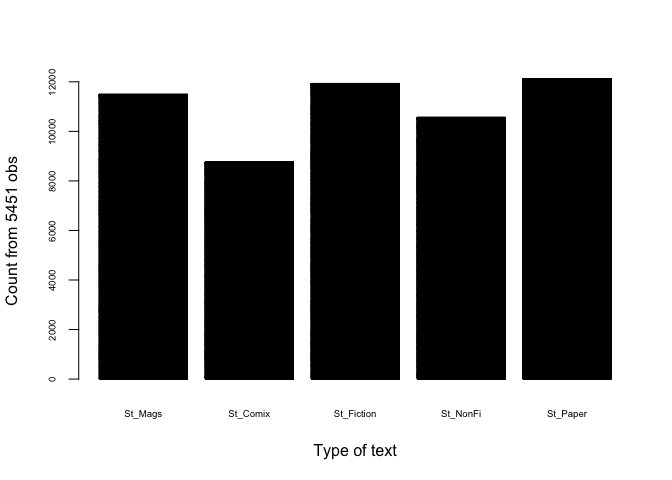
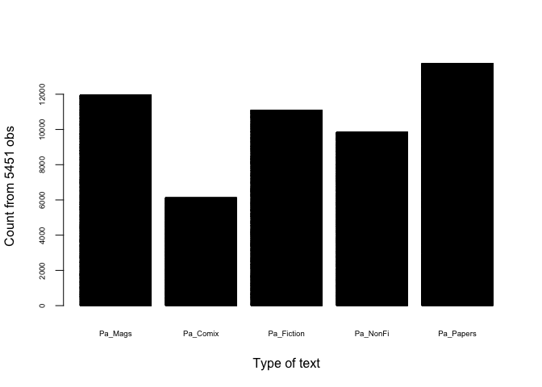
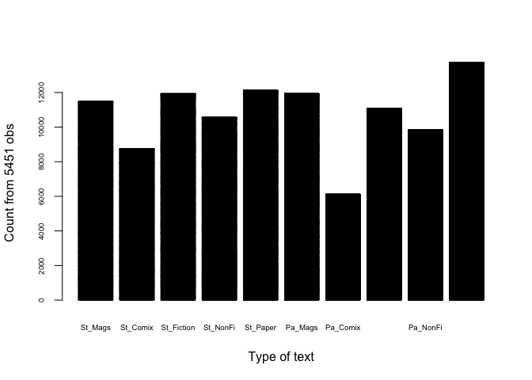
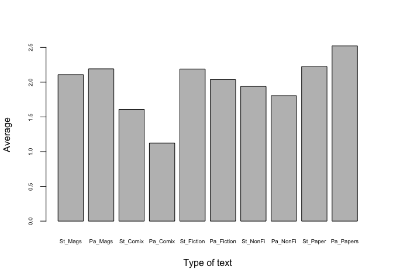
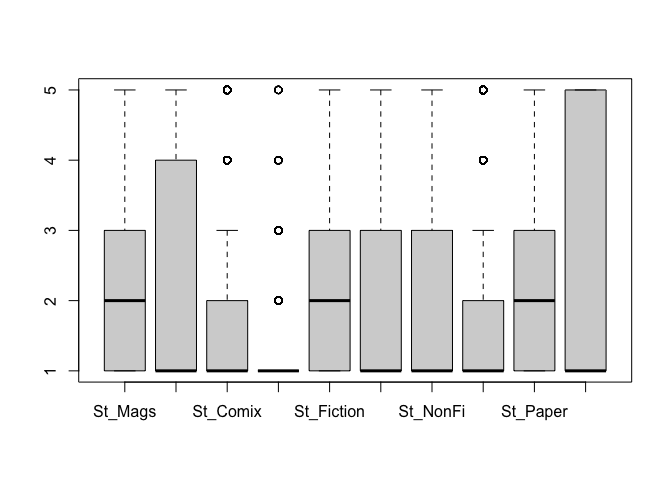
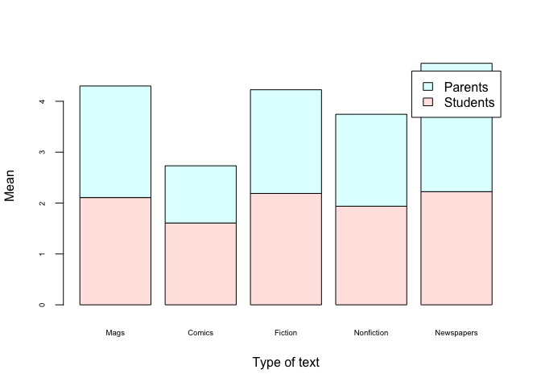
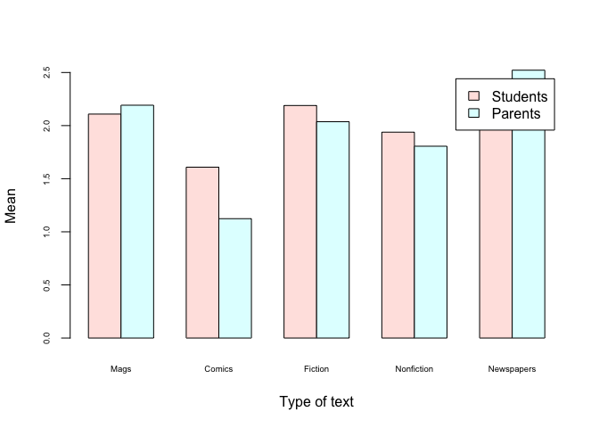

### Loading data and libraries

    knitr::opts_chunk$set(echo = TRUE)
    pisa_reading <- read.csv("pisa_reading_16-05-2023.csv", header = TRUE, stringsAsFactors = FALSE)
    library(tidyverse)

    ## ── Attaching core tidyverse packages ──────────────────────── tidyverse 2.0.0 ──
    ## ✔ dplyr     1.1.2     ✔ readr     2.1.4
    ## ✔ forcats   1.0.0     ✔ stringr   1.5.0
    ## ✔ ggplot2   3.4.2     ✔ tibble    3.2.1
    ## ✔ lubridate 1.9.2     ✔ tidyr     1.3.0
    ## ✔ purrr     1.0.1     
    ## ── Conflicts ────────────────────────────────────────── tidyverse_conflicts() ──
    ## ✖ dplyr::filter() masks stats::filter()
    ## ✖ dplyr::lag()    masks stats::lag()
    ## ℹ Use the conflicted package (<http://conflicted.r-lib.org/>) to force all conflicts to become errors

    library(ggplot2)
    df<- pisa_reading
    colnames(df)

    ##  [1] "X"                                                      
    ##  [2] "Journals.Magazines_st"                                  
    ##  [3] "Comics_st"                                              
    ##  [4] "Fiction..novels..short.stories..stories._st"            
    ##  [5] "Nonfiction..history..biography..science..technology._st"
    ##  [6] "Daily.newspapers_st"                                    
    ##  [7] "Journals.Magazines_pa"                                  
    ##  [8] "Comics_pa"                                              
    ##  [9] "Fiction..novels..short.stories..stories._pa"            
    ## [10] "Nonfiction..history..biography..science..technology._pa"
    ## [11] "Daily.newspapers_pa"

### Exploring the data

I thought column names were actually a little long to display in the
data frame.

    #Shortening columns' names
    names(df)[names(df) == "Journals.Magazines_st"] <- "St_Mags"
    names(df)[names(df) == "Comics_st"] <- "St_Comix"
    names(df)[names(df) == "Fiction..novels..short.stories..stories._st"] <- "St_Fiction"
    names(df)[names(df) == "Nonfiction..history..biography..science..technology._st"] <- "St_NonFi"
    names(df)[names(df) == "Daily.newspapers_st"] <- "St_Paper"
    names(df)[names(df) == "Journals.Magazines_pa"] <- "Pa_Mags"
    names(df)[names(df) == "Comics_pa"] <- "Pa_Comix"
    names(df)[names(df) == "Fiction..novels..short.stories..stories._pa"] <- "Pa_Fiction"
    names(df)[names(df) == "Nonfiction..history..biography..science..technology._pa"] <- "Pa_NonFi"
    names(df)[names(df) == "Daily.newspapers_pa"] <- "Pa_Papers"

    colnames(df)

    ##  [1] "X"          "St_Mags"    "St_Comix"   "St_Fiction" "St_NonFi"  
    ##  [6] "St_Paper"   "Pa_Mags"    "Pa_Comix"   "Pa_Fiction" "Pa_NonFi"  
    ## [11] "Pa_Papers"

    head(df)

    ##   X St_Mags St_Comix St_Fiction St_NonFi St_Paper Pa_Mags Pa_Comix Pa_Fiction
    ## 1 1       2        1          1        3        2      NA       NA         NA
    ## 2 2       4        1          5        2        1       4        1          5
    ## 3 3       2        1          3        2        3       5        1          5
    ## 4 4       3        1          2        2        4       3        1          2
    ## 5 5       3        1          5        4        2       2        1          4
    ## 6 6       1        1          1        1        4       2        1          2
    ##   Pa_NonFi Pa_Papers
    ## 1       NA        NA
    ## 2        2         5
    ## 3        5         5
    ## 4        1         5
    ## 5        4         4
    ## 6        4         4

## Describing the data:

Ranked index (self-assessed?) survey: “How often do you read this type
of book?” \* 1 = Never or almost never \* 5 = Several times a week

The data is categorical: **Ordinal data or ordered factor**

### Preliminary questions about the data:

-   NA in all columns, i.e. an empty row, means no observation?
-   NA in parent columns means only student answered or they parents
    don’t read?
-   NA in student columns means means there isn’t a student or the
    student doesn’t read?
-   NA in one column means they never read that type or should it be 1?
-   Who answered the survey: students, parents, or both?

## Goal:

The goal of this project is to visualize how often students and their
parents read different types of book. 1. diagram for bar plots of
different book types 2. grouped plots for students and parents

## Plan

1.  Stat summary
2.  Boxplots by column
3.  Clean data: remove outliers and NA
4.  Explore relations and correlations
5.  Add aggregated column for student and parents

<!-- -->

    #Removing NA values and replace them with 1
    any(is.na(df))

    ## [1] TRUE

    df[is.na(df)] <- 1
    any(is.na(df))

    ## [1] FALSE

    lengths(df)

    ##          X    St_Mags   St_Comix St_Fiction   St_NonFi   St_Paper    Pa_Mags 
    ##       5451       5451       5451       5451       5451       5451       5451 
    ##   Pa_Comix Pa_Fiction   Pa_NonFi  Pa_Papers 
    ##       5451       5451       5451       5451

-   Looking at STUDENTS only

<!-- -->

    df_st <- df[,(2:6)]
    head(df_st)

    ##   St_Mags St_Comix St_Fiction St_NonFi St_Paper
    ## 1       2        1          1        3        2
    ## 2       4        1          5        2        1
    ## 3       2        1          3        2        3
    ## 4       3        1          2        2        4
    ## 5       3        1          5        4        2
    ## 6       1        1          1        1        4

    boxplot(df_st)

\* Looking at PARENTS only

    df_pa <- df[,(7:11)]
    head(df_pa)

    ##   Pa_Mags Pa_Comix Pa_Fiction Pa_NonFi Pa_Papers
    ## 1       1        1          1        1         1
    ## 2       4        1          5        2         5
    ## 3       5        1          5        5         5
    ## 4       3        1          2        1         5
    ## 5       2        1          4        4         4
    ## 6       2        1          2        4         4

    boxplot(df_pa)

### summary statistics

    df_all <- df[,2:11]
    head(df_all)

    ##   St_Mags St_Comix St_Fiction St_NonFi St_Paper Pa_Mags Pa_Comix Pa_Fiction
    ## 1       2        1          1        3        2       1        1          1
    ## 2       4        1          5        2        1       4        1          5
    ## 3       2        1          3        2        3       5        1          5
    ## 4       3        1          2        2        4       3        1          2
    ## 5       3        1          5        4        2       2        1          4
    ## 6       1        1          1        1        4       2        1          2
    ##   Pa_NonFi Pa_Papers
    ## 1        1         1
    ## 2        2         5
    ## 3        5         5
    ## 4        1         5
    ## 5        4         4
    ## 6        4         4

    boxplot(df_all)

    str(df_all)

    ## 'data.frame':    5451 obs. of  10 variables:
    ##  $ St_Mags   : num  2 4 2 3 3 1 2 1 4 3 ...
    ##  $ St_Comix  : num  1 1 1 1 1 1 1 3 3 5 ...
    ##  $ St_Fiction: num  1 5 3 2 5 1 4 4 5 5 ...
    ##  $ St_NonFi  : num  3 2 2 2 4 1 4 3 5 5 ...
    ##  $ St_Paper  : num  2 1 3 4 2 4 1 1 1 4 ...
    ##  $ Pa_Mags   : num  1 4 5 3 2 2 1 1 4 1 ...
    ##  $ Pa_Comix  : num  1 1 1 1 1 1 1 1 1 1 ...
    ##  $ Pa_Fiction: num  1 5 5 2 4 2 1 1 5 1 ...
    ##  $ Pa_NonFi  : num  1 2 5 1 4 4 5 1 2 1 ...
    ##  $ Pa_Papers : num  1 5 5 5 4 4 4 1 4 1 ...

    summary(df_all)

    ##     St_Mags         St_Comix       St_Fiction       St_NonFi    
    ##  Min.   :1.000   Min.   :1.000   Min.   :1.000   Min.   :1.000  
    ##  1st Qu.:1.000   1st Qu.:1.000   1st Qu.:1.000   1st Qu.:1.000  
    ##  Median :2.000   Median :1.000   Median :2.000   Median :1.000  
    ##  Mean   :2.109   Mean   :1.609   Mean   :2.189   Mean   :1.938  
    ##  3rd Qu.:3.000   3rd Qu.:2.000   3rd Qu.:3.000   3rd Qu.:3.000  
    ##  Max.   :5.000   Max.   :5.000   Max.   :5.000   Max.   :5.000  
    ##     St_Paper        Pa_Mags         Pa_Comix       Pa_Fiction   
    ##  Min.   :1.000   Min.   :1.000   Min.   :1.000   Min.   :1.000  
    ##  1st Qu.:1.000   1st Qu.:1.000   1st Qu.:1.000   1st Qu.:1.000  
    ##  Median :2.000   Median :1.000   Median :1.000   Median :1.000  
    ##  Mean   :2.224   Mean   :2.192   Mean   :1.124   Mean   :2.037  
    ##  3rd Qu.:3.000   3rd Qu.:4.000   3rd Qu.:1.000   3rd Qu.:3.000  
    ##  Max.   :5.000   Max.   :5.000   Max.   :5.000   Max.   :5.000  
    ##     Pa_NonFi       Pa_Papers    
    ##  Min.   :1.000   Min.   :1.000  
    ##  1st Qu.:1.000   1st Qu.:1.000  
    ##  Median :1.000   Median :1.000  
    ##  Mean   :1.806   Mean   :2.522  
    ##  3rd Qu.:2.000   3rd Qu.:5.000  
    ##  Max.   :5.000   Max.   :5.000

    summary(df_st)

    ##     St_Mags         St_Comix       St_Fiction       St_NonFi    
    ##  Min.   :1.000   Min.   :1.000   Min.   :1.000   Min.   :1.000  
    ##  1st Qu.:1.000   1st Qu.:1.000   1st Qu.:1.000   1st Qu.:1.000  
    ##  Median :2.000   Median :1.000   Median :2.000   Median :1.000  
    ##  Mean   :2.109   Mean   :1.609   Mean   :2.189   Mean   :1.938  
    ##  3rd Qu.:3.000   3rd Qu.:2.000   3rd Qu.:3.000   3rd Qu.:3.000  
    ##  Max.   :5.000   Max.   :5.000   Max.   :5.000   Max.   :5.000  
    ##     St_Paper    
    ##  Min.   :1.000  
    ##  1st Qu.:1.000  
    ##  Median :2.000  
    ##  Mean   :2.224  
    ##  3rd Qu.:3.000  
    ##  Max.   :5.000

    summary(df_pa)

    ##     Pa_Mags         Pa_Comix       Pa_Fiction       Pa_NonFi    
    ##  Min.   :1.000   Min.   :1.000   Min.   :1.000   Min.   :1.000  
    ##  1st Qu.:1.000   1st Qu.:1.000   1st Qu.:1.000   1st Qu.:1.000  
    ##  Median :1.000   Median :1.000   Median :1.000   Median :1.000  
    ##  Mean   :2.192   Mean   :1.124   Mean   :2.037   Mean   :1.806  
    ##  3rd Qu.:4.000   3rd Qu.:1.000   3rd Qu.:3.000   3rd Qu.:2.000  
    ##  Max.   :5.000   Max.   :5.000   Max.   :5.000   Max.   :5.000  
    ##    Pa_Papers    
    ##  Min.   :1.000  
    ##  1st Qu.:1.000  
    ##  Median :1.000  
    ##  Mean   :2.522  
    ##  3rd Qu.:5.000  
    ##  Max.   :5.000

### Plotting

    barplot(as.matrix(df_st), cex.axis=0.6, cex.names=0.6,
            xlab='Type of text', ylab='Count from 5451 obs')

    barplot(as.matrix(df_pa), cex.axis=0.6, cex.names=0.6,
            xlab='Type of text', ylab='Count from 5451 obs')

    barplot(as.matrix(df_all), cex.axis=0.6, cex.names=0.6,
            xlab='Type of text', ylab='Count from 5451 obs')

## Preliminary findings

-   What students and parents read the most are newspapers
-   The same tendency is evident in both groups
-   As they read more papers, they read more
-   magazines, nonfiction, fiction, then comics (in that order)

### Plotting type of book side by side

The next plot illustrates better student-parent comparison

-   First we need to change the order of columns

<!-- -->

    colnames(df_all)

    ##  [1] "St_Mags"    "St_Comix"   "St_Fiction" "St_NonFi"   "St_Paper"  
    ##  [6] "Pa_Mags"    "Pa_Comix"   "Pa_Fiction" "Pa_NonFi"   "Pa_Papers"

    col_order <- c(
                    "St_Mags","Pa_Mags","St_Comix","Pa_Comix",
                   "St_Fiction","Pa_Fiction","St_NonFi","Pa_NonFi",
                   "St_Paper","Pa_Papers"      
                  )
    df_reord <- df_all[, col_order]
    colnames(df_reord)

    ##  [1] "St_Mags"    "Pa_Mags"    "St_Comix"   "Pa_Comix"   "St_Fiction"
    ##  [6] "Pa_Fiction" "St_NonFi"   "Pa_NonFi"   "St_Paper"   "Pa_Papers"

    View(df_reord)

-   Then we can plot

<!-- -->

    barplot(as.matrix(df_reord), cex.axis=0.6, cex.names=0.6,
            xlab='Type of text', ylab='Count from 5451 obs')

    type_sum <- colSums(df_reord)
    type_sum

    ##    St_Mags    Pa_Mags   St_Comix   Pa_Comix St_Fiction Pa_Fiction   St_NonFi 
    ##      11494      11949       8768       6125      11934      11102      10565 
    ##   Pa_NonFi   St_Paper  Pa_Papers 
    ##       9844      12125      13746

-   Now, we change the value, from count to mean

<!-- -->

    columns <- colnames(df_reord)
    type_mean <- colMeans(df_reord)
    columns <- names(type_mean)

    df_p <- data.frame(columns,type_mean)
    df_p

    ##               columns type_mean
    ## St_Mags       St_Mags  2.108604
    ## Pa_Mags       Pa_Mags  2.192075
    ## St_Comix     St_Comix  1.608512
    ## Pa_Comix     Pa_Comix  1.123647
    ## St_Fiction St_Fiction  2.189323
    ## Pa_Fiction Pa_Fiction  2.036691
    ## St_NonFi     St_NonFi  1.938176
    ## Pa_NonFi     Pa_NonFi  1.805907
    ## St_Paper     St_Paper  2.224363
    ## Pa_Papers   Pa_Papers  2.521739

-   Finally, we can plot

<!-- -->

    barplot(type_mean, cex.axis=0.6, cex.names=0.6,
            xlab='Type of text', ylab='Average')

    boxplot(df_reord)

------------------------------------------------------------------------

### Data frame types by reader

The values are indicated by the mean, not count.

    students_mean <- colMeans(df_st)
    parents_mean <- colMeans(df_pa)
    students_mean

    ##    St_Mags   St_Comix St_Fiction   St_NonFi   St_Paper 
    ##   2.108604   1.608512   2.189323   1.938176   2.224363

    parents_mean

    ##    Pa_Mags   Pa_Comix Pa_Fiction   Pa_NonFi  Pa_Papers 
    ##   2.192075   1.123647   2.036691   1.805907   2.521739

    df_means <- data.frame("Mags" = c(students_mean[1],parents_mean[1]),
                    "Comics" = c(students_mean[2],parents_mean[2]),
                    "Fiction" = c(students_mean[3],parents_mean[3]),
                    "Nonfiction" = c(students_mean[4],parents_mean[4]),
                    "Newspapers" = c(students_mean[5],parents_mean[5])
                    )
    View(df_means)

    barplot(as.matrix(df_means), cex.axis=0.6, cex.names=0.6,
            xlab='Type of text', ylab='Mean', 
            col = c("mistyrose", "lightcyan"), 
            legend.text = c("Students","Parents"))

## Final plot by types

I think the best way to display book types is to plot readers side by
side

    barplot(as.matrix(df_means), cex.axis=0.6, cex.names=0.6,
            xlab='Type of text', ylab='Mean', 
            col = c("mistyrose", "lightcyan"),
            beside = TRUE, 
            legend.text = c("Students","Parents"))

