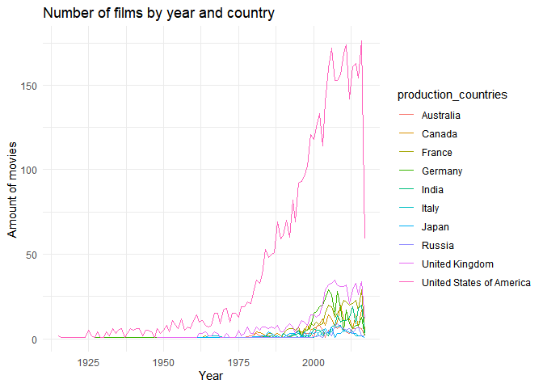
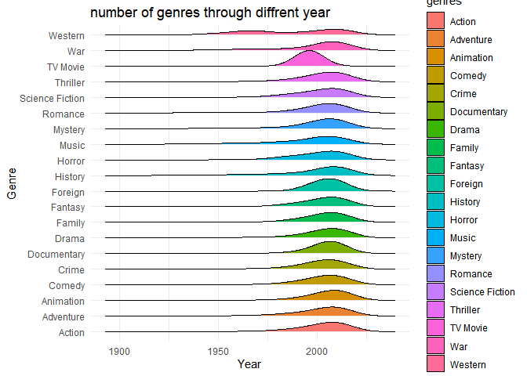
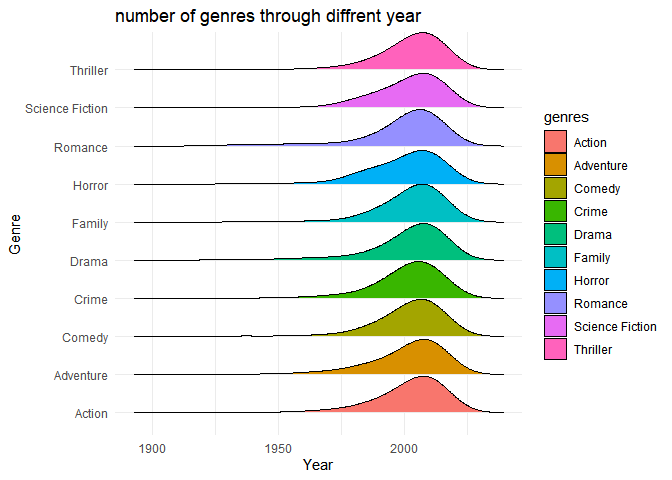
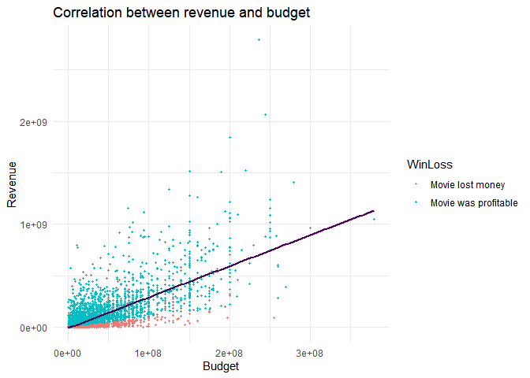
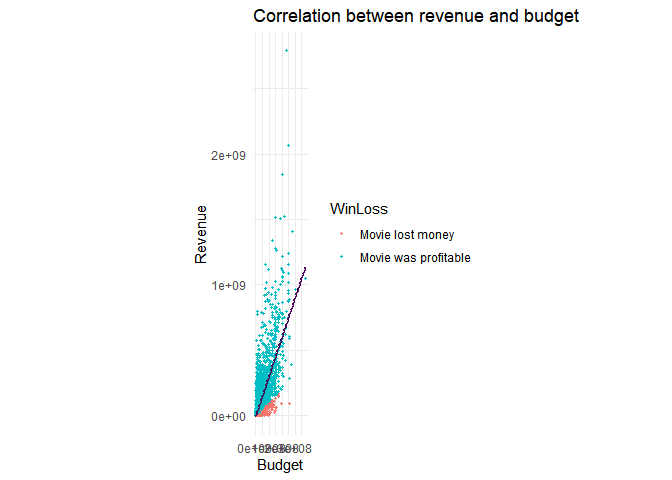

# Solution for “Film genre and popularity analysis-Project” by @yhykelly

In this File I propose my solution for the “Film genre and popularity
analysis-Project” by yhykelly. It is about a movie data set and the task
is to further analyse the data to find trends in the popularity and
sucsess of a movie based on statistics and measuarable variables.

## Loading packages and R-setup

    library(tidyverse)
    library(rstudioapi)
    library(jsonlite)
    library(lubridate)
    library(ggridges)
    library(dplyr)
    setwd(dirname(rstudioapi::getActiveDocumentContext()$path))

## Loading data

    Data <- read_csv("movies_metadata.csv")

# Data manipulation

## Data tidying:

-   Select only needed columns
-   Extract information from JSON Format
-   Filter for duplicates & invalid values
-   extracting the year from the release-date

<!-- -->

    CleanData <- Data %>%
      select(id, title,release_date, production_countries,original_language,genres,vote_average,popularity,budget,revenue,runtime)%>% # select columns
      filter(runtime > 0,
             revenue > 0,
             budget > 0) %>% # filter for invalid values
      distinct() %>% #filter for duplicates
      mutate(genres = map(genres, ~fromJSON(str_replace_all(.x,"'", "\""))),
             genres = map(genres, ~pluck(.,"name"))) %>% 
      mutate(production_countries = map(production_countries, ~fromJSON(str_replace_all(.x,"'", "\""))),
             production_countries = map(production_countries, ~pluck(.,"name"))) %>% 
      unnest(genres) %>%
      unnest(production_countries) %>% #convert JSON formats in list formats and unnest the lists
      mutate(release_date = year(release_date)) # extract year from release date

## Data wrangling

-   group by genres, year and language
-   calculate mean budget, revenue, profit (= revenue - budget),
    vote\_average and popularity for each

<!-- -->

    #grouped by genre:
    CleanData %>% 
      group_by(genres) %>% 
      summarise(Amount_Of_Movies = n_distinct(title),
                AvgBudget = mean(budget),
                AvgRevenue = mean(revenue),
                AvgProfit = mean(revenue - budget),
                AvgVote = mean(vote_average),
                AvgPopularity = mean(popularity)) %>% 
      knitr::kable()

<table>
<colgroup>
<col style="width: 17%" />
<col style="width: 19%" />
<col style="width: 11%" />
<col style="width: 12%" />
<col style="width: 13%" />
<col style="width: 10%" />
<col style="width: 15%" />
</colgroup>
<thead>
<tr class="header">
<th style="text-align: left;">genres</th>
<th style="text-align: right;">Amount_Of_Movies</th>
<th style="text-align: right;">AvgBudget</th>
<th style="text-align: right;">AvgRevenue</th>
<th style="text-align: right;">AvgProfit</th>
<th style="text-align: right;">AvgVote</th>
<th style="text-align: right;">AvgPopularity</th>
</tr>
</thead>
<tbody>
<tr class="odd">
<td style="text-align: left;">Action</td>
<td style="text-align: right;">1385</td>
<td style="text-align: right;">53533051</td>
<td style="text-align: right;">144855344</td>
<td style="text-align: right;">91322293.3</td>
<td style="text-align: right;">6.092510</td>
<td style="text-align: right;">12.7189180</td>
</tr>
<tr class="even">
<td style="text-align: left;">Adventure</td>
<td style="text-align: right;">931</td>
<td style="text-align: right;">67058860</td>
<td style="text-align: right;">203257951</td>
<td style="text-align: right;">136199090.9</td>
<td style="text-align: right;">6.203414</td>
<td style="text-align: right;">13.5579841</td>
</tr>
<tr class="odd">
<td style="text-align: left;">Animation</td>
<td style="text-align: right;">289</td>
<td style="text-align: right;">59347538</td>
<td style="text-align: right;">196253246</td>
<td style="text-align: right;">136905707.7</td>
<td style="text-align: right;">6.412742</td>
<td style="text-align: right;">13.5161658</td>
</tr>
<tr class="even">
<td style="text-align: left;">Comedy</td>
<td style="text-align: right;">1810</td>
<td style="text-align: right;">28821523</td>
<td style="text-align: right;">82184416</td>
<td style="text-align: right;">53362892.8</td>
<td style="text-align: right;">6.093277</td>
<td style="text-align: right;">8.9453363</td>
</tr>
<tr class="odd">
<td style="text-align: left;">Crime</td>
<td style="text-align: right;">849</td>
<td style="text-align: right;">29760677</td>
<td style="text-align: right;">70922296</td>
<td style="text-align: right;">41161619.0</td>
<td style="text-align: right;">6.395563</td>
<td style="text-align: right;">10.4256817</td>
</tr>
<tr class="even">
<td style="text-align: left;">Documentary</td>
<td style="text-align: right;">51</td>
<td style="text-align: right;">6433904</td>
<td style="text-align: right;">20733655</td>
<td style="text-align: right;">14299751.1</td>
<td style="text-align: right;">6.869444</td>
<td style="text-align: right;">4.9728595</td>
</tr>
<tr class="odd">
<td style="text-align: left;">Drama</td>
<td style="text-align: right;">2518</td>
<td style="text-align: right;">24024644</td>
<td style="text-align: right;">59416735</td>
<td style="text-align: right;">35392091.2</td>
<td style="text-align: right;">6.553568</td>
<td style="text-align: right;">9.0143075</td>
</tr>
<tr class="even">
<td style="text-align: left;">Family</td>
<td style="text-align: right;">516</td>
<td style="text-align: right;">59512213</td>
<td style="text-align: right;">193022894</td>
<td style="text-align: right;">133510681.4</td>
<td style="text-align: right;">6.156934</td>
<td style="text-align: right;">12.8659922</td>
</tr>
<tr class="odd">
<td style="text-align: left;">Fantasy</td>
<td style="text-align: right;">500</td>
<td style="text-align: right;">63474786</td>
<td style="text-align: right;">198217039</td>
<td style="text-align: right;">134742252.9</td>
<td style="text-align: right;">6.147751</td>
<td style="text-align: right;">14.0549560</td>
</tr>
<tr class="even">
<td style="text-align: left;">Foreign</td>
<td style="text-align: right;">29</td>
<td style="text-align: right;">3571542</td>
<td style="text-align: right;">3439950</td>
<td style="text-align: right;">-131592.6</td>
<td style="text-align: right;">5.295122</td>
<td style="text-align: right;">0.9175247</td>
</tr>
<tr class="odd">
<td style="text-align: left;">History</td>
<td style="text-align: right;">232</td>
<td style="text-align: right;">33023060</td>
<td style="text-align: right;">62816640</td>
<td style="text-align: right;">29793579.6</td>
<td style="text-align: right;">6.777387</td>
<td style="text-align: right;">9.1296529</td>
</tr>
<tr class="even">
<td style="text-align: left;">Horror</td>
<td style="text-align: right;">566</td>
<td style="text-align: right;">19696091</td>
<td style="text-align: right;">56555735</td>
<td style="text-align: right;">36859643.6</td>
<td style="text-align: right;">5.810111</td>
<td style="text-align: right;">10.0367214</td>
</tr>
<tr class="odd">
<td style="text-align: left;">Music</td>
<td style="text-align: right;">188</td>
<td style="text-align: right;">20712372</td>
<td style="text-align: right;">63924919</td>
<td style="text-align: right;">43212546.7</td>
<td style="text-align: right;">6.553942</td>
<td style="text-align: right;">7.9631486</td>
</tr>
<tr class="even">
<td style="text-align: left;">Mystery</td>
<td style="text-align: right;">437</td>
<td style="text-align: right;">32356737</td>
<td style="text-align: right;">82574121</td>
<td style="text-align: right;">50217384.3</td>
<td style="text-align: right;">6.325596</td>
<td style="text-align: right;">10.5434444</td>
</tr>
<tr class="odd">
<td style="text-align: left;">Romance</td>
<td style="text-align: right;">985</td>
<td style="text-align: right;">22215633</td>
<td style="text-align: right;">65868882</td>
<td style="text-align: right;">43653248.3</td>
<td style="text-align: right;">6.348524</td>
<td style="text-align: right;">8.3022920</td>
</tr>
<tr class="even">
<td style="text-align: left;">Science Fiction</td>
<td style="text-align: right;">617</td>
<td style="text-align: right;">54488971</td>
<td style="text-align: right;">149653890</td>
<td style="text-align: right;">95164918.1</td>
<td style="text-align: right;">6.101852</td>
<td style="text-align: right;">14.0446466</td>
</tr>
<tr class="odd">
<td style="text-align: left;">TV Movie</td>
<td style="text-align: right;">1</td>
<td style="text-align: right;">5000000</td>
<td style="text-align: right;">42000000</td>
<td style="text-align: right;">37000000.0</td>
<td style="text-align: right;">6.000000</td>
<td style="text-align: right;">5.1478190</td>
</tr>
<tr class="even">
<td style="text-align: left;">Thriller</td>
<td style="text-align: right;">1475</td>
<td style="text-align: right;">35688344</td>
<td style="text-align: right;">90113967</td>
<td style="text-align: right;">54425623.3</td>
<td style="text-align: right;">6.170512</td>
<td style="text-align: right;">11.2944998</td>
</tr>
<tr class="odd">
<td style="text-align: left;">War</td>
<td style="text-align: right;">203</td>
<td style="text-align: right;">36718589</td>
<td style="text-align: right;">80629897</td>
<td style="text-align: right;">43911307.7</td>
<td style="text-align: right;">6.776765</td>
<td style="text-align: right;">10.7229353</td>
</tr>
<tr class="even">
<td style="text-align: left;">Western</td>
<td style="text-align: right;">87</td>
<td style="text-align: right;">29771860</td>
<td style="text-align: right;">61962036</td>
<td style="text-align: right;">32190176.0</td>
<td style="text-align: right;">6.718033</td>
<td style="text-align: right;">10.7061318</td>
</tr>
</tbody>
</table>

    #grouped by year:
    CleanData %>% 
      group_by(release_date) %>% 
      summarise(Amount_Of_Movies = n_distinct(title),
                AvgBudget = mean(budget),
                AvgRevenue = mean(revenue),
                AvgProfit = mean(revenue - budget),
                AvgVote = mean(vote_average),
                AvgPopularity = mean(popularity)) %>% 
      knitr::kable()

<table>
<colgroup>
<col style="width: 14%" />
<col style="width: 19%" />
<col style="width: 13%" />
<col style="width: 13%" />
<col style="width: 13%" />
<col style="width: 10%" />
<col style="width: 15%" />
</colgroup>
<thead>
<tr class="header">
<th style="text-align: right;">release_date</th>
<th style="text-align: right;">Amount_Of_Movies</th>
<th style="text-align: right;">AvgBudget</th>
<th style="text-align: right;">AvgRevenue</th>
<th style="text-align: right;">AvgProfit</th>
<th style="text-align: right;">AvgVote</th>
<th style="text-align: right;">AvgPopularity</th>
</tr>
</thead>
<tbody>
<tr class="odd">
<td style="text-align: right;">1915</td>
<td style="text-align: right;">2</td>
<td style="text-align: right;">79327.75</td>
<td style="text-align: right;">8284341.2</td>
<td style="text-align: right;">8205013.5</td>
<td style="text-align: right;">6.000000</td>
<td style="text-align: right;">4.0050055</td>
</tr>
<tr class="even">
<td style="text-align: right;">1916</td>
<td style="text-align: right;">1</td>
<td style="text-align: right;">200000.00</td>
<td style="text-align: right;">8000000.0</td>
<td style="text-align: right;">7800000.0</td>
<td style="text-align: right;">6.000000</td>
<td style="text-align: right;">0.9177770</td>
</tr>
<tr class="odd">
<td style="text-align: right;">1918</td>
<td style="text-align: right;">1</td>
<td style="text-align: right;">250000.00</td>
<td style="text-align: right;">8000000.0</td>
<td style="text-align: right;">7750000.0</td>
<td style="text-align: right;">7.500000</td>
<td style="text-align: right;">0.2110080</td>
</tr>
<tr class="even">
<td style="text-align: right;">1921</td>
<td style="text-align: right;">1</td>
<td style="text-align: right;">250000.00</td>
<td style="text-align: right;">2500000.0</td>
<td style="text-align: right;">2250000.0</td>
<td style="text-align: right;">8.000000</td>
<td style="text-align: right;">8.1684560</td>
</tr>
<tr class="odd">
<td style="text-align: right;">1922</td>
<td style="text-align: right;">1</td>
<td style="text-align: right;">1100000.00</td>
<td style="text-align: right;">400200.0</td>
<td style="text-align: right;">-699800.0</td>
<td style="text-align: right;">6.400000</td>
<td style="text-align: right;">0.8380950</td>
</tr>
<tr class="even">
<td style="text-align: right;">1924</td>
<td style="text-align: right;">1</td>
<td style="text-align: right;">1135654.00</td>
<td style="text-align: right;">1213880.0</td>
<td style="text-align: right;">78226.0</td>
<td style="text-align: right;">7.400000</td>
<td style="text-align: right;">3.8785150</td>
</tr>
<tr class="odd">
<td style="text-align: right;">1925</td>
<td style="text-align: right;">5</td>
<td style="text-align: right;">893398.77</td>
<td style="text-align: right;">7200923.2</td>
<td style="text-align: right;">6307524.5</td>
<td style="text-align: right;">6.853846</td>
<td style="text-align: right;">2.6208845</td>
</tr>
<tr class="even">
<td style="text-align: right;">1926</td>
<td style="text-align: right;">2</td>
<td style="text-align: right;">403151.67</td>
<td style="text-align: right;">760959.3</td>
<td style="text-align: right;">357807.7</td>
<td style="text-align: right;">7.933333</td>
<td style="text-align: right;">0.6587187</td>
</tr>
<tr class="odd">
<td style="text-align: right;">1927</td>
<td style="text-align: right;">2</td>
<td style="text-align: right;">37337861.80</td>
<td style="text-align: right;">876823.0</td>
<td style="text-align: right;">-36461038.8</td>
<td style="text-align: right;">8.000000</td>
<td style="text-align: right;">5.9185494</td>
</tr>
<tr class="even">
<td style="text-align: right;">1928</td>
<td style="text-align: right;">4</td>
<td style="text-align: right;">156084.25</td>
<td style="text-align: right;">679387.8</td>
<td style="text-align: right;">523303.5</td>
<td style="text-align: right;">6.775000</td>
<td style="text-align: right;">0.4700712</td>
</tr>
<tr class="odd">
<td style="text-align: right;">1929</td>
<td style="text-align: right;">1</td>
<td style="text-align: right;">379000.00</td>
<td style="text-align: right;">4358000.0</td>
<td style="text-align: right;">3979000.0</td>
<td style="text-align: right;">5.000000</td>
<td style="text-align: right;">0.7580120</td>
</tr>
<tr class="even">
<td style="text-align: right;">1930</td>
<td style="text-align: right;">1</td>
<td style="text-align: right;">3950000.00</td>
<td style="text-align: right;">8000000.0</td>
<td style="text-align: right;">4050000.0</td>
<td style="text-align: right;">6.100000</td>
<td style="text-align: right;">5.2765460</td>
</tr>
<tr class="odd">
<td style="text-align: right;">1931</td>
<td style="text-align: right;">4</td>
<td style="text-align: right;">723636.36</td>
<td style="text-align: right;">4179793.8</td>
<td style="text-align: right;">3456157.5</td>
<td style="text-align: right;">7.100000</td>
<td style="text-align: right;">6.3732970</td>
</tr>
<tr class="even">
<td style="text-align: right;">1932</td>
<td style="text-align: right;">2</td>
<td style="text-align: right;">175003.00</td>
<td style="text-align: right;">648518.8</td>
<td style="text-align: right;">473515.8</td>
<td style="text-align: right;">6.275000</td>
<td style="text-align: right;">4.4019190</td>
</tr>
<tr class="odd">
<td style="text-align: right;">1933</td>
<td style="text-align: right;">6</td>
<td style="text-align: right;">655520.00</td>
<td style="text-align: right;">5014500.0</td>
<td style="text-align: right;">4358980.0</td>
<td style="text-align: right;">6.564286</td>
<td style="text-align: right;">4.5605731</td>
</tr>
<tr class="even">
<td style="text-align: right;">1934</td>
<td style="text-align: right;">3</td>
<td style="text-align: right;">460460.57</td>
<td style="text-align: right;">2215571.4</td>
<td style="text-align: right;">1755110.9</td>
<td style="text-align: right;">6.857143</td>
<td style="text-align: right;">6.5592476</td>
</tr>
<tr class="odd">
<td style="text-align: right;">1935</td>
<td style="text-align: right;">5</td>
<td style="text-align: right;">936526.15</td>
<td style="text-align: right;">2405884.1</td>
<td style="text-align: right;">1469357.9</td>
<td style="text-align: right;">6.630769</td>
<td style="text-align: right;">4.2970143</td>
</tr>
<tr class="even">
<td style="text-align: right;">1936</td>
<td style="text-align: right;">6</td>
<td style="text-align: right;">957750.12</td>
<td style="text-align: right;">3634562.5</td>
<td style="text-align: right;">2676812.4</td>
<td style="text-align: right;">6.493750</td>
<td style="text-align: right;">4.4110759</td>
</tr>
<tr class="odd">
<td style="text-align: right;">1937</td>
<td style="text-align: right;">1</td>
<td style="text-align: right;">1488423.00</td>
<td style="text-align: right;">184925486.0</td>
<td style="text-align: right;">183437063.0</td>
<td style="text-align: right;">6.900000</td>
<td style="text-align: right;">16.2638780</td>
</tr>
<tr class="even">
<td style="text-align: right;">1938</td>
<td style="text-align: right;">3</td>
<td style="text-align: right;">1923559.00</td>
<td style="text-align: right;">4851150.2</td>
<td style="text-align: right;">2927591.2</td>
<td style="text-align: right;">6.450000</td>
<td style="text-align: right;">5.3366344</td>
</tr>
<tr class="odd">
<td style="text-align: right;">1939</td>
<td style="text-align: right;">6</td>
<td style="text-align: right;">2178553.43</td>
<td style="text-align: right;">95164270.9</td>
<td style="text-align: right;">92985717.4</td>
<td style="text-align: right;">7.407143</td>
<td style="text-align: right;">11.5419678</td>
</tr>
<tr class="even">
<td style="text-align: right;">1940</td>
<td style="text-align: right;">5</td>
<td style="text-align: right;">2056000.00</td>
<td style="text-align: right;">42643272.7</td>
<td style="text-align: right;">40587272.7</td>
<td style="text-align: right;">7.127273</td>
<td style="text-align: right;">7.5934038</td>
</tr>
<tr class="odd">
<td style="text-align: right;">1941</td>
<td style="text-align: right;">6</td>
<td style="text-align: right;">963175.29</td>
<td style="text-align: right;">9505920.6</td>
<td style="text-align: right;">8542745.3</td>
<td style="text-align: right;">7.321429</td>
<td style="text-align: right;">8.0006241</td>
</tr>
<tr class="even">
<td style="text-align: right;">1942</td>
<td style="text-align: right;">6</td>
<td style="text-align: right;">672631.58</td>
<td style="text-align: right;">47056813.2</td>
<td style="text-align: right;">46384181.6</td>
<td style="text-align: right;">6.531579</td>
<td style="text-align: right;">6.3206186</td>
</tr>
<tr class="odd">
<td style="text-align: right;">1943</td>
<td style="text-align: right;">2</td>
<td style="text-align: right;">758570.50</td>
<td style="text-align: right;">1403312.0</td>
<td style="text-align: right;">644741.5</td>
<td style="text-align: right;">7.000000</td>
<td style="text-align: right;">1.1774315</td>
</tr>
<tr class="even">
<td style="text-align: right;">1944</td>
<td style="text-align: right;">5</td>
<td style="text-align: right;">2100341.86</td>
<td style="text-align: right;">3526642.9</td>
<td style="text-align: right;">1426301.0</td>
<td style="text-align: right;">6.657143</td>
<td style="text-align: right;">3.2793899</td>
</tr>
<tr class="odd">
<td style="text-align: right;">1945</td>
<td style="text-align: right;">5</td>
<td style="text-align: right;">1502250.88</td>
<td style="text-align: right;">6919548.2</td>
<td style="text-align: right;">5417297.4</td>
<td style="text-align: right;">7.200000</td>
<td style="text-align: right;">5.0930736</td>
</tr>
<tr class="even">
<td style="text-align: right;">1946</td>
<td style="text-align: right;">4</td>
<td style="text-align: right;">2784000.00</td>
<td style="text-align: right;">19367659.8</td>
<td style="text-align: right;">16583659.8</td>
<td style="text-align: right;">7.640000</td>
<td style="text-align: right;">10.2149405</td>
</tr>
<tr class="odd">
<td style="text-align: right;">1947</td>
<td style="text-align: right;">1</td>
<td style="text-align: right;">2000000.00</td>
<td style="text-align: right;">7800000.0</td>
<td style="text-align: right;">5800000.0</td>
<td style="text-align: right;">6.800000</td>
<td style="text-align: right;">6.8573180</td>
</tr>
<tr class="even">
<td style="text-align: right;">1948</td>
<td style="text-align: right;">8</td>
<td style="text-align: right;">1994421.43</td>
<td style="text-align: right;">2714684.4</td>
<td style="text-align: right;">720263.0</td>
<td style="text-align: right;">7.161905</td>
<td style="text-align: right;">4.9553712</td>
</tr>
<tr class="odd">
<td style="text-align: right;">1949</td>
<td style="text-align: right;">3</td>
<td style="text-align: right;">1657142.86</td>
<td style="text-align: right;">8514285.7</td>
<td style="text-align: right;">6857142.9</td>
<td style="text-align: right;">6.300000</td>
<td style="text-align: right;">3.4408353</td>
</tr>
<tr class="even">
<td style="text-align: right;">1950</td>
<td style="text-align: right;">6</td>
<td style="text-align: right;">2430728.33</td>
<td style="text-align: right;">73450521.8</td>
<td style="text-align: right;">71019793.5</td>
<td style="text-align: right;">7.393333</td>
<td style="text-align: right;">8.1163471</td>
</tr>
<tr class="odd">
<td style="text-align: right;">1951</td>
<td style="text-align: right;">8</td>
<td style="text-align: right;">2802777.67</td>
<td style="text-align: right;">104700000.0</td>
<td style="text-align: right;">101897222.3</td>
<td style="text-align: right;">7.212500</td>
<td style="text-align: right;">9.6749186</td>
</tr>
<tr class="even">
<td style="text-align: right;">1952</td>
<td style="text-align: right;">4</td>
<td style="text-align: right;">2936740.00</td>
<td style="text-align: right;">15783800.0</td>
<td style="text-align: right;">12847060.0</td>
<td style="text-align: right;">7.180000</td>
<td style="text-align: right;">7.3355239</td>
</tr>
<tr class="odd">
<td style="text-align: right;">1953</td>
<td style="text-align: right;">11</td>
<td style="text-align: right;">1932241.38</td>
<td style="text-align: right;">26280629.5</td>
<td style="text-align: right;">24348388.1</td>
<td style="text-align: right;">6.789655</td>
<td style="text-align: right;">9.6255892</td>
</tr>
<tr class="even">
<td style="text-align: right;">1954</td>
<td style="text-align: right;">9</td>
<td style="text-align: right;">2624383.59</td>
<td style="text-align: right;">15160755.5</td>
<td style="text-align: right;">12536371.9</td>
<td style="text-align: right;">7.190909</td>
<td style="text-align: right;">10.5169535</td>
</tr>
<tr class="odd">
<td style="text-align: right;">1955</td>
<td style="text-align: right;">6</td>
<td style="text-align: right;">1223353.00</td>
<td style="text-align: right;">4874353.2</td>
<td style="text-align: right;">3651000.2</td>
<td style="text-align: right;">6.500000</td>
<td style="text-align: right;">6.0109006</td>
</tr>
<tr class="even">
<td style="text-align: right;">1956</td>
<td style="text-align: right;">12</td>
<td style="text-align: right;">4194102.56</td>
<td style="text-align: right;">21791282.1</td>
<td style="text-align: right;">17597179.5</td>
<td style="text-align: right;">6.820513</td>
<td style="text-align: right;">6.5930116</td>
</tr>
<tr class="odd">
<td style="text-align: right;">1957</td>
<td style="text-align: right;">5</td>
<td style="text-align: right;">1926555.56</td>
<td style="text-align: right;">11555555.6</td>
<td style="text-align: right;">9629000.0</td>
<td style="text-align: right;">6.883333</td>
<td style="text-align: right;">6.6019512</td>
</tr>
<tr class="even">
<td style="text-align: right;">1958</td>
<td style="text-align: right;">7</td>
<td style="text-align: right;">2021111.11</td>
<td style="text-align: right;">14235724.6</td>
<td style="text-align: right;">12214613.5</td>
<td style="text-align: right;">6.855556</td>
<td style="text-align: right;">8.3038406</td>
</tr>
<tr class="odd">
<td style="text-align: right;">1959</td>
<td style="text-align: right;">6</td>
<td style="text-align: right;">7133393.88</td>
<td style="text-align: right;">54691176.5</td>
<td style="text-align: right;">47557782.6</td>
<td style="text-align: right;">6.929412</td>
<td style="text-align: right;">10.1957824</td>
</tr>
<tr class="even">
<td style="text-align: right;">1960</td>
<td style="text-align: right;">12</td>
<td style="text-align: right;">4153540.73</td>
<td style="text-align: right;">17214330.7</td>
<td style="text-align: right;">13060790.0</td>
<td style="text-align: right;">6.957576</td>
<td style="text-align: right;">8.8499639</td>
</tr>
<tr class="odd">
<td style="text-align: right;">1961</td>
<td style="text-align: right;">15</td>
<td style="text-align: right;">3268872.34</td>
<td style="text-align: right;">29861229.9</td>
<td style="text-align: right;">26592357.5</td>
<td style="text-align: right;">7.044681</td>
<td style="text-align: right;">7.0815527</td>
</tr>
<tr class="even">
<td style="text-align: right;">1962</td>
<td style="text-align: right;">13</td>
<td style="text-align: right;">12775966.67</td>
<td style="text-align: right;">37310694.8</td>
<td style="text-align: right;">24534728.1</td>
<td style="text-align: right;">7.103333</td>
<td style="text-align: right;">9.8896610</td>
</tr>
<tr class="odd">
<td style="text-align: right;">1963</td>
<td style="text-align: right;">14</td>
<td style="text-align: right;">9395053.19</td>
<td style="text-align: right;">32422125.9</td>
<td style="text-align: right;">23027072.7</td>
<td style="text-align: right;">6.876596</td>
<td style="text-align: right;">7.9578836</td>
</tr>
<tr class="even">
<td style="text-align: right;">1964</td>
<td style="text-align: right;">12</td>
<td style="text-align: right;">5121263.42</td>
<td style="text-align: right;">33798479.5</td>
<td style="text-align: right;">28677216.1</td>
<td style="text-align: right;">7.306250</td>
<td style="text-align: right;">8.8229382</td>
</tr>
<tr class="odd">
<td style="text-align: right;">1965</td>
<td style="text-align: right;">9</td>
<td style="text-align: right;">7127777.78</td>
<td style="text-align: right;">103900897.1</td>
<td style="text-align: right;">96773119.3</td>
<td style="text-align: right;">6.933333</td>
<td style="text-align: right;">8.2440774</td>
</tr>
<tr class="even">
<td style="text-align: right;">1966</td>
<td style="text-align: right;">11</td>
<td style="text-align: right;">5267605.59</td>
<td style="text-align: right;">13750549.4</td>
<td style="text-align: right;">8482943.8</td>
<td style="text-align: right;">7.075000</td>
<td style="text-align: right;">9.9186218</td>
</tr>
<tr class="odd">
<td style="text-align: right;">1967</td>
<td style="text-align: right;">17</td>
<td style="text-align: right;">6476363.64</td>
<td style="text-align: right;">43284897.7</td>
<td style="text-align: right;">36808534.0</td>
<td style="text-align: right;">6.807273</td>
<td style="text-align: right;">9.1810780</td>
</tr>
<tr class="even">
<td style="text-align: right;">1968</td>
<td style="text-align: right;">17</td>
<td style="text-align: right;">5986222.22</td>
<td style="text-align: right;">23677262.1</td>
<td style="text-align: right;">17691039.9</td>
<td style="text-align: right;">7.053968</td>
<td style="text-align: right;">9.3502872</td>
</tr>
<tr class="odd">
<td style="text-align: right;">1969</td>
<td style="text-align: right;">9</td>
<td style="text-align: right;">10221505.44</td>
<td style="text-align: right;">43824098.0</td>
<td style="text-align: right;">33602592.5</td>
<td style="text-align: right;">6.628125</td>
<td style="text-align: right;">7.2720301</td>
</tr>
<tr class="even">
<td style="text-align: right;">1970</td>
<td style="text-align: right;">19</td>
<td style="text-align: right;">11162894.68</td>
<td style="text-align: right;">31791335.2</td>
<td style="text-align: right;">20628440.5</td>
<td style="text-align: right;">6.808823</td>
<td style="text-align: right;">6.3503737</td>
</tr>
<tr class="odd">
<td style="text-align: right;">1971</td>
<td style="text-align: right;">18</td>
<td style="text-align: right;">4943745.76</td>
<td style="text-align: right;">30609738.8</td>
<td style="text-align: right;">25665993.0</td>
<td style="text-align: right;">6.808475</td>
<td style="text-align: right;">8.3120466</td>
</tr>
<tr class="even">
<td style="text-align: right;">1972</td>
<td style="text-align: right;">14</td>
<td style="text-align: right;">2356213.71</td>
<td style="text-align: right;">37329629.4</td>
<td style="text-align: right;">34973415.7</td>
<td style="text-align: right;">6.507317</td>
<td style="text-align: right;">7.9183928</td>
</tr>
<tr class="odd">
<td style="text-align: right;">1973</td>
<td style="text-align: right;">16</td>
<td style="text-align: right;">3771335.81</td>
<td style="text-align: right;">76186409.3</td>
<td style="text-align: right;">72415073.4</td>
<td style="text-align: right;">6.925532</td>
<td style="text-align: right;">8.9841431</td>
</tr>
<tr class="even">
<td style="text-align: right;">1974</td>
<td style="text-align: right;">15</td>
<td style="text-align: right;">5086463.41</td>
<td style="text-align: right;">54021315.4</td>
<td style="text-align: right;">48934852.0</td>
<td style="text-align: right;">6.758537</td>
<td style="text-align: right;">11.3780456</td>
</tr>
<tr class="odd">
<td style="text-align: right;">1975</td>
<td style="text-align: right;">17</td>
<td style="text-align: right;">3300905.77</td>
<td style="text-align: right;">58866550.3</td>
<td style="text-align: right;">55565644.5</td>
<td style="text-align: right;">7.100000</td>
<td style="text-align: right;">7.7151706</td>
</tr>
<tr class="even">
<td style="text-align: right;">1976</td>
<td style="text-align: right;">20</td>
<td style="text-align: right;">6849269.39</td>
<td style="text-align: right;">46354926.0</td>
<td style="text-align: right;">39505656.7</td>
<td style="text-align: right;">6.787755</td>
<td style="text-align: right;">7.7407530</td>
</tr>
<tr class="odd">
<td style="text-align: right;">1977</td>
<td style="text-align: right;">21</td>
<td style="text-align: right;">7943055.56</td>
<td style="text-align: right;">82317599.2</td>
<td style="text-align: right;">74374543.7</td>
<td style="text-align: right;">6.316667</td>
<td style="text-align: right;">8.6871460</td>
</tr>
<tr class="even">
<td style="text-align: right;">1978</td>
<td style="text-align: right;">25</td>
<td style="text-align: right;">11178402.51</td>
<td style="text-align: right;">59233401.1</td>
<td style="text-align: right;">48054998.6</td>
<td style="text-align: right;">6.582051</td>
<td style="text-align: right;">7.6661418</td>
</tr>
<tr class="odd">
<td style="text-align: right;">1979</td>
<td style="text-align: right;">24</td>
<td style="text-align: right;">14881168.83</td>
<td style="text-align: right;">76481246.5</td>
<td style="text-align: right;">61600077.6</td>
<td style="text-align: right;">6.444156</td>
<td style="text-align: right;">9.8936760</td>
</tr>
<tr class="even">
<td style="text-align: right;">1980</td>
<td style="text-align: right;">30</td>
<td style="text-align: right;">16505056.18</td>
<td style="text-align: right;">60932009.4</td>
<td style="text-align: right;">44426953.2</td>
<td style="text-align: right;">6.659551</td>
<td style="text-align: right;">7.9662784</td>
</tr>
<tr class="odd">
<td style="text-align: right;">1981</td>
<td style="text-align: right;">47</td>
<td style="text-align: right;">10789108.22</td>
<td style="text-align: right;">42014937.0</td>
<td style="text-align: right;">31225828.8</td>
<td style="text-align: right;">6.345736</td>
<td style="text-align: right;">7.0506456</td>
</tr>
<tr class="even">
<td style="text-align: right;">1982</td>
<td style="text-align: right;">37</td>
<td style="text-align: right;">13677272.73</td>
<td style="text-align: right;">71637930.6</td>
<td style="text-align: right;">57960657.9</td>
<td style="text-align: right;">6.551818</td>
<td style="text-align: right;">16.8841647</td>
</tr>
<tr class="odd">
<td style="text-align: right;">1983</td>
<td style="text-align: right;">40</td>
<td style="text-align: right;">17272063.83</td>
<td style="text-align: right;">58558692.0</td>
<td style="text-align: right;">41286628.2</td>
<td style="text-align: right;">6.042553</td>
<td style="text-align: right;">8.1915840</td>
</tr>
<tr class="even">
<td style="text-align: right;">1984</td>
<td style="text-align: right;">56</td>
<td style="text-align: right;">13624932.53</td>
<td style="text-align: right;">44657907.2</td>
<td style="text-align: right;">31032974.7</td>
<td style="text-align: right;">6.385556</td>
<td style="text-align: right;">9.1174608</td>
</tr>
<tr class="odd">
<td style="text-align: right;">1985</td>
<td style="text-align: right;">55</td>
<td style="text-align: right;">16399592.05</td>
<td style="text-align: right;">45355847.7</td>
<td style="text-align: right;">28956255.6</td>
<td style="text-align: right;">6.340556</td>
<td style="text-align: right;">8.4620019</td>
</tr>
<tr class="even">
<td style="text-align: right;">1986</td>
<td style="text-align: right;">55</td>
<td style="text-align: right;">13394568.29</td>
<td style="text-align: right;">47224696.1</td>
<td style="text-align: right;">33830127.8</td>
<td style="text-align: right;">6.438587</td>
<td style="text-align: right;">9.6788028</td>
</tr>
<tr class="odd">
<td style="text-align: right;">1987</td>
<td style="text-align: right;">56</td>
<td style="text-align: right;">13902947.45</td>
<td style="text-align: right;">49050162.6</td>
<td style="text-align: right;">35147215.2</td>
<td style="text-align: right;">6.397368</td>
<td style="text-align: right;">8.4087847</td>
</tr>
<tr class="even">
<td style="text-align: right;">1988</td>
<td style="text-align: right;">75</td>
<td style="text-align: right;">14672764.94</td>
<td style="text-align: right;">38467702.1</td>
<td style="text-align: right;">23794937.2</td>
<td style="text-align: right;">6.159363</td>
<td style="text-align: right;">8.1295462</td>
</tr>
<tr class="odd">
<td style="text-align: right;">1989</td>
<td style="text-align: right;">61</td>
<td style="text-align: right;">19490825.34</td>
<td style="text-align: right;">73359373.6</td>
<td style="text-align: right;">53868548.2</td>
<td style="text-align: right;">6.344503</td>
<td style="text-align: right;">9.1050584</td>
</tr>
<tr class="even">
<td style="text-align: right;">1990</td>
<td style="text-align: right;">62</td>
<td style="text-align: right;">21880255.81</td>
<td style="text-align: right;">87422144.4</td>
<td style="text-align: right;">65541888.6</td>
<td style="text-align: right;">6.208837</td>
<td style="text-align: right;">8.9484295</td>
</tr>
<tr class="odd">
<td style="text-align: right;">1991</td>
<td style="text-align: right;">74</td>
<td style="text-align: right;">22805640.36</td>
<td style="text-align: right;">67380505.1</td>
<td style="text-align: right;">44574864.7</td>
<td style="text-align: right;">6.121774</td>
<td style="text-align: right;">8.2592754</td>
</tr>
<tr class="even">
<td style="text-align: right;">1992</td>
<td style="text-align: right;">69</td>
<td style="text-align: right;">22590026.87</td>
<td style="text-align: right;">80432725.7</td>
<td style="text-align: right;">57842698.8</td>
<td style="text-align: right;">6.203659</td>
<td style="text-align: right;">9.0268265</td>
</tr>
<tr class="odd">
<td style="text-align: right;">1993</td>
<td style="text-align: right;">85</td>
<td style="text-align: right;">22606374.42</td>
<td style="text-align: right;">70806442.0</td>
<td style="text-align: right;">48200067.6</td>
<td style="text-align: right;">6.106228</td>
<td style="text-align: right;">8.0629504</td>
</tr>
<tr class="even">
<td style="text-align: right;">1994</td>
<td style="text-align: right;">74</td>
<td style="text-align: right;">28681875.50</td>
<td style="text-align: right;">92969500.4</td>
<td style="text-align: right;">64287624.9</td>
<td style="text-align: right;">6.009639</td>
<td style="text-align: right;">11.2557030</td>
</tr>
<tr class="odd">
<td style="text-align: right;">1995</td>
<td style="text-align: right;">99</td>
<td style="text-align: right;">29675097.77</td>
<td style="text-align: right;">79066892.1</td>
<td style="text-align: right;">49391794.3</td>
<td style="text-align: right;">6.260997</td>
<td style="text-align: right;">9.3775418</td>
</tr>
<tr class="even">
<td style="text-align: right;">1996</td>
<td style="text-align: right;">101</td>
<td style="text-align: right;">32525102.28</td>
<td style="text-align: right;">81460198.4</td>
<td style="text-align: right;">48935096.1</td>
<td style="text-align: right;">6.052096</td>
<td style="text-align: right;">8.5510223</td>
</tr>
<tr class="odd">
<td style="text-align: right;">1997</td>
<td style="text-align: right;">112</td>
<td style="text-align: right;">42249739.61</td>
<td style="text-align: right;">101281371.7</td>
<td style="text-align: right;">59031632.1</td>
<td style="text-align: right;">6.119467</td>
<td style="text-align: right;">9.2451387</td>
</tr>
<tr class="even">
<td style="text-align: right;">1998</td>
<td style="text-align: right;">116</td>
<td style="text-align: right;">38865430.62</td>
<td style="text-align: right;">82854470.3</td>
<td style="text-align: right;">43989039.6</td>
<td style="text-align: right;">6.366408</td>
<td style="text-align: right;">8.9205277</td>
</tr>
<tr class="odd">
<td style="text-align: right;">1999</td>
<td style="text-align: right;">134</td>
<td style="text-align: right;">44004733.61</td>
<td style="text-align: right;">97320165.4</td>
<td style="text-align: right;">53315431.8</td>
<td style="text-align: right;">6.038745</td>
<td style="text-align: right;">8.9672545</td>
</tr>
<tr class="even">
<td style="text-align: right;">2000</td>
<td style="text-align: right;">133</td>
<td style="text-align: right;">38389774.06</td>
<td style="text-align: right;">89590772.2</td>
<td style="text-align: right;">51200998.1</td>
<td style="text-align: right;">6.223208</td>
<td style="text-align: right;">9.0888100</td>
</tr>
<tr class="odd">
<td style="text-align: right;">2001</td>
<td style="text-align: right;">144</td>
<td style="text-align: right;">42424322.82</td>
<td style="text-align: right;">108827975.3</td>
<td style="text-align: right;">66403652.4</td>
<td style="text-align: right;">6.217762</td>
<td style="text-align: right;">9.5026127</td>
</tr>
<tr class="even">
<td style="text-align: right;">2002</td>
<td style="text-align: right;">154</td>
<td style="text-align: right;">41623436.86</td>
<td style="text-align: right;">109568752.6</td>
<td style="text-align: right;">67945315.7</td>
<td style="text-align: right;">6.193387</td>
<td style="text-align: right;">9.5049191</td>
</tr>
<tr class="odd">
<td style="text-align: right;">2003</td>
<td style="text-align: right;">137</td>
<td style="text-align: right;">46806358.15</td>
<td style="text-align: right;">121593578.3</td>
<td style="text-align: right;">74787220.1</td>
<td style="text-align: right;">6.277408</td>
<td style="text-align: right;">10.0804012</td>
</tr>
<tr class="even">
<td style="text-align: right;">2004</td>
<td style="text-align: right;">171</td>
<td style="text-align: right;">49650875.29</td>
<td style="text-align: right;">105870715.4</td>
<td style="text-align: right;">56219840.1</td>
<td style="text-align: right;">6.147665</td>
<td style="text-align: right;">9.7289379</td>
</tr>
<tr class="odd">
<td style="text-align: right;">2005</td>
<td style="text-align: right;">187</td>
<td style="text-align: right;">45634862.63</td>
<td style="text-align: right;">99688804.3</td>
<td style="text-align: right;">54053941.7</td>
<td style="text-align: right;">6.236009</td>
<td style="text-align: right;">9.7000174</td>
</tr>
<tr class="even">
<td style="text-align: right;">2006</td>
<td style="text-align: right;">210</td>
<td style="text-align: right;">45469862.91</td>
<td style="text-align: right;">104415862.7</td>
<td style="text-align: right;">58945999.8</td>
<td style="text-align: right;">6.228505</td>
<td style="text-align: right;">9.7561206</td>
</tr>
<tr class="odd">
<td style="text-align: right;">2007</td>
<td style="text-align: right;">195</td>
<td style="text-align: right;">42216204.79</td>
<td style="text-align: right;">107748742.7</td>
<td style="text-align: right;">65532537.9</td>
<td style="text-align: right;">6.117900</td>
<td style="text-align: right;">9.0027091</td>
</tr>
<tr class="even">
<td style="text-align: right;">2008</td>
<td style="text-align: right;">204</td>
<td style="text-align: right;">43099715.42</td>
<td style="text-align: right;">104356783.4</td>
<td style="text-align: right;">61257067.9</td>
<td style="text-align: right;">6.103100</td>
<td style="text-align: right;">10.2929508</td>
</tr>
<tr class="odd">
<td style="text-align: right;">2009</td>
<td style="text-align: right;">213</td>
<td style="text-align: right;">43897056.03</td>
<td style="text-align: right;">126259762.8</td>
<td style="text-align: right;">82362706.7</td>
<td style="text-align: right;">6.223085</td>
<td style="text-align: right;">10.6553918</td>
</tr>
<tr class="even">
<td style="text-align: right;">2010</td>
<td style="text-align: right;">229</td>
<td style="text-align: right;">42962757.06</td>
<td style="text-align: right;">112397855.9</td>
<td style="text-align: right;">69435098.8</td>
<td style="text-align: right;">6.251906</td>
<td style="text-align: right;">8.8578403</td>
</tr>
<tr class="odd">
<td style="text-align: right;">2011</td>
<td style="text-align: right;">235</td>
<td style="text-align: right;">41822809.81</td>
<td style="text-align: right;">112797153.7</td>
<td style="text-align: right;">70974343.9</td>
<td style="text-align: right;">6.143116</td>
<td style="text-align: right;">9.0490407</td>
</tr>
<tr class="even">
<td style="text-align: right;">2012</td>
<td style="text-align: right;">205</td>
<td style="text-align: right;">44126929.04</td>
<td style="text-align: right;">136095196.4</td>
<td style="text-align: right;">91968267.4</td>
<td style="text-align: right;">6.165230</td>
<td style="text-align: right;">9.5979936</td>
</tr>
<tr class="odd">
<td style="text-align: right;">2013</td>
<td style="text-align: right;">223</td>
<td style="text-align: right;">47017765.78</td>
<td style="text-align: right;">130987886.7</td>
<td style="text-align: right;">83970120.9</td>
<td style="text-align: right;">6.326087</td>
<td style="text-align: right;">10.9222757</td>
</tr>
<tr class="even">
<td style="text-align: right;">2014</td>
<td style="text-align: right;">210</td>
<td style="text-align: right;">50506890.65</td>
<td style="text-align: right;">152324499.6</td>
<td style="text-align: right;">101817609.0</td>
<td style="text-align: right;">6.252682</td>
<td style="text-align: right;">17.3211470</td>
</tr>
<tr class="odd">
<td style="text-align: right;">2015</td>
<td style="text-align: right;">210</td>
<td style="text-align: right;">43712461.33</td>
<td style="text-align: right;">152659711.9</td>
<td style="text-align: right;">108947250.6</td>
<td style="text-align: right;">6.399737</td>
<td style="text-align: right;">14.9962551</td>
</tr>
<tr class="even">
<td style="text-align: right;">2016</td>
<td style="text-align: right;">234</td>
<td style="text-align: right;">49664852.97</td>
<td style="text-align: right;">146562376.1</td>
<td style="text-align: right;">96897523.2</td>
<td style="text-align: right;">6.350160</td>
<td style="text-align: right;">14.7106592</td>
</tr>
<tr class="odd">
<td style="text-align: right;">2017</td>
<td style="text-align: right;">71</td>
<td style="text-align: right;">69480937.98</td>
<td style="text-align: right;">235332749.5</td>
<td style="text-align: right;">165851811.5</td>
<td style="text-align: right;">6.422769</td>
<td style="text-align: right;">46.4795252</td>
</tr>
</tbody>
</table>

    #grouped by language:
    CleanData %>% 
      group_by(original_language) %>% 
      summarise(Amount_Of_Movies = n_distinct(title),
                AvgBudget = mean(budget),
                AvgRevenue = mean(revenue),
                AvgProfit = mean(revenue - budget),
                AvgVote = mean(vote_average),
                AvgPopularity = mean(popularity)) %>% 
      knitr::kable()

<table>
<colgroup>
<col style="width: 19%" />
<col style="width: 18%" />
<col style="width: 11%" />
<col style="width: 13%" />
<col style="width: 11%" />
<col style="width: 9%" />
<col style="width: 15%" />
</colgroup>
<thead>
<tr class="header">
<th style="text-align: left;">original_language</th>
<th style="text-align: right;">Amount_Of_Movies</th>
<th style="text-align: right;">AvgBudget</th>
<th style="text-align: right;">AvgRevenue</th>
<th style="text-align: right;">AvgProfit</th>
<th style="text-align: right;">AvgVote</th>
<th style="text-align: right;">AvgPopularity</th>
</tr>
</thead>
<tbody>
<tr class="odd">
<td style="text-align: left;">af</td>
<td style="text-align: right;">1</td>
<td style="text-align: right;">3000000.0</td>
<td style="text-align: right;">9879971.0</td>
<td style="text-align: right;">6879971.0</td>
<td style="text-align: right;">6.900000</td>
<td style="text-align: right;">6.0812010</td>
</tr>
<tr class="even">
<td style="text-align: left;">bm</td>
<td style="text-align: right;">1</td>
<td style="text-align: right;">2000000.0</td>
<td style="text-align: right;">111000.0</td>
<td style="text-align: right;">-1889000.0</td>
<td style="text-align: right;">6.400000</td>
<td style="text-align: right;">0.3673240</td>
</tr>
<tr class="odd">
<td style="text-align: left;">ca</td>
<td style="text-align: right;">1</td>
<td style="text-align: right;">6000000.0</td>
<td style="text-align: right;">3770657.0</td>
<td style="text-align: right;">-2229343.0</td>
<td style="text-align: right;">6.900000</td>
<td style="text-align: right;">3.5461460</td>
</tr>
<tr class="even">
<td style="text-align: left;">cn</td>
<td style="text-align: right;">15</td>
<td style="text-align: right;">15279847.3</td>
<td style="text-align: right;">32919437.3</td>
<td style="text-align: right;">17639590.0</td>
<td style="text-align: right;">6.508696</td>
<td style="text-align: right;">6.2235608</td>
</tr>
<tr class="odd">
<td style="text-align: left;">da</td>
<td style="text-align: right;">11</td>
<td style="text-align: right;">9027142.9</td>
<td style="text-align: right;">14760638.1</td>
<td style="text-align: right;">5733495.2</td>
<td style="text-align: right;">6.875893</td>
<td style="text-align: right;">8.0705446</td>
</tr>
<tr class="even">
<td style="text-align: left;">de</td>
<td style="text-align: right;">22</td>
<td style="text-align: right;">11614723.4</td>
<td style="text-align: right;">24294111.2</td>
<td style="text-align: right;">12679387.8</td>
<td style="text-align: right;">6.785000</td>
<td style="text-align: right;">6.7404155</td>
</tr>
<tr class="odd">
<td style="text-align: left;">el</td>
<td style="text-align: right;">1</td>
<td style="text-align: right;">151000.0</td>
<td style="text-align: right;">8000000.0</td>
<td style="text-align: right;">7849000.0</td>
<td style="text-align: right;">6.000000</td>
<td style="text-align: right;">1.8791620</td>
</tr>
<tr class="even">
<td style="text-align: left;">en</td>
<td style="text-align: right;">4649</td>
<td style="text-align: right;">40800998.9</td>
<td style="text-align: right;">113211566.8</td>
<td style="text-align: right;">72410567.9</td>
<td style="text-align: right;">6.232755</td>
<td style="text-align: right;">11.2998964</td>
</tr>
<tr class="odd">
<td style="text-align: left;">es</td>
<td style="text-align: right;">38</td>
<td style="text-align: right;">9224477.0</td>
<td style="text-align: right;">21269564.7</td>
<td style="text-align: right;">12045087.6</td>
<td style="text-align: right;">6.729333</td>
<td style="text-align: right;">10.2185834</td>
</tr>
<tr class="even">
<td style="text-align: left;">fa</td>
<td style="text-align: right;">1</td>
<td style="text-align: right;">180000.0</td>
<td style="text-align: right;">900000.0</td>
<td style="text-align: right;">720000.0</td>
<td style="text-align: right;">7.800000</td>
<td style="text-align: right;">7.5235170</td>
</tr>
<tr class="odd">
<td style="text-align: left;">fi</td>
<td style="text-align: right;">2</td>
<td style="text-align: right;">1788265.5</td>
<td style="text-align: right;">2013306.0</td>
<td style="text-align: right;">225040.5</td>
<td style="text-align: right;">6.100000</td>
<td style="text-align: right;">1.6384485</td>
</tr>
<tr class="even">
<td style="text-align: left;">fr</td>
<td style="text-align: right;">87</td>
<td style="text-align: right;">17226991.6</td>
<td style="text-align: right;">23350081.7</td>
<td style="text-align: right;">6123090.1</td>
<td style="text-align: right;">6.745063</td>
<td style="text-align: right;">7.8095770</td>
</tr>
<tr class="odd">
<td style="text-align: left;">he</td>
<td style="text-align: right;">4</td>
<td style="text-align: right;">2034117.6</td>
<td style="text-align: right;">7809709.1</td>
<td style="text-align: right;">5775591.5</td>
<td style="text-align: right;">7.423529</td>
<td style="text-align: right;">4.4527244</td>
</tr>
<tr class="even">
<td style="text-align: left;">hi</td>
<td style="text-align: right;">96</td>
<td style="text-align: right;">6863791.0</td>
<td style="text-align: right;">22761328.0</td>
<td style="text-align: right;">15897537.0</td>
<td style="text-align: right;">6.435897</td>
<td style="text-align: right;">3.6803136</td>
</tr>
<tr class="odd">
<td style="text-align: left;">hu</td>
<td style="text-align: right;">2</td>
<td style="text-align: right;">1600000.0</td>
<td style="text-align: right;">1029700.5</td>
<td style="text-align: right;">-570299.5</td>
<td style="text-align: right;">6.850000</td>
<td style="text-align: right;">6.3587010</td>
</tr>
<tr class="even">
<td style="text-align: left;">id</td>
<td style="text-align: right;">3</td>
<td style="text-align: right;">1760000.0</td>
<td style="text-align: right;">3077469.0</td>
<td style="text-align: right;">1317469.0</td>
<td style="text-align: right;">7.400000</td>
<td style="text-align: right;">9.2789002</td>
</tr>
<tr class="odd">
<td style="text-align: left;">is</td>
<td style="text-align: right;">1</td>
<td style="text-align: right;">10.0</td>
<td style="text-align: right;">11.0</td>
<td style="text-align: right;">1.0</td>
<td style="text-align: right;">6.900000</td>
<td style="text-align: right;">2.8614510</td>
</tr>
<tr class="even">
<td style="text-align: left;">it</td>
<td style="text-align: right;">27</td>
<td style="text-align: right;">7962179.1</td>
<td style="text-align: right;">11400276.6</td>
<td style="text-align: right;">3438097.6</td>
<td style="text-align: right;">6.680000</td>
<td style="text-align: right;">7.8619435</td>
</tr>
<tr class="odd">
<td style="text-align: left;">ja</td>
<td style="text-align: right;">38</td>
<td style="text-align: right;">13987320.5</td>
<td style="text-align: right;">54172354.5</td>
<td style="text-align: right;">40185034.0</td>
<td style="text-align: right;">6.955629</td>
<td style="text-align: right;">9.1219545</td>
</tr>
<tr class="even">
<td style="text-align: left;">kn</td>
<td style="text-align: right;">1</td>
<td style="text-align: right;">79000.0</td>
<td style="text-align: right;">170000.0</td>
<td style="text-align: right;">91000.0</td>
<td style="text-align: right;">6.800000</td>
<td style="text-align: right;">0.4495820</td>
</tr>
<tr class="odd">
<td style="text-align: left;">ko</td>
<td style="text-align: right;">25</td>
<td style="text-align: right;">14967317.5</td>
<td style="text-align: right;">34924551.0</td>
<td style="text-align: right;">19957233.4</td>
<td style="text-align: right;">6.812195</td>
<td style="text-align: right;">7.2563876</td>
</tr>
<tr class="even">
<td style="text-align: left;">ml</td>
<td style="text-align: right;">11</td>
<td style="text-align: right;">1907278.1</td>
<td style="text-align: right;">3595225.7</td>
<td style="text-align: right;">1687947.6</td>
<td style="text-align: right;">6.814815</td>
<td style="text-align: right;">0.8049838</td>
</tr>
<tr class="odd">
<td style="text-align: left;">mr</td>
<td style="text-align: right;">1</td>
<td style="text-align: right;">1500000.0</td>
<td style="text-align: right;">4400000.0</td>
<td style="text-align: right;">2900000.0</td>
<td style="text-align: right;">9.000000</td>
<td style="text-align: right;">0.4464540</td>
</tr>
<tr class="even">
<td style="text-align: left;">nb</td>
<td style="text-align: right;">1</td>
<td style="text-align: right;">3500000.0</td>
<td style="text-align: right;">4159678.0</td>
<td style="text-align: right;">659678.0</td>
<td style="text-align: right;">6.700000</td>
<td style="text-align: right;">6.0976840</td>
</tr>
<tr class="odd">
<td style="text-align: left;">nl</td>
<td style="text-align: right;">6</td>
<td style="text-align: right;">9428333.3</td>
<td style="text-align: right;">12455160.0</td>
<td style="text-align: right;">3026826.7</td>
<td style="text-align: right;">6.658333</td>
<td style="text-align: right;">4.4611065</td>
</tr>
<tr class="even">
<td style="text-align: left;">no</td>
<td style="text-align: right;">4</td>
<td style="text-align: right;">5481220.1</td>
<td style="text-align: right;">7763744.3</td>
<td style="text-align: right;">2282524.2</td>
<td style="text-align: right;">6.290000</td>
<td style="text-align: right;">6.3155626</td>
</tr>
<tr class="odd">
<td style="text-align: left;">pl</td>
<td style="text-align: right;">4</td>
<td style="text-align: right;">4525932.3</td>
<td style="text-align: right;">10836234.5</td>
<td style="text-align: right;">6310302.2</td>
<td style="text-align: right;">6.761539</td>
<td style="text-align: right;">5.5147032</td>
</tr>
<tr class="even">
<td style="text-align: left;">pt</td>
<td style="text-align: right;">7</td>
<td style="text-align: right;">6207780.5</td>
<td style="text-align: right;">12282017.6</td>
<td style="text-align: right;">6074237.1</td>
<td style="text-align: right;">7.518750</td>
<td style="text-align: right;">5.9084081</td>
</tr>
<tr class="odd">
<td style="text-align: left;">ro</td>
<td style="text-align: right;">4</td>
<td style="text-align: right;">1394582.7</td>
<td style="text-align: right;">289319.3</td>
<td style="text-align: right;">-1105263.4</td>
<td style="text-align: right;">7.140000</td>
<td style="text-align: right;">3.1694662</td>
</tr>
<tr class="even">
<td style="text-align: left;">ru</td>
<td style="text-align: right;">63</td>
<td style="text-align: right;">8554191.8</td>
<td style="text-align: right;">13539125.7</td>
<td style="text-align: right;">4984933.9</td>
<td style="text-align: right;">5.491463</td>
<td style="text-align: right;">3.3046069</td>
</tr>
<tr class="odd">
<td style="text-align: left;">sr</td>
<td style="text-align: right;">3</td>
<td style="text-align: right;">148333.3</td>
<td style="text-align: right;">123882.8</td>
<td style="text-align: right;">-24450.5</td>
<td style="text-align: right;">6.925000</td>
<td style="text-align: right;">0.7569240</td>
</tr>
<tr class="even">
<td style="text-align: left;">sv</td>
<td style="text-align: right;">8</td>
<td style="text-align: right;">7902842.5</td>
<td style="text-align: right;">50343561.9</td>
<td style="text-align: right;">42440719.4</td>
<td style="text-align: right;">6.743750</td>
<td style="text-align: right;">5.6914380</td>
</tr>
<tr class="odd">
<td style="text-align: left;">ta</td>
<td style="text-align: right;">26</td>
<td style="text-align: right;">7172856.7</td>
<td style="text-align: right;">23298718.0</td>
<td style="text-align: right;">16125861.4</td>
<td style="text-align: right;">6.498718</td>
<td style="text-align: right;">1.2629695</td>
</tr>
<tr class="even">
<td style="text-align: left;">te</td>
<td style="text-align: right;">8</td>
<td style="text-align: right;">12662152.6</td>
<td style="text-align: right;">67206402.2</td>
<td style="text-align: right;">54544249.6</td>
<td style="text-align: right;">6.422727</td>
<td style="text-align: right;">4.9672805</td>
</tr>
<tr class="odd">
<td style="text-align: left;">th</td>
<td style="text-align: right;">2</td>
<td style="text-align: right;">6681818.2</td>
<td style="text-align: right;">22194057.9</td>
<td style="text-align: right;">15512239.7</td>
<td style="text-align: right;">6.554545</td>
<td style="text-align: right;">8.8819867</td>
</tr>
<tr class="even">
<td style="text-align: left;">tr</td>
<td style="text-align: right;">3</td>
<td style="text-align: right;">1283091.7</td>
<td style="text-align: right;">5761983.3</td>
<td style="text-align: right;">4478891.7</td>
<td style="text-align: right;">7.500000</td>
<td style="text-align: right;">2.9523312</td>
</tr>
<tr class="odd">
<td style="text-align: left;">ur</td>
<td style="text-align: right;">1</td>
<td style="text-align: right;">143149.0</td>
<td style="text-align: right;">645135.0</td>
<td style="text-align: right;">501986.0</td>
<td style="text-align: right;">7.500000</td>
<td style="text-align: right;">0.0919510</td>
</tr>
<tr class="even">
<td style="text-align: left;">xx</td>
<td style="text-align: right;">2</td>
<td style="text-align: right;">15850000.0</td>
<td style="text-align: right;">42630279.0</td>
<td style="text-align: right;">26780279.0</td>
<td style="text-align: right;">6.900000</td>
<td style="text-align: right;">7.4622970</td>
</tr>
<tr class="odd">
<td style="text-align: left;">zh</td>
<td style="text-align: right;">29</td>
<td style="text-align: right;">27340792.8</td>
<td style="text-align: right;">92755679.7</td>
<td style="text-align: right;">65414886.8</td>
<td style="text-align: right;">6.546386</td>
<td style="text-align: right;">7.8477164</td>
</tr>
</tbody>
</table>

# Visualization

## Line chart:

To make it less messy I only took the top 10 countries with the overall
most movies and compared their amount of movies over the time.

    #Select top 10 countries
    Top10Countries <- CleanData %>% 
      group_by(production_countries) %>% 
      summarise(amount = n_distinct(title)) %>% 
      arrange(desc(amount)) %>% 
      slice_head(n=10) %>% 
      ungroup()

    #group data by year and genre and generate a lineplot for each (of the top 10) genre
    CleanData %>%
      group_by(release_date,production_countries) %>% 
      summarise(amount = n_distinct(title)) %>%
      filter(production_countries %in% Top10Countries$production_countries) %>% 
      ggplot(aes(x=release_date,y=amount,colour = production_countries))+
      geom_line()+
      labs(
        title = "Number of films by year and country",
        x = "Year",
        y = "Amount of movies"
      )+
      theme_minimal()

    ## `summarise()` has grouped output by 'release_date'. You can override using the
    ## `.groups` argument.

## Ridgeline plot

-   I used the “ggridges” package and geom\_density\_ridges to create
    the ridgeline plot
-   I did the same again only for the top 10 genres to make it cleaner
    but it didn’t change a lot

<!-- -->

    # Plot the amount of movies of each genre against the time in a ridgelineplot
    CleanData %>%
      ggplot(aes(x = release_date, y=genres, fill = genres))+
      geom_density_ridges(scale=1, bandwidth = 7.5,na.rm=T)+
      labs(
        title = "number of genres through diffrent year",
        x = "Year",
        y = "Genre"
      )+
      theme_minimal()

    # Trying the same for the top 10 genres -> maybe this looks a bit better?
    # Define Top 10 Genres
    Top10Genres <- CleanData %>% 
      group_by(genres) %>% 
      summarise(amount = n_distinct(title)) %>% 
      arrange(desc(amount)) %>% 
      slice_head(n=10) %>% 
      ungroup()

    #Plot it
    CleanData %>%
      filter(genres %in% Top10Genres$genres) %>% 
      ggplot(aes(x = release_date, y=genres, fill = genres))+
      geom_density_ridges(scale=1, bandwidth = 7.5,na.rm=T)+
      labs(
        title = "number of genres through diffrent year",
        x = "Year",
        y = "Genre"
      )+
      theme_minimal()

## Scatter plot

-   Created a “WinLoss” column that shows if the movie was proftiable or
    lost money.
-   Created a Scatterplot of budget and revenue and colorize the
    datapoints depending if the movie made profit or lost money
-   Added a trendline -&gt; All movies above it are more profitable than
    the average movie, all below it are less profitable
-   Added the same plot again with same axis scaling -&gt; shows the
    real ratio but looks a bit ugly (I was curious how it would look :))

<!-- -->

    CleanData %>% 
      mutate(WinLoss = ifelse(revenue>budget, "Movie was profitable", "Movie lost money")) %>% #Create WinLoss column
      ggplot(aes(x=budget,y=revenue, colour = WinLoss))+ #plot scatterplot
      geom_point(size=0.75)+
      geom_smooth(method = "lm",col= "#480355")+ #add trendline
      labs(
        title="Correlation between revenue and budget",
        x = "Budget",
        y = "Revenue"
      )+
      theme_minimal()

    ## `geom_smooth()` using formula = 'y ~ x'

    #second plot with even axis scaling -> shows the real ratio between budget and revenue but is ugly -> just because i was curious :)

    CleanData %>% 
      mutate(WinLoss = ifelse(revenue>budget, "Movie was profitable", "Movie lost money")) %>% #Create WinLoss column
      ggplot(aes(x=budget,y=revenue, colour = WinLoss))+ #plot scatterplot
      geom_point(size=0.75)+
      geom_smooth(method = "lm",col= "#480355")+ #add trendline
      labs(
        title="Correlation between revenue and budget",
        x = "Budget",
        y = "Revenue"
      )+
      coord_fixed()+
      theme_minimal()

    ## `geom_smooth()` using formula = 'y ~ x'

