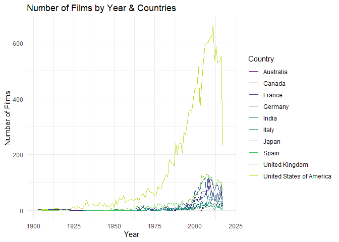
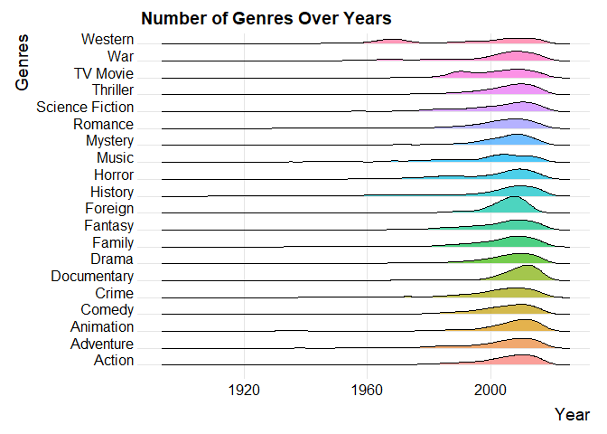
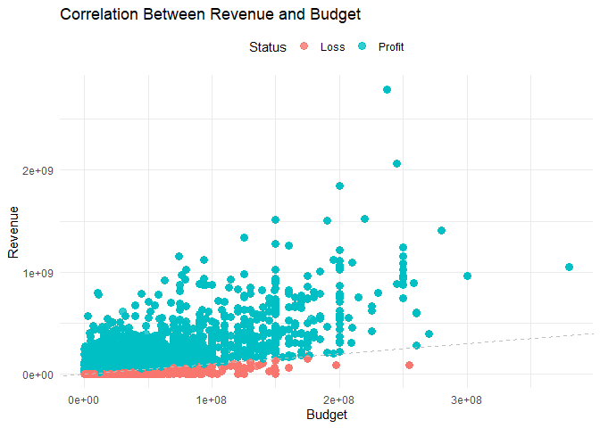
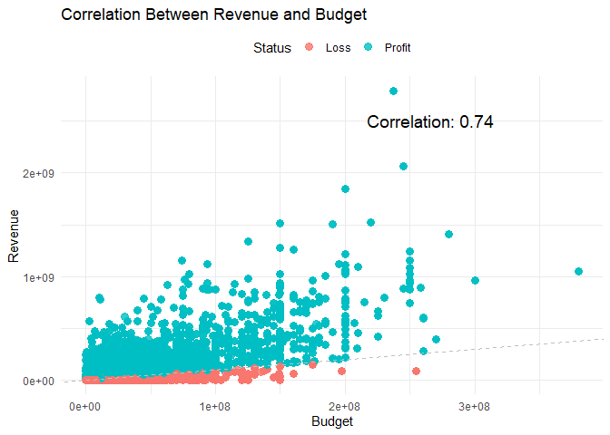

## Load Libraries

    library(tidyverse)

    ## ── Attaching core tidyverse packages ──────────────────────── tidyverse 2.0.0 ──
    ## ✔ dplyr     1.1.3     ✔ readr     2.1.4
    ## ✔ forcats   1.0.0     ✔ stringr   1.5.0
    ## ✔ ggplot2   3.4.4     ✔ tibble    3.2.1
    ## ✔ lubridate 1.9.3     ✔ tidyr     1.3.0
    ## ✔ purrr     1.0.2     
    ## ── Conflicts ────────────────────────────────────────── tidyverse_conflicts() ──
    ## ✖ dplyr::filter() masks stats::filter()
    ## ✖ dplyr::lag()    masks stats::lag()
    ## ℹ Use the conflicted package (<http://conflicted.r-lib.org/>) to force all conflicts to become errors

    library(jsonlite)

    ## 
    ## Attache Paket: 'jsonlite'
    ## 
    ## Das folgende Objekt ist maskiert 'package:purrr':
    ## 
    ##     flatten

    library(ggplot2)
    library(ggridges)

    ## Warning: Paket 'ggridges' wurde unter R Version 4.3.3 erstellt

    library(readr)
    library(lubridate)
    library(dplyr)
    library(stringi)
    library(purrr)
    library(tidyr)

    setwd(dirname(rstudioapi::getActiveDocumentContext()$path))

## Load Data

    data <- read_csv("movies_metadata.csv", show_col_types = FALSE)

    ## Warning: One or more parsing issues, call `problems()` on your data frame for details,
    ## e.g.:
    ##   dat <- vroom(...)
    ##   problems(dat)

## Data Cleaning & Preprocessing

    # Select relevant columns, remove missing values and filter out invalid values
    data <- data %>% 
      select(id, title, release_date, genres, original_language, production_countries, budget, revenue, runtime, vote_average, vote_count, popularity) %>% 
      filter(runtime > 0 & budget > 0)

    # Extract and flatten the production countries and genres
       production_countries <- unlist(data$production_countries)
       genres <- unlist(data$genres)

    # Convert JSON formatted columns to list
    data <- data %>%
      mutate(
        genres = map(genres, ~fromJSON(gsub("'", "\"", .), simplifyDataFrame = TRUE))
      ) %>%
      mutate(
        genres = map(genres, ~pluck(., "name"))
      ) %>%
      unnest(genres)

    data <- data %>%
         mutate(
           production_countries = map(production_countries, ~ {
             cleaned_json <- gsub("'", "\"", .)
             tryCatch(
               fromJSON(cleaned_json, simplifyDataFrame = TRUE), 
               error = function(e) NULL 
             )
           })
         ) %>%
         mutate(production_countries = map(production_countries, ~ if (!is.null(.)) pluck(.,  "name") else NULL)) %>%
         unnest(production_countries)

    # Extract year from release_date
    data$year <- year(data$release_date)

    # Check for duplicates
    duplicated_rows <- data[duplicated(data), ]

## Data Wrangling

    # Group films by genres
    data_grouped_genre <- data %>%
      group_by(genres) %>%
      summarise(
        count = n(),
        avg_revenue = mean(revenue, na.rm = TRUE),
        avg_budget = mean(budget, na.rm = TRUE),
        avg_runtime = mean(runtime, na.rm = TRUE),
        avg_vote_average = mean(vote_average, na.rm = TRUE),
        avg_vote_count = mean(vote_count, na.rm = TRUE),
        avg_popularity = mean(popularity, na.rm = TRUE)
      ) %>%
      ungroup()

    # Group films by year
    data_grouped_year <- data %>%
      group_by(year) %>%
      summarise(
        count = n(),
        avg_revenue = mean(revenue, na.rm = TRUE),
        avg_budget = mean(budget, na.rm = TRUE),
        avg_runtime = mean(runtime, na.rm = TRUE),
        avg_vote_average = mean(vote_average, na.rm = TRUE),
        avg_vote_count = mean(vote_count, na.rm = TRUE),
        avg_popularity = mean(popularity, na.rm = TRUE)
      ) %>%
      ungroup()

    # Group films by year & countries (only if JSON formatting worked for countries)
    data_grouped_year_countries <- data %>%
      group_by(year, production_countries) %>%
      summarise(
      count = n(),
      avg_revenue = mean(revenue, na.rm = TRUE),
      avg_budget = mean(budget, na.rm = TRUE),
      avg_runtime = mean(runtime, na.rm = TRUE),
      avg_vote_average = mean(vote_average, na.rm = TRUE),
      avg_vote_count = mean(vote_count, na.rm = TRUE),
      avg_popularity = mean(popularity, na.rm = TRUE)
      ) %>%
      ungroup()

    ## `summarise()` has grouped output by 'year'. You can override using the
    ## `.groups` argument.

    # Group films by languages
    data_grouped_language <- data %>%
      group_by(original_language) %>%
      summarise(
        count = n(),
        avg_revenue = mean(revenue, na.rm = TRUE),
        avg_budget = mean(budget, na.rm = TRUE),
        avg_runtime = mean(runtime, na.rm = TRUE),
        avg_vote_average = mean(vote_average, na.rm = TRUE),
        avg_vote_count = mean(vote_count, na.rm = TRUE),
        avg_popularity = mean(popularity, na.rm = TRUE)
      ) %>%
      ungroup()

## Data Visualization

    ### Plots

    # Select top 10 countries
    top_countries <- data_grouped_year_countries %>%
      group_by(production_countries) %>%
      summarise(total_films = sum(count)) %>%
      arrange(desc(total_films)) %>%
      slice_head(n = 10) %>%
      pull(production_countries)

    # Number of Films by Year & Countries (Top 10 Countries) (only if JSON formatting worked for countries)
    ggplot(data_grouped_year_countries %>% filter(production_countries %in% top_countries),
          aes(x = year, y = count, color = production_countries)) +
      geom_line(linewidth = 0.7) +
      scale_x_continuous(limits = c(min(data_grouped_year_countries$year), 2020)) +
      scale_color_viridis_d(option = "D", end = 0.9, name = "Country") +  
     labs(title = "Number of Films by Year & Countries", x = "Year", y = "Number of Films") +
      theme_minimal()

    # number of genres through different year (use ridgeline plot)
    ggplot(data, aes(x = year, y = genres, fill = genres)) +
      geom_density_ridges(scale = 1, alpha = 0.7) +
      labs(
        title = "Number of Genres Over Years",
        x = "Year",
        y = "Genres"
      ) +
      theme_ridges() +
      theme(legend.position = "none")

    ## Picking joint bandwidth of 2.86

    ## correlation between revenue and budget 
    # Add a profit_or_loss column
    data <- data %>%
      mutate(
        profit_or_loss = revenue - budget, 
        status = ifelse(profit_or_loss >= 0, "Profit", "Loss")  
      )

    ggplot(data, aes(x = budget, y = revenue, color = status)) +
      geom_point(size = 3, alpha = 0.8) +  # Scatter plot points
      geom_abline(slope = 1, intercept = 0, linetype = "dashed", color = "gray") +  
      labs(
        title = "Correlation Between Revenue and Budget",
        x = "Budget",
        y = "Revenue",
        color = "Status"
      ) +
      theme_minimal() +
      theme(legend.position = "top")

    correlation <- cor(data$budget, data$revenue)
    print(correlation)

    ## [1] 0.7412838

    ggplot(data, aes(x = budget, y = revenue, color = status)) +
      geom_point(size = 3, alpha = 0.8) +
      geom_abline(slope = 1, intercept = 0, linetype = "dashed", color = "gray") +
      labs(
        title = "Correlation Between Revenue and Budget",
        x = "Budget",
        y = "Revenue",
        color = "Status"
      ) +
      annotate("text", x = max(data$budget) * 0.7, y = max(data$revenue) * 0.9,
               label = paste("Correlation:", round(correlation, 2)), size = 5) +
      theme_minimal() +
      theme(legend.position = "top")

